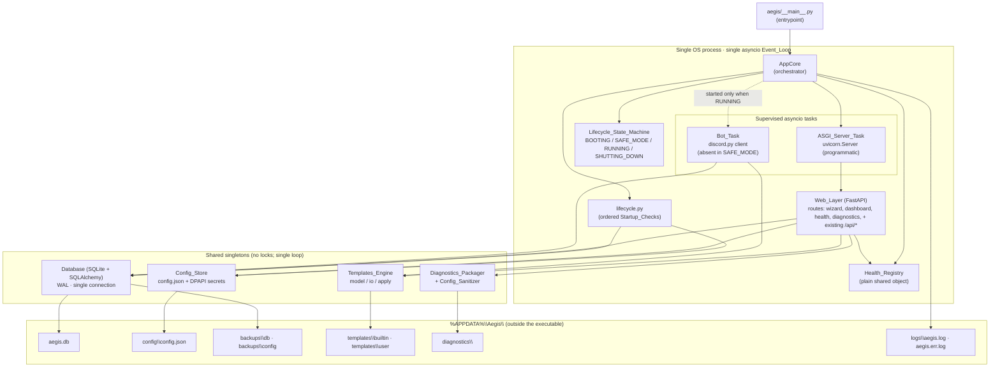
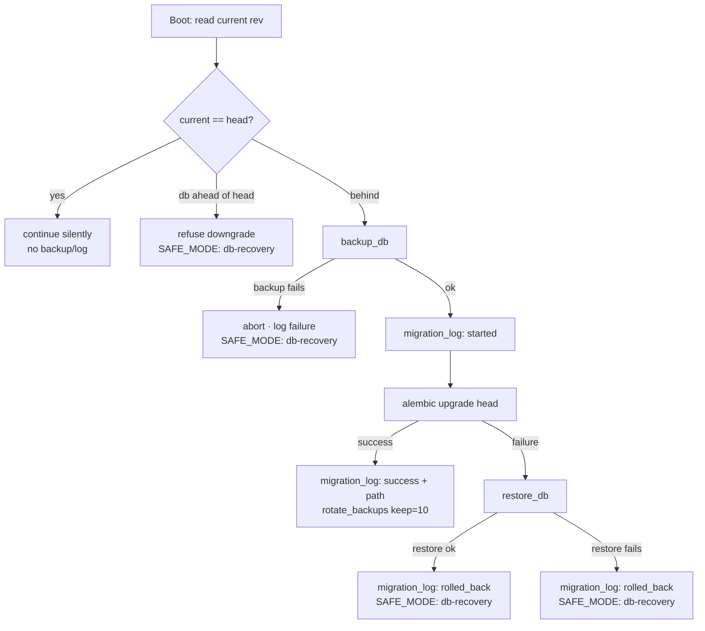
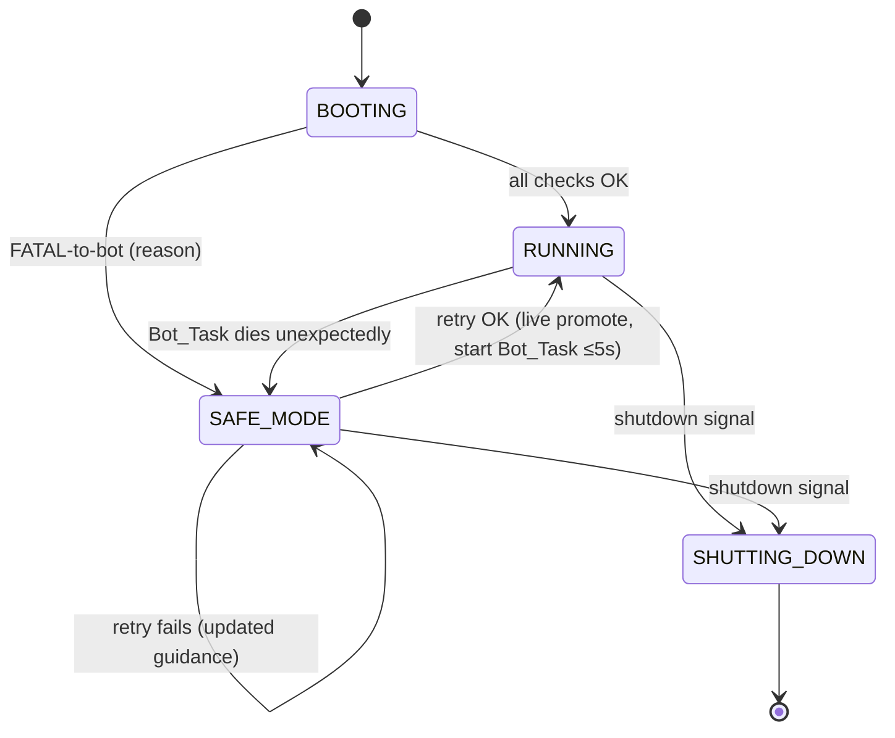

# Design Document

## Overview

This document describes the technical design for the **Aegis Suite — Foundational Architecture** (V1). It translates the 25 requirements in `requirements.md` into a concrete component design, data model, and control flow for a single-process, single-event-loop Windows desktop application that hosts the Discord bot, the HTTP API, and the web dashboard together.

The design is governed by the three stances from the architecture specification:

1. **One process, one event loop** — Uvicorn (ASGI) and the Discord bot run as cooperative `asyncio` tasks on one shared loop. No threads for the bot, no IPC, no second runtime.
2. **YAGNI enforced** — extension points are plain Python base classes, registry dictionaries, and JSON data files. No DI container, factory framework, event bus, microservices, Docker, Redis, or message queue.
3. **Refactor, don't rewrite** — existing working code is wrapped and relocated into the `aegis/` package, not replaced.

### Relationship to the existing codebase (important)

The requirements describe this as a refactor that "folds the existing SQLite schema into Alembic via a baseline revision." Investigation of the current codebase shows a material divergence from that assumption that this design resolves explicitly:

| Requirements/architecture assumption | Actual current state | Design resolution |
| --- | --- | --- |
| Existing SQLite schema adopted via Alembic baseline | **No database exists.** All state is JSON: `config.json`, `leveling_data.json`, `audit_log.json`, giveaways in `config.json`/`giveaways.json` | The Alembic baseline **creates** the V1 schema fresh. A one-time `LegacyImporter` folds existing JSON state into the new tables on first boot, satisfying "without data loss" (R10.2, R18.4). |
| Bot started via blocking `bot.run()` to be replaced | Bot already starts non-blocking as an `asyncio` task: `start_bot_service()` → `asyncio.create_task(run_bot_safe(token))` → `await bot.start(token)` | Wrap the existing pattern in the supervised `Bot_Task` owned by `AppCore`. The non-blocking start already matches the target; the work is supervision, cancellation, and Safe Mode integration. |
| Existing Discord.py cogs relocated to `bot/cogs/` | **No cogs exist.** Commands are registered imperatively via `@bot.hybrid_command` inside `start_bot_service`; `leveling`/`music_manager` are plain singleton classes, not cogs | Relocate the command-registration code and the `LevelingSystem`/`MusicPlayer` classes under `aegis/bot/`. Cog-ification is optional and out of scope; the imperative registration is wrapped as-is. |
| Uvicorn launched programmatically | EXE path already runs `uvicorn.run("web_server:app", ...)` in-process; source path runs uvicorn as a subprocess | Replace both with a programmatic `uvicorn.Server(Config(...))` driven as an `asyncio` task so `AppCore` controls startup ordering and shutdown (R1.3, R3.3). |
| Token/secrets in Config_Store `config.json` | Secrets are in `.env`/`.env.enc` (DPAPI), not `config.json`; `config.json` deliberately excludes secrets | The Config_Store keeps the **non-secret** config in `config.json`; the Discord token and secrets continue to flow through the existing DPAPI `secret_store`. The Config_Sanitizer redacts values regardless of source. |

These are reconciled in the relevant sections below. The net effect: existing **behavior** (routes, commands, leveling, music, auth, DPAPI secrets, templates) is preserved and relocated; the **storage substrate** moves from scattered JSON to a single SQLite database with a documented one-time import.

### Goals

- Deterministic startup, shutdown, and recovery driven by a single lifecycle state machine.
- The web layer is reachable in every non-shutdown state so all recovery happens in-browser.
- Mutable state lives entirely under `%APPDATA%\Aegis\` so the executable is freely replaceable.
- Defensive data handling: integrity checks, full-file backups before migrations, file-restore rollback.

### Non-goals (V1)

Multi-process/threaded hosting, cloud/multi-tenant deployment of this foundation, more than one bot identity, non-Windows single-exe targets, non-SQLite engines, reverse-applied migrations, public-internet exposure, and any CLI for setup/recovery. (See `requirements.md` "Out of Scope".)

## Architecture

### High-level component diagram



### Code layout (the `aegis/` package)

```
aegis/
├── __main__.py              # entrypoint: build AppCore, install signal handlers, run loop
├── core/
│   ├── app_core.py          # AppCore orchestrator: owns loop, tasks, state machine
│   ├── lifecycle.py         # Startup_Check definitions + ordered runner + Reason_Code mapping
│   ├── state.py             # Lifecycle_State_Machine (enum + guarded transitions)
│   ├── paths.py             # Paths_Module: %APPDATA% resolution + dir bootstrap
│   └── health.py            # Health_Registry + Health_Payload assembly
├── config/
│   ├── loader.py            # load/validate/save Config_Store; wraps existing utils/secret_store
│   ├── schema.py            # config shape + validation (pydantic)
│   └── sanitizer.py         # Config_Sanitizer (value-level redaction)
├── db/
│   ├── engine.py            # SQLAlchemy engine/session factory; WAL pragma; single connection
│   ├── models.py            # ORM models for the 6 V1 tables
│   ├── maintenance.py       # integrity check, backup, restore, rotation, forward-compat guard
│   ├── legacy_import.py     # one-time JSON -> SQLite importer (config/leveling/audit/giveaways)
│   └── migrations/          # Alembic env.py + versions/ (baseline = create V1 schema)
├── bot/
│   ├── runner.py            # supervised Bot_Task; intent setup; Token_Validation_Routine
│   ├── commands.py          # relocated @hybrid_command registrations (from bot_manager.py)
│   ├── leveling.py          # relocated LevelingSystem
│   └── music.py             # relocated MusicPlayer / music_manager
├── web/
│   ├── server.py            # programmatic uvicorn.Server + FastAPI app assembly
│   ├── app.py               # FastAPI() construction, middleware, lifespan bridge to AppCore
│   ├── routes/
│   │   ├── wizard.py        # Setup_Wizard steps + recovery flows
│   │   ├── dashboard.py     # relocated existing /api/* dashboard routes
│   │   ├── health.py        # GET health endpoint -> Health_Payload
│   │   └── diagnostics.py   # Generate Diagnostics Package endpoint
│   ├── static/              # relocated static/ (index.html, app.js, style.css) + responsive.css
│   └── templates/           # (optional) shared HTML shell for wizard/recovery
├── templates_engine/
│   ├── model.py             # Template schema (pydantic) + validate()
│   ├── io.py                # import_json / export_json
│   ├── apply.py             # apply_to_server / clone_from_server (diff + create)
│   └── registry.py          # Template_Registry: kind -> builtin file
└── diagnostics/
    └── packager.py          # Diagnostics_Packager (read-only zip assembly)
```

### Data directory layout (`%APPDATA%\Aegis\`)

Owned by `Paths_Module` (`core/paths.py`), which is the single source of truth and creates missing directories on boot (R4.4, R4.5).

```
%APPDATA%\Aegis\
├── aegis.db
├── config\config.json
├── backups\db\            # aegis_<rev>_<timestamp>.db  (max 10 retained)
├── backups\config\
├── templates\builtin\     # gaming.json, community.json, creator.json
├── templates\user\
├── diagnostics\           # aegis_diag_<timestamp>.zip
└── logs\aegis.log, logs\aegis.err.log
```

### Concurrency model

All long-lived work runs as `asyncio` tasks on one loop owned by `AppCore`:

- `ASGI_Server_Task` wraps `uvicorn.Server.serve()`.
- `Bot_Task` wraps `discord.Client.start(token)` and is created only on the transition into RUNNING.

Because scheduling is cooperative and single-threaded, shared singletons (`Config_Store`, DB session factory, `Health_Registry`, `Templates_Engine`) need no locks for in-loop access (R25.1). The only background threads retained are the legacy JSON periodic savers during the transition window; once state is in SQLite these are removed. No `run_coroutine_threadsafe`, no cross-thread queues.

## Components and Interfaces

### AppCore (`core/app_core.py`)

`AppCore` is the single top-level object. It owns the loop lifecycle and holds the state machine, the two task handles, and the shared singletons (R1.2).

```python
class AppCore:
    def __init__(self) -> None:
        self.state = LifecycleStateMachine()          # starts BOOTING
        self.health = HealthRegistry()
        self.paths = Paths()
        self.config: ConfigStore | None = None
        self.db: Database | None = None
        self._asgi_task: asyncio.Task | None = None
        self._bot_task: asyncio.Task | None = None
        self._shutting_down = False

    async def run(self) -> int:
        """Top-level entry. Returns process exit code."""
        try:
            verdict, reason = await run_startup_checks(self)     # lifecycle.py
        except Exception as exc:                                 # R1.6 top-level boundary
            self.health.record_fatal(exc)
            reason = ReasonCode.from_unhandled(exc)
            verdict = Verdict.FATAL_TO_BOT
        await self._enter_post_startup_state(verdict, reason)
        return await self._serve_until_shutdown()

    async def promote_to_running(self) -> None:
        """SAFE_MODE -> RUNNING live promotion (R7.8). Starts the Bot_Task."""

    async def enter_safe_mode(self, reason: ReasonCode) -> None:
        """Idempotent transition into SAFE_MODE carrying a Reason_Code."""

    async def request_shutdown(self) -> None:
        """Idempotent, timeout-bounded teardown (R3)."""
```

Key responsibilities:
- Run the ordered `Startup_Check` sequence and decide RUNNING vs SAFE_MODE (R5.8–R5.10).
- Start the `ASGI_Server_Task` in both RUNNING and SAFE_MODE (R6.1).
- Start the `Bot_Task` only in RUNNING, and supervise it: if it terminates unexpectedly while RUNNING, transition to SAFE_MODE and keep the process alive (R1.8).
- Provide a top-level exception boundary that converts unhandled startup failures into SAFE_MODE rather than a crash (R1.6).
- Own the single shutdown path (R3).

### Lifecycle_State_Machine (`core/state.py`)

A small enum-backed state machine with guarded transitions. Exactly one state is occupied at any time (R2.1). Every transition records the new state into the `Health_Registry` (R2.6).

```python
class LifecycleState(str, Enum):
    BOOTING = "booting"
    SAFE_MODE = "safe_mode"
    RUNNING = "running"
    SHUTTING_DOWN = "shutting_down"

ALLOWED = {
    BOOTING:       {RUNNING, SAFE_MODE, SHUTTING_DOWN},
    SAFE_MODE:     {RUNNING, SHUTTING_DOWN},     # live promotion + shutdown
    RUNNING:       {SAFE_MODE, SHUTTING_DOWN},   # bot-died fallback + shutdown
    SHUTTING_DOWN: set(),                        # terminal
}
```

`SAFE_MODE` carries a `ReasonCode`. Transitions that violate `ALLOWED` raise, surfacing programming errors early.

### Startup checks (`core/lifecycle.py`)

The seven checks run in strict dependency order; the first non-`OK` verdict halts the sequence (R5.1, R5.2). Each check is a small object with a `name`, a `run(core)` coroutine returning a `Verdict`, and the `ReasonCode` it maps to on failure.

| # | Startup_Check | OK requirement | Non-OK Verdict → Reason_Code |
| --- | --- | --- | --- |
| 1 | Resolve Data_Directory, create dirs | Writable `%APPDATA%\Aegis\` | `FATAL-to-app` (no Safe Mode; observable error w/ path) — R5.3 |
| 2 | Init logging with rotation | File handlers attached | degrade to console, continue (R5.4) |
| 3 | Load Config_Store | Valid config + `setup_complete` present | `FATAL-to-bot` → `needs-setup` (R5.5) |
| 4 | Open DB + PRAGMA integrity_check | DB opens, integrity OK | `FATAL-to-bot` → `db-recovery` (R5.6) |
| 5 | Run pending migrations w/ backup | At head (or upgraded) | `FATAL-to-bot` → `db-recovery` (R10.8/10.11/10.12) |
| 6 | Validate Discord token | Auth probe + intent capability ≤10s | `FATAL-to-bot` → `token-recovery` (R5.7) |
| 7 | Verify required intents enabled | Declared + enabled | `FATAL-to-bot` → `intent-recovery` (R5.8) |

The runner records each verdict into the `Health_Registry` (R5.12) and returns the first failing `(verdict, reason)` or `OK`.

For **retry from Safe Mode** (R7.7), the runner accepts a `start_at` index derived from the active `ReasonCode`, so a token retry re-runs from check 6 forward rather than from scratch, completing within the 30s budget (R7.7) and promoting live within 5s on success (R7.8).

```python
RETRY_START = {
    ReasonCode.NEEDS_SETUP:     3,   # re-load config after wizard finish
    ReasonCode.DB_RECOVERY:     4,   # re-open DB / re-attempt migration
    ReasonCode.TOKEN_RECOVERY:  6,   # re-validate token
    ReasonCode.INTENT_RECOVERY: 7,   # re-check intents
}
```

### Paths_Module (`core/paths.py`)

Single source of truth for every path under the Data_Directory (R4.4). Resolves `%APPDATA%` via `os.environ["APPDATA"]` (falling back to `Path.home()`), builds the directory tree, and creates any missing directory on boot (R4.5). If the root is unwritable, it raises `UnwritableDataDirError`, which check 1 maps to `FATAL-to-app` with an observable message naming the location (R5.3).

```python
class Paths:
    root: Path                       # %APPDATA%\Aegis
    db_file: Path                    # root/aegis.db
    config_file: Path                # root/config/config.json
    backups_db: Path; backups_config: Path
    templates_builtin: Path; templates_user: Path
    diagnostics: Path
    log_file: Path; err_log_file: Path

    def ensure(self) -> None:        # mkdir(parents, exist_ok); write-probe the root
```

This supersedes the legacy `utils.get_writeable_path` (which placed state next to the executable). During relocation, `utils.get_writeable_path` is redirected to `Paths` so existing modules keep working unchanged.

### Config_Store (`config/loader.py`, `config/schema.py`)

Loads and validates `config\config.json`, exposing typed access to the `setup_complete` flag, the `ui_mode` flag, and the existing dashboard config keys (welcome/automod/ticket/leveling/giveaways/guild_configs/hosting_mode/client_id). The Discord token and secrets are **not** stored here; they continue to flow through the existing DPAPI `secret_store` / env path (`utils.get_bot_token`).

```python
class ConfigStore:
    @classmethod
    def load(cls, paths: Paths) -> "ConfigStore": ...   # raises ConfigInvalid on bad shape
    def is_setup_complete(self) -> bool: ...
    @property
    def ui_mode(self) -> Literal["beginner", "advanced"]: ...   # default "beginner" (R14.1)
    def save(self) -> None: ...                          # atomic write + backups/config snapshot
```

Validation failure, a missing file, or an absent `setup_complete` flag yields the `needs-setup` Reason_Code (R5.5, R8.1, R8.11).

### Config_Sanitizer (`config/sanitizer.py`)

Centralized serializer that redacts secret **values** while preserving structure and non-secret key names (R16.7, R22.2). It is the only serialization path allowed to reach logs or diagnostics (R22.1).

```python
SECRET_KEYS = {"bot_token", "DISCORD_BOT_TOKEN", "JWT_SECRET",
               "ADMIN_PASSWORD_HASH", "admin_password_hash", "BOT_API_URL", "client_secret"}
REDACTION = "***REDACTED***"

def sanitize(obj: Mapping) -> dict:
    """Deep-copy; replace values of SECRET_KEYS (and heuristic token-like strings) with REDACTION."""
```

A logging filter installed in check 2 routes any config object emitted to logs through `sanitize`, guaranteeing secrets never enter the logs (R16.8, R22.3).

### Database (`db/engine.py`, `db/models.py`, `db/maintenance.py`)

SQLite at `%APPDATA%\Aegis\aegis.db` via SQLAlchemy ORM, WAL journaling, single connection (R9.1, R9.2).

```python
def make_engine(paths: Paths) -> Engine:
    engine = create_engine(
        f"sqlite:///{paths.db_file}",
        connect_args={"check_same_thread": False},
        poolclass=StaticPool,                 # single-connection model
    )
    @event.listens_for(engine, "connect")
    def _pragmas(conn, _):
        cur = conn.cursor()
        cur.execute("PRAGMA journal_mode=WAL")
        cur.execute("PRAGMA foreign_keys=ON")
        cur.close()
    return engine
```

`maintenance.py` provides the defensive operations:

```python
def integrity_check(engine) -> bool:                 # PRAGMA integrity_check -> "ok"
def backup_db(paths, current_rev) -> Path:           # full-file copy -> aegis_<rev>_<ts>.db
def restore_db(paths, backup_path) -> None:          # file-restore over aegis.db (rollback)
def rotate_backups(paths, keep=10) -> None:          # delete all but 10 newest (R10.9)
def is_db_ahead(engine, head_rev) -> bool:           # forward-compat guard (R10.10)
```

### Migration_Engine (Alembic; `db/migrations/`, invoked from `lifecycle.py` check 5)

Alembic owns the authoritative schema (R10.1). On boot the engine reads the current revision and compares to head (R10.3):

- **Equal** → continue silently: no backup, no migration, no `migration_log` row (R10.4).
- **Behind** → back up first, log `started`, upgrade, log `success`+`backup_path`; on failure restore the backup, log `rolled_back`, enter `db-recovery` (R10.5–R10.8).
- **Backup creation fails** → abort, leave DB unchanged, log the failure, enter `db-recovery` (R10.11).
- **Restore fails during rollback** → log `rolled_back`, enter `db-recovery` (R10.12).
- **DB ahead of code head** → refuse to downgrade, enter `db-recovery` (R10.10).

The **baseline revision** creates the six V1 tables (since no prior DB exists). On the very first boot after creating the schema, the `LegacyImporter` runs once (see below) to fold existing JSON state in, satisfying "version tracking without data loss" (R10.2, R18.4).



### LegacyImporter (`db/legacy_import.py`)

One-time, idempotent importer that runs when the schema was just created and a legacy JSON state is detected. Guarded by a `schema_meta` key `legacy_import_done`.

| Legacy source | Target table / rows |
| --- | --- |
| `config.json` top-level + `guild_configs` | `config_kv` rows (key/value/updated_at); plus `servers` rows per known guild |
| `templates/gaming.json`, `templates/community.json` | copied to `templates\builtin\`; registered in `templates` table (`source=builtin`) |
| `leveling_data.json` | `config_kv` (or a dedicated namespace) preserving XP per guild/member |
| `audit_log.json` | retained as-is (audit log remains file-based in V1; not a V1 table) |

This is the concrete mechanism behind "adopt existing data without loss." It never deletes the legacy files; it imports and marks completion.

### Bot_Task and Token_Validation_Routine (`bot/runner.py`)

Wraps the existing non-blocking start pattern under `AppCore` supervision.

```python
REQUIRED_INTENTS = ("guilds", "members", "message_content")  # from current bot_manager

def build_intents() -> discord.Intents:
    intents = discord.Intents.default()
    intents.guilds = True; intents.members = True
    intents.messages = True; intents.message_content = True
    return intents

async def validate_token(token: str, timeout: float = 10.0) -> TokenVerdict:
    """Token_Validation_Routine — the single shared code path (R8.9).
    Auth probe via a lightweight client login; intent capability check.
    Returns OK / AUTH_FAILED / INTENT_FAILED / TIMEOUT, bounded at 10s (R5.7, R8.3)."""

async def start_bot_task(core: AppCore, token: str) -> asyncio.Task:
    """Create the supervised Bot_Task; register relocated commands; add persistent views."""
```

`validate_token` is invoked by **both** startup check 6 and the wizard token step — one routine, two callers (R8.9). The auth probe uses a short-lived `discord.Client` login with `asyncio.wait_for(..., 10)`; on timeout it returns `TIMEOUT`, mapped to `token-recovery` (R5.7) or an inline wizard error (R8.5).

The bot's command registrations (`@hybrid_command` handlers), `LevelingSystem`, and `MusicPlayer` are relocated verbatim into `bot/commands.py`, `bot/leveling.py`, `bot/music.py` (R18.2, R18.3). They read/write the new `Database` instead of JSON once the import has run.

### Web_Layer (`web/server.py`, `web/app.py`, `web/routes/`)

The FastAPI app is assembled in `web/app.py` and served by a programmatic Uvicorn server in `web/server.py` (R1.3, R6).

```python
def build_app(core: AppCore) -> FastAPI:
    app = FastAPI(title="Aegis Suite")
    app.state.core = core
    app.mount("/static", StaticFiles(directory=core.paths_static()), name="static")
    app.include_router(health.router)        # always available
    app.include_router(diagnostics.router)   # available incl. SAFE_MODE (R16.9)
    if core.state.is_safe_mode():
        app.include_router(wizard.router)    # recovery surface (R6.3, R7)
    else:
        app.include_router(dashboard.router) # relocated existing /api/* (R18.2)
        app.include_router(wizard.router)    # wizard reachable for re-runs too
    app.add_middleware(...)                  # relocated auth_middleware
    return app

async def serve(core: AppCore, app: FastAPI) -> None:
    config = uvicorn.Config(app, host="127.0.0.1", port=8000, log_config=None)
    server = uvicorn.Server(config)
    core._uvicorn_server = server            # so shutdown can set server.should_exit = True
    await server.serve()                     # the ASGI_Server_Task body
```

The existing dashboard routes and the hand-rolled HS256 JWT `auth_middleware` are relocated into `routes/dashboard.py` and wrapped, not rewritten (R18.2). The web layer never gets disabled in a non-shutdown state (R6.2).

### Setup_Wizard (`web/routes/wizard.py`)

Server-rendered (or SPA-driven) flow with the fixed step order Welcome → Token entry → Server selection → Template selection → Finish (R8.2). It reuses the dashboard layout/shell and the responsive CSS (R8.10, R15.5).

| Step | Endpoint(s) | Behavior |
| --- | --- | --- |
| Welcome | `GET /wizard` | Overview; entered automatically when `needs-setup` (R8.1) |
| Token entry | `POST /wizard/token` | Calls `validate_token` (≤10s); on success persist token via secret_store, never to logs/diagnostics (R8.4); on fail/timeout inline error naming auth vs intent failure, stay on step (R8.5) |
| Server selection | `GET /wizard/guilds` | Enumerate accessible guilds (≤10s); choose exactly one; zero guilds or timeout → inline message, do not advance (R8.6, R8.12) |
| Template selection | `GET /wizard/templates` | Offer Gaming/Community/Creator/start-empty + structure preview before apply (R8.7) |
| Finish | `POST /wizard/finish` | Set `setup_complete`, re-run Startup_Checks; all OK → redirect to dashboard (R8.8, R8.13); any non-OK → remain SAFE_MODE with mapped Reason_Code, no redirect (R8.14) |

### Safe Mode recovery flows (`web/routes/wizard.py`)

Safe Mode is one parameterized state; the active `ReasonCode` selects the recovery view (R7.1). All four flows render in-browser; none require a CLI (R7.12).



| Reason_Code | Recovery view | Retry restarts at |
| --- | --- | --- |
| `needs-setup` | Setup_Wizard (R7.3) | check 3 |
| `token-recovery` | Re-enter/re-validate token (R7.4) | check 6 |
| `db-recovery` | Restore from DB_Backup / rebuild / open diagnostics (R7.5) | check 4 |
| `intent-recovery` | Guided intent instructions + re-check (R7.6) | check 7 |

During a re-check the web layer keeps serving and signals "re-check in progress" (R7.13). A full process restart is offered only as a fallback (R7.10).

### Templates_Engine (`templates_engine/`)

The Template is a JSON document; the schema is the contract (R11.1). One validation path and one apply path serve built-ins, imports, and exports (R11.3).

```python
# model.py
class TemplateModel(BaseModel):     # mirrors existing community.json/gaming.json shape
    name: str
    verification_level: str | None = None
    explicit_content_filter: str | None = None
    roles: list[RoleSpec] = []
    categories: list[CategorySpec] = []
    uncategorized_channels: list[ChannelSpec] = []

def validate(doc: dict) -> TemplateModel:   # raises TemplateInvalid w/ descriptive error (R11.4)

# io.py
def import_json(raw: str | dict) -> TemplateModel        # validate -> store source="imported" (R13.1)
def export_json(template_id: int, paths: Paths) -> Path   # serialize -> templates/user (R13.2)

# apply.py
async def apply_to_server(bot, guild_id, template) -> ApplyResult   # diff + create missing (R13.4)
async def clone_from_server(bot, guild_id) -> TemplateModel         # read live -> template (R13.3)

# registry.py
TEMPLATE_REGISTRY = {                       # kind -> builtin file (R12.2)
    "gaming": "gaming.json",
    "community": "community.json",
    "creator": "creator.json",
}
```

The existing `community.json`/`gaming.json` content is preserved by relocation into `templates\builtin\`; a new `creator.json` is added (R12.1, R12.4). Adding a kind = drop a JSON file + add a registry entry, with no change to the apply/validation code (R12.3). Apply records an `apply_history` row; if that write fails after Discord changes were made, the created structure is kept and the failure is recorded — the apply is not reversed (R13.5, R13.6).

### Diagnostics_Packager (`diagnostics/packager.py`)

One-click, read-only zip assembly available in every state including Safe Mode (R16.1, R16.5, R16.9).

```python
def generate_package(core: AppCore) -> Path:
    bundle = {
        "logs": tail(core.paths.log_file) + tail(core.paths.err_log_file),   # R16.2
        "app_version": read_app_version(core.db),                            # schema_meta
        "database": {"integrity": ..., "revision": ..., "size_bytes": ...},  # R16.3
        "runtime": {"state": ..., "uptime_s": ..., "safe_mode_reason": ...}, # R16.4
        "config": sanitize(core.config.as_dict()),                           # R16.7
    }
    return write_zip(core.paths.diagnostics / f"aegis_diag_{ts()}.zip", bundle)  # R16.6
```

It performs only reads and never mutates state (R16.5). The config snapshot is always passed through `Config_Sanitizer` (R16.7).

### Health_Registry and Health_Payload (`core/health.py`)

A plain shared object updated in place by each subsystem — no event bus/pub-sub (R17.1, R17.6). The payload reads cached statuses, never live probes, so it is safe to poll (R17.4, R23.2).

```python
@dataclass
class HealthRegistry:
    web: str = "down"                 # uvicorn task state
    database: dict = field(...)       # reachable / integrity / at_head
    bot: str = "disabled"             # connected_ready / disabled
    intents: str = "unknown"          # declared_enabled / missing
    safe_mode: dict | bool = False    # {active, reason} or False
    lifecycle_state: str = "booting"
    checks: dict = field(...)         # per-check verdicts (R5.12)

    def payload(self) -> dict: ...    # assembles Health_Payload (R17.3)
```

Exposed at `GET /api/health` (or `/health`) consumed by the dashboard status panel (R17.2). Meaningful in every state, including Safe Mode where `bot=disabled` and `safe_mode` carries the reason (R17.5).

### UI_Mode (frontend rendering concern)

`ui_mode` (`beginner` default) lives in the Config_Store (R14.1). The backend exposes the same API regardless of mode (R14.4); the frontend reads the flag (via `/api/config` or the health/config payload) and hides advanced controls — raw permission editing, manual template JSON editing, diagnostics internals — in beginner mode (R14.2, R14.3). No capability is removed from the data model (R14.5).

### Mobile-friendly responsive layer (`web/static/responsive.css`)

A mobile-first CSS layer added over the existing `static/index.html` markup; the current desktop layout becomes the wide-viewport breakpoint (R15.1–R15.3). Routes, endpoints, and data flow are unchanged (R15.4). The wizard reuses the same responsive shell (R15.5).

### Shutdown sequence (`core/app_core.py`)

One idempotent, timeout-bounded path (R3, R25.2). Signal handlers (`SIGINT`, and on Windows the console-close/`CTRL_CLOSE_EVENT`) and the dashboard "Shutdown" action all call `request_shutdown()`.

```mermaid
sequenceDiagram
    participant Sig as Signal / Dashboard
    participant Core as AppCore
    participant Bot as Bot_Task
    participant ASGI as ASGI_Server_Task
    participant DB as Engine/Logs
    Sig->>Core: request_shutdown()
    Core->>Core: state = SHUTTING_DOWN (first step, R3.1)
    Note over Core: second signal -> os._exit (R3.7)
    Core->>Bot: cancel + await bot.close() (if present, R3.2)
    Core->>ASGI: server.should_exit = True; drain (bounded, R3.3)
    Core->>DB: dispose engine + flush logs (R3.4)
    Core->>Core: stop loop, exit code 0 (R3.5)
```

A second signal during `SHUTTING_DOWN` forces immediate `os._exit` (R3.7). Cancellation of either task is bounded to 10s (R1.7); full shutdown to 15s (R1.9).

## Data Models

### V1 schema (SQLAlchemy ORM — `db/models.py`)

Six tables (R9.3). Field lists are fixed by R9.4–R9.8.

```python
class SchemaMeta(Base):          # R9.4 — key/value version + app metadata
    __tablename__ = "schema_meta"
    key = Column(String, primary_key=True)
    value = Column(String)

class ConfigKV(Base):            # DB-backed settings overflow
    __tablename__ = "config_kv"
    key = Column(String, primary_key=True)
    value = Column(Text)
    updated_at = Column(DateTime, default=utcnow)

class Template(Base):            # R9.5
    __tablename__ = "templates"
    id = Column(Integer, primary_key=True)
    name = Column(String, nullable=False)
    kind = Column(String, nullable=False)         # gaming/community/creator/custom
    json = Column(Text, nullable=False)           # validated Template document
    source = Column(String, nullable=False)       # builtin/imported/cloned
    created_at = Column(DateTime, default=utcnow)

class Server(Base):              # R9.6
    __tablename__ = "servers"
    id = Column(Integer, primary_key=True)
    guild_id = Column(String, unique=True, nullable=False)
    name = Column(String)
    mode = Column(String)                          # e.g. hosting/UI mode marker
    last_synced = Column(DateTime)

class ApplyHistory(Base):        # R9.7
    __tablename__ = "apply_history"
    id = Column(Integer, primary_key=True)
    server_id = Column(Integer, ForeignKey("servers.id"))
    template_id = Column(Integer, ForeignKey("templates.id"))
    applied_at = Column(DateTime, default=utcnow)
    result = Column(Text)                          # success/partial + detail

class MigrationLog(Base):        # R9.8
    __tablename__ = "migration_log"
    id = Column(Integer, primary_key=True)
    from_rev = Column(String)
    to_rev = Column(String)
    backup_path = Column(String)
    status = Column(String)                        # started/success/rolled_back
    ts = Column(DateTime, default=utcnow)
```

### Template document shape (`templates_engine/model.py`)

Mirrors the existing `community.json`/`gaming.json` so relocation is loss-free:

```
Template := {
  name: str,
  verification_level?: str,
  explicit_content_filter?: str,
  roles: [ { name, color:int, hoist:bool, permissions:int, position:int } ],
  categories: [ { name, position, overwrites: [Overwrite], channels: [Channel] } ],
  uncategorized_channels: [ Channel ]
}
Channel  := { name, type: "text"|"voice", position, overwrites: [Overwrite] }
Overwrite:= { target_type: "role", target_name: str, allow:int, deny:int }
```

### Health_Payload shape

```json
{
  "lifecycle_state": "running|safe_mode|booting|shutting_down",
  "web": "up|down",
  "database": { "reachable": true, "integrity_ok": true, "at_head": true },
  "bot": "connected_ready|disabled",
  "intents": "declared_enabled|missing|unknown",
  "safe_mode": false,
  "checks": { "data_dir": "OK", "logging": "OK", "config": "OK", "db": "OK",
              "migrations": "OK", "token": "OK", "intents": "OK" }
}
```

## Error Handling

| Condition | Detection | Handling | Requirement |
| --- | --- | --- | --- |
| Unhandled startup exception | Top-level try in `AppCore.run` | Record diagnostic, enter SAFE_MODE, keep process alive | R1.6 |
| Bot_Task dies while RUNNING | `add_done_callback` on the task | Transition RUNNING→SAFE_MODE, keep process | R1.8 |
| Data dir unwritable | Write-probe in `Paths.ensure` | `FATAL-to-app`, observable error w/ path, stop | R5.3 |
| Logging init fails | Exception in check 2 | Degrade to console, continue | R5.4 |
| Config missing/invalid | `ConfigStore.load` raises | SAFE_MODE `needs-setup` | R5.5 |
| DB unopenable / corrupt | `integrity_check` ≠ "ok" or open error | SAFE_MODE `db-recovery` | R5.6 |
| Token invalid/timeout | `validate_token` ≠ OK or `TIMEOUT` | SAFE_MODE `token-recovery` | R5.7 |
| Missing intents | Intent capability check | SAFE_MODE `intent-recovery` | R5.8 |
| Migration failure | Alembic raises during upgrade | restore backup, log `rolled_back`, `db-recovery` | R10.8 |
| Backup creation fails | `backup_db` raises | abort, DB unchanged, log failure, `db-recovery` | R10.11 |
| Restore fails on rollback | `restore_db` raises | log `rolled_back`, `db-recovery` | R10.12 |
| DB ahead of code | `is_db_ahead` true | refuse downgrade, `db-recovery` | R10.10 |
| Template invalid | `model.validate` raises | reject, return descriptive error | R11.4 |
| apply_history write fails | DB error after Discord changes | keep created structure, record failure indication | R13.6 |
| Second shutdown signal | `_shutting_down` already set | force `os._exit` | R3.7 |
| Browser fails to open | `webbrowser.open` returns False/raises | record observable local URL | R5.11 |

All error paths that enter Safe Mode carry exactly one Reason_Code and keep the web layer serving (R6.2, R7.2).

## Correctness Properties

These are the invariants that must hold for any input or event sequence. They are the contract the property-based tests in the Testing Strategy enforce, and they trace directly to acceptance criteria.

### Property 1: Single-state invariant

At any moment the `Lifecycle_State_Machine` occupies exactly one of {BOOTING, SAFE_MODE, RUNNING, SHUTTING_DOWN}, and every applied transition is a member of `ALLOWED`. SHUTTING_DOWN is terminal.

**Validates: Requirements 2.1**

### Property 2: Startup short-circuit

For any verdict assignment to the seven checks, the runner executes a contiguous prefix that ends at the first non-`OK` check and executes no later check.

**Validates: Requirements 5.1, 5.2**

### Property 3: Verdict-to-Reason_Code determinism

A failing check always yields its single mapped Reason_Code: config to `needs-setup`, db/migration to `db-recovery`, token to `token-recovery`, intents to `intent-recovery`. Safe Mode always carries exactly one Reason_Code from the defined set.

**Validates: Requirements 5.5, 5.6, 5.7, 5.8, 7.1**

### Property 4: Retry-start mapping

Retry from Safe Mode re-runs starting at the index mapped from the active Reason_Code; if the previously failing check and all subsequent checks return `OK`, the machine promotes SAFE_MODE to RUNNING and starts the Bot_Task without a process restart.

**Validates: Requirements 7.7, 7.8**

### Property 5: Web-layer availability

In every non-SHUTTING_DOWN state the `ASGI_Server_Task` is running and the `Web_Layer` is reachable; the `Bot_Task` exists only in RUNNING.

**Validates: Requirements 6.1, 6.2, 6.3, 7.2**

### Property 6: Migration terminal-state exclusivity

Every migration run records exactly one `started` row followed by exactly one terminal row (`success` XOR `rolled_back`); an at-head boot records no row at all.

**Validates: Requirements 10.4, 10.6, 10.7, 10.8**

### Property 7: Backup rotation bound

After rotation, the number of retained DB_Backup files is `min(N, 10)` and the retained set is the newest by timestamp.

**Validates: Requirements 10.9**

### Property 8: No-downgrade guard

If the DB revision is ahead of the code head, no migration or backup is attempted and the machine enters `db-recovery`.

**Validates: Requirements 10.10**

### Property 9: Sanitizer totality

For any config object, no secret value survives `sanitize`; all non-secret values and the key structure are preserved; the sanitized output is what reaches logs and diagnostics.

**Validates: Requirements 16.7, 22.1, 22.2, 22.3**

### Property 10: Template round-trip and validation totality

`import_json(export_json(t)) == t` for any valid Template `t`; any document that violates the schema is rejected with a descriptive error and never stored or applied.

**Validates: Requirements 11.2, 11.4, 13.1, 13.2**

### Property 11: Apply durability

Once Discord structure is created, a subsequent `apply_history` write failure never reverses the created structure.

**Validates: Requirements 13.6**

### Property 12: Shutdown idempotency and bound

`request_shutdown` sets SHUTTING_DOWN before any teardown step, each step is idempotent and timeout-bounded, a second signal forces immediate exit, and a clean completion exits with code 0.

**Validates: Requirements 3.1, 3.5, 3.6, 3.7**

### Property 13: Token routine singularity

The token auth-probe-plus-intent check used at startup and in the wizard is the same routine, bounded at 10 seconds.

**Validates: Requirements 8.3, 8.9**

### Property 14: Health payload from cache

The Health_Payload is assembled only from cached `Health_Registry` values (no live probes) and is well-formed in every state.

**Validates: Requirements 17.4, 17.5, 23.2**

## Testing Strategy

The behavior here is highly stateful (a lifecycle state machine, ordered checks, migration backup/rollback, retry promotion) which makes it a strong fit for property-based testing alongside example-based unit tests.

### Property-based tests (Hypothesis)

- **State machine invariants:** for any sequence of events (start, check verdicts, retries, bot-death, shutdown signals), the machine occupies exactly one state and only takes transitions in `ALLOWED` (R2.1). Generate random event sequences and assert no illegal transition and that SHUTTING_DOWN is terminal.
- **Startup ordering / short-circuit:** for any assignment of verdicts to the seven checks, the runner executes a prefix ending at the first non-OK check and never runs later checks (R5.1, R5.2); the resulting Reason_Code matches the failing check's mapping.
- **Reason_Code ↔ retry start index:** for every Reason_Code, retry re-runs from the mapped start index and, when the previously failing check now returns OK with all subsequent OK, promotes to RUNNING (R7.7, R7.8).
- **Backup rotation:** for any number N of backup files, `rotate_backups(keep=10)` leaves exactly `min(N,10)` newest files and deletes the rest (R10.9).
- **Config_Sanitizer:** for any nested config dict containing secret keys with arbitrary values, `sanitize` redacts every secret value, leaves all non-secret values intact, and preserves the key structure (R16.7, R22.2). No secret value appears anywhere in the output.
- **Template round-trip:** for any valid generated Template, `export_json` then `import_json` yields an equal document; any document failing schema raises `TemplateInvalid` (R11.2, R11.4, R13.1, R13.2).
- **Migration log monotonicity:** any migration run produces a `started` row followed by exactly one terminal row (`success` or `rolled_back`), never both (R10.6–R10.8).

### Example-based unit tests

- `Paths.ensure` creates the full tree and raises on an unwritable root.
- `validate_token` returns `TIMEOUT` when the probe exceeds 10s (patched clock), and that both startup and wizard call the same routine (R8.9).
- Migration happy path: equal revision → no backup, no `migration_log` row (R10.4).
- Migration upgrade path: behind → backup created, `started`+`success` rows, backup_path recorded.
- Migration rollback path: forced upgrade failure → backup restored, `rolled_back` row, `db-recovery` (R10.8); and the backup-fails / restore-fails branches (R10.11, R10.12).
- `apply_to_server` diffs against an existing guild and creates only missing structure (R13.4); a failing `apply_history` write keeps the structure (R13.6).
- LegacyImporter is idempotent: running twice imports once (guarded by `legacy_import_done`).

### Integration / smoke tests

- Boot with no config → SAFE_MODE `needs-setup`, `GET /wizard` reachable, health payload reflects `safe_mode`.
- Boot with valid config + token (mocked Discord) → RUNNING, Bot_Task created, dashboard reachable.
- Shutdown signal during RUNNING drives the full teardown to exit code 0 within the time budget; a second signal forces immediate exit.
- Existing dashboard `/api/*` routes respond after relocation (regression guard against R18.2).
- Build the EXE with PyInstaller and verify it boots against a clean `%APPDATA%\Aegis\` (R21).

### Test infrastructure notes

The current repo already has `tests/` with pytest. New tests live under `tests/` mirroring the `aegis/` package. Discord network calls are mocked; SQLite tests use a temp `%APPDATA%` via a `Paths` override fixture. Hypothesis is added as a dev dependency.

## Design Decisions and Rationale

1. **Shared asyncio loop over threads** — chosen for linear tracebacks, a single cancellation path, and no locks on shared state (R1, R25.1). The current code already starts the bot as a task inside the uvicorn loop, so this formalizes an existing pattern rather than introducing a new runtime.
2. **Programmatic `uvicorn.Server` over `uvicorn.run`/subprocess** — gives `AppCore` control of startup ordering and a clean `should_exit` shutdown hook (R1.3, R3.3), replacing both the in-process `uvicorn.run` (EXE) and the subprocess launch (source) paths.
3. **Alembic baseline creates the schema; LegacyImporter folds in JSON** — since there is no existing SQLite DB, "adopt without data loss" is implemented as a one-time, idempotent JSON→SQLite import rather than a schema-stamp. This is the single most important deviation from the literal requirement wording and is called out explicitly.
4. **File-copy backup + file-restore rollback** — the most defensive option; no partial-state reverse migrations (R10, R24.2).
5. **Reason_Code-parameterized Safe Mode** — one state, one set of transitions, view selected by reason. Avoids a code fork per failure type (R7.1).
6. **Secrets stay in DPAPI `secret_store`; Config_Store holds non-secret config** — preserves the existing, audited secret-at-rest scheme; the Config_Sanitizer guarantees redaction wherever config is serialized (R22).
7. **UI_Mode and responsive layout are frontend-only** — no backend forks, no endpoint changes, protecting against Beginner/Advanced diverging into two products (R14.5, R15.4).
8. **YAGNI extension points** — `Template_Registry` dict + base models are the only extension surface; no DI/factory/event-bus (R19).

## Open Questions / Risks

- **Legacy import fidelity:** the exact mapping of `leveling_data.json` and per-guild `config.json` overrides into `config_kv`/`servers` should be confirmed against live data before the importer is finalized. Audit log remains file-based in V1 (no V1 table for it).
- **Windows console-close signal:** capturing the window-close event reliably under a PyInstaller `--onefile` console build may need `win32api.SetConsoleCtrlHandler`; the fallback is SIGINT + dashboard shutdown.
- **Token auth probe cost:** a full `discord.Client` login per validation is heavier than a REST-only probe; if latency approaches the 10s budget, a direct `GET /users/@me` with the bot token via `httpx` (already a dependency) is a lighter alternative for the auth half, with the intent capability check kept separate.
