# Implementation Plan: Aegis Suite — Foundational Architecture

## Overview

This plan refactors the existing working Discord bot (`bot_manager.py`, `web_server.py`, `auth.py`, `first_run_wizard.py`, `secret_store.py`, `audit_log.py`, `leveling.py`, `music_manager.py`, `static/`, `templates/`) into the single-process, single-event-loop `aegis/` package described in `design.md`. Implementation language is **Python 3.12** (matches the existing codebase and the design's discord.py / FastAPI / SQLAlchemy / Alembic / pydantic stack). Property-based tests use **Hypothesis**; example and integration tests use **pytest** (already present under `tests/`).

The work is organized as twelve phases. **Phases 1–11 are the MVP**; **Phase 12 is post-MVP distribution** (Windows installer, code signing, shortcuts, upgrade path) and is intentionally deferred until the MVP is functionally complete. Phases run in sequence, but sub-tasks within and across phases may run in parallel where their dependencies and file targets allow — see the per-task `Depends on:` notes and the `## Task Dependency Graph` (mermaid) at the bottom. Each phase is a vertical slice wherever practical: implementation plus its tests land together rather than deferring all tests to the end.

This plan incorporates five production-readiness fixes from architecture review (applied to the MVP phases):

- **C1 (Task 3.2)** — WAL-safe database backups via the SQLite Online Backup API instead of a naive file copy, so rollback never restores a torn/stale database.
- **C2 (Task 3.5)** — recovery from an *interrupted* migration (process killed mid-upgrade), detected via a dangling `migration_log` row on next boot.
- **C3 (Task 10.5)** — removal of the hardcoded JWT fallback secret; the auth layer fails closed and generates/persists a real secret.
- **C4 (Task 1.4)** — a global logging redaction filter so secrets cannot leak through any log line, crash traceback, or the diagnostics bundle.
- **C6 (Tasks 4.1, 10.9)** — port-conflict fallback and a Windows single-instance guard.

Key design facts reflected below:

- **There is no existing database.** All current state is JSON (`config.json`, `leveling_data.json`, `audit_log.json`, giveaways) with secrets in DPAPI `.env.enc`. The Alembic baseline **creates** the V1 schema fresh; a one-time idempotent `LegacyImporter` folds JSON state in (no "stamp existing schema" task).
- **There are no discord.py cogs.** Commands are imperative `@hybrid_command` handlers; leveling/music are singleton classes. Phase 10 relocates these as-is.
- A single asyncio loop hosts a programmatic `uvicorn.Server` plus the supervised `Bot_Task`; `AppCore` owns the loop and the lifecycle state machine (BOOTING / SAFE_MODE / RUNNING / SHUTTING_DOWN).
- Existing entrypoints (`run.py`, `web_server.py` `uvicorn.run`/subprocess) are replaced by `aegis/__main__.py` + a programmatic `uvicorn.Server`.

Complexity labels: **S** = a few hours / one focused file, **M** = a day / multiple units + tests, **L** = multi-day / cross-cutting or high-risk.

## Tasks

- [ ] 1. Phase 1 — Project Skeleton
  - [ ] 1.1 Create the `aegis/` package skeleton and dev dependencies (Complexity: S)
    - Create the `aegis/` package with the subpackage tree from the design: `aegis/__init__.py`, `aegis/__main__.py` (placeholder `main()` that prints and exits 0 for now), and empty `__init__.py` files under `aegis/core/`, `aegis/config/`, `aegis/db/`, `aegis/bot/`, `aegis/web/`, `aegis/web/routes/`, `aegis/templates_engine/`, `aegis/diagnostics/`
    - **⚠️ Do NOT create `__init__.py` inside `aegis/db/migrations/`.** That directory is Alembic's environment directory (`env.py`, `script.py.mako`, `versions/`). Making it a Python package confuses Alembic's revision discovery. Task 3.4 will scaffold it via `alembic init`
    - Add `sqlalchemy>=2.0,<2.1`, `alembic`, `hypothesis`, `pytest-asyncio`, and `jinja2` (if HTML rendering is used) to `requirements.txt`, pinned with `==`, under a clearly commented section; keep existing pins intact. **`pytest-asyncio` is required** because Phases 2+ are async-heavy; choose explicit mode (`@pytest.mark.asyncio`) to avoid breaking the existing sync `tests/` suite
    - Add `pytest`, `pytest-asyncio`, and `hypothesis` to the dev/test section so the harness runs
    - **Implementation constraint:** append new dependencies in a new commented block at the end of `requirements.txt`; do not reorder, remove, or modify existing pinned lines or platform markers (`pywin32==306; sys_platform == 'win32'`, etc.)
    - Acceptance criteria:
      - `python -c "import aegis"` succeeds and `python -m aegis` exits 0
      - Every subpackage directory listed in the design's "Code layout" exists with an `__init__.py` **except** `aegis/db/migrations/` (which has no `__init__.py`)
      - `pip install -r requirements.txt` resolves with `sqlalchemy` (2.0.x), `alembic`, `hypothesis`, `pytest-asyncio`, `jinja2` present and pinned
      - A test asserts each expected `aegis/<subpackage>/__init__.py` path exists on disk and that `aegis/db/migrations/__init__.py` does NOT exist
      - Existing tests (`tests/test_*.py`) still collect and pass after the dependency additions
    - _Requirements: 18.1, 19.1, 19.4_

  - [ ] 1.2 Implement `Paths_Module` (`aegis/core/paths.py`) (Complexity: M)
    - Implement the `Paths` class as the single source of truth for every Data_Directory location: `root` (`%APPDATA%\Aegis`, falling back to `Path.home()`), `db_file`, `config_file`, `backups_db`, `backups_config`, `templates_builtin`, `templates_user`, `diagnostics`, `log_file`, `err_log_file`
    - Implement `ensure()` to `mkdir(parents=True, exist_ok=True)` the full tree and write-probe the root, raising `UnwritableDataDirError` (naming the location) when the root is unwritable
    - **⚠️ Implementation constraints (high-risk AI mistakes):**
      - **Lazy resolution:** resolve `%APPDATA%` in `__init__` (or a factory/classmethod), **never at module import time**. The test harness (1.3) sets `APPDATA` via `monkeypatch.setenv` *after* import; if the value is captured at import, the fixture has no effect and tests write to the real user profile
      - **Accept `root=` injection:** the constructor must accept an explicit `root: Path | None` parameter so tests can pass `tmp_path` directly without relying on env-var patching at all (this is the primary test path)
      - **Use `os.environ.get("APPDATA")` (not `os.environ["APPDATA"]`):** the hard index raises `KeyError` on Linux CI where `APPDATA` is unset; the fallback to `Path.home()` handles this
      - **Zero imports of legacy modules:** `Paths` must NOT import `utils`, `secret_store`, `auth`, or any other existing module. Those modules have import-time side effects (`utils.load_env_file()` decrypts secrets, mutates `os.environ`, writes to `.env`). The redirection of `utils.get_writeable_path` → `Paths` happens in Task 10.5, not here
      - **Cross-platform path composition:** compose every path with `Path(...) / "config" / "config.json"`, never with backslash string literals. The test suite runs on Linux CI
      - **Write-probe via actual file I/O:** do NOT use `os.access(path, os.W_OK)` — it is unreliable on Windows due to ACL semantics. Instead, attempt to create+delete a temp file under the root and catch `OSError`; test the unwritable case by monkeypatching the probe's open to raise, not by manipulating real filesystem permissions
    - Depends on: 1.1
    - Acceptance criteria:
      - `Paths(root=tmp).ensure()` creates `config/`, `backups/db/`, `backups/config/`, `templates/builtin/`, `templates/user/`, `diagnostics/`, `logs/` under a temp root
      - Re-running `ensure()` on an existing tree is idempotent (no error)
      - `ensure()` against an unwritable root raises `UnwritableDataDirError` whose message contains the offending path
      - All path attributes resolve under `root` and match the design's layout exactly
      - `Paths` has zero imports from `utils`, `secret_store`, `auth`, or any other legacy module (verified by inspecting the module's imports)
      - Constructing `Paths()` without `APPDATA` set (Linux CI) does not raise; it falls back to `Path.home()`
      - All internal paths use `pathlib.Path` composition (no hardcoded `\\` or `/` separators)
    - _Requirements: 4.1, 4.2, 4.4, 4.5_

  - [ ] 1.3 Build the test harness and shared fixtures (`tests/conftest.py`) (Complexity: M)
    - Add a `paths_tmp` fixture that constructs a `Paths(root=tmp_path / "aegis")` and calls `ensure()`, overriding `%APPDATA%` resolution so no test touches the real user profile. **The fixture passes `root=` directly** — it does not rely solely on env-var patching (which is fragile with import-time resolution)
    - Add a `mock_discord` fixture providing a fake `discord.Client`/login surface (guild enumeration, login success/failure, intent capability) usable by token-validation, wizard, and bot tests. **Pin the mock shape to discord.py's real API surface:** mock `Client.login(token)` (raises `LoginFailure` on bad auth), `Client.close()`, and `Client.guilds` (list of `Guild`-like objects with `id`/`name`). This avoids a Phase 6 rewrite when `validate_token` is implemented
    - Add a `temp_appdata` fixture that sets `APPDATA` to `tmp_path` via `monkeypatch.setenv` for integration/boot tests
    - Register Hypothesis with a sane default profile (e.g., deterministic seed in CI, `max_examples=200`) in `conftest.py`
    - Configure `pytest-asyncio` in explicit mode (`asyncio_mode = "auto"` is NOT used — it would break the existing sync `tests/test_*.py` suite). Use `@pytest.mark.asyncio` on individual async tests
    - **⚠️ Hypothesis + fixture footgun:** property tests (Phase 2+) must NOT consume `paths_tmp` (function-scoped) inside `@given` — Hypothesis reuses the single fixture instance across all generated examples, causing state bleed. Document in `conftest.py` that property tests should build their own `Paths(root=tmp_path_factory.mktemp(...))` per example or use a stateless approach
    - Depends on: 1.2
    - Acceptance criteria:
      - A trivial test using `paths_tmp` confirms the temp tree exists and the real `%APPDATA%\Aegis` is never created
      - A trivial test using `mock_discord` can simulate both a successful login and an auth failure without network access
      - An async test decorated with `@pytest.mark.asyncio` runs green alongside the existing sync tests
      - `pytest -q` collects and runs the harness tests green (including existing `tests/test_*.py`)
      - Hypothesis profile is loaded (a sample property test using the profile runs without configuration warnings)
      - `conftest.py` contains a documented warning about Hypothesis + function-scoped fixtures
    - _Requirements: 4.4_

  - [ ] 1.4 Implement the logging foundation with a global secret-redaction filter (`aegis/core/logging_setup.py`) (Complexity: M)
    - **(Critical fix C4 — secrets must never leak through logs, crash tracebacks, or diagnostics)**
    - Implement `setup_logging(paths)` that configures rotating file handlers for `logs\aegis.log` and `logs\aegis.err.log` plus a console handler; degrade to console-only if the files cannot be opened
    - Implement and install a `RedactionFilter` on **every** handler that scrubs secret-shaped content from each `LogRecord` — the live Discord token value (when known), known secret key names/values (`DISCORD_BOT_TOKEN`, `JWT_SECRET`, `ADMIN_PASSWORD_HASH`, `BOT_API_URL`, bearer tokens), and heuristic token-like substrings — applied to `record.msg` and `record.args` (and to formatted exception text), replacing matches with `***REDACTED***`
    - Expose a `register_secret(value)` hook so the token-validation and config paths can register the live secret value for redaction once known
    - **⚠️ Implementation constraints (high-risk AI mistakes):**
      - **Install on ROOT HANDLERS, not on a named `aegis` logger.** Filters on a named logger do not see records from `uvicorn`, `discord.py`, `alembic`, or any third-party library. The filter must be attached to the **handlers on `logging.getLogger()` (root)** or implemented as a redacting `Formatter` wrapping the real formatter on each handler
      - **Scrub `record.args`, not just `record.msg`.** With `logger.error("token=%s", tok)` the secret lives in `args`; rewriting `msg` alone does nothing. Robust approach: format the final message string, redact it, then replace `msg` with the redacted string and set `args` to `None` (or use a custom Formatter that redacts post-format)
      - **Heuristic matching BEFORE `register_secret` is called.** The token is only known after startup check 6 (or the wizard), but logging is initialized at check 2. Use a Discord-token-shape regex (`[A-Za-z0-9_-]{24,}\.[A-Za-z0-9_-]{6}\.[A-Za-z0-9_-]{27,}`) and secret-key-name matching so secrets logged before `register_secret` are still caught
      - **Idempotent setup.** The Safe-Mode retry path re-runs startup checks, which can re-invoke `setup_logging`. Guard against adding duplicate handlers on re-init (clear existing handlers or check before adding). Duplicate handlers produce multiplied log lines and rotating-file contention
      - **UTF-8 encoding on file handlers.** The existing templates/audit data contain emoji (🏆, 📢). A `RotatingFileHandler` without `encoding="utf-8"` will throw `UnicodeEncodeError` under the Windows default cp1252
      - **Add a test that logs via a non-`aegis` logger** (e.g., `logging.getLogger("uvicorn.access")`) and via `%s` args, and asserts the secret is still redacted in the output file
    - Depends on: 1.2
    - Acceptance criteria:
      - A deliberately logged token value (`logger.info(token)`) appears as `***REDACTED***` in `aegis.log`
      - A raised exception whose message/args carry the token is redacted in `aegis.err.log` (no plaintext token in the file)
      - A secret logged via a **non-`aegis` logger** (e.g., `logging.getLogger("uvicorn")`) is still redacted (proves handler-level, not logger-level, filtering)
      - A secret logged via `logger.error("tok=%s", secret_value)` (in `args`, not `msg`) is redacted
      - A Discord-token-shaped string logged **before** `register_secret` is called is redacted by heuristic matching
      - The filter is attached to all handlers on the root logger (verified by inspecting `logging.getLogger().handlers`)
      - Calling `setup_logging` twice does not produce duplicate handlers or duplicate log lines
      - File handlers use `encoding="utf-8"` (verified by logging an emoji and reading the file without decode errors)
      - Logging falls back to console-only when the log files are unwritable, without raising
    - _Requirements: 5.4, 22.1, 22.3_

- [ ] 2. Phase 2 — Core Lifecycle
  - [ ] 2.1 Implement the `Lifecycle_State_Machine` (`aegis/core/state.py`) (Complexity: M)
    - Implement `LifecycleState` enum (BOOTING, SAFE_MODE, RUNNING, SHUTTING_DOWN), the `ALLOWED` transition map from the design, and a guarded `transition(to, reason=None)` that raises on illegal transitions
    - Implement `ReasonCode` enum (`needs-setup`, `token-recovery`, `db-recovery`, `intent-recovery`) and store the active reason only while in SAFE_MODE; expose `is_safe_mode()` and current `reason`
    - Invoke a Health_Registry update hook on every transition (wired in 2.2/3.1)
    - Depends on: 1.1
    - Acceptance criteria:
      - Exactly one state is occupied at any time; SHUTTING_DOWN has no outgoing transitions
      - Illegal transitions (e.g., SHUTTING_DOWN→RUNNING) raise
      - SAFE_MODE always carries exactly one `ReasonCode` from the defined set
      - Unit tests cover each allowed and a representative illegal transition
    - _Requirements: 2.1, 2.2, 7.1_

  - [ ]* 2.2 Write property test for the state machine single-state invariant (Complexity: M)
    - **Property 1: Single-state invariant**
    - Generate random event sequences (start, verdicts, retries, bot-death, shutdown signals); assert the machine occupies exactly one state, every applied transition is in `ALLOWED`, and SHUTTING_DOWN is terminal
    - Depends on: 2.1, 1.3
    - Acceptance criteria:
      - Hypothesis stateful/sequence test passes over many generated sequences
      - No generated sequence produces an out-of-`ALLOWED` transition or a post-SHUTTING_DOWN transition
    - _Requirements: 2.1_

  - [ ] 2.3 Implement the `Health_Registry` and `Health_Payload` (`aegis/core/health.py`) (Complexity: M)
    - Implement `HealthRegistry` as a plain shared dataclass updated in place (web, database, bot, intents, safe_mode, lifecycle_state, checks) with no event bus / pub-sub
    - Implement `payload()` assembling the `Health_Payload` from cached values only (no live probes), matching the design's JSON shape; include per-check verdicts and `safe_mode` reason
    - Provide `record_state(state)`, `record_check(name, verdict)`, and `record_fatal(exc)` helpers
    - Depends on: 2.1
    - Acceptance criteria:
      - `payload()` returns the documented keys in BOOTING, SAFE_MODE, and RUNNING with no exceptions
      - `safe_mode` is `false` outside SAFE_MODE and `{active, reason}` inside it
      - No method performs I/O or live probing (verified by test that patches I/O to raise)
    - _Requirements: 17.1, 17.3, 17.4, 17.5, 17.6, 23.2_

  - [ ]* 2.4 Write property test for the Health_Payload cache-only assembly (Complexity: S)
    - **Property 14: Health payload from cache**
    - For arbitrary registry field assignments and lifecycle states, assert `payload()` is well-formed and uses only cached values (patch any probe to raise; payload must still build)
    - Depends on: 2.3, 1.3
    - Acceptance criteria:
      - Property test passes across generated registry states and all four lifecycle states
      - Patching network/db probes to raise does not affect `payload()`
    - _Requirements: 17.4, 17.5, 23.2_

  - [ ] 2.5 Implement `AppCore` skeleton: loop ownership, task handles, shutdown path (`aegis/core/app_core.py`) (Complexity: L)
    - Implement `AppCore` owning the event loop, the `LifecycleStateMachine`, `HealthRegistry`, `Paths`, and the `_asgi_task`/`_bot_task` handles (config/db wired in later phases)
    - Implement `request_shutdown()` as the single idempotent, timeout-bounded teardown: set SHUTTING_DOWN first, cancel `Bot_Task` and await `bot.close()` if present, signal `uvicorn` `should_exit`, drain within bounds, dispose engine + flush logs, stop loop, exit code 0; a second signal forces `os._exit`
    - Implement `enter_safe_mode(reason)` (idempotent) and `promote_to_running()` stubs; cancellation of either task bounded to 10s, full shutdown to 15s
    - Provide a top-level exception boundary in `run()` that converts unhandled startup failures into SAFE_MODE and keeps the process alive
    - **(Fix C4)** Route the exception boundary's logging of `exc`/tracebacks through the redaction filter from Task 1.4 so a fatal error carrying the token cannot leak it
    - Depends on: 2.1, 2.3, 1.4
    - Acceptance criteria:
      - `request_shutdown()` sets SHUTTING_DOWN before any teardown step and is safe to call twice (second call forces immediate exit)
      - A simulated unhandled startup exception drives SAFE_MODE rather than a crash; process stays alive
      - A fatal exception carrying the token value is recorded redacted (no plaintext token in `aegis.err.log`)
      - Cancelling a stub `Bot_Task`/`ASGI_Server_Task` completes within the 10s/15s bounds (tested with fast fakes)
      - Clean shutdown returns exit code 0
    - _Requirements: 1.2, 1.6, 1.7, 1.9, 3.1, 3.2, 3.3, 3.4, 3.5, 3.6, 3.7_

  - [ ]* 2.6 Write property test for shutdown idempotency and bound (Complexity: M)
    - **Property 12: Shutdown idempotency and bound**
    - Generate teardown event orderings and duplicate shutdown signals; assert SHUTTING_DOWN is set before any teardown step, each step is idempotent and bounded, a second signal forces immediate exit, and clean completion yields exit code 0
    - Depends on: 2.5, 1.3
    - Acceptance criteria:
      - Property test passes across generated signal orderings using fast fakes
      - Double-signal path is exercised and forces immediate exit
    - _Requirements: 3.1, 3.5, 3.6, 3.7_

- [ ] 3. Phase 3 — Database & Migration
  - [ ] 3.1 Implement the SQLAlchemy engine and ORM models (`aegis/db/engine.py`, `aegis/db/models.py`) (Complexity: M)
    - Implement `make_engine(paths)` with `sqlite:///`, `StaticPool` (single-connection), `check_same_thread=False`, and a `connect` listener setting `PRAGMA journal_mode=WAL` and `PRAGMA foreign_keys=ON`; expose a session factory
    - Implement the six V1 ORM models with exactly the design's fields: `SchemaMeta(key,value)`, `ConfigKV(key,value,updated_at)`, `Template(id,name,kind,json,source,created_at)`, `Server(id,guild_id,name,mode,last_synced)`, `ApplyHistory(id,server_id,template_id,applied_at,result)`, `MigrationLog(id,from_rev,to_rev,backup_path,status,ts)`
    - Depends on: 1.2
    - Acceptance criteria:
      - Engine opens against a temp `aegis.db`; `PRAGMA journal_mode` reports `wal` and `foreign_keys` is on
      - `Base.metadata.create_all` produces all six tables with the documented columns (verified via `PRAGMA table_info`)
      - Only the six tables named in the design exist after `create_all`
    - _Requirements: 9.1, 9.2, 9.3, 9.4, 9.5, 9.6, 9.7, 9.8_

  - [ ] 3.2 Implement DB maintenance operations with WAL-safe backups (`aegis/db/maintenance.py`) (Complexity: M)
    - **(Critical fix C1 — a plain file copy of `aegis.db` under WAL can capture a torn/stale database; rollback must restore a consistent file)**
    - Implement `integrity_check(engine)` (PRAGMA integrity_check == "ok"), `restore_db(paths, backup_path)` (file-restore over `aegis.db`, removing any stale `-wal`/`-shm` sidecars first), `rotate_backups(paths, keep=10)`, and `is_db_ahead(engine, head_rev)`
    - Implement `backup_db(paths, current_rev)` using the **SQLite Online Backup API** (`sqlite3.Connection.backup(dest)`) to write a transactionally consistent snapshot to `backups\db\aegis_<rev>_<timestamp>.db`; the source connection may have un-checkpointed WAL pages and the backup must still be consistent. Do **not** use `shutil.copy` on the live file. As an alternative for the same guarantee, `PRAGMA wal_checkpoint(TRUNCATE)` then copy is acceptable only if the checkpoint success is verified
    - **(Fix R1 — avoid blocking the event loop)** Expose the copy/restore as awaitable wrappers that run the blocking work via `asyncio.to_thread` so a large DB does not freeze the loop, the dashboard, or the bot heartbeat
    - Depends on: 3.1
    - Acceptance criteria:
      - `integrity_check` returns True on a healthy DB and False on a deliberately corrupted file
      - **WAL-consistency test:** write rows without checkpointing, take `backup_db`, mutate the live DB, `restore_db`, and assert the restored DB passes `integrity_check` and equals the pre-mutation content
      - `backup_db` writes a file matching `aegis_<rev>_<timestamp>.db`; `restore_db` removes stale `-wal`/`-shm` sidecars and restores a DB that opens cleanly
      - `is_db_ahead` returns True when the stored revision is unknown-ahead of the code head
      - The health endpoint remains responsive while a backup of a large (multi-MB) DB runs (offloaded off the loop)
    - _Requirements: 24.1, 24.2, 24.3, 9.2_

  - [ ]* 3.3 Write property test for backup rotation bound (Complexity: S)
    - **Property 7: Backup rotation bound**
    - For any number N of backup files (varied timestamps), assert `rotate_backups(keep=10)` leaves exactly `min(N,10)` files and the retained set is the newest by timestamp
    - Depends on: 3.2, 1.3
    - Acceptance criteria:
      - Property test passes for N from 0 to well over 10
      - Retained filenames are exactly the newest `min(N,10)` by timestamp
    - _Requirements: 10.9_

  - [ ] 3.4 Implement Alembic baseline that creates the V1 schema (`aegis/db/migrations/`) (Complexity: M)
    - Configure Alembic `env.py` to target the ORM `Base.metadata` and the `Paths`-resolved DB URL (offline-friendly for packaging)
    - Author the baseline revision that **creates** the six V1 tables fresh (no prior DB exists); set it as head
    - Depends on: 3.1
    - Acceptance criteria:
      - `alembic upgrade head` on an empty temp DB creates all six tables and stamps the baseline revision
      - The current revision equals head after upgrade; re-running upgrade is a no-op
      - `env.py` resolves the DB path via `Paths`, not a hardcoded location
    - _Requirements: 10.1, 10.2, 18.4_

  - [ ] 3.5 Implement the `Migration_Engine` boot flow with interrupted-migration recovery (`aegis/db/maintenance.py` + lifecycle hook) (Complexity: L)
    - **(Critical fix C2 — a migration interrupted by power loss/kill leaves a dangling `started` row and a half-migrated DB; boot must detect and recover)**
    - **Interrupted-migration detection (runs first, before the revision comparison):** on boot, scan `migration_log` for a row with `status == 'started'` that has no matching terminal row. If found, treat the prior migration as interrupted: restore the row's `backup_path` over the DB (via the WAL-safe `restore_db`), mark the dangling row `rolled_back`, and return `db-recovery`. If the dangling row has no usable `backup_path`, return `db-recovery` without further mutation
    - Implement the boot comparison: current==head → continue silently (no backup, no migration, no `migration_log` row); behind → `backup_db`, write `migration_log` `started`, `alembic upgrade head`, write `success`+backup_path, `rotate_backups(keep=10)`; on upgrade failure → `restore_db`, write `rolled_back`, signal `db-recovery`
    - Handle backup-creation failure (abort, DB unchanged, log failure, `db-recovery`), restore-failure during rollback (`rolled_back`, `db-recovery`), and DB-ahead (refuse downgrade, `db-recovery`)
    - Expose a single `run_migrations(core)` returning a Verdict + Reason_Code for the lifecycle check
    - Depends on: 3.2, 3.4
    - Acceptance criteria:
      - Equal-revision boot creates no backup and writes no `migration_log` row
      - Behind-revision boot creates a backup and writes exactly one `started` then one `success` row with `backup_path`
      - Forced upgrade failure restores the backup, writes `rolled_back`, and returns `db-recovery`
      - **Interrupted-migration test:** simulate a kill after the `started` row is written but before any terminal row (and after partial schema changes); next boot detects the dangling row, restores `backup_path`, marks it `rolled_back`, and returns `db-recovery`
      - Backup-fail, restore-fail, and DB-ahead branches each return `db-recovery` with the documented side effects
    - _Requirements: 10.3, 10.4, 10.5, 10.6, 10.7, 10.8, 10.10, 10.11, 10.12_

  - [ ]* 3.6 Write property test for migration terminal-state exclusivity (Complexity: M)
    - **Property 6: Migration terminal-state exclusivity**
    - For generated revision deltas and injected success/failure outcomes, assert every migration run records exactly one `started` followed by exactly one terminal row (`success` XOR `rolled_back`), and an at-head boot records no row
    - Depends on: 3.5, 1.3
    - Acceptance criteria:
      - Property test passes across generated outcomes
      - No run produces both terminal statuses or a terminal without a `started`
    - _Requirements: 10.4, 10.6, 10.7, 10.8_

  - [ ]* 3.7 Write property test for the no-downgrade guard (Complexity: S)
    - **Property 8: No-downgrade guard**
    - For any DB revision ahead of the code head, assert no migration or backup is attempted and the engine returns `db-recovery`
    - Depends on: 3.5, 1.3
    - Acceptance criteria:
      - Property test passes for generated ahead-revisions
      - No `backup_db`/`alembic upgrade` is invoked in the ahead case (verified via spies)
    - _Requirements: 10.10_

  - [ ] 3.8 Implement the `Config_Store` and `Config_Sanitizer` (`aegis/config/loader.py`, `schema.py`, `sanitizer.py`) (Complexity: M)
    - Implement `ConfigStore.load(paths)` validating `config\config.json` (pydantic schema), exposing `is_setup_complete()`, `ui_mode` (default `beginner`), and existing dashboard keys; `save()` does an atomic write plus a `backups\config` snapshot. Secrets stay in DPAPI `secret_store`/env, not in `config.json`
    - Implement `sanitize(obj)` deep-copy redaction of `SECRET_KEYS` (and heuristic token-like strings) → `***REDACTED***`, preserving structure and non-secret key names; this is the only serialization path allowed to reach logs/diagnostics
    - Missing/invalid config or absent `setup_complete` yields the `needs-setup` signal
    - Depends on: 1.2
    - Acceptance criteria:
      - Valid config loads and exposes `ui_mode == "beginner"` by default and `is_setup_complete()` correctly
      - Missing/invalid/`setup_complete`-absent config raises the mapped `ConfigInvalid`/`needs-setup` condition
      - `save()` writes atomically and drops a snapshot under `backups\config`
      - `sanitize` removes every secret value while keeping all non-secret values and the full key structure
    - _Requirements: 5.5, 14.1, 16.7, 22.1, 22.2, 22.3_

  - [ ]* 3.9 Write property test for sanitizer totality (Complexity: M)
    - **Property 9: Sanitizer totality**
    - For arbitrary nested config dicts containing secret keys with arbitrary values, assert no secret value survives `sanitize`, all non-secret values and key structure are preserved, and no secret value appears anywhere in the output
    - Depends on: 3.8, 1.3
    - Acceptance criteria:
      - Property test passes over deeply nested generated configs
      - Generated secret values never appear in the sanitized output (substring scan)
    - _Requirements: 16.7, 22.1, 22.2, 22.3_

- [ ] 4. Phase 4 — Web Layer
  - [ ] 4.1 Implement the programmatic Uvicorn server and FastAPI assembly (`aegis/web/server.py`, `aegis/web/app.py`) (Complexity: M)
    - Implement `build_app(core)` constructing `FastAPI`, mounting `/static`, attaching `app.state.core`, and including routers conditionally by lifecycle state (wizard/recovery in SAFE_MODE; dashboard + wizard in RUNNING); health and diagnostics routers always included
    - Implement `serve(core, app)` building `uvicorn.Config(host="127.0.0.1", port=<resolved>)` + `uvicorn.Server`, storing the server on `core` so shutdown can set `should_exit = True`; this coroutine is the `ASGI_Server_Task` body
    - **(Critical fix C6 — port conflict must not crash boot)** Resolve the bind port by trying 8000 first, then a small fallback range (e.g., 8000–8010); record the chosen port so the browser-open uses the actual URL. If no port in the range is free, return `FATAL-to-app` with an observable error message naming the conflict (do not raise an unhandled `OSError`)
    - Add a security note in code/comments: the dashboard binds to `127.0.0.1` only (no public exposure) and relies on the relocated auth middleware (Phase 10) for authenticated routes
    - Depends on: 2.5
    - Acceptance criteria:
      - `build_app` returns a `FastAPI` whose included routers match the current lifecycle state
      - `serve` starts a real server on `127.0.0.1` (first free port in range) in a test and stops cleanly when `should_exit` is set
      - With 8000 occupied, the server binds the next free port and the chosen port is recorded for browser-open
      - With the entire fallback range occupied, boot returns `FATAL-to-app` with an observable message and no unhandled exception
      - `/static` is mounted and serves a known asset
    - _Requirements: 1.3, 6.1, 6.2, 21.2_

  - [ ] 4.2 Implement the health endpoint route (`aegis/web/routes/health.py`) (Complexity: S)
    - Implement `GET /api/health` (and/or `/health`) returning `core.health.payload()`; available in every operating state, reading cached values only
    - Depends on: 2.3, 4.1
    - Acceptance criteria:
      - `GET /api/health` returns 200 with the documented payload shape in BOOTING, SAFE_MODE, and RUNNING
      - Repeated polling triggers no live probes (db/network spies stay untouched)
    - _Requirements: 17.2, 23.2_

  - [ ] 4.3 Wire the ASGI_Server_Task into AppCore startup for both RUNNING and SAFE_MODE (Complexity: M)
    - Have `AppCore` create the `ASGI_Server_Task` from `serve(...)` in both RUNNING and SAFE_MODE; record `web` status into the Health_Registry; never disable the web layer outside shutdown
    - Depends on: 4.1, 2.5
    - Acceptance criteria:
      - In a simulated SAFE_MODE boot, the server task starts and `/api/health` is reachable
      - In a simulated RUNNING boot, the server task starts and the health status reports `web: up`
      - Web layer is not started/served only in SHUTTING_DOWN
    - _Requirements: 6.1, 6.2, 23.1_

  - [ ]* 4.4 Write integration test for web-layer availability across states (Complexity: M)
    - **Property 5: Web-layer availability**
    - Drive the app through BOOTING→SAFE_MODE and BOOTING→RUNNING (mocked Discord/DB); assert the ASGI task is running and `/api/health` reachable in every non-SHUTTING_DOWN state, and `Bot_Task` exists only in RUNNING
    - Depends on: 4.3, 1.3
    - Acceptance criteria:
      - Health endpoint reachable in SAFE_MODE and RUNNING; not served in SHUTTING_DOWN
      - `Bot_Task` handle is absent in SAFE_MODE and present in RUNNING
    - _Requirements: 6.1, 6.2, 6.3, 7.2_

- [ ] 5. Phase 5 — Safe Mode
  - [ ] 5.1 Implement the ordered Startup_Check runner and Reason_Code mapping (`aegis/core/lifecycle.py`) (Complexity: L)
    - Implement the seven checks in strict dependency order (data dir, logging, config, DB+integrity, migrations, token, intents) as small objects with `name`, `run(core)->Verdict`, and a mapped `ReasonCode`; halt on first non-`OK`; record each verdict into the Health_Registry
    - Map verdicts: data-dir unwritable → `FATAL-to-app` (observable error w/ path, no Safe Mode); logging fail → degrade to console + continue; config → `needs-setup`; DB → `db-recovery`; migration → `db-recovery`; token → `token-recovery`; intents → `intent-recovery`
    - Implement `run_startup_checks(core, start_at=0)` returning `(verdict, reason)`; implement `RETRY_START` mapping so retries resume at the check tied to the active Reason_Code
    - Depends on: 2.1, 2.3, 3.5, 3.8
    - Acceptance criteria:
      - For a given failing check index, the runner executes a contiguous prefix ending at that check and runs no later check
      - Each failing check yields exactly its mapped Reason_Code
      - Data-dir failure returns `FATAL-to-app` with an observable path message and does not enter Safe Mode
      - Logging-init failure degrades to console and continues to later checks
    - _Requirements: 5.1, 5.2, 5.3, 5.4, 5.5, 5.6, 5.7, 5.8, 5.12_

  - [ ]* 5.2 Write property test for startup short-circuit ordering (Complexity: M)
    - **Property 2: Startup short-circuit**
    - For any verdict assignment to the seven checks, assert the runner executes the prefix ending at the first non-`OK` check and executes no later check
    - Depends on: 5.1, 1.3
    - Acceptance criteria:
      - Property test passes across all generated verdict assignments
      - No check after the first non-`OK` is ever invoked (verified via spies)
    - _Requirements: 5.1, 5.2_

  - [ ]* 5.3 Write property test for verdict-to-Reason_Code determinism (Complexity: S)
    - **Property 3: Verdict-to-Reason_Code determinism**
    - For each failing check, assert the resulting Safe_Mode carries exactly one mapped Reason_Code from the defined set
    - Depends on: 5.1, 1.3
    - Acceptance criteria:
      - config→`needs-setup`, db/migration→`db-recovery`, token→`token-recovery`, intents→`intent-recovery` hold for all generated cases
      - Safe_Mode never carries zero or multiple Reason_Codes
    - _Requirements: 5.5, 5.6, 5.7, 5.8, 7.1_

  - [ ] 5.4 Implement post-startup state entry and the RUNNING happy path in AppCore (Complexity: M)
    - Implement `_enter_post_startup_state(verdict, reason)`: all-OK → RUNNING, start ASGI task + Bot_Task, open default browser to the dashboard (record observable local URL if the browser fails to open); FATAL-to-bot → SAFE_MODE, start ASGI task only, leave Bot_Task unstarted, open browser to the recovery flow
    - Supervise the Bot_Task via `add_done_callback`: if it dies while RUNNING, transition to SAFE_MODE and keep the process alive
    - Depends on: 5.1, 4.3
    - Acceptance criteria:
      - All-OK path reaches RUNNING with both tasks started and a browser-open attempt (or recorded URL fallback)
      - FATAL-to-bot path reaches SAFE_MODE with only the ASGI task started and the recovery flow targeted
      - A Bot_Task that exits unexpectedly while RUNNING drives SAFE_MODE without killing the process
    - _Requirements: 5.9, 5.10, 5.11, 1.6, 1.8, 2.3, 2.4_

  - [ ] 5.5 Implement Safe Mode recovery routes and live retry/promotion (`aegis/web/routes/wizard.py` recovery views) (Complexity: L)
    - Render the Reason_Code-specific recovery view (not a generic error): `token-recovery` re-enter/re-validate token; `db-recovery` restore-from-backup / rebuild / open-diagnostics; `intent-recovery` guided instructions + re-check; `needs-setup` renders the Setup_Wizard (Phase 6)
    - Implement the retry endpoint that re-runs Startup_Checks from `RETRY_START[reason]`, keeps the web layer serving and signals "re-check in progress", completes within 30s, and on all-OK promotes SAFE_MODE→RUNNING starting the Bot_Task within 5s without a process restart; on any non-OK remains in SAFE_MODE with mapped guidance
    - Offer a full process restart as a fallback option; surface Safe_Mode active+reason in the Health_Payload
    - Depends on: 5.1, 5.4, 4.3, 2.5
    - Acceptance criteria:
      - Each Reason_Code renders its specific recovery view via the web layer with no CLI step
      - A successful token retry promotes to RUNNING and starts the Bot_Task without restarting the process
      - A failing retry stays in SAFE_MODE, retains the Reason_Code, and shows guidance for the failed check
      - Health_Payload includes `safe_mode: {active, reason}` while in Safe Mode
    - _Requirements: 7.1, 7.2, 7.3, 7.4, 7.5, 7.6, 7.7, 7.8, 7.9, 7.10, 7.11, 7.12, 7.13, 23.3, 20.1, 20.3_

  - [ ]* 5.6 Write property test for retry-start mapping and live promotion (Complexity: M)
    - **Property 4: Retry-start mapping**
    - For every Reason_Code, assert retry re-runs starting at the mapped index, and when the previously failing check plus all subsequent checks return `OK` the machine promotes SAFE_MODE→RUNNING and starts the Bot_Task without a process restart
    - Depends on: 5.5, 5.1, 1.3
    - Acceptance criteria:
      - Property test passes for all four Reason_Codes
      - On all-OK retry the Bot_Task is created and no process restart occurs (verified via fakes)
    - _Requirements: 7.7, 7.8_

- [ ] 6. Phase 6 — Setup Wizard
  - [ ] 6.1 Implement the Token_Validation_Routine (`aegis/bot/runner.py`) (Complexity: M)
    - Implement `build_intents()` (guilds, members, message_content from current bot) and `validate_token(token, timeout=10.0)` as the single shared routine: lightweight auth probe + intent capability check, bounded by `asyncio.wait_for(..., 10)`, returning OK / AUTH_FAILED / INTENT_FAILED / TIMEOUT
    - Ensure this is the exact routine invoked by both startup check 6 and the wizard token step (one routine, two callers)
    - Depends on: 1.1
    - Acceptance criteria:
      - Returns OK on a mocked valid token, AUTH_FAILED on bad auth, INTENT_FAILED on missing intent capability, TIMEOUT when the probe exceeds 10s (patched clock)
      - A single function object is referenced by both the startup check and the wizard route (verified by identity in a test)
    - _Requirements: 8.3, 8.9, 5.7_

  - [ ]* 6.2 Write property/example test for token routine singularity and bound (Complexity: S)
    - **Property 13: Token routine singularity**
    - Assert the startup check and the wizard token step call the identical routine, and that the routine is bounded at 10 seconds (TIMEOUT past the budget)
    - Depends on: 6.1, 5.1, 1.3
    - Acceptance criteria:
      - Identity assertion holds (same callable used by both callers)
      - A probe exceeding 10s yields TIMEOUT under a patched clock
    - _Requirements: 8.3, 8.9_

  - [ ] 6.3 Implement the Setup_Wizard step flow (`aegis/web/routes/wizard.py`) (Complexity: L)
    - Implement the fixed step order Welcome → Token entry → Server selection → Template selection → Finish reusing the dashboard layout/shell and responsive CSS
    - `POST /wizard/token`: call `validate_token` (≤10s); on success persist the token via `secret_store` and never to logs/diagnostics; on fail/timeout show an inline error naming auth vs intent failure and stay on the step (no advance)
    - `GET /wizard/guilds`: enumerate guilds for the validated token (≤10s); allow exactly one selection; zero guilds or timeout → inline message, do not advance
    - `GET /wizard/templates`: offer Gaming/Community/Creator/start-empty with a structure preview before apply
    - `POST /wizard/finish`: set `setup_complete`, re-run Startup_Checks; all-OK → redirect to dashboard; any non-OK → remain SAFE_MODE with mapped Reason_Code, no redirect
    - On boot with `setup_complete` absent, enter SAFE_MODE `needs-setup` and serve the wizard on every boot until completed
    - Depends on: 6.1, 5.5, 3.8
    - Acceptance criteria:
      - Steps are served in the fixed order and reuse the shared responsive shell
      - Successful token entry persists via `secret_store`; the token never appears in logs or a diagnostics archive (asserted by scan)
      - Token failure/timeout keeps the user on the Token step with an inline auth-vs-intent message
      - Zero guilds or guild-enumeration timeout shows an inline message and does not advance
      - Template step shows a preview for the selected option before apply
      - Finish sets `setup_complete`; all-OK redirects to the dashboard, any non-OK stays in SAFE_MODE with the mapped Reason_Code
      - With `setup_complete` absent, every boot re-enters `needs-setup` Safe Mode
    - _Requirements: 8.1, 8.2, 8.3, 8.4, 8.5, 8.6, 8.7, 8.8, 8.10, 8.11, 8.12, 8.13, 8.14, 20.2_

  - [ ]* 6.4 Write integration test for the wizard finish → boot promotion flow (Complexity: M)
    - With a mocked Discord client and temp `%APPDATA%`, drive Welcome→Token→Guilds→Templates→Finish; assert `setup_complete` is set and an all-OK re-run redirects to the dashboard; assert a failing re-run stays in SAFE_MODE
    - Depends on: 6.3, 5.5, 1.3
    - Acceptance criteria:
      - Happy path ends RUNNING with a dashboard redirect
      - Forced failing check after Finish keeps SAFE_MODE with the correct Reason_Code and no redirect
      - The persisted token never appears in any log or diagnostics output produced during the test
    - _Requirements: 8.8, 8.13, 8.14, 22.3_

- [ ] 7. Phase 7 — Templates Engine
  - [ ] 7.1 Implement the Template model, validation, and registry (`aegis/templates_engine/model.py`, `registry.py`) (Complexity: M)
    - Implement `TemplateModel` (pydantic) mirroring the existing `community.json`/`gaming.json` shape (name, verification_level?, explicit_content_filter?, roles[], categories[]→channels[]→overwrites[], uncategorized_channels[]) and `validate(doc)` raising `TemplateInvalid` with a descriptive error
    - Implement `TEMPLATE_REGISTRY` mapping `kind` → builtin filename so a new kind = drop a JSON file + add a registry entry with no apply/validation code changes
    - Depends on: 3.1
    - Acceptance criteria:
      - The existing `community.json` and `gaming.json` validate against the model unchanged
      - An invalid document raises `TemplateInvalid` with a descriptive message and is not returned as valid
      - Adding a registry entry for a new `kind` is recognized without editing apply/validation code
    - _Requirements: 11.1, 11.2, 11.4, 12.2, 12.3_

  - [ ] 7.2 Implement Template import/export and relocate built-in templates (`aegis/templates_engine/io.py`, `templates/builtin/`) (Complexity: M)
    - Implement `import_json(raw)` (validate → store in `templates` with `source="imported"`) and `export_json(template_id, paths)` (serialize → `templates\user`), routing built-ins, imports, and exports through the same validation path
    - Relocate the existing `templates/community.json` and `templates/gaming.json` content into `templates\builtin\` and add `creator.json` as data files (not hardcoded), registered with `source="builtin"`
    - Depends on: 7.1
    - Acceptance criteria:
      - `import_json` of a valid doc creates a `templates` row with `source="imported"`; an invalid doc is rejected before storage
      - `export_json` writes a validated file under `templates\user`
      - `templates\builtin\` contains gaming/community/creator JSON whose content matches the relocated originals (community/gaming) and validates
    - _Requirements: 11.3, 12.1, 12.4, 13.1, 13.2, 18.5_

  - [ ]* 7.3 Write property test for template round-trip and validation totality (Complexity: M)
    - **Property 10: Template round-trip and validation totality**
    - For any valid generated Template, assert `import_json(export_json(t)) == t`; for any schema-violating document, assert `validate` rejects it with a descriptive error and it is never stored or applied
    - Depends on: 7.2, 1.3
    - Acceptance criteria:
      - Round-trip equality holds for generated valid templates
      - Generated invalid documents always raise `TemplateInvalid` and never produce a `templates` row
    - _Requirements: 11.2, 11.4, 13.1, 13.2_

  - [ ] 7.4 Implement apply-to-server, clone-from-server, and apply_history recording (`aegis/templates_engine/apply.py`) (Complexity: L)
    - Implement `apply_to_server(bot, guild_id, template)` that diffs the template against the live guild and creates only missing structure; `clone_from_server(bot, guild_id)` that reads the live structure and produces a validated Template through the standard validation path
    - Record an `apply_history` row (server, template, applied_at, result) on apply completion; if the history write fails after Discord changes were made, keep the created structure, do not reverse it, and record an observable indication of the failure
    - Depends on: 7.1, 3.1
    - Acceptance criteria:
      - Applying against a guild with partial structure creates only the missing categories/channels/roles (verified with a mocked guild)
      - `clone_from_server` output validates against `TemplateModel`
      - Successful apply writes an `apply_history` row capturing server, template, timestamp, and result
      - A simulated `apply_history` write failure after Discord changes leaves the created structure intact and records the failure indication
    - _Requirements: 11.3, 11.5, 13.3, 13.4, 13.5, 13.6_

  - [ ]* 7.5 Write property test for apply durability (Complexity: S)
    - **Property 11: Apply durability**
    - Simulate Discord structure creation followed by an `apply_history` write failure; assert the created structure is never reversed and the failure is recorded
    - Depends on: 7.4, 1.3
    - Acceptance criteria:
      - For generated apply scenarios, a post-create history failure never triggers a reversal
      - An observable failure indication is recorded in every failing case
    - _Requirements: 13.6_

- [ ] 8. Phase 8 — Diagnostics
  - [ ] 8.1 Implement the Diagnostics_Packager (`aegis/diagnostics/packager.py`) (Complexity: M)
    - Implement `generate_package(core)` assembling a timestamped zip under `diagnostics`: tail of `aegis.log` + `aegis.err.log`, app version (from `schema_meta`), database status (integrity result, schema revision, file size), runtime status (lifecycle state, uptime, Safe_Mode reason when active), and a `Config_Sanitizer`-redacted config snapshot; reads only, never mutates state
    - Depends on: 3.8, 3.2, 2.3
    - Acceptance criteria:
      - Produces `aegis_diag_<timestamp>.zip` under the diagnostics directory containing logs, version, db status, runtime status, and a sanitized config
      - The config snapshot contains no secret values (substring scan for the token and known secret keys)
      - The packager performs no writes outside the diagnostics directory (verified with spies)
    - _Requirements: 16.2, 16.3, 16.4, 16.5, 16.6, 16.7_

  - [ ] 8.2 Implement the diagnostics route available in every state (`aegis/web/routes/diagnostics.py`) (Complexity: S)
    - Implement the one-click "Generate Diagnostics Package" endpoint that calls `generate_package` and offers the archive for download; register it so it is reachable in RUNNING and SAFE_MODE
    - Depends on: 8.1, 4.1
    - Acceptance criteria:
      - The endpoint returns a downloadable archive in RUNNING and in SAFE_MODE
      - The response never contains the Discord token or other secret values
    - _Requirements: 16.1, 16.9, 22.3_

- [ ] 9. Phase 9 — Health Monitoring
  - [ ] 9.1 Wire subsystem health updates throughout the lifecycle (Complexity: M)
    - Update the `Health_Registry` in place from each subsystem: web (uvicorn task state), database (reachable/integrity/at_head), bot (connected_ready/disabled), intents (declared_enabled/missing), safe_mode (active+reason), lifecycle_state, and per-check verdicts during startup and retries
    - Depends on: 2.3, 5.1, 4.3, 6.1
    - Acceptance criteria:
      - After a RUNNING boot the payload reports `web: up`, `bot: connected_ready`, db fields true, intents `declared_enabled`
      - In SAFE_MODE the payload reports `bot: disabled` and `safe_mode: {active, reason}`
      - Per-check verdicts appear under `checks` after the startup sequence
    - _Requirements: 17.1, 17.3, 2.6, 5.12_

  - [ ] 9.2 Implement the dashboard status panel binding and UI_Mode flag exposure (`aegis/web/static/`) (Complexity: M)
    - Bind the dashboard status panel to the health endpoint (cached payload, safe to poll); expose `ui_mode` (via `/api/config` or the health/config payload) so the frontend hides advanced controls (raw permission editing, manual template JSON editing, diagnostics internals) in `beginner` and reveals them in `advanced`; the backend API is identical regardless of mode
    - Depends on: 4.2, 9.1, 3.8
    - Acceptance criteria:
      - The status panel renders subsystem states from the health endpoint and updates on poll
      - In `beginner` mode advanced controls are hidden; in `advanced` they are revealed; no backend endpoint changes between modes
      - `ui_mode` defaults to `beginner` when unset
    - _Requirements: 17.2, 14.1, 14.2, 14.3, 14.4, 14.5_

  - [ ] 9.3 Implement the mobile-first responsive CSS layer (`aegis/web/static/responsive.css`) (Complexity: M)
    - Add a mobile-first responsive CSS layer over the existing markup (fluid layout, stacked navigation, touch-sized targets at narrow widths; existing desktop layout at a wide breakpoint) without replacing markup or changing routes/data flow; the wizard reuses the same shell
    - Depends on: 9.2, 6.3
    - Acceptance criteria:
      - The existing markup is unchanged except for the added stylesheet link
      - Narrow-viewport rendering stacks navigation and enlarges touch targets; wide-viewport matches the current desktop layout
      - The wizard pages reuse the same responsive shell
    - _Requirements: 15.1, 15.2, 15.3, 15.4, 15.5_

- [ ] 10. Phase 10 — Existing Feature Migration
  - [ ] 10.1 Relocate the imperative bot command registrations (`aegis/bot/commands.py`) (Complexity: L)
    - Move the imperative `@hybrid_command` registrations from `bot_manager.py` into `aegis/bot/commands.py` verbatim, exposing a `register_commands(bot)` function; wire it into the supervised `Bot_Task` startup
    - Keep behavior identical; switch data reads/writes to the new `Database` once the import has run (Phase 10.6)
    - Depends on: 5.4, 3.1
    - Acceptance criteria:
      - All previously registered hybrid commands are registered through `register_commands(bot)` (count and names match the original)
      - The Bot_Task starts with commands registered under a mocked Discord client
      - No command is dropped or renamed during relocation
    - _Requirements: 18.1, 18.2_

  - [ ] 10.2 Relocate the LevelingSystem (`aegis/bot/leveling.py`) (Complexity: M)
    - Move `LevelingSystem` from `leveling.py` into `aegis/bot/leveling.py` preserving its public behavior; switch persistence from `leveling_data.json` to the `Database` (via `config_kv`/dedicated namespace) once the import has run
    - Depends on: 10.1, 3.1
    - Acceptance criteria:
      - XP award/lookup behavior matches the original implementation for representative inputs
      - Persistence reads/writes through the Database after import; the legacy JSON file is not modified
      - Existing leveling unit behavior is covered by a regression test
    - _Requirements: 18.2, 18.3_

  - [ ] 10.3 Relocate the MusicPlayer (`aegis/bot/music.py`) (Complexity: M)
    - Move `MusicPlayer`/`music_manager` into `aegis/bot/music.py` preserving queueing/playback control behavior; keep it loop-hosted (no new threads/IPC)
    - Depends on: 10.1
    - Acceptance criteria:
      - Queue/skip/stop control behavior matches the original for representative inputs (mocked voice client)
      - No new OS threads or IPC introduced by the relocation
      - A smoke test instantiates the player and exercises queue operations
    - _Requirements: 18.2, 18.3_

  - [ ] 10.4 Relocate the FastAPI `/api/*` dashboard routes (`aegis/web/routes/dashboard.py`) (Complexity: L)
    - Move the existing `/api/*` dashboard routes from `web_server.py` into `aegis/web/routes/dashboard.py` as a router, wrapping (not rewriting) the handlers; include the router in RUNNING (and reachable for re-runs)
    - Depends on: 4.1
    - Acceptance criteria:
      - Every existing `/api/*` route responds after relocation (regression parity with the original paths/methods)
      - The router is included in the RUNNING app and serves the dashboard
      - No route path or response contract changes during relocation
    - _Requirements: 18.1, 18.2_

  - [ ] 10.5 Relocate the JWT auth middleware (fail-closed secret) and DPAPI secret_store path (`aegis/web/app.py`, `aegis/config/loader.py`, `aegis/bot/runner.py`) (Complexity: M)
    - **(Critical fix C3 — the existing `auth.py` uses a hardcoded `JWT_SECRET` fallback constant; a build with the secret unset signs sessions with a publicly known key, allowing forged admin sessions)**
    - Relocate the HS256 JWT `auth_middleware` and attach it to the FastAPI app, **removing the hardcoded fallback secret**: `get_jwt_secret()` must never return a compile-time constant. If `JWT_SECRET` is absent, generate a cryptographically random secret during startup and persist it via `secret_store` (DPAPI), then use the persisted value
    - **Fail closed:** if no `JWT_SECRET` can be obtained or persisted, the auth layer refuses to validate/issue sessions (authenticated routes return 401/403) rather than falling back to a default — surfaced to the operator rather than silently insecure
    - Route the Discord token/secrets through the existing DPAPI `secret_store`/env path (`utils.get_bot_token`), register the live token with the redaction filter (Task 1.4), and redirect legacy `utils.get_writeable_path` to `Paths` so existing modules keep working
    - Depends on: 10.4, 3.8, 1.2, 1.4
    - Acceptance criteria:
      - No code path signs or validates a token with a compile-time constant (grep/identity test asserts the old fallback string is gone)
      - With `JWT_SECRET` unset, a random secret is generated and persisted via `secret_store`, and subsequent sessions validate against it across restarts
      - If the secret cannot be obtained/persisted, authenticated `/api/*` routes fail closed (401/403); no default-signed session is ever accepted
      - Authenticated `/api/*` routes enforce the same JWT checks as before (valid token passes, tampered/expired token rejected)
      - Token/secrets are read/written via `secret_store`, never persisted into `config.json`; the live token is registered for log redaction
      - `utils.get_writeable_path` resolves under the `Paths` Data_Directory
    - _Requirements: 18.2, 22.1, 22.3_

  - [ ] 10.6 Implement the one-time idempotent LegacyImporter (`aegis/db/legacy_import.py`) (Complexity: L)
    - Implement the importer that runs once when the schema was just created and legacy JSON is detected, guarded by `schema_meta.legacy_import_done`: fold `config.json` top-level + `guild_configs` into `config_kv` and `servers`; register relocated `gaming.json`/`community.json` builtins into `templates`; preserve `leveling_data.json` XP per guild/member; retain `audit_log.json` as-is (file-based, no V1 table); never delete legacy files
    - Wire the importer to run on first boot after baseline creation
    - Depends on: 3.4, 3.1, 7.2
    - Acceptance criteria:
      - Running the importer against sample legacy JSON populates `config_kv`, `servers`, and `templates` and preserves leveling XP
      - Running it a second time imports nothing (guard `legacy_import_done` set) — idempotent
      - Legacy JSON files remain present and unmodified after import
      - `audit_log.json` is retained as a file and not imported into a V1 table
    - _Requirements: 10.2, 18.3, 18.4, 18.5_

  - [ ]* 10.7 Write integration tests for relocation parity and importer idempotency (Complexity: M)
    - Assert existing `/api/*` routes respond after relocation (regression guard); assert JWT auth parity; assert the LegacyImporter is idempotent (run twice → one import) and that leveling/music behavior is preserved
    - Depends on: 10.4, 10.5, 10.6, 10.2, 10.3, 1.3
    - Acceptance criteria:
      - `/api/*` parity test passes against the relocated router
      - JWT tamper/expiry rejection test passes against the relocated middleware
      - Double-run importer test confirms a single import and unchanged legacy files
    - _Requirements: 18.2, 18.3, 18.4_

  - [ ] 10.8 Replace legacy entrypoints with `aegis/__main__.py` (Complexity: M)
    - Implement `aegis/__main__.py` to build `AppCore`, install signal handlers (`SIGINT`, and on Windows the console-close handler with a SIGINT/dashboard fallback), and run the loop via `AppCore.run()`; retire the `run.py`/`web_server.py` `uvicorn.run`/subprocess launch paths in favor of the programmatic server
    - **(Fix C6)** Acquire the single-instance guard (Task 10.9) before building `AppCore`; if another instance holds it, open the browser to the running instance's dashboard URL and exit 0 instead of starting a second process
    - Depends on: 5.4, 4.3, 2.5, 10.9
    - Acceptance criteria:
      - `python -m aegis` boots through `AppCore.run()` and reaches RUNNING or SAFE_MODE (mocked Discord, temp `%APPDATA%`)
      - A SIGINT triggers the single shutdown path to exit code 0 within the time budget
      - Launching a second instance while one is running does not start a second process; it opens the existing dashboard and exits 0
      - No code path calls blocking `bot.run()` or spawns a separate uvicorn process
    - _Requirements: 1.1, 1.3, 1.4, 1.5, 3.5_

  - [ ] 10.9 Implement the Windows single-instance guard (`aegis/core/single_instance.py`) (Complexity: S)
    - **(Critical fix C6 — two instances both bind the dashboard port and open the same SQLite file, breaking the single-process/no-locks assumption)**
    - Implement a named-mutex (Windows `CreateMutex` via `pywin32`, already a dependency) single-instance guard with a cross-platform fallback (lock file under the Data_Directory) for dev/test on non-Windows; expose `acquire()` returning whether this process is the primary, and release on shutdown
    - Persist the running instance's dashboard URL (chosen port from Task 4.1) to a small runtime file under the Data_Directory so a second launch can open it
    - Depends on: 1.2
    - Acceptance criteria:
      - First `acquire()` succeeds (primary); a second concurrent `acquire()` reports non-primary
      - The guard is released on clean shutdown so a subsequent launch becomes primary
      - The running dashboard URL is discoverable by a second launch (read from the runtime file)
      - On non-Windows (CI), the lock-file fallback exhibits the same primary/non-primary behavior
    - _Requirements: 1.5, 21.2_

- [ ] 11. Phase 11 — Packaging & Release
  - [ ] 11.1 Update `build_exe.py` and `AegisOptimizer.spec` for the `aegis/__main__.py` entrypoint (Complexity: M)
    - Repoint the PyInstaller build at the new entrypoint (`aegis/__main__.py` / `python -m aegis`), update `hiddenimports` to the `aegis.*` modules plus `alembic`/`sqlalchemy` (and Alembic migration scripts as bundled data via `--add-data`), and keep `static`/`templates` data includes; ensure the Alembic `versions/` directory ships in the bundle
    - Depends on: 10.8, 3.4
    - Acceptance criteria:
      - `AegisOptimizer.spec` Analysis targets the new entrypoint and lists `aegis.*`, `alembic`, `sqlalchemy` hiddenimports
      - Alembic `versions/` and `env.py` are included as bundled data
      - `build_exe.py` invokes PyInstaller against the new entrypoint and exits non-zero on build failure
    - _Requirements: 19.4, 21.1, 21.2_

  - [ ]* 11.2 Write a PyInstaller smoke test against a clean `%APPDATA%\Aegis\` (Complexity: M)
    - Add a documented smoke test that builds the EXE and boots it against a clean temp `%APPDATA%\Aegis\`, asserting the Data_Directory tree is created, the baseline migration runs, and the dashboard/health endpoint becomes reachable; gate it so it runs on Windows only
    - Depends on: 11.1, 1.3
    - Acceptance criteria:
      - On a clean `%APPDATA%\Aegis\`, the booted EXE creates the full Data_Directory tree and an `aegis.db` at the baseline revision
      - `/api/health` becomes reachable after boot
      - Replacing the EXE while keeping the Data_Directory preserves config/db/templates/backups (data-loss-free upgrade check)
    - _Requirements: 4.6, 21.1, 21.3, 23.1_

  - [ ] 11.3 Final checkpoint
    - Ensure all tests pass, ask the user if questions arise.

- [ ] 12. Phase 12 — Distribution & Installer (post-MVP)
  - **Deferred until the MVP (Phases 1–11) is functionally complete. This phase covers Critical Issue C5 (no installer/signing/shortcuts) from architecture review. It is required before a public release to non-technical users but is not part of the MVP build.**
  - [ ] 12.1 Author a Windows installer with shortcuts and an uninstaller (Inno Setup preferred; NSIS acceptable) (Complexity: L)
    - Create an installer script that wraps the PyInstaller EXE, installs program files to a per-user location (e.g., `%LOCALAPPDATA%\Programs\Aegis`), creates a **Start Menu** entry and an optional **Desktop** shortcut, and registers an **uninstaller**
    - The installer must **never** place mutable data in the install directory — all data stays under `%APPDATA%\Aegis` (per the data-directory separation guarantee) so uninstall/upgrade never touches user data
    - Depends on: 11.1
    - Acceptance criteria:
      - Both interactive and silent (`/VERYSILENT` or NSIS `/S`) installs succeed and place the EXE in the per-user program location
      - Start Menu entry and (optional) Desktop shortcut launch the app and open the dashboard
      - Uninstall removes program files and shortcuts but leaves `%APPDATA%\Aegis` (config/db/templates/backups) intact
      - The installer does not write any file under `%APPDATA%\Aegis` at install time
    - _Requirements: 20.1, 21.1, 21.3_

  - [ ] 12.2 Code-sign the EXE and the installer (Authenticode) (Complexity: M)
    - Add an Authenticode signing step for both the PyInstaller EXE and the installer to reduce SmartScreen friction for non-technical users; document the certificate handling and wire signing into the build/release flow (cert material supplied out-of-band, never committed)
    - Depends on: 12.1
    - Acceptance criteria:
      - The produced EXE and installer carry a valid Authenticode signature (verified with `signtool verify` / `Get-AuthenticodeSignature`)
      - The signing step reads cert material from a secure source and never persists it into the repo or logs
      - The build fails clearly if signing is requested but cert material is unavailable
    - _Requirements: 21.1_

  - [ ] 12.3 Implement and test the installer upgrade path (Complexity: M)
    - Ensure installing a newer version over an existing install upgrades program files in place, preserves `%APPDATA%\Aegis`, and that the next launch runs the Alembic migration (with the WAL-safe backup + interrupted-migration recovery from Phase 3) against the existing data
    - Depends on: 12.1, 3.5
    - Acceptance criteria:
      - Installing vN+1 over vN preserves config, database, templates, and backups under `%APPDATA%\Aegis` (criterion I — upgrade without reinstalling user data)
      - First launch after upgrade runs the pending migration and reaches RUNNING (or `db-recovery` on failure, never data loss)
      - Downgrade attempt (older EXE over a newer DB) is refused at boot via the existing no-downgrade guard, entering `db-recovery`
    - _Requirements: 4.6, 21.3_

## Notes

- Tasks marked with `*` are optional test sub-tasks and can be skipped for a faster MVP; they encode the design's 14 Correctness Properties and key regressions as code and should be retained for CI.
- Each property-test sub-task references its specific **Property N** from `design.md` and the requirement clauses it validates, placed next to the implementation it guards so errors surface early.
- Phases are ordered, but the dependency graph below allows parallelism wherever tasks touch disjoint files and their `Depends on:` notes are satisfied. Test sub-tasks land in the same vertical slice as the code they cover rather than being deferred to the end.
- This is a refactor: there is no existing database. The Alembic baseline creates the V1 schema fresh and the one-time idempotent `LegacyImporter` folds existing JSON state in. There are no discord.py cogs — Phase 10 relocates imperative `@hybrid_command` handlers and the `LevelingSystem`/`MusicPlayer` singletons as-is.
- Secrets remain in the DPAPI `secret_store`; `config.json` holds only non-secret config. The `Config_Sanitizer` is the only serialization path allowed to reach logs or diagnostics, and the Task 1.4 redaction filter is the only path allowed to format any log line.
- **Phases 1–11 are the MVP. Phase 12 (Distribution & Installer) is post-MVP** and is required before a public release to non-technical users but excluded from the MVP build.
- **Architecture-review fixes applied to the MVP:** C1 (WAL-safe backups, Task 3.2), C2 (interrupted-migration recovery, Task 3.5), C3 (fail-closed JWT secret, Task 10.5), C4 (global log redaction filter, Task 1.4 + 2.5), C6 (port-conflict fallback in Task 4.1 + single-instance guard in Task 10.9 + 10.8). C5 (installer/signing/shortcuts) is captured in Phase 12. The deferred review items R3 (dedicated XP table), R8 (API versioning), and R12 (telemetry toggle) are intentionally **not** included in V1.

## Task Dependency Graph

The waves below order leaf sub-tasks for parallel scheduling. Tasks in the same wave are independent; tasks in wave N run only after waves 0..N-1 complete. Tasks that write to the same file are placed in different waves.

```mermaid
graph TD
    %% Phase 1 — Project Skeleton
    T1_1["1.1 aegis/ skeleton + deps"]
    T1_2["1.2 Paths_Module"]
    T1_3["1.3 Test harness/fixtures"]
    T1_4["1.4 Logging + redaction filter (C4)"]

    %% Phase 2 — Core Lifecycle
    T2_1["2.1 State machine"]
    T2_2["2.2* PBT: Property 1"]
    T2_3["2.3 Health_Registry"]
    T2_4["2.4* PBT: Property 14"]
    T2_5["2.5 AppCore skeleton"]
    T2_6["2.6* PBT: Property 12"]

    %% Phase 3 — Database & Migration
    T3_1["3.1 Engine + ORM models"]
    T3_2["3.2 DB maintenance"]
    T3_3["3.3* PBT: Property 7"]
    T3_4["3.4 Alembic baseline"]
    T3_5["3.5 Migration_Engine"]
    T3_6["3.6* PBT: Property 6"]
    T3_7["3.7* PBT: Property 8"]
    T3_8["3.8 Config_Store + Sanitizer"]
    T3_9["3.9* PBT: Property 9"]

    %% Phase 4 — Web Layer
    T4_1["4.1 Uvicorn + FastAPI"]
    T4_2["4.2 Health endpoint"]
    T4_3["4.3 ASGI task wiring"]
    T4_4["4.4* Integration: Property 5"]

    %% Phase 5 — Safe Mode
    T5_1["5.1 Startup_Check runner"]
    T5_2["5.2* PBT: Property 2"]
    T5_3["5.3* PBT: Property 3"]
    T5_4["5.4 Post-startup + RUNNING"]
    T5_5["5.5 Safe Mode recovery + retry"]
    T5_6["5.6* PBT: Property 4"]

    %% Phase 6 — Setup Wizard
    T6_1["6.1 Token_Validation_Routine"]
    T6_2["6.2* PBT: Property 13"]
    T6_3["6.3 Setup_Wizard flow"]
    T6_4["6.4* Integration: wizard finish"]

    %% Phase 7 — Templates Engine
    T7_1["7.1 Template model + registry"]
    T7_2["7.2 import/export + builtins"]
    T7_3["7.3* PBT: Property 10"]
    T7_4["7.4 apply/clone + history"]
    T7_5["7.5* PBT: Property 11"]

    %% Phase 8 — Diagnostics
    T8_1["8.1 Diagnostics_Packager"]
    T8_2["8.2 Diagnostics route"]

    %% Phase 9 — Health Monitoring
    T9_1["9.1 Subsystem health wiring"]
    T9_2["9.2 Status panel + UI_Mode"]
    T9_3["9.3 Responsive CSS"]

    %% Phase 10 — Existing Feature Migration
    T10_1["10.1 Relocate commands"]
    T10_2["10.2 Relocate LevelingSystem"]
    T10_3["10.3 Relocate MusicPlayer"]
    T10_4["10.4 Relocate /api/* routes"]
    T10_5["10.5 Relocate JWT auth + DPAPI"]
    T10_6["10.6 LegacyImporter"]
    T10_7["10.7* Integration: relocation parity"]
    T10_8["10.8 aegis/__main__.py entrypoint"]
    T10_9["10.9 Single-instance guard (C6)"]

    %% Phase 11 — Packaging & Release
    T11_1["11.1 build_exe + .spec update"]
    T11_2["11.2* PyInstaller smoke test"]

    %% Phase 12 — Distribution & Installer (post-MVP)
    T12_1["12.1 Windows installer + shortcuts (C5)"]
    T12_2["12.2 Code-sign EXE + installer (C5)"]
    T12_3["12.3 Installer upgrade path (C5)"]

    %% Edges
    T1_1 --> T1_2 --> T1_3
    T1_2 --> T1_4
    T1_1 --> T2_1
    T2_1 --> T2_2
    T2_1 --> T2_3 --> T2_4
    T2_3 --> T2_5
    T1_4 --> T2_5
    T2_1 --> T2_5 --> T2_6
    T1_2 --> T3_1
    T3_1 --> T3_2 --> T3_3
    T3_1 --> T3_4
    T3_2 --> T3_5
    T3_4 --> T3_5
    T3_5 --> T3_6
    T3_5 --> T3_7
    T1_2 --> T3_8 --> T3_9
    T2_5 --> T4_1
    T2_3 --> T4_2
    T4_1 --> T4_2
    T4_1 --> T4_3
    T2_5 --> T4_3 --> T4_4
    T3_5 --> T5_1
    T3_8 --> T5_1
    T2_3 --> T5_1
    T2_1 --> T5_1 --> T5_2
    T5_1 --> T5_3
    T5_1 --> T5_4
    T4_3 --> T5_4 --> T5_5
    T5_5 --> T5_6
    T1_1 --> T6_1 --> T6_2
    T6_1 --> T6_3
    T5_5 --> T6_3
    T3_8 --> T6_3 --> T6_4
    T3_1 --> T7_1 --> T7_2 --> T7_3
    T7_1 --> T7_4 --> T7_5
    T3_8 --> T8_1
    T3_2 --> T8_1
    T2_3 --> T8_1 --> T8_2
    T4_1 --> T8_2
    T2_3 --> T9_1
    T5_1 --> T9_1
    T4_3 --> T9_1
    T6_1 --> T9_1
    T4_2 --> T9_2
    T9_1 --> T9_2 --> T9_3
    T6_3 --> T9_3
    T5_4 --> T10_1 --> T10_2
    T10_1 --> T10_3
    T4_1 --> T10_4 --> T10_5
    T1_4 --> T10_5
    T3_4 --> T10_6
    T7_2 --> T10_6
    T10_4 --> T10_7
    T10_5 --> T10_7
    T10_6 --> T10_7
    T1_2 --> T10_9
    T5_4 --> T10_8
    T10_9 --> T10_8
    T10_8 --> T11_1
    T3_4 --> T11_1 --> T11_2
    T11_1 --> T12_1 --> T12_2
    T12_1 --> T12_3
    T3_5 --> T12_3
```



```json
{
  "waves": [
    { "id": 0, "tasks": ["1.1"] },
    { "id": 1, "tasks": ["1.2", "2.1", "6.1"] },
    { "id": 2, "tasks": ["1.3", "1.4", "2.3", "3.1", "3.8", "10.9"] },
    { "id": 3, "tasks": ["2.2", "2.4", "2.5", "3.2", "3.4", "3.9", "7.1"] },
    { "id": 4, "tasks": ["2.6", "3.3", "3.5", "4.1", "7.2", "7.4"] },
    { "id": 5, "tasks": ["3.6", "3.7", "4.2", "4.3", "5.1", "7.3", "7.5", "8.1", "10.4"] },
    { "id": 6, "tasks": ["4.4", "5.2", "5.3", "5.4", "6.2", "8.2", "10.5"] },
    { "id": 7, "tasks": ["5.5", "10.1", "10.6"] },
    { "id": 8, "tasks": ["5.6", "6.3", "9.1", "10.2", "10.3", "10.8"] },
    { "id": 9, "tasks": ["6.4", "9.2", "10.7", "11.1"] },
    { "id": 10, "tasks": ["9.3", "11.2", "12.1"] },
    { "id": 11, "tasks": ["12.2", "12.3"] }
  ]
}
```

## Workflow Completion

This workflow created the planning artifact only — `tasks.md` — alongside the existing `requirements.md` and `design.md`. It does not implement the feature. To begin execution, open `tasks.md` and click **Start task** next to a task item. Sub-tasks within the same wave of the Task Dependency Graph are independent and can be dispatched in parallel.
