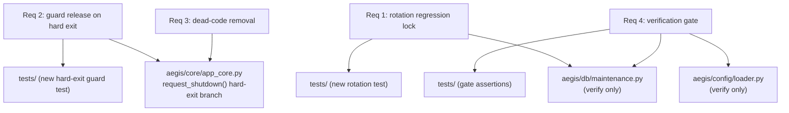

# Design Document

## Overview

V2.0.2 is a **stabilization patch release**. It changes behavior in exactly two small places (`SingleInstanceGuard` release on hard exit; removal of one dead method), adds regression tests for fixes that already landed without coverage, and runs a verification gate over three already-remediated items. It introduces no features, no data-format changes, and no new abstractions.

The guiding constraints:

1. **Minimal blast radius.** Each change is independently revertible and touches the smallest possible file set.
2. **No re-implementation of landed fixes.** The config shallow-overlay, the mtime backup rotation, and the frozen-bundle Alembic path are already correct in the tree; V2.0.2 only locks and verifies them.
3. **Preserve graceful shutdown ordering.** The single-signal teardown sequence in `AppCore.request_shutdown()` is not to be reordered; only the second-signal hard-exit branch gains a guard release.

### Current state (verified against the code)

- `aegis/config/loader.py` — `ConfigStore.save()` performs `merged_data = on_disk_data.copy(); merged_data.update(model_data)` under `utils.config_lock`, with atomic temp-file write and a `backups/config` snapshot. Covered by `tests/test_config_preservation.py` (preservation, nested extra-field retention, atomic-failure integrity, delete/clear merge contract).
- `aegis/db/maintenance.py` — `rotate_backups()` sorts by `(p.stat().st_mtime, p.name)` and deletes all but the newest `keep`. **No dedicated test.**
- `aegis/db/maintenance.py` — `run_migrations()` branches on `sys.frozen` and resolves `alembic.ini` + `script_location` from `sys._MEIPASS`.
- `aegis/db/maintenance.py` — `is_db_ahead()` returns `True` only when the current revision is unparseable by the running build's `ScriptDirectory`; for any recognized revision it returns `False`. For the project's current linear single-head migration model this is acceptable (an older build encountering a newer revision will not recognize it → refusal), but the inline `script.get_revision(current)` / `get_heads()` logic is partly inert and should be documented.
- `aegis/core/app_core.py` — `request_shutdown()` does `os._exit(0)` on the second call **before** any guard release; `_bot_task_placeholder()` is defined but unreferenced. `aegis/__main__.py` holds the `SingleInstanceGuard` as `core.guard` and calls `guard.release()` only in its own `finally`, which the `os._exit` path bypasses.
- `aegis/core/single_instance.py` — `release()` releases the mutex (Windows) and unlinks `aegis.lock`/`aegis.url` when primary; it is safe to call and swallows its own errors.

## Architecture

No structural change. The four requirements map to three files plus tests:

## Components and Interfaces

### Requirement 1 — Backup rotation regression lock (test only)

`rotate_backups(paths, keep)` is already correct (mtime ordering). The design adds a test that:
- Creates more than `keep` DB_Backup files whose **filename order contradicts their mtime order** (e.g., an `aegis_zzz_*.db` created earliest and an `aegis_aaa_*.db` created latest, plus revision-name variants of differing lengths), by explicitly setting `os.utime` on each file.
- Calls `rotate_backups(paths, keep)`.
- Asserts the surviving set is exactly the newest `keep` by mtime, and that a file that sorts "newest" lexically but is oldest by mtime is deleted.
- A separate case with fewer than `keep` files asserts nothing is deleted.

No production change in this requirement.

### Requirement 2 — Single-instance guard release on hard exit

Behavioral contract change, confined to the second-signal branch of `AppCore.request_shutdown()`:
- Before calling `os._exit(0)` on the second shutdown request, if `self` holds a reference to the Single_Instance_Guard (it is attached as `core.guard` in `aegis/__main__.py`), call its `release()` inside a `try/except` that swallows any error, then proceed to `os._exit(0)`.
- The guard reference must be accessed defensively (the attribute may be absent in unit tests or alternative entry paths); absence must not raise.
- The first-signal graceful path is unchanged; it already terminates via `aegis/__main__.py`'s `finally: guard.release()`.

Interface note: this requires `AppCore` to be able to see the guard. It is already set as `core.guard = guard` in `aegis/__main__.py`. The design uses `getattr(self, "guard", None)` so no constructor signature change is needed.

### Requirement 3 — Dead-code removal

Remove `AppCore._bot_task_placeholder`. Confirm via search that it is unreferenced anywhere in `aegis/`, `tests/`, and the legacy modules before removal. No other method is touched.

### Requirement 4 — Verification gate (no production change)

- Confirm `ConfigStore.save()` retains the shallow overlay and the existing tests pass.
- Confirm `run_migrations()` resolves the frozen-bundle paths (inspection or a test that asserts the `sys.frozen` branch builds the `_MEIPASS`-based config).
- Confirm `is_db_ahead()` returns a refusal verdict for an unknown current revision; add a clarifying code comment documenting the linear-single-head limitation. (The comment is the only permitted production edit under R4; if even that is undesired, it may be deferred — see Open Questions.)

## Data Models

V2.0.2 introduces no new data models, no schema migrations, and no configuration-format changes. The relevant existing shapes are unchanged:

- **DB_Backup files**: `aegis_<rev>_<timestamp>.db` under `backups/db`; ordering authority is filesystem mtime.
- **Guard_Files**: `aegis.lock` (PID/owner marker) and `aegis.url` (running dashboard URL), under the data directory root.
- **Config file**: unchanged JSON at `%APPDATA%\Aegis\config\config.json`; the shallow-overlay write contract is retained, not modified.

## Error Handling

| Condition | Detection | Handling | Requirement |
| --- | --- | --- | --- |
| Guard release raises during hard exit | exception from `guard.release()` | Swallow; proceed to `os._exit(0)`; never hang | 2.3 |
| Guard reference absent on `AppCore` | `getattr(self, "guard", None)` is None | Skip release; proceed to `os._exit(0)` | 2.1 |
| Fewer than `keep` backups during rotation | length check in `rotate_backups` | Delete nothing | 1.4 |
| Backup directory missing during rotation | `exists()` check | Return without action (existing behavior) | 1.1 |
| `is_db_ahead` cannot parse current revision | exception from `script.get_revision` | Return `True` (refuse) | 4.3 |
| Placeholder method still referenced somewhere | pre-removal search finds a caller | Do not remove; report | 3.2 |

The change in Requirement 2 must not introduce any new await point or reordering into the graceful (single-signal) teardown; the guard release on hard exit is synchronous and bounded.

## Correctness Properties

### Property 1: Rotation keeps newest by mtime

For any set of `N` DB_Backup files with arbitrary filenames and arbitrary modification times, `rotate_backups(keep)` leaves exactly the `min(N, keep)` files with the greatest mtime and deletes the rest, independent of filename lexical order.

**Validates: Requirements 1.1, 1.2, 1.4**

### Property 2: Hard exit releases the guard

For a second shutdown signal, the Single_Instance_Guard's `release()` is invoked before process termination, and a raising `release()` does not prevent termination.

**Validates: Requirements 2.1, 2.2, 2.3**

### Property 3: Graceful teardown ordering preserved

For a single shutdown signal, the teardown step order recorded in `AppCore.teardown_log` is unchanged from the pre-V2.0.2 sequence.

**Validates: Requirements 2.4**

### Property 4: No reachable reference to removed code

After removal, no module in `aegis/`, `tests/`, or the legacy root references `_bot_task_placeholder`, and the suite remains green.

**Validates: Requirements 3.1, 3.2, 3.3**

### Property 5: Landed fixes hold

The config shallow-overlay tests, a frozen-bundle Alembic path assertion, and an `is_db_ahead` unknown-revision refusal assertion all pass.

**Validates: Requirements 4.1, 4.2, 4.3, 4.5**

## Testing Strategy

- **Baseline gate:** the full existing suite must be green before and after each task; no existing test may be deleted.
- **New tests land with their task** (same commit).
- **No real process termination in tests:** the hard-exit test must patch `os._exit` (assert it is called) and provide a fake guard whose `release()` is observable; it must never actually exit the test runner.
- **No real Discord/network or DB process:** rotation tests use temp files via the existing `paths_tmp` fixture and `os.utime` to control mtimes.
- **Exit condition:** full suite green; the rotation regression test fails if reverted to lexical sort; the hard-exit guard test fails if the release call is removed.

## Design Decisions and Rationale

1. **Lock, don't re-fix.** The config and rotation fixes already exist; re-implementing them would add risk for zero benefit. V2.0.2's value is the *tests* that prevent silent regression.
2. **Guard release via `getattr`, not a constructor change.** The guard is attached post-construction in `aegis/__main__.py`; using `getattr(self, "guard", None)` keeps `AppCore`'s signature stable and unit tests simple.
3. **Keep `os._exit` semantics.** The double-signal force-quit is intentional (it must terminate even if teardown is wedged). The only addition is a bounded, exception-swallowing guard release immediately before it — it cannot reintroduce a hang.
4. **Document, don't redesign, `is_db_ahead`.** A proper revision-graph comparison belongs to the later migration-hardening work; for the current linear single-head model the unknown-revision refusal is sufficient, and a comment records the limitation.
5. **Dead-code removal is isolated.** Removing `_bot_task_placeholder` is independent of the other tasks and trivially revertible.

## Open Questions / Risks

- **R4 code comment vs. zero-production-change:** Requirement 4 permits a single clarifying comment in `is_db_ahead`. If the release policy forbids *any* production edit in a verification-only task, the comment can be deferred to V2.1 and R4 becomes inspection-only. Default: include the comment.
- **Scope confirmation:** if the approving party's "V2.0.2 plan" intended scope beyond these four items (for example, the recovery restore/rebuild stale-engine-handle cleanup, or moving `.env.enc` out of the EXE bundle if not already done by the prior V2.0 phase), that must be reconciled before implementation rather than inferred here.
