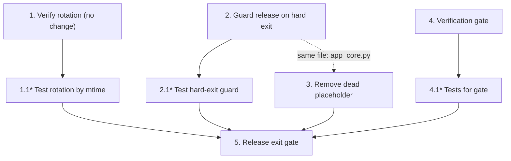

# Implementation Plan: Aegis Suite V2.0.2 — Stabilization Patch

## Overview

This plan locks in already-landed correctness fixes with regression tests and closes a short list of low-severity residuals. Implementation language is **Python 3.12** (existing stack). Tests use the existing **pytest** suite under `tests/` with the `paths_tmp` fixture from `conftest.py`.

Rules for the executing model:

- **One task = one revertible commit.** Never batch tasks.
- **No features, no data-format changes, no new abstractions.** This is a patch release.
- **Baseline gate:** the full suite must be green before starting and after each task. Do not delete any existing test.
- **Do NOT re-implement landed fixes.** `ConfigStore.save()` shallow overlay, `rotate_backups()` mtime ordering, and the frozen-bundle Alembic path are already correct — V2.0.2 only adds tests and verifies them.
- Tasks marked `*` are test-only sub-tasks and land in the same commit as their parent.
- **Before any task, confirm the working tree state matches the design's "Current state" notes.** If a referenced fix is absent or different, stop and reconcile scope.

Complexity labels: **S** = one focused change, **M** = change + tests.

## Tasks

- [ ] 1. Regression-lock backup rotation ordering (Complexity: S)
  - Verify (no change) that `rotate_backups()` in `aegis/db/maintenance.py` sorts by `(p.stat().st_mtime, p.name)` and deletes all but the newest `keep`
  - Do NOT modify `rotate_backups` unless verification shows it has regressed to lexical sort; if it has, stop and report before changing
  - Files affected: none (verification); `tests/` (new test)
  - Acceptance criteria:
    - `rotate_backups` confirmed to order by mtime
    - The new test (1.1) is present and green
  - Regression risks: none (verification task)
  - _Requirements: 1.1, 1.2, 1.4_

- [ ]* 1.1 Test rotation keeps newest by mtime regardless of filename (Complexity: S)
  - **Property 1:** create more than `keep` `aegis_*.db` files in `paths_tmp.backups_db` whose lexical filename order contradicts their mtime order (use `os.utime` to set explicit mtimes; include differing-length revision names such as `aegis_empty_*.db` and `aegis_<hash>_*.db`); call `rotate_backups(paths_tmp, keep=N)`; assert the survivors are exactly the newest `N` by mtime and that a lexically-"newest" but oldest-by-mtime file is deleted
  - Add a case with fewer than `keep` files asserting nothing is deleted
  - Files affected: `tests/`
  - Acceptance criteria: test passes; reverting `rotate_backups` to sort by `p.name` only makes it fail
  - _Requirements: 1.1, 1.2, 1.3, 1.4_

- [ ] 2. Release the single-instance guard on hard exit (Complexity: M)
  - In `aegis/core/app_core.py` `request_shutdown()`, in the second-signal branch that calls `os._exit(0)`: before exiting, retrieve the guard via `getattr(self, "guard", None)`; if present, call `guard.release()` inside a `try/except` that swallows any exception; then call `os._exit(0)`
  - Access the guard defensively — absence must not raise (unit tests may construct `AppCore` without a guard)
  - Do NOT change the single-signal graceful teardown ordering or any other teardown step
  - **⚠️ Do NOT** add an `await` to the hard-exit branch or move the `os._exit` call; the release must be synchronous and immediately precede exit
  - Files affected: `aegis/core/app_core.py`
  - Acceptance criteria:
    - A second shutdown signal invokes `guard.release()` before `os._exit`
    - A raising `release()` does not prevent exit
    - Missing guard attribute does not raise
    - The graceful (single-signal) `teardown_log` order is unchanged
  - Regression risks: introducing a hang before `os._exit`; reordering graceful teardown; assuming the guard always exists
  - _Requirements: 2.1, 2.2, 2.3, 2.4_

- [ ]* 2.1 Test hard-exit releases guard (Complexity: M)
  - **Property 2 + Property 3:** patch `os._exit` (assert called, do not actually exit); attach a fake guard whose `release()` is observable; call `request_shutdown()` twice; assert `release()` was called before `os._exit`. Add a case where `release()` raises and assert `os._exit` is still called. Add a case with no `guard` attribute asserting no exception. Add a single-signal case asserting `teardown_log` matches the pre-change order
  - Files affected: `tests/`
  - Acceptance criteria: all cases pass; removing the release call makes the first case fail
  - _Requirements: 2.1, 2.2, 2.3, 2.4_

- [ ] 3. Remove dead placeholder method (Complexity: S)
  - Search `aegis/`, `tests/`, and the legacy root for any reference to `_bot_task_placeholder`; confirm none exists outside its definition
  - Remove `AppCore._bot_task_placeholder` from `aegis/core/app_core.py`
  - Do NOT remove or alter any other method
  - **⚠️ If any caller is found**, stop and report; do not remove
  - Files affected: `aegis/core/app_core.py`
  - Acceptance criteria:
    - `_bot_task_placeholder` is gone; no reference remains anywhere
    - The full suite is green after removal
  - Regression risks: removing a method that is referenced indirectly (verify first)
  - _Requirements: 3.1, 3.2, 3.3_

- [ ] 4. Stabilization verification gate (Complexity: M)
  - Confirm `ConfigStore.save()` retains the shallow overlay (`merged_data.update(model_data)`) and that `tests/test_config_preservation.py` passes (preservation, nested extra retention, atomic-failure integrity, delete/clear merge contract)
  - Confirm `run_migrations()` resolves `alembic.ini` and `script_location` from `sys._MEIPASS` under the `sys.frozen` branch
  - Confirm `is_db_ahead()` returns a refusal verdict (True) when the current DB revision is unknown to the running build; add a single clarifying code comment documenting the linear-single-head limitation (this comment is the only permitted production edit in this task; if the release policy forbids any production edit, defer the comment and make this inspection-only)
  - Files affected: `aegis/db/maintenance.py` (one comment, optional); `tests/` (gate assertions)
  - Acceptance criteria:
    - Config preservation/merge-contract tests pass
    - A test or documented inspection confirms the frozen-bundle Alembic path resolution
    - A test confirms `is_db_ahead` returns True for an unknown current revision
    - If `is_db_ahead` is found to permit a genuinely newer-build DB without refusal, the finding is reported and scope is NOT expanded
  - Regression risks: scope creep into a migration-guard redesign (forbidden here)
  - _Requirements: 4.1, 4.2, 4.3, 4.4, 4.5_

- [ ]* 4.1 Tests for verification gate (Complexity: S)
  - **Property 5:** add a test asserting the `sys.frozen` branch of `run_migrations` builds a `Config` rooted at the bundle dir (patch `sys.frozen`/`sys._MEIPASS`, assert `script_location` points under the bundle); add a test asserting `is_db_ahead` returns True for an unknown current revision (stub `get_current_revision` and a `ScriptDirectory` that raises on `get_revision`)
  - Files affected: `tests/`
  - Acceptance criteria: tests pass
  - _Requirements: 4.2, 4.3_

- [ ] 5. Release exit gate (Complexity: S)
  - Run the full suite; confirm baseline plus all V2.0.2 tests pass
  - Confirm: rotation regression test fails if reverted to lexical sort; hard-exit guard test fails if release removed; `_bot_task_placeholder` reference search is empty; config preservation tests green
  - Confirm each task landed as its own revertible commit
  - Files affected: none (verification)
  - Acceptance criteria: all gate conditions hold
  - _Requirements: 1.3, 2.1, 3.1, 4.5_

## Task Dependency Graph

All four implementation tasks touch disjoint concerns and can be completed independently; Tasks 2 and 3 both edit `aegis/core/app_core.py`, so if worked in parallel they must be sequenced (do Task 2, then Task 3) to avoid a merge conflict. The recommended order is 1 → 4 (priority order). Task 5 is the final gate and depends on all others.



```json
{
  "waves": [
    { "id": 0, "tasks": ["1", "2", "4"] },
    { "id": 1, "tasks": ["1.1", "2.1", "3", "4.1"] },
    { "id": 2, "tasks": ["5"] }
  ]
}
```

Note: Task 3 is placed in wave 1 (after Task 2) because both edit `app_core.py`; strict serial execution in priority order already satisfies this.

## Notes

- This release deliberately leaves legacy modules and the larger V2.1 backlog untouched.
- If the working tree no longer matches the design's "Current state" (the codebase is actively changing), reconcile scope before implementing — several earlier-flagged items have already been remediated.

## Highest-Risk Mistakes an AI Developer Will Make Implementing This Phase

1. **Re-implementing already-landed fixes.** The config shallow overlay, mtime rotation, and frozen Alembic path are done. An AI will "fix" them again and risk regressing working, tested code. Tasks 1 and 4 are verify-only — reject any diff that rewrites `ConfigStore.save()` or `rotate_backups()`.
2. **Reintroducing the recursive merge into `ConfigStore.save()`.** A well-meaning AI may "improve" the overlay into a deep merge, re-creating the delete-semantics regression that `test_config_store_save_merge_contract_patch` exists to prevent. Do not touch the merge.
3. **Adding an `await` or reordering before `os._exit` (Task 2).** The hard-exit branch must stay synchronous and immediate; an awaited release could hang exactly when force-quit is needed. The release is a bounded, exception-swallowed synchronous call right before `os._exit`.
4. **Assuming `AppCore.guard` always exists (Task 2).** It is attached post-construction in `aegis/__main__.py`; unit tests construct `AppCore` without it. Use `getattr(self, "guard", None)` or the guard test will raise.
5. **Actually exiting the test runner.** The hard-exit test must patch `os._exit` and assert it was called; a literal `os._exit` in a test kills the entire pytest process.
6. **Changing the graceful teardown ordering (Task 2).** Only the second-signal branch changes. Reordering the single-signal sequence breaks `teardown_log`-based tests and the shutdown contract.
7. **Removing a referenced method (Task 3).** Verify `_bot_task_placeholder` is truly unreferenced before deleting; do not delete any neighboring method to "tidy up."
8. **Expanding Task 4 into a migration-guard redesign.** `is_db_ahead`'s linear-model limitation is documented, not fixed, in this patch. A proper revision-graph comparison is later work; doing it here violates the patch scope.
9. **Batching tasks into one commit.** Destroys the per-task rollback; the exit gate requires each task independently revertible.
10. **Using lexical-name fixtures that accidentally agree with mtime (Task 1.1).** If the test's filenames happen to sort the same lexically and by mtime, the test passes even against the buggy lexical sort. The fixture must deliberately make lexical order contradict mtime order via `os.utime`.
