# Design Document

## Overview

This document specifies the technical design for **Phase V2.0 — Correctness & Consolidation** of Aegis Suite. It is a prescriptive, low-risk evolution of the existing codebase. It changes *behavior* in seven narrowly scoped places and introduces **no new architectural abstractions**.

The design follows three rules:

1. **Minimal blast radius.** Each change touches the smallest possible set of files and is independently revertible.
2. **No format change.** Configuration remains JSON at `%APPDATA%\Aegis\config\config.json`; secrets remain `.env`/`.env.enc` under `%APPDATA%\Aegis`. Only write behavior, launch wiring, authorization gating, and build packaging change.
3. **Preserve what is correct.** The redaction filter, fail-closed JWT, WAL-safe backups, constant-time password comparison, atomic config write, and the leveling redirect shim are known-good and must not regress.

### Current state (verified against the code)

- `aegis/config/loader.py` — `ConfigStore.save()` writes `self.as_dict()` (model fields only) via temp-file + `os.replace`, then snapshots to `backups/config`. **It does not read or preserve unmodeled keys.** This is the data-loss path.
- `aegis/config/schema.py` — `ConfigModel` and nested models do **not** set `extra="allow"`.
- `utils.py` — `get_writeable_path` already resolves through `Paths()`, so `utils.load_config`/`save_config` and `ConfigStore` target the **same** file; `utils.save_config` preserves all keys; `utils.config_lock` is the shared re-entrant lock; `DEFAULT_CONFIG` enumerates the legacy key set.
- `run.py` — launches `uvicorn web_server:app` (frozen: in-process `uvicorn.run`; source: subprocess) and invokes the legacy console `first_run_wizard`. It does **not** call `aegis.__main__`.
- `aegis/__main__.py` — `main()` builds `Paths`, acquires the `SingleInstanceGuard`, calls `setup_logging`, builds `AppCore`, installs signal handlers, and runs `loop.run_until_complete(core.run())`. It manages its own loop.
- `aegis/web/app.py` — `auth_middleware` bypasses auth for any path starting with `/api/recovery/` or `/wizard/`, in every state.
- `aegis/web/routes/wizard.py` — defines the wizard steps and the recovery endpoints, including the destructive `/api/recovery/db/rebuild`, `/api/recovery/db/restore`, `/api/recovery/restart`.
- `aegis/bot/runner.py` — `validate_token` contains literal/substring/`PYTEST_CURRENT_TEST` shortcuts; `wizard.py` `/wizard/guilds` returns hardcoded guilds under the same conditions.
- `leveling.py` — already a redirect shim re-exporting from `aegis.bot.leveling`.
- `build_exe.py` / `AegisOptimizer.spec` — conditionally add `.env.enc` to the bundle.

## Architecture

No structural change. The seven tasks map to seven existing files plus added tests:

```mermaid
graph TD
    subgraph "Task 1 + 2 — Config integrity"
        L["aegis/config/loader.py<br/>ConfigStore.save() read-merge-write"]
        S["aegis/config/schema.py<br/>extra=allow on all models"]
        U["utils.py<br/>config_lock (reused, unchanged)"]
        L -->|imports lock| U
    end

    subgraph "Task 3 — Entrypoint"
        R["run.py<br/>delegates to aegis.__main__.main()"]
        M["aegis/__main__.py<br/>(unchanged)"]
        R --> M
    end

    subgraph "Task 4 — Recovery auth"
        A["aegis/web/app.py<br/>narrowed middleware allowlist + Origin check"]
        W["aegis/web/routes/wizard.py<br/>per-handler admin check"]
        ST["aegis/core/state.py<br/>current_state (read-only)"]
        A -->|reads| ST
    end

    subgraph "Task 5 — Leveling lock"
        LV["leveling.py shim + aegis/bot/leveling.py<br/>(verify only)"]
    end

    subgraph "Task 6 — Bypass removal"
        RN["aegis/bot/runner.py<br/>validate_token real path"]
        WG["aegis/web/routes/wizard.py<br/>/wizard/guilds real API"]
    end

    subgraph "Task 7 — Secret hygiene"
        BE["build_exe.py / AegisOptimizer.spec<br/>drop .env.enc from datas"]
    end
```

## Components and Interfaces

### Task 1 — `ConfigStore.save()` read-merge-write

Behavioral contract for the new `save()`:

1. Acquire `utils.config_lock` (import it; do not define a new lock).
2. Read the current on-disk Config_File into a dict if it exists; otherwise start from an empty dict.
3. Overlay the model's serialized fields (`self.as_dict()`) onto that dict: modeled keys replace, unmodeled keys are retained verbatim.
4. Write the merged dict to a temporary file in the same directory and `os.replace` it onto the Config_File (unchanged atomic behavior).
5. Snapshot the written file into `backups/config` and rotate (unchanged behavior).
6. On any failure after temp-file creation, delete the temp file and re-raise.

Notes:
- The merge is shallow at the top level: a modeled top-level key wholly replaces its on-disk counterpart. This matches how the legacy layer treats top-level sections and avoids surprising deep-merge semantics. Unmodeled top-level keys (e.g., `giveaways`, `guild_configs`) are never touched.
- Preserve the existing JSON formatting (indentation) used by the current `save()` to avoid spurious diffs and backup churn.

### Task 2 — `extra="allow"` on config models

Add `model_config = ConfigDict(extra="allow")` (Pydantic v2) to `ConfigModel`, `WelcomeSettingsModel`, `AutomodSettingsModel`, and `TicketSettingsModel`. Import `ConfigDict` from `pydantic`. No field changes. `validate_config(data)` continues to call `ConfigModel(**data)`; extra keys now survive into `model_dump()`.

### Task 3 — `run.py` delegation

`run.py` retains its source-only environment preparation (venv, dependency install, FFmpeg PATH discovery) guarded by the existing frozen/headless checks, then calls `aegis.__main__.main()` for the launch in both frozen and source cases. The legacy `uvicorn.run("web_server:app", ...)`, the subprocess uvicorn launch, and the legacy console `first_run_wizard` invocation are removed from the launch path. No `asyncio.run`/loop is created in `run.py` (the Unified_Entrypoint owns the loop). `import web_server` must not occur at module level.

### Task 4 — Recovery/wizard authorization

Two coordinated changes:

**Middleware (`aegis/web/app.py`).** Replace the blanket `/api/recovery/` and `/wizard/` bypass with:
- Pre_Auth_Recovery_Endpoints (wizard token/guilds/templates/finish, `/api/recovery/token`, `/api/recovery/retry`, `/api/recovery/backups`) are reachable without a session **only** when `core.state.current_state == SAFE_MODE` OR the admin password hash is unset. Otherwise they fall through to the normal auth check.
- Destructive_Recovery_Endpoints (`/api/recovery/db/rebuild`, `/api/recovery/db/restore`, `/api/recovery/restart`) always require a valid Admin_Session, in every state.
- For state-changing POSTs to wizard/recovery paths, if an `Origin` header is present and does not equal `http://127.0.0.1:<core.web_port>`, reject with 403. Absent `Origin` → allow through to normal handling.

**Handlers (`aegis/web/routes/wizard.py`).** Each Destructive_Recovery_Endpoint handler independently extracts the bearer token, calls `auth.validate_session`, and confirms `auth.get_session_role(token) == "admin"`, returning 401/403 otherwise. This is defense in depth and must not be removed even though the middleware also enforces it.

The lifecycle state is read from `request.app.state.core.state.current_state` — the authoritative state machine, not a health-registry mirror.

### Task 5 — Leveling verification (no behavior change)

Verify `leveling.py` is a pure re-export of `aegis.bot.leveling` and that no second `LevelingSystem()` is constructed anywhere outside `aegis/bot/leveling.py`. Add a regression test asserting object identity and DB round-trip. If a divergence exists, stop and report — do not refactor.

### Task 6 — Test-bypass removal

In `validate_token` (`aegis/bot/runner.py`), remove the `"bad_token"`/`"intent_failed"`/`"timeout"` literals, the `startswith("valid")`/`startswith("token")`/`"fake" in token`/`== "ABC.DEF.GHI"` heuristics, and the `PYTEST_CURRENT_TEST` branch; keep the format check and the real `discord.Client.login` probe within `asyncio.wait_for`. In `/wizard/guilds`, remove the equivalent mock block; always call the real Discord guilds API. Update affected tests to monkeypatch `validate_token` and the aiohttp guilds call instead of relying on the shims.

### Task 7 — Secret packaging hygiene

In `build_exe.py`, remove the conditional `--add-data .env.enc;.` (and any `.env`) so the Distributed_Executable carries no secrets; replace with a build-log note. In `AegisOptimizer.spec`, ensure `datas` contains no `.env`/`.env.enc` entry. Keep `static`, `templates`, `alembic.ini`, and `aegis/db/migrations`. Verify (no change expected) that `utils.get_writeable_path(".env")`/`(".env.enc")` resolve under `Paths().root`.

## Data Models

This phase introduces no new persistent data models and no schema migrations. The relevant data shapes are existing and unchanged; they are restated here to bound the implementation.

### Config_File (JSON, unchanged format)

Top-level keys fall into two categories:

- **Modeled keys** (owned by `ConfigModel`): `client_id`, `setup_complete`, `ui_mode`, `welcome_settings`, `automod_settings`, `ticket_settings`, `custom_commands`, `admin_password_hash`, `hosting_mode`.
- **Unmodeled keys** (owned by the Legacy_Config_Layer, must be preserved by Task 1): `scheduled_messages`, `leveling_settings`, `auto_responders`, `giveaways`, `guild_configs`, `revoked_guilds`, `pending_pairings`, and any other key present on disk.

Task 1's merge contract: `merged = on_disk_dict; merged.update(model.as_dict())`. Modeled keys overwrite; unmodeled keys persist untouched. No deep merge.

### ConfigModel (Pydantic v2, Task 2)

Existing fields are unchanged. The only change is `model_config = ConfigDict(extra="allow")` added to `ConfigModel`, `WelcomeSettingsModel`, `AutomodSettingsModel`, and `TicketSettingsModel`, so unknown fields survive construction and `model_dump()`.

### Session / role (read-only, Task 4)

Authorization decisions consume the existing JWT session shape via `auth.validate_session(token)` and `auth.get_session_role(token)` returning `admin` / `tenant` / `None`. No change to the session model.

### Secret_Files (unchanged)

`.env` (plaintext `KEY=VALUE`) and `.env.enc` (DPAPI JSON blob) resolve under `Paths().root`. No format change; Task 7 only removes them from the build bundle.

## Error Handling

| Condition | Detection | Handling | Requirement |
| --- | --- | --- | --- |
| Config_File missing on save | `exists()` check in `save()` | Start merge from empty dict; write normally | 1.3 |
| Config_File present but unreadable/corrupt JSON on save | `json.load` raises | Do not destroy the file; abort the save, re-raise, leave prior file intact | 1.6 |
| Temp-file write fails after creation | exception during write/replace | Delete temp file, re-raise; Config_File unchanged | 1.6 |
| Backup snapshot fails | exception during `backups/config` copy | Log and continue; the primary write already succeeded (best-effort backup) | 1.5 |
| `run.py` cannot import `aegis.__main__` | ImportError at launch | Surface a clear error and non-zero exit; do not fall back to `web_server` | 3.1, 3.2 |
| Destructive endpoint without Admin_Session | middleware + handler check | HTTP 401 (no/invalid token) or 403 (valid non-admin); no side effects | 4.1, 4.2, 4.7 |
| Cross-origin state-changing recovery POST | `Origin` header mismatch vs `core.web_port` | HTTP 403; no side effects | 4.5 |
| `core.web_port` unset during Origin check | attribute is `None` | Present-but-mismatched Origin → reject; absent Origin → allow | 4.5, 4.6 |
| Token validation real path raises | exception in `login` probe | Return `AUTH_FAILED` (never a bypass success) | 6.1, 6.2 |
| Discord guilds API non-200 / timeout | response status / `asyncio.TimeoutError` | HTTP 400 with detail; never return placeholder guilds | 6.3 |
| Leveling divergence discovered | second instantiation found | Stop, report; no refactor in this phase | 5.3 |
| Secret_Files do not resolve under data root | Task 7 verification | Report discrepancy; do not silently rework fallback | 7.4 |

All recovery/auth rejections must be side-effect-free: no DB mutation, no token write, no shutdown is permitted before the authorization check passes.

## Correctness Properties

### Property 1: Config write preservation

For any Config_File content `C` and any ConfigStore model `M`, the result of `ConfigStore.save()` contains every key of `C` that is not a modeled field of `M`, with its original value, and every modeled field equal to `M`'s value.

**Validates: Requirements 1.1, 1.2, 1.3**

### Property 2: Atomic write integrity

For any `ConfigStore.save()` invocation, either the Config_File reflects the fully merged content or it reflects the prior content; it is never left partially written, and no temporary file remains after a failure.

**Validates: Requirements 1.5, 1.6**

### Property 3: Model extra-field retention

For any dictionary `D` passed to a config model, every key of `D` not declared as a field appears unchanged in the model's `model_dump()` output.

**Validates: Requirements 2.1, 2.2**

### Property 4: Entrypoint equivalence

The `run.py` launch path and the packaged executable both result in `AppCore.run()` being the served application, and `run.py` does not import `web_server`.

**Validates: Requirements 3.1, 3.2, 3.3**

### Property 5: Destructive endpoint authorization

For every Destructive_Recovery_Endpoint and every Lifecycle_State, a request lacking a valid Admin_Session is rejected without side effects.

**Validates: Requirements 4.1, 4.2, 4.7**

### Property 6: Recovery reachability preserved

While SAFE_MODE or first-run, every Pre_Auth_Recovery_Endpoint is reachable without a session.

**Validates: Requirements 4.3, 4.4**

### Property 7: Validation has no shipped bypass

For any input, the Token_Validation_Routine in shipped code reaches a verdict only through the real format check and login probe, never through a literal or environment shortcut.

**Validates: Requirements 6.1, 6.2, 6.4**

### Property 8: Single leveling instance

`leveling.leveling_system` and `aegis.bot.leveling.leveling_system` are the same object, and a DB-bound write through one import is visible through the other.

**Validates: Requirements 5.1, 5.2**

### Property 9: No bundled secrets

The build configuration's data set contains no `.env` or `.env.enc` entry, and the Secret_Files resolve under the data directory root at runtime.

**Validates: Requirements 7.1, 7.2, 7.3**

## Testing Strategy

- **Baseline gate:** the full existing suite (≥170 tests) must be green before and after each task. No existing test may be deleted to pass a change; tests that depended on removed bypasses are *updated* to use mocks (Task 6).
- **Per-task tests:** each task ships its own tests in the same commit (enumerated in `tasks.md`).
- **Property-style tests:** Properties 1, 3, and 5 lend themselves to parametrized/property tests (varied config dicts, varied destructive endpoints and states). Properties 2, 4, 7, 8, 9 are example/integration tests.
- **No network in tests:** Task 6's tests must mock the Discord client and the aiohttp guilds call; no test may hit the real Discord API.
- **Phase exit gate:** full suite green; config round-trip test green; destructive-endpoint-rejected-in-RUNNING test green; `run` does not import `web_server`; grep for removed bypass literals in `aegis/` (excluding `tests/`) is empty; build data set contains no `.env*`.

## Design Decisions and Rationale

1. **Read-merge-write over a full config-layer rewrite.** The data-loss bug is closed with a minimal change inside one method, deferring the proper SQL/repository solution to V2.2. This avoids risk in a phase whose purpose is stabilization.
2. **Reuse `utils.config_lock`.** A new lock would either race with the legacy writer (the exact bug) or deadlock under the re-entrant pattern. Reusing the existing lock guarantees serialization across both writers during the transition.
3. **Defense in depth for recovery auth.** Enforcing in both middleware and handler protects against future router-registration changes that might bypass the middleware ordering.
4. **SAFE_MODE/first-run carve-out is mandatory.** Without it, a token-recovery or needs-setup user has no session and would be permanently locked out — the opposite of the recovery system's purpose.
5. **Delegate, don't merge, the entrypoint.** Keeping `run.py` as a thin shim preserves the developer source-run workflow (venv/deps/ffmpeg) while guaranteeing the served app is identical to the shipped one.
6. **Verify, don't refactor, leveling.** The unification already landed; the only V2.0 action is to lock it with a test so a later refactor cannot silently re-split it.

## Open Questions / Risks

- **Origin port binding:** the dashboard port is resolved dynamically (8000–8010). The Origin check must compare against `core.web_port` (the resolved value), not a hardcoded 8000. If `web_port` is unset at request time, treat a present-but-mismatched Origin conservatively (reject) and an absent Origin as allowed.
- **Cloud path:** removing the bundled `.env.enc` is safe for Railway/Render because those use platform-injected env vars, not the bundle. Confirm during Task 7 verification.
