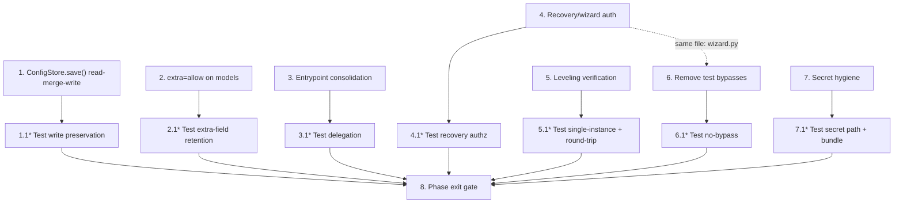

# Implementation Plan: Phase V2.0 — Correctness & Consolidation

## Overview

This plan executes the seven correctness/security fixes defined in `requirements.md` and `design.md`. Implementation language is **Python 3.12** (matches the existing codebase: discord.py, FastAPI, SQLAlchemy, Alembic, Pydantic v2). Tests use the existing **pytest** suite under `tests/`.

Rules for the executing model:

- **One task = one revertible commit.** Never batch tasks.
- **No new architecture.** No SQL config, no DI container, no event bus, no repository layer, no cog refactor. This phase only changes write behavior, launch wiring, authorization gating, and build packaging.
- **Baseline gate:** the full suite (≥170 tests) must be green before starting and after each task. Do not delete an existing test to make a change pass; update tests only where a task explicitly requires it (Task 6).
- **Before Task 1 and Task 7**, confirm a manual backup of `%APPDATA%\Aegis\config\config.json` and `%APPDATA%\Aegis\.env*` exists.
- Tasks marked `*` are test-only sub-tasks and must land in the same commit as their parent task.

Complexity labels: **S** = one focused change, **M** = multiple edits + tests, **L** = cross-cutting + behavior change with test migration.

## Tasks

- [x] 1. Make `ConfigStore.save()` non-destructive (read-merge-write) (Complexity: M)
  - Modify `ConfigStore.save()` in `aegis/config/loader.py` to: import and acquire `utils.config_lock`; read the current on-disk Config_File into a dict (empty dict if absent); overlay `self.as_dict()` onto that dict (modeled keys replace, unmodeled keys retained verbatim); write the merged dict via the existing temp-file + `os.replace` atomic path; produce the existing `backups/config` snapshot and rotation
  - Preserve the existing JSON indentation/format used by the current `save()` exactly
  - On any failure after temp-file creation, delete the temp file and re-raise; never destroy or partially write the Config_File
  - **⚠️ Do NOT** create a new lock; import `config_lock` from `utils`. Do NOT deep-merge nested dicts — top-level overlay only. Do NOT add SQL or a repository.
  - Files affected: `aegis/config/loader.py`
  - Acceptance criteria:
    - Saving via ConfigStore preserves every pre-existing top-level key not in ConfigModel (`giveaways`, `guild_configs`, `scheduled_messages`, `revoked_guilds`, `pending_pairings`, `leveling_settings`, `auto_responders`) with original values
    - Modeled fields reflect the model's values after save
    - Output remains valid JSON; temp file removed on failure; `backups/config` snapshot still produced
    - No second lock object is introduced (verified by inspection)
  - Regression risks: deadlock from a new lock; format change causing spurious diffs/backup churn; reading the file outside the lock
  - _Requirements: 1.1, 1.2, 1.3, 1.4, 1.5, 1.6_

- [x]* 1.1 Test config write preservation (Complexity: S)
  - **Property 1 + Property 2** support: write a Config_File containing unmodeled keys, load via ConfigStore, `save()`, reload raw JSON, assert all original keys/values persist and modeled fields updated
  - Add a failure-injection test asserting a write error leaves the original file intact and removes the temp file
  - Files affected: `tests/` (new test module)
  - Acceptance criteria: tests pass; intentionally removing the merge step makes the preservation test fail
  - _Requirements: 1.1, 1.3, 1.6_

- [x] 2. Add `extra="allow"` to config models (Complexity: S)
  - In `aegis/config/schema.py`, add `model_config = ConfigDict(extra="allow")` to `ConfigModel`, `WelcomeSettingsModel`, `AutomodSettingsModel`, and `TicketSettingsModel`; import `ConfigDict` from `pydantic`
  - Do not change any existing field name, type, or default; `validate_config` remains `ConfigModel(**data)`
  - Files affected: `aegis/config/schema.py`
  - Acceptance criteria:
    - Constructing any model with extra keys returns those keys in `model_dump()`
    - No field signature changes; existing schema tests still pass
  - Regression risks: leaving `extra="forbid"` anywhere; wrong import of `ConfigDict`; breaking `validate_config`
  - _Requirements: 2.1, 2.2, 2.3_

- [x]* 2.1 Test extra-field retention (Complexity: S)
  - **Property 3:** pass extra keys into `ConfigModel` and each nested model; assert they survive `model_dump()`
  - Files affected: `tests/`
  - Acceptance criteria: test passes; reverting `extra="allow"` makes it fail
  - _Requirements: 2.1, 2.2_

- [x] 3. Consolidate the entrypoint (`run.py` → `aegis.__main__`) (Complexity: M)
  - In `run.py`, replace the application launch (both the frozen `uvicorn.run("web_server:app", ...)` branch and the source subprocess uvicorn branch) with a call to `aegis.__main__.main()`
  - Remove the legacy console `first_run_wizard` invocation from the launch path; do NOT delete `first_run_wizard.py`
  - Retain source-only environment prep (venv creation, dependency install, FFmpeg PATH resolution) behind the existing frozen/headless guards
  - Ensure `run.py` does not `import web_server` at module level and does not wrap `main()` in `asyncio.run` (the Unified_Entrypoint owns its loop)
  - **⚠️ Do NOT** delete `web_server.py`, `bot_manager.py`, or `first_run_wizard.py`. Do NOT add a second event loop.
  - Files affected: `run.py`
  - Acceptance criteria:
    - The source launch reaches `AppCore.run()`; `web_server:app` is never served
    - `import run` does not import `web_server`
    - FFmpeg PATH resolution for source runs is preserved
  - Regression risks: double event loop; broken frozen-EXE detection; losing FFmpeg resolution
  - _Requirements: 3.1, 3.2, 3.3, 3.4, 3.5, 3.6_

- [x]* 3.1 Test entrypoint delegation (Complexity: S)
  - **Property 4:** assert the `run` module source does not reference `web_server` and that its launch function delegates to `aegis.__main__.main` (patch `aegis.__main__.main` and assert it is called; do not boot a real server)
  - Files affected: `tests/`
  - Acceptance criteria: test passes without starting uvicorn or the bot
  - _Requirements: 3.1, 3.2, 3.3_

- [x] 4. Secure recovery and wizard endpoints (Complexity: L)
  - In `aegis/web/app.py` `auth_middleware`: narrow the `/api/recovery/` and `/wizard/` bypass. Pre_Auth_Recovery_Endpoints (wizard token/guilds/templates/finish, `/api/recovery/token`, `/api/recovery/retry`, `/api/recovery/backups`) are bypassable without a session ONLY when `request.app.state.core.state.current_state == SAFE_MODE` OR `os.environ.get("ADMIN_PASSWORD_HASH")` is unset; otherwise fall through to normal auth
  - Destructive_Recovery_Endpoints (`POST /api/recovery/db/rebuild`, `/api/recovery/db/restore`, `/api/recovery/restart`) ALWAYS require a valid Admin_Session in every state
  - Add an `Origin` check for state-changing wizard/recovery POSTs: if `Origin` is present and not equal to `http://127.0.0.1:{core.web_port}`, reject with 403; absent `Origin` → allow through to normal handling; if `core.web_port` is None, a present-but-mismatched Origin is rejected
  - In `aegis/web/routes/wizard.py`: at the top of each Destructive_Recovery_Endpoint handler, extract the bearer token, call `auth.validate_session`, confirm `auth.get_session_role(token) == "admin"`, and return 401/403 otherwise (defense in depth, kept even though middleware also enforces)
  - **⚠️ Do NOT** require auth on the wizard/token/retry endpoints in SAFE_MODE/first-run — that locks out recovery. Read state from `core.state.current_state`, not a health mirror.
  - Files affected: `aegis/web/app.py`, `aegis/web/routes/wizard.py`
  - Acceptance criteria:
    - Unauthenticated destructive recovery POST in RUNNING → 401/403, no action taken
    - Admin-authenticated destructive POST → allowed
    - Wizard token endpoint reachable in `needs-setup`/SAFE_MODE without a session
    - Cross-origin destructive POST → 403
  - Regression risks: locking out first-run users; breaking existing recovery tests that assume open access; reading the wrong state attribute
  - _Requirements: 4.1, 4.2, 4.3, 4.4, 4.5, 4.6, 4.7_

- [x]* 4.1 Test recovery authorization (Complexity: M)
  - **Property 5 + Property 6:** (a) unauthenticated destructive POST in RUNNING → rejected, no side effect; (b) admin-authenticated destructive POST in SAFE_MODE → allowed; (c) wizard token endpoint reachable in `needs-setup` without a session; (d) cross-origin destructive POST → 403
  - Use the FastAPI test client with a mocked `AppCore`/state; do not perform a real DB rebuild
  - Files affected: `tests/`
  - Acceptance criteria: all four cases pass; reverting the middleware narrowing makes case (a) fail
  - _Requirements: 4.1, 4.2, 4.3, 4.5_

- [x] 5. Verify and lock leveling unification (Complexity: S)
  - Verify `leveling.py` is a pure re-export of `aegis.bot.leveling` (`leveling_system`, `LevelingSystem`) and that no second `LevelingSystem()` is constructed outside `aegis/bot/leveling.py`
  - Do NOT change leveling behavior. IF a second instantiation is found, STOP and report; do not refactor
  - Files affected: none for behavior; `tests/` (new test)
  - Acceptance criteria: `import leveling; import aegis.bot.leveling; leveling.leveling_system is aegis.bot.leveling.leveling_system` holds
  - Regression risks: none (verification); do not "improve" leveling here
  - _Requirements: 5.1, 5.2, 5.3_

- [x]* 5.1 Test leveling single-instance + DB round-trip (Complexity: S)
  - **Property 8:** assert object identity across both import paths; after `set_engine(engine)`, a write via the bot-facing import is readable via the DB-facing import (in-memory SQLite via the existing test fixtures)
  - Files affected: `tests/`
  - Acceptance criteria: identity and round-trip assertions pass
  - _Requirements: 5.1, 5.2_

- [x] 6. Remove production test bypasses (Complexity: L)
  - In `aegis/bot/runner.py` `validate_token`: remove the `"bad_token"`/`"intent_failed"`/`"timeout"` literals, the `startswith("valid")`/`startswith("token")`/`"fake" in token`/`== "ABC.DEF.GHI"` heuristics, and the `PYTEST_CURRENT_TEST` branch; keep the format check and the real `discord.Client.login` probe within `asyncio.wait_for`
  - In `aegis/web/routes/wizard.py` `/wizard/guilds`: remove the mock/test bypass block; always call the real Discord guilds API
  - Update any tests that relied on these shims to monkeypatch `validate_token` and the aiohttp guilds call (mock the Discord client / HTTP layer); do NOT re-introduce any bypass to make tests pass
  - Files affected: `aegis/bot/runner.py`, `aegis/web/routes/wizard.py`, affected `tests/`
  - Acceptance criteria:
    - No shipped (non-test) code returns a verdict from a token literal or env var; grep for removed literals in `aegis/` excluding `tests/` is empty
    - A well-formed fake token no longer returns OK without a mock
    - The suite is green after test migration
  - Regression risks: re-adding a bypass to pass tests; tests hitting the real Discord API
  - _Requirements: 6.1, 6.2, 6.3, 6.4, 6.5_

- [x]* 6.1 Test validation has no bypass (Complexity: S)
  - **Property 7:** assert a well-formed-but-fake token returns a failure verdict when the login probe is mocked to fail; assert `PYTEST_CURRENT_TEST` no longer forces OK
  - Files affected: `tests/`
  - Acceptance criteria: tests pass; grep assertion for removed literals in shipped code is empty
  - _Requirements: 6.1, 6.4_

- [x] 7. Secret storage hygiene (Complexity: M)
  - In `build_exe.py`: remove the conditional `--add-data .env.enc;.` (and any `.env`) block; replace with a build-log note that secrets are read from `%APPDATA%\Aegis` at runtime
  - In `AegisOptimizer.spec`: confirm `datas` has no `.env`/`.env.enc` entry; remove if present. Keep `static`, `templates`, `alembic.ini`, `aegis/db/migrations`
  - Verify (no change expected) that `utils.get_writeable_path(".env")` and `(".env.enc")` resolve under `Paths().root`; if not, STOP and report
  - **⚠️ Do NOT** remove `static`, `templates`, `alembic.ini`, or `aegis/db/migrations` from the bundle.
  - Files affected: `build_exe.py`, `AegisOptimizer.spec`
  - Acceptance criteria:
    - Build config contains no `.env`/`.env.enc` data entry
    - `get_writeable_path(".env.enc")` resolves under the `Paths` root
    - Non-secret data sets remain bundled
  - Regression risks: removing the wrong `--add-data` line; breaking the cloud env-var path (it does not use the bundle — confirm)
  - _Requirements: 7.1, 7.2, 7.3, 7.4_

- [x]* 7.1 Test secret path + bundle exclusion (Complexity: S)
  - **Property 9:** assert `get_writeable_path(".env.enc")` resolves under the data root; assert the build command/spec data set no longer references `.env`/`.env.enc`
  - Files affected: `tests/`
  - Acceptance criteria: tests pass
  - _Requirements: 7.1, 7.2_

- [ ] 8. Phase exit gate (Complexity: S)
  - Run the full suite; confirm ≥170 baseline tests plus all new tests pass
  - Confirm: config round-trip preservation test green; destructive-endpoint-rejected-in-RUNNING test green; `run` does not import `web_server`; grep for removed bypass literals in `aegis/` (excluding `tests/`) is empty; build data set contains no `.env*`
  - Confirm each task landed as its own revertible commit
  - Files affected: none (verification)
  - Acceptance criteria: all gate conditions hold
  - _Requirements: 1.1, 2.1, 3.2, 4.1, 5.1, 6.4, 7.1_

## Task Dependency Graph

All seven implementation tasks are designed to be **independently completable** — each touches a disjoint file set, so there are no hard ordering dependencies between them. The only edges are the test sub-tasks depending on their parent, and the exit gate depending on all tasks. The recommended execution order is the priority order (1 → 7), but Tasks 4 and 6 may be done first as they share no files with the others.

File-disjointness check: Task 1 (`loader.py`), Task 2 (`schema.py`), Task 3 (`run.py`), Task 4 (`app.py` + `wizard.py`), Task 5 (verify + test), Task 6 (`runner.py` + `wizard.py`), Task 7 (`build_exe.py` + `.spec`). Tasks 4 and 6 both edit `wizard.py` — if run in parallel, sequence them (do Task 4, then Task 6) to avoid a merge conflict in that file.



```json
{
  "waves": [
    { "id": 0, "tasks": ["1", "2", "3", "4", "5", "7"] },
    { "id": 1, "tasks": ["1.1", "2.1", "3.1", "4.1", "5.1", "7.1", "6"] },
    { "id": 2, "tasks": ["6.1"] },
    { "id": 3, "tasks": ["8"] }
  ]
}
```

Note: Task 6 is placed in wave 1 (after Task 4) because both edit `wizard.py`; if the executor works strictly serially, the priority order 1→7 already satisfies this.

## Notes

- Tasks marked `*` are test sub-tasks; land them in the same commit as their parent.
- This phase deliberately leaves the legacy modules in place; their removal is a later V2 phase after the SQL-config and cog-refactor work.
- If any task reveals that a prior V1 finding was already fixed differently than described, trust the current code and this spec's per-task file scope; report the discrepancy rather than reverting working code.

## Highest-Risk Mistakes an AI Developer Will Make Implementing This Phase

1. **Building the SQL/repository config layer instead of the minimal read-merge-write (Task 1).** Out of scope; balloons risk. Task 1 touches one file only — reject any diff adding tables/repos/modules.
2. **Creating a new lock and deadlocking (Task 1).** Must import and reuse `utils.config_lock`; a fresh lock re-creates the race or deadlocks the re-entrant pattern.
3. **Deep-merging nested config dicts (Task 1).** Only top-level overlay is specified. Deep merge produces surprising, hard-to-debug config states. Keep it shallow.
4. **Wrapping `aegis.__main__.main()` in `asyncio.run` (Task 3).** `main()` owns its loop; wrapping it raises `RuntimeError` or double-runs the loop.
5. **Deleting `web_server.py` / `bot_manager.py` / `first_run_wizard.py` (Task 3).** Still imported by live `aegis` code (the bot subclasses `bot_manager.DiscordOptimizerBot`; dashboard routes import `bot_manager`). Deletion is an outage — out of scope.
6. **Over-securing recovery and locking out first-run users (Task 4).** The SAFE_MODE/`ADMIN_PASSWORD_HASH`-unset carve-out is mandatory; without it, token-recovery/needs-setup users have no session and can never recover.
7. **Reading lifecycle state from the wrong place (Task 4).** Must read `request.app.state.core.state.current_state` (authoritative), not a health-registry mirror; getting this wrong makes the gate always-allow or always-deny.
8. **Removing test bypasses, then re-adding a different one to make tests pass (Task 6).** Forbidden. Migrate tests to mocking the Discord client/HTTP layer instead.
9. **Letting Task 6 tests hit the real Discord API.** Tests must mock `login`/the aiohttp guilds call; no network in CI.
10. **Removing the wrong `--add-data` entry (Task 7).** Only `.env`/`.env.enc` come out; `static`, `templates`, `alembic.ini`, `aegis/db/migrations` must stay or the EXE breaks at runtime.
11. **Changing config JSON indentation/format (Task 1).** Causes spurious diffs and backup churn; preserve the existing format exactly.
12. **Batching tasks into one commit.** Destroys the rollback strategy; the exit gate requires each task to be independently revertible.
