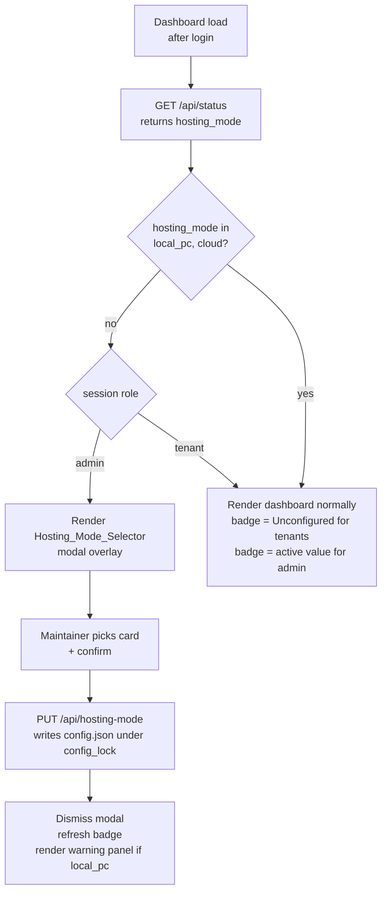
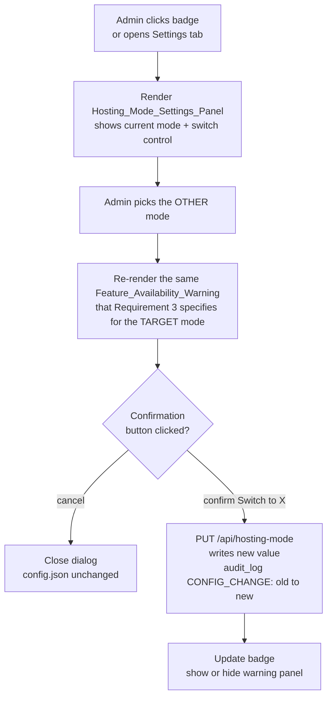

# Design Document

## Overview

This design adds a **Hosting Mode Selector** to the Aegis Suite dashboard. The selector is a small, additive UX layer that records whether the current installation is running as a **Local PC** Windows EXE (intermittent uptime) or on a **Cloud** host the Maintainer provisioned themselves (continuous 24/7 uptime). The choice drives three visible artifacts: a first-launch full-screen chooser, a persistent header badge, and (for Local PC mode only) a read-only Feature Availability Warning panel listing exactly which Aegis features depend on the bot being continuously online.

The Cloud option does **not** provision a host. The dashboard's only job in Cloud mode is to record the Maintainer's choice and silence the Local-PC-only warnings. README links point Cloud users at the existing Railway button, the Render manual flow, and the generic Docker / VPS path that already shipped in the `managed-hosting-migration` spec.

The Hosting Mode is a **non-sensitive deployment preference**, not a credential. It lives as a top-level `hosting_mode` string field in `config.json`, alongside `client_id` and `welcome_settings`. The DPAPI-encrypted `.env.enc` Secret_Store contract from `managed-hosting-migration` is left untouched: this spec does not read, write, or extend `.env`, `.env.enc`, or `secret_store.py`. A single new environment variable, `AEGIS_HOSTING_MODE`, is honored only as a one-time bootstrap for headless cloud deploys (Railway, Render) where no human can click the chooser; once a value has been persisted in `config.json`, the env var is ignored on subsequent boots so it cannot silently overwrite an explicit Maintainer choice.

The feature is **strictly additive on top of `managed-hosting-migration`**. It introduces no new authentication, no new rate-limiting, and no new session model. It does not reintroduce the deleted Setup Wizard, the deleted `bot_token` / `client_id` form fields, or the deleted `POST /api/bot/start` / `POST /api/bot/stop` endpoints. The `/linkdashboard` Pairing Onboarding Flow remains the only Tenant entry point; Tenants see the badge and the warning panel but cannot change the Hosting Mode (that surface is admin-only, gated by `auth.get_session_role(token) == "admin"` in `auth_middleware`).

### Out of scope

- Provisioning, billing, or API integration with Railway, Render, or any other hosting provider (Requirement 2 forbids this explicitly).
- Migrating the Hosting Mode value into the Secret_Store, `.env`, or `.env.enc` (Requirements 5.6, 9.2 forbid this explicitly).
- Auto-detecting the hosting mode at runtime. The Maintainer makes the choice; the dashboard records it.
- Changing the existing JWT, rate-limit, guild-isolation, `on_guild_remove`, ReDoS, or XSS code paths (Requirement 11.6 enumerates these as preserved invariants).

---

## Architecture

### Component map

```mermaid
flowchart LR
  subgraph Browser [Browser - dashboard]
    Selector[Hosting Mode Selector<br/>full-screen modal<br/>first-launch only]
    Badge[Hosting Mode Badge<br/>.top-header pill<br/>Local PC / Cloud / Unconfigured]
    Warning[Feature Availability Warning<br/>read-only panel<br/>visible when local_pc]
    Settings[Hosting Mode Settings Panel<br/>admin-only, in Settings tab<br/>opens from badge click]
  end

  subgraph FastAPI [web_server.py]
    GET_HM[GET /api/hosting-mode<br/>any authenticated session]
    PUT_HM[PUT /api/hosting-mode<br/>admin only, 403 for tenant]
    GET_STATUS[GET /api/status<br/>now also returns hosting_mode]
    LIFESPAN[lifespan startup<br/>AEGIS_HOSTING_MODE bootstrap]
  end

  subgraph Disk [Server - disk]
    CONFIG[config.json<br/>hosting_mode: local_pc | cloud | empty]
    AUDIT[audit_log.json<br/>CONFIG_CHANGE entry]
  end

  Selector -->|PUT| PUT_HM
  Settings -->|PUT| PUT_HM
  Badge -->|GET| GET_HM
  Badge -->|opens, admin only| Settings
  Warning -->|GET| GET_HM
  Selector -->|GET on first paint| GET_HM

  PUT_HM -->|utils.config_lock| CONFIG
  PUT_HM -->|log_action CONFIG_CHANGE| AUDIT
  GET_HM --> CONFIG
  GET_STATUS --> CONFIG
  LIFESPAN -->|bootstrap if unset and env valid| CONFIG
```

### First-launch decision flow



### Switching from Settings (existing install)



### Why config.json and not the Secret Store

The `managed-hosting-migration` spec moved every credential (`DISCORD_BOT_TOKEN`, `JWT_SECRET`, `ADMIN_PASSWORD_HASH`, `BOT_API_URL`) **out** of `config.json` and into `.env` (or DPAPI-encrypted `.env.enc` on Windows EXE installs). The Hosting Mode is the inverse case: it is **not** a credential, it is a deployment preference that:

- Must be readable on the very first paint of the dashboard, before any decryption or environment-variable lookup happens.
- Must be writable by an authenticated admin without requiring DPAPI rights or a `.env.enc` round-trip.
- Must be safe to surface in `GET /api/status` for unauthenticated visitors (Tenants see the badge before login).

Putting it next to `client_id` in `config.json` is consistent with how every other non-secret preference is stored. The Secret_Store interface (`secret_store.py`) is left untouched. Requirement 9.2 makes this explicit, and Requirement 5.6 reinforces it from the persistence side.

### Why an environment-variable bootstrap is needed

Cloud-mode deploys (Railway, Render) are headless: there is no Maintainer in front of a browser at first boot, and the platform-provisioned filesystem starts with a fresh `config.json` whose `hosting_mode` field is empty. Without `AEGIS_HOSTING_MODE`, the dashboard would sit on the Selector overlay forever, blocking the Tenant `/linkdashboard` flow. The bootstrap rule (Requirement 6) is intentionally narrow:

- It runs **only** during FastAPI lifespan startup.
- It runs **only** when no `hosting_mode` is currently persisted in `config.json`.
- An invalid value is logged and ignored (Requirement 6.2).
- A pre-existing persisted value is **never** overwritten (Requirement 6.3), so a Maintainer who later switches modes from the dashboard cannot have that choice silently stomped by a stale Railway env var.

The variable is documented in README alongside the existing managed-hosting environment variables (Requirement 6.4, 10.5).

### Preserved invariants from `managed-hosting-migration`

This design must not regress any of the following (Requirement 11):

- No `#setup-wizard`, `#wizard-token`, `#wizard-client-id`, `#btn-save-wizard`, `#btn-bot-toggle`, or `#btn-reconfigure` element is reintroduced in `static/index.html`.
- `ConfigModel` in `web_server.py` does not regain a `bot_token` field.
- `POST /api/bot/start` and `POST /api/bot/stop` are not reintroduced.
- `DISCORD_BOT_TOKEN` is loaded exclusively via `utils.get_bot_token` from `os.environ`, populated by `.env` or DPAPI-decrypted `.env.enc`.
- `/linkdashboard` remains the only Tenant entry surface.
- JWT signature verification, guild-scoped `auth_middleware` checks, the per-guild sliding-window rate limiter, `on_guild_remove` session revocation, `is_regex_safe` ReDoS guard, and `escapeHtml` XSS guard are unchanged.
- The DPAPI-encrypted `.env.enc` Secret_Store remains the source of truth for credentials on local Windows installs.

The new `PUT /api/hosting-mode` endpoint is reachable only through the existing `auth_middleware`; no new auth path is created.

---

## Components and Interfaces

### Backend: `web_server.py`

#### New Pydantic model

```python
class HostingModePutRequest(BaseModel):
    hosting_mode: str  # validated to be exactly "local_pc" or "cloud"
```

A separate model is used (rather than extending `ConfigModel`) because Hosting Mode has its own dedicated REST surface and its own admin-only validation rules. Reusing `ConfigModel` would force the frontend to round-trip the entire dashboard config to flip a single string, and would make it harder to enforce the 400 rule in Requirement 8.3.

#### New endpoints

| Method | Path | Auth | Body | Response |
|---|---|---|---|---|
| `GET` | `/api/hosting-mode` | any authenticated session (admin or tenant) | none | `{"hosting_mode": "local_pc" \| "cloud" \| null}` |
| `PUT` | `/api/hosting-mode` | admin only (`session_role == "admin"`) | `{"hosting_mode": "local_pc" \| "cloud"}` | `{"status": "success", "hosting_mode": "..."}` |

`PUT /api/hosting-mode` validation order:

1. Reject with HTTP 401 if no valid session (handled upstream by `auth_middleware`; Requirement 8.5).
2. Reject with HTTP 403 if `auth.get_session_role(token) != "admin"` (Requirement 7.7, Requirement 8.4).
3. Reject with HTTP 400 if the request body is missing the `hosting_mode` field, the value is not a string, or the value is not exactly `"local_pc"` or `"cloud"` (Requirement 5.2, Requirement 8.3). `config.json` is **not** touched on a 400.
4. On success, acquire `utils.config_lock`, read `config.json`, set `config["hosting_mode"]`, call `utils.save_config(config)`, and append a `CONFIG_CHANGE` audit log entry naming the old value and the new value (Requirement 7.6).

#### Modified endpoint: `GET /api/status`

The existing `get_status()` handler is extended to include a `hosting_mode` field in its response payload, sourced from the same `config.json` value returned by `GET /api/hosting-mode`. This satisfies Requirement 8.6 and lets the frontend render the badge on the very first status poll without a second round-trip. `GET /api/status` is already in the `auth_middleware` allowlist for unauthenticated visitors, which is fine: the Hosting Mode is non-sensitive and the badge is intentionally visible to Tenants pre-login.

The existing fields in the `/api/status` response (`status`, `has_token`, `ffmpeg_installed`, `role`, `guild_id`, `bot_user`, `client_id`) are unchanged.

#### Modified lifespan startup

The existing `lifespan(app)` async context manager is extended with a single block, executed **before** the existing `bot_manager.start_bot_service` call, that performs the `AEGIS_HOSTING_MODE` bootstrap:

```python
# Hosting Mode env-var bootstrap (Requirement 6)
config = utils.load_config()
if not config.get("hosting_mode"):
    env_val = os.environ.get("AEGIS_HOSTING_MODE", "").strip().lower()
    if env_val in ("local_pc", "cloud"):
        with utils.config_lock:
            cfg = utils.load_config()
            if not cfg.get("hosting_mode"):
                cfg["hosting_mode"] = env_val
                utils.save_config(cfg)
        logger.info(f"Hosting mode bootstrapped from AEGIS_HOSTING_MODE: {env_val}")
    elif env_val:
        logger.warning(
            f"AEGIS_HOSTING_MODE={env_val!r} is not a valid hosting mode "
            f"(expected 'local_pc' or 'cloud'); ignoring."
        )
```

Key properties of the bootstrap:

- The double-check inside `config_lock` (re-reading the config after acquiring the lock) protects against a race with a concurrent admin PUT during startup.
- A pre-existing persisted value is left untouched (Requirement 6.3).
- Invalid values are logged at WARNING level and ignored (Requirement 6.2). Startup never aborts on a bad env var.
- The bootstrap runs before `bot_manager.start_bot_service`, so by the time the bot is connecting, `config.json` has the correct mode.

#### `auth_middleware` interaction

`auth_middleware` already gates everything under `/api/*` except `/api/auth/*` and `/api/status`. The new `/api/hosting-mode` routes pass through that middleware unchanged: a missing or invalid bearer token returns 401, a tenant token reaches the handler where the handler-level role check returns 403 on PUT.

The middleware's existing tenant-blocklist for `/api/bot/start` and `/api/bot/stop` is **not** extended to `/api/hosting-mode` because GET is intentionally allowed for tenants (so the Tenant-side Hosting Mode Badge can read its label). The PUT-side admin-only check lives in the handler, mirroring the pattern already used for global config writes.

### Backend: `utils.py`

No new helper functions are required. The existing `load_config()`, `save_config(config)`, and `config_lock` primitives already provide everything needed:

- `utils.load_config()` already merges the on-disk JSON with `DEFAULT_CONFIG`, so a missing `hosting_mode` key reads as absent (`config.get("hosting_mode")` returns `None`).
- `utils.save_config(config)` already writes under `config_lock` via the calling sites.
- `utils.config_lock` is the same `threading.RLock` used by every other `config.json` writer.

`DEFAULT_CONFIG` in `utils.py` gains one new key:

```python
DEFAULT_CONFIG = {
    # ... existing keys unchanged ...
    "hosting_mode": "",  # "" means unset; valid values are "local_pc" and "cloud"
}
```

The empty-string default (rather than `None`) is chosen for parity with `bot_token` and `admin_password_hash`, which use the same convention. The handler treats `""`, missing, and any value other than `"local_pc"` / `"cloud"` as **unset** for the purposes of Requirement 5.4 (first-launch trigger).

### Backend: `config.example.json`

A `"hosting_mode": ""` line is added at the top level so new clones of the repository document the field's existence (Requirement 9.3). The file is not committed for individual installs (Requirement 9.4: `.gitignore` already excludes `config.json`).

### Backend: `audit_log.py`

No code changes. The existing `audit_log.log_action(actor, category, action, target=None, details=None)` API is reused. The PUT handler calls:

```python
audit_log.log_action(
    actor="admin",
    category="CONFIG_CHANGE",
    action=f"Hosting mode changed from '{old}' to '{new}'",
)
```

`CONFIG_CHANGE` is already an established category in the codebase (used for dashboard config saves and custom-command edits), so existing audit-log filters in the UI surface this entry without additional work.

### Frontend: `static/index.html`

Three new elements are added; nothing is removed.

1. **Hosting Mode Badge** in `.top-header > .header-right`:

   ```html
   <button id="hosting-mode-badge"
           class="hosting-mode-badge state-unconfigured"
           title="Hosting mode"
           aria-label="Hosting mode: Unconfigured">
     <i class="fa-solid fa-circle-question"></i>
     <span id="hosting-mode-badge-text">Unconfigured</span>
   </button>
   ```

   Rendered inside the existing `.top-header` so it appears on every authenticated dashboard view (Requirement 4.1). For Tenants the JS strips the `<button>` interactivity and replaces it with a `<span>` clone (Requirement 4.6).

2. **Hosting Mode Selector** modal — a new `<div id="hosting-mode-selector-overlay" class="wizard-container hidden">` reusing the existing `.wizard-box.glass` style used by `auth-setup-overlay` and `auth-login-overlay`, containing two side-by-side `.option-card` elements with the exact copy from Requirement 1.3 / 1.4 / 2.1 / 2.2.

3. **Hosting Mode Settings Panel** — a new section inside the existing Settings tab pane (or, if no Settings pane exists yet, attached to the Audit Log / utility area) with id `hosting-mode-settings-panel`. Contains the current mode display, a "Switch to {other}" button, and an inline confirmation step that re-renders the Feature Availability Warning content for the **target** mode (Requirement 7.3) before persisting.

4. **Feature Availability Warning** panel — a non-dismissable card with id `feature-availability-warning`, rendered on the dashboard whenever the active mode is `local_pc`. It contains two `<section>` blocks titled exactly "Impacted by intermittent uptime" and "Unaffected by intermittent uptime" with the feature lists from Requirements 3.2 and 3.3.

The exact HTML mirrors the existing card / wizard / panel patterns in `static/index.html` so no new CSS framework choices are introduced.

### Frontend: `static/app.js`

A new module-scoped object captures the hosting-mode UI state:

```javascript
let hostingMode = {
  value: null,        // "local_pc" | "cloud" | null
  pendingTarget: null // used by the settings-panel confirm step
};
```

Three new functions:

- `renderHostingModeBadge(mode, role)` — sets the badge text (`Local PC` / `Cloud` / `Unconfigured`), the visual state class (`state-local-pc` / `state-cloud` / `state-unconfigured`), the tooltip / `aria-label` per Requirement 4.7, and switches between `<button>` (admin) and `<span>` (tenant) per Requirement 4.6.
- `renderFeatureAvailabilityWarning(mode)` — shows or hides the panel based on `mode === "local_pc"` (Requirement 3.1, 3.5). The DOM content is static; only the `hidden` class toggles.
- `openHostingModeSelector()` / `openHostingModeSettings(targetMode)` — modal lifecycle helpers, gated on `localStorage.getItem("admin_role") === "admin"` (mirroring existing patterns in `app.js`).

The existing `checkStatus()` polling loop (already runs every 15 seconds) is extended to read `statusData.hosting_mode` and invoke `renderHostingModeBadge` and `renderFeatureAvailabilityWarning`. This satisfies Requirement 5.5: the dashboard fetches the active Hosting Mode from the server on every page load and on every status poll; nothing is cached as the source of truth in `localStorage`, `sessionStorage`, or cookies.

The first-launch trigger logic runs in the existing `initApp()` flow, after the auth check but before the rest of the dashboard renders:

```javascript
async function maybeShowHostingModeSelector() {
  const role = localStorage.getItem("admin_role");
  if (role !== "admin") return; // Tenants never see the chooser (Req 1.6)
  const res = await fetch("/api/hosting-mode");
  if (!res.ok) return;
  const { hosting_mode } = await res.json();
  if (hosting_mode === "local_pc" || hosting_mode === "cloud") return; // Req 1.7
  openHostingModeSelector();
}
```

A separate `localStorage` key (`hosting_mode_seen`) is **not** introduced — Requirement 5.5 forbids browser-side state from being treated as the source of truth, and the server's `null` response is the single signal for the first-launch case.

### Frontend: `static/style.css`

Three new style blocks, all using existing CSS variables (`--warning`, `--success`, `--text-muted`, `--card-bg`, `--card-border`) so the visual language is consistent with the rest of the dashboard:

- `.hosting-mode-badge` — pill-shaped, fits inside `.top-header > .header-right`. Variants: `.state-local-pc` (amber, `--warning`), `.state-cloud` (green, `--success`), `.state-unconfigured` (neutral, `--text-muted`).
- `.feature-availability-warning` — card-style panel reusing the existing `.card.glass` look, with the impacted section visually flagged via a `--warning`-tinted border-left.
- `#hosting-mode-selector-overlay .option-card` — two side-by-side cards inheriting the existing modal / wizard styling.

No new color palette is introduced. The amber-vs-green choice is the recommendation in Requirements 4.2 and 4.3; an installation-level color override is out of scope.

---

## Data Models

### `config.json` schema additions

Single new top-level field:

| Field | Type | Valid values | Default | Notes |
|---|---|---|---|---|
| `hosting_mode` | string | `"local_pc"`, `"cloud"`, `""` | `""` | Empty string, missing key, or any other value is treated as **unset** and triggers Requirement 1's first-launch behavior. |

No nested objects. No new files. No schema version bump (the codebase has no schema versioning yet, and the `architecture/schema.md` SQLite migration remains out of scope per `managed-hosting-migration`'s own deferred-debt list).

### REST contracts

`GET /api/hosting-mode` response body:

```json
{ "hosting_mode": "local_pc" }
```

or

```json
{ "hosting_mode": "cloud" }
```

or

```json
{ "hosting_mode": null }
```

(`null` is used over `""` in the response so the frontend can use a strict `=== null` check; the on-disk default is still `""` for parity with other fields.)

`PUT /api/hosting-mode` request body:

```json
{ "hosting_mode": "local_pc" }
```

`PUT /api/hosting-mode` success response:

```json
{ "status": "success", "hosting_mode": "local_pc" }
```

`PUT /api/hosting-mode` failure responses:

| Status | Body | Cause |
|---|---|---|
| 400 | `{ "detail": "Invalid hosting_mode value. Must be 'local_pc' or 'cloud'." }` | Missing field, empty string, or unknown value (Req 8.3) |
| 401 | `{ "detail": "Unauthorized: Invalid or missing token" }` | No / invalid bearer token (Req 8.5, handled by `auth_middleware`) |
| 403 | `{ "detail": "Forbidden: Admin role required" }` | Tenant session attempted to PUT (Req 7.7, Req 8.4) |

`GET /api/status` response body now includes `hosting_mode`:

```json
{
  "status": "running",
  "has_token": true,
  "ffmpeg_installed": true,
  "role": "admin",
  "guild_id": null,
  "bot_user": { "...": "..." },
  "client_id": "1234567890",
  "hosting_mode": "local_pc"
}
```

The value follows the same `string | null` contract as `GET /api/hosting-mode`.

### Environment variables

| Variable | Required? | Valid values | Behavior |
|---|---|---|---|
| `AEGIS_HOSTING_MODE` | No | `local_pc`, `cloud` | Used **only** during lifespan startup, **only** when `config.json` has no persisted `hosting_mode`. Invalid values are logged and ignored. A pre-existing persisted value is never overwritten. |

`DISCORD_BOT_TOKEN`, `JWT_SECRET`, `ADMIN_PASSWORD_HASH`, and `BOT_API_URL` are unchanged; the README's "Hosting Modes" section will list `AEGIS_HOSTING_MODE` alongside them (Requirement 10.5).

---

## Error Handling

### Invalid hosting mode values

| Source | Behavior |
|---|---|
| `PUT /api/hosting-mode` body with missing / empty / wrong value | HTTP 400, `config.json` unchanged, no audit-log entry. |
| `config.json` containing an unrecognized `hosting_mode` value (manual edit, corruption) | Treated as unset. `GET /api/hosting-mode` returns `null`. Admin sees the first-launch Selector. Tenant sees the `Unconfigured` badge (Req 1.6, Req 4.4). The bad value remains in `config.json` until the admin overwrites it via the Selector. |
| `AEGIS_HOSTING_MODE` env var with an unrecognized value | WARNING-level log line naming the invalid value (Req 6.2), env var ignored, startup proceeds. |

### Concurrent writes

All `PUT /api/hosting-mode` writes go through `utils.config_lock` (`threading.RLock`), the same lock used by `POST /api/config`, the pairing-code helpers, and the auto-responder writes. The lock ensures that the env-var bootstrap and a concurrent admin PUT cannot interleave to overwrite each other's value. The bootstrap re-reads `config.get("hosting_mode")` **after** acquiring the lock so a PUT that lands during startup wins.

### Audit log failures

`audit_log.log_action` already swallows write errors and logs them to stderr. A failure to append the `CONFIG_CHANGE` entry must **not** roll back the `config.json` write — the Maintainer's choice has been persisted, the audit-log gap is the lesser problem, and the existing handler pattern (`POST /api/config`) follows the same write-config-then-best-effort-log ordering. This matches the precedent set in `managed-hosting-migration` and is not changed by this spec.

### Tenant attempting PUT

The handler short-circuits with HTTP 403 before any disk read or write, mirroring the existing tenant-block pattern in `auth_middleware` for `/api/bot/start` and `/api/bot/stop`. No audit-log entry is written for rejected PUTs (consistent with how tenant 403s are handled elsewhere in the codebase).

### Frontend network failures

If `GET /api/status` or `GET /api/hosting-mode` fails (network error, 500), the badge falls back to the `Unconfigured` neutral state and the warning panel stays hidden. The Selector is **not** opened on a failed fetch — failing open to the modal would block dashboard usage on a transient network blip. This is consistent with how the existing `checkStatus()` polling loop handles errors (logs to console, retains the prior render).

### `config.json` write failures

`utils.save_config` returns `False` on disk-write failure. The PUT handler returns HTTP 500 with `{"detail": "Failed to save hosting mode."}` and does **not** write the audit-log entry, so the audit log does not falsely claim a change took effect. This mirrors the existing pattern in `POST /api/config`.

---

## Testing Strategy

### Why this feature does not use property-based testing

This spec is a thin UX layer (one chooser modal, one badge, one read-only panel, one settings panel) on top of two endpoints whose state space is exactly three values: `"local_pc"`, `"cloud"`, and unset. It hits every category the Property-Based Testing guidance flags as a poor fit:

- **UI rendering** — The Selector, the badge, and the warning panel are static DOM whose content is fully specified by the requirements. The right tool is example-based DOM tests and (optionally) snapshot tests, not property generators.
- **Configuration validation** — The PUT endpoint accepts an enum of two values. There is no meaningful "for all valid inputs X, P(X) holds" statement: the entire valid input space fits in two unit tests.
- **Simple CRUD** — Reads and writes a single string field in `config.json`. No transformation logic, no parsing, no algorithm under test.

A 100-iteration property test would re-test the same two valid values and the same handful of invalid values 100 times, finding nothing that two unit tests cannot. The cost of authoring property generators (with mocks for `config.json`, the audit log, and the FastAPI `auth_middleware`) is not justified.

The Correctness Properties section is therefore intentionally omitted from this design document, in line with the workflow's guidance for UI / config / IaC features.

### What is tested instead

A focused set of **example-based unit tests** and **integration tests**, expressed against the existing `pytest`-based test suite already used by the repo (see `tests/test_managed_hosting.py` for the pattern).

#### Backend unit tests (FastAPI handlers)

Using `fastapi.testclient.TestClient` against the existing `app` instance, with `tmp_path`-scoped `config.json` fixtures so tests do not contaminate the real config. Each test seeds `config.json` to a known state, optionally pre-issues a JWT via `auth.create_session`, and asserts response code + body + side effects.

- `test_get_hosting_mode_returns_null_when_unset` — `config.json` has no `hosting_mode` key; admin GET returns `{"hosting_mode": null}`.
- `test_get_hosting_mode_returns_local_pc` — seed `config.json` with `local_pc`; admin GET returns the value.
- `test_get_hosting_mode_returns_cloud` — seed `config.json` with `cloud`; tenant GET returns the value (Tenants are allowed to read).
- `test_get_hosting_mode_unauthenticated_401` — no bearer token; `auth_middleware` returns 401.
- `test_put_hosting_mode_admin_local_pc` — admin PUT with `local_pc`; expect 200, `config.json` updated, audit-log `CONFIG_CHANGE` entry present.
- `test_put_hosting_mode_admin_cloud` — admin PUT with `cloud`; expect 200, `config.json` updated.
- `test_put_hosting_mode_admin_invalid_value_400` — admin PUT with `"on-prem"`; expect 400, `config.json` unchanged, no audit-log entry.
- `test_put_hosting_mode_admin_missing_field_400` — admin PUT with `{}`; expect 400.
- `test_put_hosting_mode_admin_empty_string_400` — admin PUT with `{"hosting_mode": ""}`; expect 400.
- `test_put_hosting_mode_tenant_403` — tenant session PUTs `local_pc`; expect 403, `config.json` unchanged.
- `test_put_hosting_mode_unauthenticated_401` — no bearer token; expect 401, `config.json` unchanged.
- `test_get_status_includes_hosting_mode` — seed `cloud`; `GET /api/status` body includes `"hosting_mode": "cloud"`.
- `test_get_status_includes_null_when_unset` — no value persisted; `GET /api/status` body includes `"hosting_mode": null`.
- `test_put_hosting_mode_audit_entry_names_old_and_new` — pre-seed `local_pc`, PUT `cloud`; the audit-log entry text contains both `local_pc` and `cloud`.

#### Backend unit tests (lifespan bootstrap)

These tests directly exercise the bootstrap helper (extracted into a module-level function so it is callable from tests without spinning up uvicorn).

- `test_bootstrap_writes_local_pc_when_unset_and_env_valid` — env=`local_pc`, config unset; after bootstrap, config has `local_pc`.
- `test_bootstrap_writes_cloud_when_unset_and_env_valid` — env=`cloud`, config unset; after bootstrap, config has `cloud`.
- `test_bootstrap_ignores_invalid_env_value` — env=`onprem`, config unset; after bootstrap, config still unset, WARNING line emitted.
- `test_bootstrap_does_not_overwrite_persisted_value` — env=`cloud`, config=`local_pc`; after bootstrap, config still `local_pc` (Req 6.3).
- `test_bootstrap_no_env_var_no_change` — env unset, config unset; after bootstrap, config still unset.
- `test_bootstrap_case_insensitive` — env=`LOCAL_PC`, config unset; after bootstrap, config has `local_pc` (the implementation lowercases before validating).

#### Frontend tests (DOM assertions)

A small Playwright (or Selenium / `pytest-html-fixture`-style) integration suite that loads `static/index.html` against the FastAPI `TestClient`-served app:

- `test_first_launch_admin_sees_selector` — fresh `config.json`, admin login, dashboard render shows `#hosting-mode-selector-overlay` visible.
- `test_first_launch_tenant_no_selector_shows_unconfigured_badge` — fresh `config.json`, tenant login via pairing code, Selector stays hidden, badge text is `Unconfigured` (Req 1.6).
- `test_persisted_value_admin_no_selector` — `config.json` has `local_pc`, admin login, Selector stays hidden (Req 1.7).
- `test_badge_renders_local_pc_amber` — seed `local_pc`, badge has `state-local-pc` class and text `Local PC`.
- `test_badge_renders_cloud_green` — seed `cloud`, badge has `state-cloud` class and text `Cloud`.
- `test_badge_aria_label_local_pc` — badge `aria-label` matches `Local PC mode — intermittent uptime` (Req 4.7).
- `test_badge_aria_label_cloud` — badge `aria-label` matches `Cloud mode — 24/7 uptime` (Req 4.7).
- `test_warning_panel_visible_when_local_pc` — seed `local_pc`, panel has the impacted/unaffected sections with the exact feature lists from Req 3.2 / 3.3.
- `test_warning_panel_hidden_when_cloud` — seed `cloud`, panel is `display: none` (Req 3.5).
- `test_warning_panel_no_dismiss_control_when_local_pc` — querySelector for any element matching `[data-action="dismiss"]` inside the panel returns null (Req 3.6).
- `test_admin_clicks_badge_opens_settings_panel` — admin role, badge click opens `#hosting-mode-settings-panel`.
- `test_tenant_badge_is_not_clickable` — tenant role, badge is rendered as `<span>` and the click handler is not attached (Req 4.6, Req 7.7).
- `test_settings_panel_cancel_does_not_persist` — admin opens settings, picks the other mode, cancels confirmation; `PUT /api/hosting-mode` is never called (Req 7.5).
- `test_settings_panel_confirm_persists_and_audits` — admin confirms switch; one `PUT /api/hosting-mode` call lands, badge updates, warning panel toggles, audit-log entry present (Req 7.6).

#### Regression tests for `managed-hosting-migration` invariants

Borrowed from / extended in `tests/test_managed_hosting.py`:

- `test_no_setup_wizard_in_index_html` — `static/index.html` does not contain `id="setup-wizard"`, `id="wizard-token"`, `id="wizard-client-id"`, `id="btn-save-wizard"`, `id="btn-bot-toggle"`, or `id="btn-reconfigure"` (Req 11.1).
- `test_config_model_has_no_bot_token` — introspect `ConfigModel.__fields__` and assert `"bot_token"` is absent (Req 11.2).
- `test_no_bot_start_stop_endpoints` — the FastAPI route table does not contain `POST /api/bot/start` or `POST /api/bot/stop` (Req 11.3).
- `test_hosting_mode_not_in_secret_store` — after a PUT, `.env` and `.env.enc` do not contain `HOSTING_MODE` or `hosting_mode`; the `secret_store.py` API surface is unchanged (Req 5.6, Req 9.2).

#### README content tests

A simple grep test that `README.md` contains:

- A "Hosting Modes" section heading (Req 10.1).
- The string `Local PC` and an `intermittent uptime` mention (Req 10.2).
- The strings `Railway`, `Render`, and `Docker` in the Hosting Modes section (Req 10.3).
- The full impacted-features list and unaffected-features list, matching the dashboard panel character-for-character (Req 10.4 — same content in two places must not drift).
- The `AEGIS_HOSTING_MODE` token (Req 10.5).
- Unchanged `🤖 Discord Bot Setup` and `🔐 Secrets at Rest (Local EXE Deployment)` section headings (Req 10.6, 10.7).

### Test execution model

All backend tests run via `pytest` against the existing `app` instance using `TestClient`, with `tmp_path`-isolated config files (the `managed_hosting` test suite already establishes this fixture pattern). Frontend tests can be added incrementally; the backend coverage above is sufficient on its own to satisfy every testable requirement clause in this spec, and the frontend behaviors are deterministic enough to be validated by the listed DOM assertions without needing property generators.
