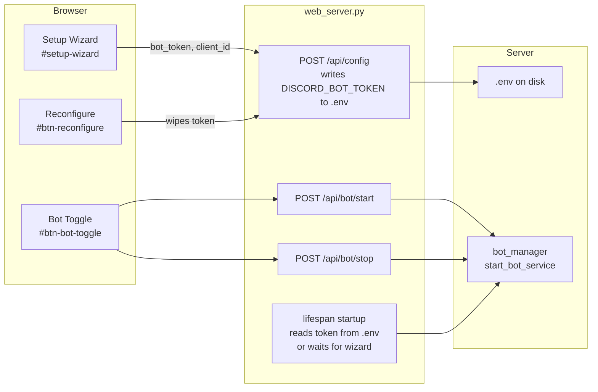
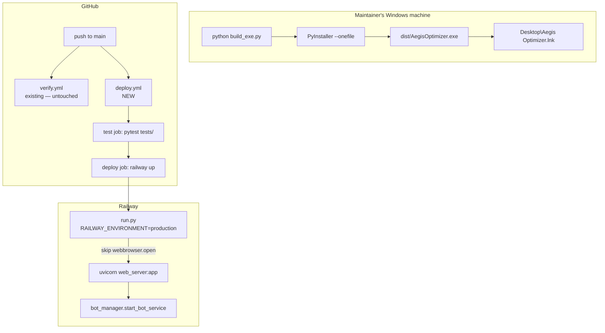
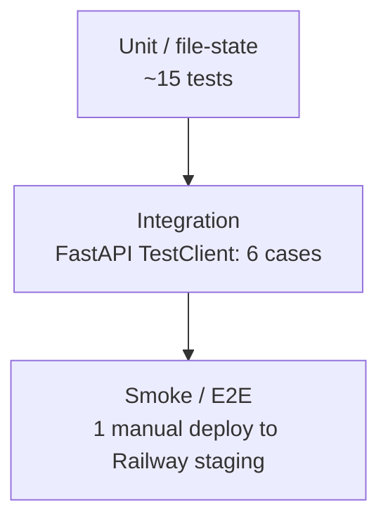

# Design Document

## Overview

This design migrates the Aegis Suite from the legacy **self-hosted bot token** model to a **managed-hosting** model. Today, the FastAPI dashboard prompts every visitor for a `DISCORD_BOT_TOKEN` and `client_id` through a Setup Wizard, persists those values into a server-side `.env`, and exposes `/api/bot/start` and `/api/bot/stop` endpoints that any authenticated admin (or, in older builds, anyone landing on the page) can trigger. After the migration, the bot token lives **only** in the maintainer's server-side `.env`, the bot starts automatically when uvicorn launches, and tenants reach their server panel exclusively through the existing `/linkdashboard` 6-digit pairing flow.

Three secondary deliverables are bundled with the migration because they share the same release:

1. **Build script repair** — `build_exe.py` already builds `--onedir` and explicitly defers shortcut creation to "Inno Setup". The maintainer wants a single file plus a Desktop shortcut (OneDrive-aware) directly from `python build_exe.py`.
2. **Headless launcher** — `run.py` unconditionally calls `webbrowser.open("http://127.0.0.1:8000")`. On Railway and Render this either crashes (no browser binary) or wastes a thread. The launcher needs to detect the cloud and skip the browser step.
3. **Cloud deployability** — Railway provisions Python apps via `pip install -r requirements.txt`. The repo currently has no `requirements.txt` at the root; `run.py` hard-codes the dependency list. A pinned `requirements.txt` and a `.github/workflows/deploy.yml` (test → deploy to Railway via `RAILWAY_TOKEN`) close that gap. The README's Discord Bot Setup section is rewritten to describe the invite + `/linkdashboard` flow.

The migration is intentionally **subtractive**. No new authentication, isolation, rate-limiting, or session-revocation logic is introduced. The work is to remove the user-facing token entry surface and to make the existing managed-hosting machinery (`/linkdashboard`, signed JWT tenant sessions, guild-scoped middleware, per-guild rate limiter, `on_guild_remove` purge, `hmac.compare_digest` signature checks, `%%BOT_API_URL%%` sentinel injection, ReDoS guards, XSS escaping, `.gitignore` exclusions) the **only** path into the dashboard. Requirement 11 enumerates each preservation invariant; the design treats them as load-bearing constraints, not editable surfaces.

### Out of scope (deferred technical debt)

The following items appear in the current README and code as TODO comments and remain untouched by this spec:

- JSON → SQLite migration via `aiosqlite` (the schemas drafted in `architecture/schema.md` are reference material, not a deliverable).
- Schema versioning / migration scripts.
- Unification of authorization checks behind a single `check_auth_permission` matrix.

These notes are preserved verbatim. The migration must not introduce regressions that make them harder to land later, but it also must not advance them.

---

## Architecture

### Before — self-hosted token model



Two entry points write `DISCORD_BOT_TOKEN`: the lifespan (server-managed) and `POST /api/config` (browser-managed). The wizard-driven path is the one we are removing.

### After — managed-hosting model

```mermaid
flowchart LR
  subgraph Discord
    SLASH[/linkdashboard slash command/]
  end

  subgraph Browser
    LOGIN[Login Overlay<br/>paste 6-digit code<br/>OR admin password]
    OFFLINE[Offline Notice<br/>maintenance message only]
    APP[Main App<br/>tenant-scoped]
  end

  subgraph FastAPI [web_server.py]
    LIFESPAN[lifespan startup<br/>reads DISCORD_BOT_TOKEN<br/>from os.environ only]
    LOGIN_EP[POST /api/auth/login<br/>resolves code or password]
    STATUS[GET /api/status]
    GUILDS[/api/guilds, /api/guilds/{id}/*<br/>tenant-scoped middleware/]
  end

  subgraph Server
    ENV[(.env<br/>maintainer-only)]
    PAIRINGS[(config.json<br/>pending_pairings)]
    BOT[bot_manager<br/>started once at boot]
  end

  ENV --> LIFESPAN
  LIFESPAN --> BOT
  SLASH --> PAIRINGS
  LOGIN --> LOGIN_EP
  LOGIN_EP --> PAIRINGS
  LOGIN_EP -->|JWT tenant session| APP
  STATUS -->|status=stopped| OFFLINE
  APP --> GUILDS
```

Key changes:

- The browser has **no path** that writes `DISCORD_BOT_TOKEN`.
- `POST /api/bot/start` and `POST /api/bot/stop` are deleted; the bot's lifecycle is bound 1:1 to uvicorn's lifespan.
- The previous offline screen, which conditionally rendered the Setup Wizard for admins and an "offline" message for non-admins, collapses to a single maintenance overlay regardless of role.
- The `/linkdashboard` → JWT tenant session path becomes the **only** way for a tenant to obtain dashboard authorization (the admin password remains for the maintainer's own access).

### Build and deployment topology



`verify.yml` (the existing hardening test workflow) is left in place. `deploy.yml` is a **new, separate** file so the security regression suite cannot be silently disabled by editing the deploy pipeline.

---

## Components and Interfaces

This section enumerates every code asset touched by the spec and the contract change required. The phrasing "delete" means the literal lines/elements/files are removed; "guard" means the existing behavior is wrapped in a conditional; "leave" means the file is read but not modified.

### 1. `static/index.html`

| Element / region | Action | Rationale |
| --- | --- | --- |
| `<div id="setup-wizard" class="wizard-container hidden">` and the entire enclosing block (≈55 lines, including `#wizard-token`, `#wizard-client-id`, `#btn-save-wizard`, password-toggle buttons, helper text) | **Delete** | R1.1, R1.2 |
| The `<div class="info-row">` containing `id="btn-reconfigure"` and the surrounding "Setup Configuration" label | **Delete** | R1.3 |
| `<button id="btn-bot-toggle" class="btn-circle" title="Start/Stop Bot">…</button>` inside the sidebar bot badge | **Delete** | R1.4 |
| `<div id="offline-notice-overlay" class="wizard-container hidden">…</div>` | **Rewrite contents** to a single static maintenance message ("This dashboard is temporarily unavailable. Please try again later."). Remove the warning icon's call to action, any links, any token/credential references. Keep the overlay's `id`, root classes, and `hidden` initial state so `app.js` can still toggle it. | R3.1, R3.2, R3.3, R3.4 |
| `<script>window.BOT_API_URL = '%%BOT_API_URL%%';</script>` block at the top of `<head>` | **Leave unchanged** | R2.10 |
| Login overlay (`#auth-login-overlay`) and its onboarding ordered list (steps 1–5: invite, ensure admin perms, run `/linkdashboard`, copy 6-digit code, paste) | **Leave unchanged** (already describes the Pairing_Onboarding_Flow) | R1.7 |

### 2. `static/app.js`

| Symbol / call site | Action |
| --- | --- |
| `const setupWizard = document.getElementById('setup-wizard');` and every read/write of `setupWizard.classList` | **Delete** the constant; remove every `classList.add('hidden')` / `classList.remove('hidden')` reference. The current `checkStatus()` function toggles the wizard for admins when `data.has_token === false` — that whole branch collapses to "always show offline notice when status is `stopped` or `connecting`". |
| `async function saveWizardCredentials()` (entire function body, ≈40 lines) | **Delete** |
| `async function startBot()` and `async function stopBot()` (top-level functions, plus all call sites in `setupEventListeners`) | **Delete** |
| Event listener registrations in `setupEventListeners`: `#btn-save-wizard` click handler, `#btn-bot-toggle` click handler, `#btn-reconfigure` click handler | **Delete** the three `addEventListener` calls. Wrap nothing in `try/catch` — the IDs no longer exist, so a registration call would throw. |
| `checkStatus()` — the role-based `data.role === 'user'` branch that hides `#btn-bot-toggle` and `#btn-reconfigure` | **Simplify**: the IDs are gone, so the branch is dead. Remove the branch. The `serverSelect` disabling logic for tenants is preserved. |
| `checkStatus()` — the `if (!data.has_token)` branch | **Replace** with `if (data.status === 'stopped' || data.status === 'connecting') { offlineNotice.classList.remove('hidden'); mainApp.classList.add('hidden'); return; }`. The `has_token` field of `/api/status` is no longer consulted by the frontend (the field itself can stay in the response for backward compatibility). |
| One-time cleanup on first load: `localStorage.removeItem('bot_token'); localStorage.removeItem('client_id');` | **Add** at the top of the `DOMContentLoaded` handler, before `checkAuthentication()`. This satisfies R4.2 (clear residual keys from prior versions). |
| `localStorage.getItem('admin_token')`, `localStorage.setItem('admin_role', …)`, `localStorage.setItem('admin_guild_id', …)`, the `escapeHtml` helper, and every existing `escapeHtml(...)` call site | **Leave unchanged** (R11.8). |
| Fetch interceptor that prepends `window.BOT_API_URL` and the `Authorization: Bearer` header | **Leave unchanged** (R2.10, R11). |

### 3. `web_server.py`

| Symbol | Action | Rationale |
| --- | --- | --- |
| `class ConfigModel(BaseModel)` — the `bot_token: str` field | **Delete the field**. `client_id` remains. | R2.4 |
| `@app.post("/api/bot/start")` route handler `start_bot()` | **Delete the entire handler** (decorator + function). FastAPI will then return 404 for that path. | R2.1, R2.3 |
| `@app.post("/api/bot/stop")` route handler `stop_bot()` | **Delete the entire handler**. | R2.2, R2.3 |
| `@app.get("/api/config")` — `config["bot_token"] = "********" if utils.get_bot_token(config) else ""` line | **Delete the line**. The response body will no longer carry a `bot_token` key. | R2.5 |
| `@app.post("/api/config")` — the entire `if session_role == "admin":` arm that handles `old_token`, `token_changed`, the `.env` read/write loop, and the `os.environ["DISCORD_BOT_TOKEN"]` mutation | **Delete the token-handling logic** (≈45 lines). Keep the rest of the admin branch (config persistence for client_id, welcome_settings, automod_settings, etc.). The Pydantic model no longer carries `bot_token`, so unknown keys in incoming JSON are ignored by `model_validate` (Pydantic v2 default). The implementation will additionally `new_data.pop("bot_token", None)` defensively before merging. | R2.6 |
| `@app.post("/api/config")` — the `token_changed` field in the JSON response | **Delete** (or hard-code to `False`). Tenant arm of the response is unchanged. | R2.6 |
| `lifespan` — the `if token: … else: logger.info("No saved bot token found. Awaiting user configuration via Web Dashboard.")` block | **Replace** the `else` branch with a single `logger.error("DISCORD_BOT_TOKEN is missing from environment. Set it in the server's .env. Bot will not start.")`. Do not mention the dashboard. The startup proceeds (uvicorn binds the port) so `/api/status` continues to serve the maintenance overlay. | R2.7, R2.8, R2.9 |
| Root HTML handler (around line 1707) — `content.replace("%%BOT_API_URL%%", bot_api_url)` | **Leave unchanged** | R2.10 |
| `auth_middleware`, `check_login_rate_limit`, `parse_id`, the per-guild rate limiter check, the `re.search(r"/api/guilds/(\d+)", path)` guard, `prune_stale_rate_limiters` GC task | **Leave unchanged** | R11.4, R11.5 |
| `/api/auth/login`, `/api/auth/setup`, `/api/auth/setup-status`, `/api/auth/logout` | **Leave unchanged** | R11.2 |

**Why delete instead of returning 410/501.** The acceptance criteria (R2.3) require HTTP 404 for `/api/bot/start` and `/api/bot/stop`. FastAPI's default behavior for an undefined path is 404, so deleting the routes is the simplest correct implementation; no explicit deprecation handler is needed.

### 4. `bot_manager.py`

**Untouched.** The `/linkdashboard` slash command (R11.1), `pending_pairings` writes with `expires_at`, `can_generate_code` rate guard, `/unlink` and `/unlink purge` commands (R11.6), `on_guild_remove` handler that calls `auth.revoke_guild_sessions` and clears guild config (R11.6), `is_regex_safe`-gated regex auto-responder evaluation (R11.7) all remain. The bot still receives its token via `start_bot_service(token)` from the FastAPI lifespan.

### 5. `auth.py` and `utils.py`

**Untouched.** The signed JWT contract (`{guild_id, role, exp}`), `hmac.compare_digest` signature check, `validate_session`, `get_session_guild_id`, `get_session_role`, the `revoked_guilds` persistence, `config_lock` / `giveaways_lock`, the per-guild sliding-window rate limiter, `is_regex_safe`, and `get_bot_token` (which already reads from `os.environ["DISCORD_BOT_TOKEN"]`) are all preservation invariants (R11.2, R11.3, R11.5, R11.7, R11.9).

Note that `utils.load_env_file` currently has a legacy migration path that reads `bot_token` out of `config.json` and copies it into `os.environ`. That path is **left in place** so existing local installations continue to start; it is a one-shot migration helper and the dashboard never writes `config.json["bot_token"]` after this spec lands.

### 6. `build_exe.py`

The current script invokes PyInstaller with `--onedir` and explicitly defers shortcut creation. The rewrite has three stages:

#### 6.1 PyInstaller invocation

Replace the command list with:

```python
cmd = [
    "pyinstaller",
    "--onefile",
    "--name=AegisOptimizer",
    "--add-data", "static;static",
    "--add-data", "templates;templates",
]
if os.path.exists(logo_ico):
    cmd.extend(["--icon", logo_ico])
cmd.append("run.py")
```

The script must capture stdout/stderr and `sys.exit(result.returncode)` on non-zero exit, before any shortcut step runs (R5.5, R5.6).

#### 6.2 Resolve the executable path

After a successful build, `dist/AegisOptimizer.exe` is the artifact (PyInstaller `--onefile` writes the EXE directly under `dist/`, not under `dist/AegisOptimizer/`). The script computes:

```python
exe_path = os.path.abspath(os.path.join("dist", "AegisOptimizer.exe"))
ico_path = os.path.abspath(logo_ico)
```

#### 6.3 Desktop shortcut creation

```python
def create_desktop_shortcut(exe_path: str, ico_path: str) -> bool:
    try:
        import winshell
        from win32com.client import Dispatch
    except ImportError:
        print("[!] winshell and pywin32 are required for desktop shortcut creation. "
              "Install them with: pip install winshell pywin32. "
              "Skipping shortcut step; the executable is still available at "
              f"{exe_path}.")
        return False

    desktop = winshell.desktop()  # OneDrive-aware: returns C:\Users\<n>\OneDrive\Desktop on redirected profiles
    if not os.path.isdir(desktop):
        print(f"[-] Resolved Desktop folder does not exist: {desktop}. Skipping shortcut.")
        return False

    shortcut_path = os.path.join(desktop, "Aegis Optimizer.lnk")
    shell = Dispatch("WScript.Shell")
    shortcut = shell.CreateShortCut(shortcut_path)
    shortcut.Targetpath = exe_path
    shortcut.WorkingDirectory = os.path.dirname(exe_path)
    shortcut.IconLocation = ico_path
    shortcut.save()
    print(f"[+] Created Desktop shortcut: {shortcut_path}")
    return True
```

`winshell.desktop()` is the canonical helper for resolving the per-user Desktop folder. On a OneDrive-redirected profile, Windows reports the redirected path through the `CSIDL_DESKTOPDIRECTORY` shell folder lookup that `winshell` wraps, so no extra OneDrive-specific branch is required (R6.5).

The function returns `False` on the import-missing and folder-missing branches and the caller does **not** treat those as build failures (R6.6, R6.7). Any exception from the COM dispatch is caught at the call site and logged; the build still exits 0 because the EXE itself is good.

#### 6.4 Inno Setup references

All `print` statements that mention "Inno Setup" or "shortcut creation is deferred" are removed (R6.8).

### 7. `run.py`

```python
import os
# ... existing imports ...

def is_headless_cloud() -> bool:
    """Returns True when running on a cloud host where webbrowser.open would fail or be useless."""
    return bool(os.getenv("RAILWAY_ENVIRONMENT")) or bool(os.getenv("RENDER"))

# ... inside main(), replacing the existing browser thread block ...

if not is_headless_cloud():
    import threading
    import webbrowser
    import time

    def open_browser():
        try:
            time.sleep(1.5)
            print("[+] Automatically opening the Dashboard in your browser...")
            webbrowser.open("http://127.0.0.1:8000")
        except Exception as exc:
            print(f"[!] webbrowser.open failed: {exc}. Continuing without opening a browser.")

    threading.Thread(target=open_browser, daemon=True).start()
else:
    print("[+] Headless cloud environment detected (RAILWAY_ENVIRONMENT or RENDER set). "
          "Skipping webbrowser.open.")
```

The uvicorn invocation that follows (R7.4) is unchanged. The `try/except` inside `open_browser` covers R7.3.

`run.py` is also the place where the maintainer's local-only `uv venv` setup happens. That block is left intact for the maintainer's local workflow; on Railway, uvicorn is launched directly from the platform's start command (`python -m uvicorn web_server:app --host 0.0.0.0 --port $PORT`), so the venv-creation branch is never reached. No changes are required there.

### 8. `requirements.txt` (new file at repo root)

The current `run.py` installs:

```
discord.py
fastapi
uvicorn
websockets
yt-dlp
PyNaCl
pydantic
```

Plus, `tests/test_hardening.py` (which CI runs) imports `auth`, `utils`, `audit_log`, which transitively need `Pillow` (used by `build_exe.py`). `Pillow` is build-only, so it goes under a separate section.

The pinned `requirements.txt` (R8.1, R8.2, R8.3, R8.4):

```
# Aegis Suite — runtime dependencies
# Pinned to versions verified against Python 3.12 on 2025-01.
discord.py==2.4.0
fastapi==0.115.5
uvicorn[standard]==0.32.1
websockets==13.1
yt-dlp==2024.12.13
PyNaCl==1.5.0
pydantic==2.10.3

# Build-only (Windows EXE packaging). Listed here so CI test job has a complete env;
# Railway will install them but they are inert at runtime.
Pillow==11.0.0
```

The maintainer chose `==` pins rather than `~=` because Railway's image does not support deterministic redeploys without a lockfile, and `==` is the simplest forward-compatible answer. The maintainer can switch to `pip-tools` / a `requirements.lock` in a later spec.

`winshell` and `pywin32` are **not** in `requirements.txt`. They are Windows-only and the build script handles their absence gracefully (R6.6). Adding them to a Linux-targeted `requirements.txt` would break Railway installs.

### 9. `.github/workflows/deploy.yml` (new file)

```yaml
name: Deploy to Railway

on:
  push:
    branches: [ main ]

jobs:
  test:
    runs-on: ubuntu-latest
    steps:
      - uses: actions/checkout@v4
      - uses: actions/setup-python@v5
        with:
          python-version: '3.12'
      - name: Install dependencies
        run: |
          python -m pip install --upgrade pip
          pip install -r requirements.txt
          pip install pytest
      - name: Run tests
        run: pytest tests/ -v

  deploy:
    needs: test
    runs-on: ubuntu-latest
    steps:
      - uses: actions/checkout@v4
      - name: Verify RAILWAY_TOKEN is set
        env:
          RAILWAY_TOKEN: ${{ secrets.RAILWAY_TOKEN }}
        run: |
          if [ -z "$RAILWAY_TOKEN" ]; then
            echo "::error::RAILWAY_TOKEN secret is not set. Configure it under Settings → Secrets → Actions."
            exit 1
          fi
      - name: Install Railway CLI
        run: npm install -g @railway/cli
      - name: Deploy
        env:
          RAILWAY_TOKEN: ${{ secrets.RAILWAY_TOKEN }}
        run: railway up --detach
```

Notes:

- `needs: test` ensures the deploy job is gated on the test job's success (R9.4).
- The "Verify RAILWAY_TOKEN" step gives a clear, early failure when the secret is missing (R9.6).
- `railway up --detach` is the non-interactive deploy command; `--detach` returns immediately after upload so the workflow does not block on long log streams (R9.5).
- `verify.yml` is left in place; both workflows run on `push` to `main` independently (R9.7).
- `tests/test_hardening.py` is currently invoked as `python tests/test_hardening.py` (it is a script, not a pytest module). pytest can still execute it because `pytest tests/` discovers files matching `test_*.py` and the file's `if __name__ == "__main__":` block is skipped under pytest, while the `test_*` functions get auto-collected. Each function uses `assert` and writes to `print`, both of which pytest tolerates. No file change is required.

### 10. `README.md`

The "🤖 Discord Bot Setup Instructions" section (currently 7 numbered steps that walk through the Discord Developer Portal, intent toggles, token reset, and Setup Wizard) is replaced with:

```markdown
## 🤖 Discord Bot Setup

The Aegis bot is hosted by us — you do not need to create a Discord application or paste any token.

1. **Invite Aegis to your server.** Click the **Invite Bot** button on the dashboard login page at `https://[your domain]/`. You must have **Administrator** permission on the target Discord server.
2. **Run `/linkdashboard` in your server.** In any text channel of the server you just invited the bot to, type `/linkdashboard`. The bot will reply (only to you) with a 6-digit alphanumeric connection code that is valid for 10 minutes.
3. **Paste the code into the dashboard.** Back at `https://[your domain]/`, paste the 6-digit code into the login field and click **Unlock Dashboard**.
4. **You're in.** The dashboard now shows your server's panel. Codes are single-use; if you need to log in again later, run `/linkdashboard` to mint a fresh one.
```

The "🚀 Features", "⚙️ Deployment Targets", "🚀 Getting Started (Run from Source)", and **"⚠️ Known Technical Debt & Limits"** sections are left unchanged (R10.5). The `[your domain]` placeholder (R10.4) is the only piece of operator-specific text in the rewritten section.

---

## Data Models

This migration removes one field, deletes one persisted side effect, and changes nothing else.

### `ConfigModel` (Pydantic, `web_server.py`)

| Field | Before | After |
| --- | --- | --- |
| `bot_token` | `str` (required) | **removed** |
| `client_id` | `str` | unchanged |
| `welcome_settings` | `WelcomeSettingsModel` | unchanged |
| `automod_settings` | `AutomodSettingsModel` | unchanged |
| `ticket_settings` | `Optional[TicketSettingsModel]` | unchanged |
| `custom_commands` | `Optional[dict]` | unchanged |
| `admin_password_hash` | `Optional[str]` | unchanged (already hidden behind a mask in responses) |

### `.env` file

| Key | Owner | Lifecycle |
| --- | --- | --- |
| `DISCORD_BOT_TOKEN` | **Maintainer only** (manually set on the server) | Read by `utils.get_bot_token` at process startup. Never written by HTTP request handlers after this spec lands. |
| `JWT_SECRET` | Maintainer | Unchanged. |
| `ADMIN_PASSWORD_HASH` | First-run admin password setup wizard (`/api/auth/setup`) | Unchanged. |
| `BOT_API_URL` | Maintainer (deploy-time) | Unchanged. |

### `config.json`

The `bot_token` key was already kept blank by the existing admin save logic ("Always keep `bot_token` and `admin_password_hash` empty in `config.json`"). After this spec the field is never written from any code path, but the existing migration helper in `utils.load_env_file` that copies a legacy `config.json["bot_token"]` into `os.environ["DISCORD_BOT_TOKEN"]` on startup is preserved so old local installs continue to start.

`pending_pairings`, `revoked_guilds`, `guild_configs`, `scheduled_messages`, `auto_responders`, and `audit_log` retain their existing schemas (R11).

### Frontend storage

| Key in `localStorage` | Status |
| --- | --- |
| `admin_token` | unchanged (the dashboard JWT) |
| `admin_role` | unchanged |
| `admin_guild_id` | unchanged |
| `bot_token` | **deleted on first load** (one-shot cleanup, R4.2) |
| `client_id` | **deleted on first load** (one-shot cleanup, R4.2) |

---

## Error Handling

### `web_server.py` lifespan with missing token

If `DISCORD_BOT_TOKEN` is missing from `os.environ` at startup, the lifespan logs a single `logger.error(...)` line that names the missing variable and the `.env` file path, then yields control to FastAPI. uvicorn binds the port and serves `/api/status` so the maintenance overlay renders for every visitor (R2.9, R3.1). No exception is raised; the process must keep running so the maintainer can inspect logs without the host marking the service "crash-looping".

### Deleted `/api/bot/start` and `/api/bot/stop`

FastAPI's default 404 response is the contract (R2.3). No custom handler is added — adding one would invite confusion about whether the endpoints are "deprecated" or "removed". The existing `auth_middleware` runs **before** route resolution, so an unauthenticated request to `/api/bot/start` would today receive 401; after deletion it receives 404 unauthenticated, because FastAPI's router matches first when the route does not exist. The 404-vs-401 ordering is acceptable: any legitimate caller has been removed in the same change, so leaking "this path does not exist" carries no security cost.

### `POST /api/config` with stray `bot_token` field

Pydantic v2 ignores unknown fields by default unless `model_config = ConfigDict(extra="forbid")` is set. `ConfigModel` does not set `extra="forbid"`, so a JSON body containing `"bot_token": "…"` validates and the field is silently dropped from `config_data.model_dump()`. The handler additionally calls `new_data.pop("bot_token", None)` defensively. No write to `.env` occurs (R2.6).

### `build_exe.py` with `winshell` / `pywin32` missing

Catch the `ImportError` inside `create_desktop_shortcut`, print a single warning that names both packages and the install command, and return `False`. The outer `main()` does **not** propagate the failure: the EXE is the primary artifact. `sys.exit(0)` is the final call (R6.6).

### `build_exe.py` with a missing Desktop folder

`os.path.isdir(winshell.desktop())` returns `False` on profiles where the Desktop folder has been deleted or is on an unmounted network share. The script logs the resolved path and returns 0 (R6.7).

### `run.py` with `webbrowser.open` raising

The `try/except` in `open_browser()` catches **any** exception (the `webbrowser` module raises `webbrowser.Error`, `OSError`, or `RuntimeError` in different platforms), prints a warning, and the daemon thread exits cleanly. uvicorn is unaffected because it runs on the main thread (R7.3).

### `deploy.yml` with `RAILWAY_TOKEN` unset

The "Verify RAILWAY_TOKEN is set" step exits 1 with `::error::` annotation **before** the Railway CLI is installed (R9.6). The error appears in the GitHub UI as a red annotation on the PR / commit.

---

## Testing Strategy

### Property-based testing applicability

**PBT is not appropriate for this feature** and the Correctness Properties section is intentionally omitted. The migration is dominated by:

- **DOM and source-code removals** (R1, R2): the assertion is "does this element / symbol exist", which has no input space to vary.
- **Configuration files** (`requirements.txt`, `deploy.yml`, R8, R9): snapshot/schema validation, not universal properties.
- **Build tooling** (`build_exe.py`, R5, R6): a deterministic invocation; running PyInstaller 100 times with the same inputs produces the same artifact.
- **Documentation** (`README.md`, R10): prose verified by substring assertions.
- **Side-effect-only environment guard** (`run.py`, R7): two boolean cases, fully covered by two example tests.
- **Preservation of existing behaviors** (R11): the existing regression suite in `tests/test_hardening.py` (JWT tampering, session revocation, sliding-window rate limiter, idempotent purge) already runs on every push via `verify.yml` and now also via the new `deploy.yml` test job. Re-deriving those properties here would be redundant.

The workflow's own PBT-applicability rules list exactly these categories ("UI rendering", "Configuration validation", "side-effect-only operations", "infrastructure as code") as not appropriate for property tests. The remainder of this section uses example-based unit tests, snapshot tests, and integration smoke tests instead.

### Test pyramid



### Unit and file-state tests (`tests/test_managed_hosting.py`, new file)

All tests use `pytest`. Each test maps 1:1 (or n:1) to acceptance criteria from `requirements.md`.

| # | Test | Validates |
| --- | --- | --- |
| T1 | Read `static/index.html`. Assert `id="setup-wizard"` substring is **absent**. | R1.1, R1.2 |
| T2 | Same file. Assert `id="btn-reconfigure"` and `id="btn-bot-toggle"` substrings are absent. | R1.3, R1.4 |
| T3 | Same file. Assert `id="wizard-token"`, `id="wizard-client-id"`, `name="bot-token"` are all absent. | R4.3 |
| T4 | Same file. Assert the `#offline-notice-overlay` block contains the maintenance phrase ("temporarily unavailable") and contains no `<a `, no `<button `, no `<input `, no `<form ` tags inside the overlay. | R3.2, R3.3, R3.4 |
| T5 | Read `static/app.js`. Assert `saveWizardCredentials`, `function startBot`, `function stopBot`, `'/api/bot/start'`, `'/api/bot/stop'`, `getElementById('btn-save-wizard')`, `getElementById('btn-bot-toggle')`, `getElementById('btn-reconfigure')` are all absent (substring search). | R1.5, R1.6, R2.1, R2.2 |
| T6 | Read `static/app.js`. Assert it contains `localStorage.removeItem('bot_token')` and `localStorage.removeItem('client_id')`. | R4.2 |
| T7 | Read `web_server.py` source. Assert `class ConfigModel` body does not contain `bot_token:`. | R2.4 |
| T8 | Spin up FastAPI via `TestClient(app)` with a stubbed bot. `POST /api/bot/start` and `POST /api/bot/stop` return 404. | R2.3 |
| T9 | `TestClient`. Authenticate as admin. `GET /api/config` returns a JSON body whose top-level keys do not include `bot_token`. | R2.5 |
| T10 | `TestClient`. Authenticate as admin. `POST /api/config` with body containing `"bot_token": "FAKE.TOKEN.VALUE"` returns 200. After the call, `os.environ.get("DISCORD_BOT_TOKEN")` is unchanged from its pre-call value, the `.env` file (read fresh from disk) does not contain the substring `FAKE.TOKEN.VALUE`, and `config.json["bot_token"]` is empty. | R2.6 |
| T11 | Read `requirements.txt`. Assert each of `discord.py`, `fastapi`, `uvicorn`, `websockets`, `yt-dlp`, `PyNaCl`, `pydantic` is present. Assert each line that names one of those packages contains `==` or `~=` (regex `^[A-Za-z0-9_.-]+(\[[a-z]+\])?(==|~=)\d`). | R8.1, R8.2, R8.3 |
| T12 | Read `.github/workflows/deploy.yml`. Parse as YAML. Assert `on.push.branches == ['main']`, jobs include `test` and `deploy`, `jobs.deploy.needs == 'test'`, the deploy job references `secrets.RAILWAY_TOKEN`, and the file path `.github/workflows/verify.yml` still exists on disk. | R9.1, R9.2, R9.4, R9.5, R9.7 |
| T13 | Read `README.md`. Assert the "Discord Bot Setup" section contains the phrase `/linkdashboard` and contains the phrase `[your domain]`. Assert the README does **not** contain the phrases `Discord Developer Portal`, `Privileged Gateway Intents`, `Reset Token` (case-insensitive) anywhere in the rewritten section (we scope the assertion to the new section by splitting on the next `##` header). Assert the "Known Technical Debt & Limits" section is present and contains both `JSON` and `SQLite`. | R10.1, R10.2, R10.3, R10.4, R10.5 |
| T14 | Import `run` (the module). Assert `is_headless_cloud()` returns `False` when both `RAILWAY_ENVIRONMENT` and `RENDER` are unset (use `monkeypatch.delenv`). | R7.1 |
| T15 | Same module. Assert `is_headless_cloud()` returns `True` when `RAILWAY_ENVIRONMENT=production`. Assert it returns `True` when `RENDER=true`. | R7.2 |

### Existing PBT regression suite (`tests/test_hardening.py`)

Run unchanged via the new `deploy.yml` test job. This covers R11.2, R11.3, R11.5, R11.6 (JWT tampering rejection, session revocation on `/unlink`, un-revocation on relink, sliding-window rate limiter, idempotent purge). Each existing test runs ≥1 deterministic assertion; the rate-limiter test exercises 61 sequential calls, which functions as light fuzz coverage of the limiter window. **No new property tests are added** for the reasons stated in the Correctness Properties section.

### Build-script integration test (manual, documented in the spec)

`tests/test_managed_hosting.py` does **not** invoke PyInstaller — running `--onefile` in CI would add 60–120 s to every test run and fail on Linux runners (the EXE is Windows-only). The maintainer verifies R5 and R6 manually:

1. On a Windows machine, run `python build_exe.py`.
2. Assert `dist/AegisOptimizer.exe` exists and is non-zero size.
3. Assert `%USERPROFILE%\Desktop\Aegis Optimizer.lnk` (or the OneDrive-redirected equivalent reported by `winshell.desktop()`) exists. Right-click → Properties → Target points at the `.exe`.
4. Double-click the shortcut. The dashboard opens at `http://127.0.0.1:8000`.

This is recorded as a release checklist item in the tasks document.

### Cloud smoke test (manual, post-deploy)

After `deploy.yml` runs on `main`:

1. Hit `https://[your domain]/api/status`. Expect HTTP 200 with `status: running` (or `connecting` during the first ~10 s).
2. Hit `https://[your domain]/api/bot/start`. Expect HTTP 404.
3. Open `https://[your domain]/` in a browser. Expect the login overlay (no Setup Wizard).
4. In a test Discord server with the bot already invited, run `/linkdashboard`, paste the 6-digit code into the login field, click Unlock Dashboard. Expect the tenant view to load.
5. Tail Railway logs. Expect no error mentioning `webbrowser` and no "Awaiting user configuration" message.

### Test framework choices

- **`pytest`** for all unit tests (already a transitive dep; explicitly added to the deploy `test` job).
- **`fastapi.testclient.TestClient`** (already available via FastAPI; no extra install) for the route-level tests.
- **`PyYAML`** for parsing `deploy.yml` in T12 — added as a dev-only dep through `pip install pyyaml` in the test job, **not** in `requirements.txt`.

### What is intentionally not tested

- **Visual layout** of the maintenance overlay. The tests assert the absence of credential controls and the presence of the maintenance phrase; pixel-perfect rendering is not in scope.
- **PyInstaller's bundling correctness**. PyInstaller is third-party; we trust upstream and verify only that our invocation flags produce the expected artifact path.
- **Railway's deployment success**. The deploy job exits 0 when `railway up` accepts the upload; runtime health is observed by the cloud smoke test, not asserted in CI.
