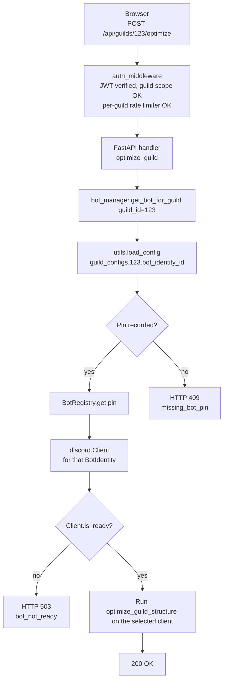
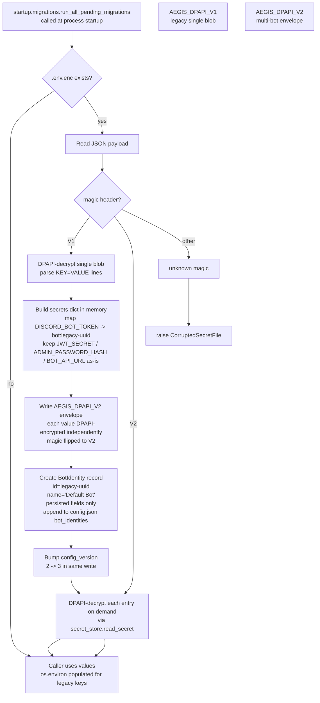
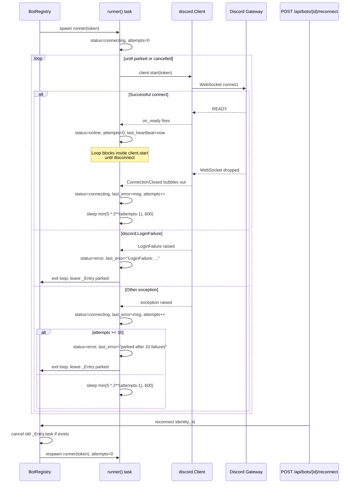
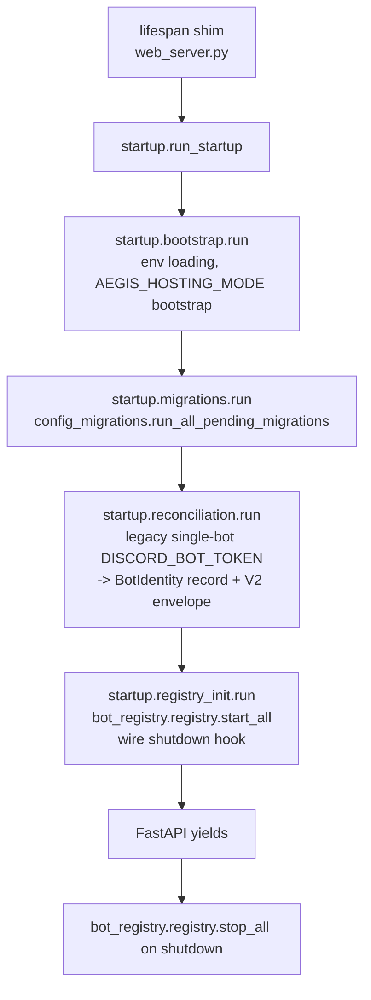

# Design Document

## Overview

This design extends the Aegis Suite from a single-bot installation to a multi-bot installation. Today every install runs exactly one `discord.Client` whose token comes out of `DISCORD_BOT_TOKEN` in the DPAPI-encrypted `.env.enc` envelope. After this spec lands, an installation runs **N** concurrent `discord.Client` instances, each one keyed by a `BotIdentity` UUID, each one with its own DPAPI-encrypted token slot inside a forward-compatible `Multi_Bot_Secret_Envelope` (`AEGIS_DPAPI_V2`). Each Discord guild the dashboard manages is **pinned** to exactly one `BotIdentity` at the moment its admin redeems a `/linkdashboard` 6-digit code; all subsequent dashboard operations on that guild are dispatched to that BotIdentity's client and to no other.

The first-run setup story is upgraded in lockstep. The existing console wizard (`first_run_wizard.py`) becomes the headless / SSH / Linux fallback. On a Windows desktop session the launcher (`run.py`) opens a small `tkinter` GUI that collects exactly the same fields the console wizard collects (bot token, client ID, admin password + confirmation, optional public dashboard URL) and writes through the same persistence path so DPAPI encryption, plaintext-`.env` cleanup, and `config.json` `client_id` mirroring all happen identically. After the GUI completes, the maintainer's first BotIdentity is registered in the V2 envelope under `bot:{uuid}` and the legacy `DISCORD_BOT_TOKEN` slot is left for backward compatibility readers.

**Path B is what the user picked.** This design contains no `DefaultHostedBot`, no `BOT_API_URL`-driven thin-client routing layer, no upstream-maintainer-hosted bot. Every Aegis installation is responsible for at least one BotIdentity that the operator configured themselves. The shipped EXE does not point at any maintainer-hosted default bot, and the upstream Aegis repository owner is not expected to host a 24/7 instance other users connect to. The `%%BOT_API_URL%%` sentinel injection in `static/index.html` is left in place untouched (R10.5) — that mechanism is for the operator's own reverse proxy hostname, not for routing to a remote bot.

The work is **strictly additive on top of `managed-hosting-migration` and `hosting-mode-selector`**. No deleted DOM element returns. `ConfigModel` does not regrow `bot_token`. `POST /api/bot/start` and `POST /api/bot/stop` do not return. `/linkdashboard` remains the only Tenant entry surface. The hosting-mode badge, the feature-availability warning panel, and the `AEGIS_HOSTING_MODE` env-var bootstrap continue to work unchanged. Multi-bot is orthogonal to hosting mode: the same `BotRegistry` design runs on both Local PC and Cloud installs.

This revision adds four cross-cutting improvements that came out of design review:

- **Schema versioning** — a `config_version` integer at the top of `config.json` and a forward-only migration runner so future schema changes (including a planned SQLite migration) have a clean entry point.
- **Runtime state separation** — `status`, `last_error`, `last_heartbeat`, and `reconnect_attempts` move out of the persisted `BotIdentity` record and live exclusively in the `BotRegistry`'s in-memory `_Entry` dataclass. After a hard crash the next startup naturally shows every bot as `connecting` until the registry reconciles; no stale `online` status persists across crashes.
- **Startup modularization** — the overloaded `lifespan()` function in `web_server.py` becomes a 5-line shim that awaits a sequence of focused steps in a new `startup/` subpackage (`bootstrap`, `migrations`, `reconciliation`, `registry_init`).
- **Reconnect / backoff** — the `BotRegistry` runner gains a bounded exponential-backoff reconnect loop (5 s → 600 s cap), terminal handling for `discord.LoginFailure`, and an admin-only `POST /api/bots/{id}/reconnect` to manually retry parked bots.

### Out of scope

- Provisioning Discord applications on behalf of the maintainer. The maintainer creates each bot manually at <https://discord.com/developers> and pastes the token into the GUI wizard or the Bots Management UI.
- Per-BotIdentity ratelimit budgets, per-BotIdentity sharding, or per-BotIdentity gateway routing. Each BotIdentity runs as a vanilla `discord.py` client.
- Migrating `.env.enc` from per-secret DPAPI encryption to a single passphrase-bound master key. The threat model from `secret_store.py` is unchanged.
- Changing the JWT shape, the `auth_middleware` guild-scope check, the per-guild sliding-window rate limiter, the `on_guild_remove` revocation path, or any other invariant enumerated in Requirement 10.
- Migrating `config.json`, `audit_log.json`, `giveaways.json`, or `leveling_data.json` to SQLite. The schema-versioning machinery introduced here is the entry point that the next spec will use; the migration itself is deferred (see Future Work).

---

## Architecture

### Component map

```mermaid
flowchart LR
  subgraph Launcher [run.py]
    DETECT[Headless_Environment detector<br/>DISPLAY/WAYLAND/AEGIS_HEADLESS<br/>RAILWAY/RENDER/tkinter.TclError]
    GUI[GUI_Setup_Wizard<br/>tkinter top-level]
    CONSOLE[Console_Setup_Wizard<br/>first_run_wizard.run_first_run_wizard]
  end

  subgraph Server [Server-side process]
    LIFESPAN[FastAPI lifespan shim<br/>awaits startup.run_startup]
    STARTUP[startup/ subpackage<br/>bootstrap -> migrations<br/>-> reconciliation -> registry_init]
    REGISTRY[BotRegistry<br/>id -> _Entry runtime state<br/>+ reconnect loop]
    DISPATCH[get_bot_for_guild<br/>guild_id -> BotIdentity.id -> client]
    BOTAPI[Bots REST surface<br/>GET/POST/PUT/DELETE /api/bots<br/>POST /api/bots/{id}/reconnect]
    LINK[/linkdashboard handler<br/>per BotIdentity]
    STATUS[GET /api/status<br/>joins persisted record + runtime state]
  end

  subgraph Disk [Server-side disk]
    CONFIG[config.json<br/>config_version: 3<br/>bot_identities[] persisted fields only<br/>guild_configs[gid].bot_identity_id]
    ENVELOPE[.env.enc<br/>AEGIS_DPAPI_V2<br/>secrets[bot:uuid] per BotIdentity]
  end

  subgraph Browser [Dashboard]
    BOTSPANE[Bots_Management_UI<br/>list / add / rename / retoken / remove / reconnect]
    PINPICKER[Server_Bot_Pin picker<br/>shown after code redemption]
    BADGE[Hosting badge / Bots count<br/>from /api/status]
  end

  DETECT -->|graphical| GUI
  DETECT -->|headless / TclError| CONSOLE
  GUI -->|writes| ENVELOPE
  GUI -->|writes| CONFIG
  CONSOLE -->|writes| ENVELOPE
  CONSOLE -->|writes| CONFIG

  LIFESPAN --> STARTUP
  STARTUP -->|reads N tokens| ENVELOPE
  STARTUP -->|reads BotIdentity[]| CONFIG
  STARTUP --> REGISTRY
  REGISTRY --> DISPATCH
  LINK -->|registered on every client| REGISTRY

  BOTAPI -->|admin only| REGISTRY
  BOTAPI -->|admin only| ENVELOPE
  BOTAPI -->|admin only| CONFIG
  BOTSPANE --> BOTAPI
  PINPICKER -->|PUT pin| CONFIG

  STATUS -->|reads| REGISTRY
  STATUS -->|reads role-filtered| CONFIG
  BADGE --> STATUS
```

### Multi-bot routing flow

This diagram traces a single dashboard call (for example `POST /api/guilds/{guild_id}/optimize`) through the router and shows how the right `discord.Client` is selected.



The lookup is a **single config read followed by a single dict lookup**. There is no fan-out, no broadcast, no "ask all clients which one knows the guild" — the pin is the source of truth.

### V1 -> V2 envelope migration (with config_version bump)



The migration is **idempotent** — once the V1 envelope has been rewritten as V2 and `config_version` reaches 3, the V1 branch is never reentered. The `BotIdentity` record for the legacy bot is created exactly once, on the first boot after the upgrade, before uvicorn binds the port. If the migration partially fails (e.g. DPAPI rejects one of the legacy values mid-rewrite), the `.env.enc` file is left untouched on disk because the V2 write is performed atomically through a `*.tmp` file plus `os.replace`, and `config.json` is left at its previous `config_version` so the migration runs again on the next boot.

### Preserved invariants from prior specs

This design must not regress (Requirement 10):

- No `#setup-wizard`, `#wizard-token`, `#wizard-client-id`, `#btn-save-wizard`, `#btn-bot-toggle`, or `#btn-reconfigure` is reintroduced.
- `ConfigModel` does not regrow `bot_token`.
- `POST /api/bot/start` and `POST /api/bot/stop` are not reintroduced.
- `/linkdashboard` remains the only Tenant entry surface; the new Bots Management UI is admin-only.
- JWT verification, guild-scoped `auth_middleware`, sliding-window per-guild rate limiter, `on_guild_remove` revocation, `is_regex_safe` ReDoS guard, `escapeHtml` XSS guard remain unchanged.
- The Hosting Mode selector and `AEGIS_HOSTING_MODE` env-var bootstrap are untouched.
- `JWT_SECRET`, `ADMIN_PASSWORD_HASH`, `BOT_API_URL` continue to live in the same envelope (now V2 in the `secrets` dict; V1 transparently upgraded on first write).
- The `%%BOT_API_URL%%` sentinel injection in `static/index.html` is preserved (R10.5).
- **WebSocket authentication invariant (preserved):** The existing `/ws/logs` WebSocket endpoint validates the session token from the `token` query parameter during the handshake via `auth.validate_session(token)`. This is a security invariant that any NEW WebSocket endpoints introduced by this spec (or future specs) MUST follow. No WebSocket connection may be established without a valid, non-expired, non-revoked session token verified during the handshake phase.

---

## Lifecycle and Runtime State Separation

`BotIdentity` carries two kinds of fields with very different lifetimes. The earlier draft of this design persisted both kinds inside `config.json["bot_identities"][i]`, which had two problems:

1. **Stale state across hard crashes.** A persisted `status: "online"` survives a power loss or a Windows OOM kill. On the next launch the dashboard would briefly claim every bot was online before the registry's reconciliation reverted them, and the `last_error` from the previous boot would still be on screen.
2. **Write amplification.** Every gateway state transition (every reconnect attempt, every heartbeat) wrote the entire `config.json` to disk under `config_lock`. With several bots on flaky networks this becomes the highest-churn write path in the system.

The fix is a strict split: persisted fields live in `config.json`, runtime fields live only in `BotRegistry._Entry`. The `GET /api/bots`, `GET /api/status`, and `POST /api/bots/{id}/reconnect` handlers join the two views at response time.

| Field | Lifetime | Storage | Mutated by |
| --- | --- | --- | --- |
| `id` | persisted, immutable | `config.json["bot_identities"][i]["id"]` | created once on register |
| `name` | persisted | `config.json["bot_identities"][i]["name"]` | `PUT /api/bots/{id}` rename |
| `client_id` | persisted | `config.json["bot_identities"][i]["client_id"]` | created once on register |
| `created_at` | persisted, immutable | `config.json["bot_identities"][i]["created_at"]` | created once on register |
| `created_by_role` | persisted, immutable | `config.json["bot_identities"][i]["created_by_role"]` | created once on register |
| `pinned_guild_ids` | persisted | `config.json["bot_identities"][i]["pinned_guild_ids"]` | `PUT /api/guilds/{guild_id}/bot-pin`, `DELETE /api/bots/{id}`, `on_guild_remove` |
| `token_ref` | computed, never persisted | derived as `f"bot:{id}"` at response time | n/a |
| `status` | runtime only | `BotRegistry._entries[id].status` | every gateway state transition in the runner task |
| `last_error` | runtime only | `BotRegistry._entries[id].last_error` | exception handler in the runner task |
| `last_heartbeat` | runtime only | `BotRegistry._entries[id].last_heartbeat` | `discord.Client.on_socket_response` / readiness check |
| `reconnect_attempts` | runtime only | `BotRegistry._entries[id].reconnect_attempts` | reconnect loop in the runner task |

Three consequences fall out of this split:

1. **`utils.update_bot_identity_status` is removed.** Earlier drafts called this helper from inside the registry on every state transition; the new design does not write status to `config.json` at all. The helper's signature is gone from the public API and its call sites become in-place mutations of `_Entry`.
2. **`GET /api/bots` and `GET /api/status` join records at response time.** The handler reads `config.json["bot_identities"]` for the persisted fields, asks the registry for `status_summary()` (which returns `id -> {status, last_error, reconnect_attempts, last_heartbeat}`), and merges them by `id`. A persisted record with no matching runtime entry (e.g. a bot whose runner task already exited) is reported as `status: "offline", last_error: null` in the response.
3. **Crash recovery is automatic.** After a hard crash, every bot's runtime state is reset to defaults on the next startup. The runner task starts in `status: "connecting"` and the dashboard reflects that immediately. There is no stale `online` claim to retract.

The persisted record's reduced shape is captured in the [Data Models](#data-models) section's "BotIdentity shape" subsection.

---

## Reconnect and Backoff Strategy

`discord.py`'s `Client.start()` returns under three conditions: (a) `Client.close()` was called from outside, (b) the gateway raised a non-recoverable error such as `discord.LoginFailure` (4004 — bad token), or (c) the websocket dropped and `discord.py` exhausted its built-in retry budget. The earlier draft of this design caught all three identically and let the runner task exit, which meant a transient network blip permanently parked a bot in `error` state until the operator clicked something.

The new runner wraps `Client.start()` in a bounded exponential-backoff loop:

- Start delay: **5 seconds** before the first retry.
- Backoff: delay doubles on each consecutive failure (5 → 10 → 20 → 40 → 80 → 160 → 320 → 600).
- Cap: **600 seconds** (10 minutes). Subsequent failures keep retrying at the cap.
- Reset: on a successful connect (the first `on_ready` after a `Client.start()` call), `reconnect_attempts` resets to 0 and the next failure starts the cycle again at 5 s.
- Park threshold: after **10 consecutive failures with no successful connect in between**, the bot is parked in `status: "error"` and the loop stops. The operator triggers `POST /api/bots/{id}/reconnect` to retry.
- Terminal errors: `discord.LoginFailure` (bad token) is **never retried**. The runner sets `status: "error"` with `last_error: "LoginFailure: ..."` and exits immediately. The operator must edit the token via `PUT /api/bots/{id}` (which calls `BotRegistry.restart_running_client` internally) to recover.
- Retryable errors: every other exception class — `discord.ConnectionClosed`, `aiohttp.ClientError`, `asyncio.TimeoutError`, `OSError`, generic `Exception` — is treated as retryable.

The reconnect loop runs **as part of the existing runner task**. It does not spawn extra tasks. Cancelling the runner (via `BotRegistry.remove_running_client` or `BotRegistry.stop_all`) cancels the whole loop including any in-progress `asyncio.sleep`.



The runner's pseudocode (full version appears in the [bot_registry.py](#backend-bot_registrypy-new-file) section):

```python
async def runner() -> None:
    entry = self._entries[identity_id]
    while True:
        try:
            entry.status = "connecting"
            await client.start(token)              # blocks until disconnect
            # Normal close (Client.close() called from outside).
            entry.status = "offline"
            return
        except discord.LoginFailure as exc:
            entry.status = "error"
            entry.last_error = f"LoginFailure: {exc}"[:256]
            return                                 # terminal — never retry
        except asyncio.CancelledError:
            raise                                  # propagate task cancel
        except Exception as exc:
            entry.last_error = f"{type(exc).__name__}: {exc}"[:256]
            entry.reconnect_attempts += 1
            if entry.reconnect_attempts >= 10:
                entry.status = "error"
                logger.warning(
                    f"Bot {identity_id} parked after 10 consecutive "
                    f"failures; manual reconnect required."
                )
                return
        delay = min(5 * (2 ** (entry.reconnect_attempts - 1)), 600)
        entry.status = "connecting"
        await asyncio.sleep(delay)
```

`reconnect_attempts` is reset to 0 by the `on_ready` handler on `DiscordOptimizerBot` (which calls `registry.on_bot_ready(self.identity_id)` — see `bot_manager.py`). That keeps the registry's reset path single-sourced from the same event the persisted-status update used to fire on, without crossing module boundaries or accessing `_entries` directly.

A new admin-only endpoint exposes manual recovery:

`POST /api/bots/{id}/reconnect`

| Status | Body | Cause |
|---|---|---|
| 200 | `{ "status": "reconnecting", "id": "..." }` | runner respawned, attempts reset to 0 |
| 403 | `{ "detail": "Forbidden: Admin role required" }` | non-admin caller |
| 404 | `{ "detail": "BotIdentity not found" }` | unknown id |
| 409 | `{ "detail": "Bot is already running" }` | `_Entry.status in {"online", "connecting"}` |

The handler delegates to `BotRegistry.reconnect(identity_id)` which cancels the old `_Entry.task` if it is still alive, then calls `add_running_client(identity)` to spawn a fresh runner with `reconnect_attempts = 0`.

---

## Schema Versioning and Forward Migrations

`config.json` now carries a `config_version: int` integer at the top level. The launcher reads it at startup and runs forward-only migrations to bring older configs up to current. The version numbers reflect the chronology of the specs that touched the schema:

| Version | Introduced by | Schema delta |
| --- | --- | --- |
| `1` | `managed-hosting-migration` | Removed `bot_token` from `config.json`; secrets moved to `.env` / `.env.enc` (V1 envelope). |
| `2` | `hosting-mode-selector` | Added top-level `hosting_mode` string (values: `local_pc`, `cloud`, `""`). |
| `3` | **this spec** | Added top-level `bot_identities` array. Added `config_version` field itself. Removed `status` and `last_error` from the persisted `BotIdentity` shape (they were never present in v2 since `bot_identities` did not exist; this is the canonical persisted shape from v3 onward). |

Older configs may not carry a `config_version` field at all. The migration runner treats a missing key as `0` and walks forward through every migration whose target version is > the current value.

### `config_migrations.py`

A new module at the repository root holds an ordered list of migration callables. Each callable takes a config dict (an isolated `copy.deepcopy` of the on-disk config), performs an in-place transformation, and returns the dict with `config_version` set to the next integer. The runner walks the list in order, applying every migration whose `to_version` is strictly greater than the on-disk value. Failed migrations leave the file untouched and surface a clear error in logs.

> **Production hardening note (item 1):** The post-migration version check uses an explicit `if ... != ...: raise RuntimeError(...)` instead of `assert`. Python's `-O` flag and PyInstaller's optimized builds strip `assert` statements, which would silently skip the version-integrity check in production.

```python
# config_migrations.py

"""Forward-only migration runner for config.json.

Migrations receive isolated working copies and may mutate in place. Each
migration must:

* read the input dict's ``config_version`` (defaulting to 0 when absent);
* perform any structural changes the new version requires;
* set ``config_version`` to the next integer in the returned dict.

The runner passes a ``copy.deepcopy`` of the config to each migration, so
mutations are safe and the original is preserved for rollback on failure.

The runner is idempotent: a config that is already at the target version
walks the migration list and applies nothing.
"""

from __future__ import annotations
import copy
import logging
from typing import Callable, Iterable

logger = logging.getLogger("ConfigMigrations")

CURRENT_VERSION = 3

# Each entry: (to_version, callable). Callables MUST be ordered by to_version.
MIGRATIONS: list[tuple[int, Callable[[dict], dict]]] = [
    (1, _migrate_to_v1),
    (2, _migrate_to_v2),
    (3, _migrate_to_v3),
]


def run_all_pending_migrations(config: dict) -> tuple[dict, bool]:
    """Walk the migrations list and apply every step whose to_version
    exceeds the on-disk config_version.

    Returns ``(new_config, changed)``. ``changed`` is True iff at least
    one migration ran. Callers are expected to ``utils.save_config`` the
    new dict only when ``changed`` is True so we don't churn the file on
    every boot.
    """
    current = int(config.get("config_version", 0) or 0)
    if current >= CURRENT_VERSION:
        return config, False

    working = copy.deepcopy(config)
    for to_version, migrate in MIGRATIONS:
        if to_version <= current:
            continue
        try:
            working = migrate(working)
            if working.get("config_version") != to_version:
                raise RuntimeError(
                    f"Migration to v{to_version} did not set config_version "
                    f"correctly (got {working.get('config_version')!r})"
                )
            logger.info(f"Migrated config.json to v{to_version}.")
        except Exception as exc:
            logger.error(
                f"Migration to v{to_version} failed: {exc}. config.json "
                "is unchanged on disk; the migration will retry on next boot."
            )
            # Return the ORIGINAL config (pre-migration) so the caller's
            # save_config call does not partially commit an in-flight migration.
            return config, False

    return working, True


def _migrate_to_v1(cfg: dict) -> dict:
    """v0 -> v1: drop bot_token from config.json (managed-hosting-migration)."""
    cfg.pop("bot_token", None)
    cfg["config_version"] = 1
    return cfg


def _migrate_to_v2(cfg: dict) -> dict:
    """v1 -> v2: ensure hosting_mode key exists (hosting-mode-selector)."""
    cfg.setdefault("hosting_mode", "")
    cfg["config_version"] = 2
    return cfg


def _migrate_to_v3(cfg: dict) -> dict:
    """v2 -> v3: ensure bot_identities exists; strip runtime-state fields
    from any pre-existing entries; ensure each entry has the v3 persisted
    shape (id, name, client_id, created_at, created_by_role,
    pinned_guild_ids).
    """
    identities = cfg.setdefault("bot_identities", [])
    sanitized = []
    for entry in identities:
        if not isinstance(entry, dict) or "id" not in entry:
            continue
        sanitized.append({
            "id": entry["id"],
            "name": entry.get("name", "Bot"),
            "client_id": entry.get("client_id", ""),
            "created_at": entry.get("created_at", ""),
            "created_by_role": entry.get("created_by_role", "admin"),
            "pinned_guild_ids": list(entry.get("pinned_guild_ids", [])),
        })
    cfg["bot_identities"] = sanitized
    cfg["config_version"] = 3
    return cfg
```

The runner is invoked from `startup/migrations.py` (see [Startup Modularization](#startup-modularization)). On a fresh install with no `config.json` on disk, `utils.load_config()` already merges with `DEFAULT_CONFIG` which carries `config_version: CURRENT_VERSION`, so the runner walks the list and applies nothing. On an existing v0 / v1 / v2 install, the runner walks forward to v3 in a single boot.

`utils.save_config` is the single chokepoint that writes `config.json`. Because the migrator returns the original dict unchanged on failure, a partial migration cannot be committed — either every step succeeds and the file is rewritten with the new version, or nothing is rewritten and the next boot retries.

---

## Startup Modularization

The earlier draft of this design extended `lifespan()` in `web_server.py` with five distinct concerns: rate-limiter GC, hosting-mode env bootstrap, hosting-mode persistence, legacy-bot reconciliation, and `BotRegistry.start_all`. That function had grown to roughly 80 lines spanning four logical phases with no obvious seams. Adding the schema-migration step would push it past the point where any single reader can hold its behavior in their head.

The new `startup/` subpackage breaks the work into focused modules. Each module owns one logical phase, has its own `logger` prefix, and surfaces its own error-handling envelope so a failure in one phase produces a clear message naming the phase. The `lifespan()` shim in `web_server.py` becomes a 5-line orchestration:

> **Startup convergence guarantee:** Migration failures do not block runtime startup. Future boots retry pending migrations until convergence. This is intentional architecture, not emergent behavior — the `run_startup` orchestrator catches exceptions from each phase and continues to the next, so a transient disk error during migration does not prevent the bot fleet from connecting. The migration will succeed on the next boot when the transient condition clears.

```python
# web_server.py — lifespan() after modularization

@asynccontextmanager
async def lifespan(app: FastAPI):
    utils.setup_logging()
    init_default_templates()
    gc_task = asyncio.create_task(utils.prune_stale_rate_limiters())

    from startup import run_startup
    await run_startup(app)

    yield

    # Shutdown
    gc_task.cancel()
    try:
        await gc_task
    except asyncio.CancelledError:
        pass
    from bot_registry import registry
    await registry.stop_all()
```



### `startup/__init__.py`

The package's public API is a single async function. Internal modules are not exported; callers go through `run_startup` only.

```python
# startup/__init__.py

"""Startup orchestration for the Aegis Suite FastAPI server.

Each phase is a small async function with its own logging prefix so a
failure in any phase produces a clear, attributable error message. Phases
run sequentially; a phase that raises stops the chain and surfaces the
exception to the FastAPI lifespan, which then logs and continues so
``/api/status`` can still serve the maintenance overlay.
"""

from __future__ import annotations
import logging

from .bootstrap import run as _run_bootstrap
from .migrations import run as _run_migrations
from .reconciliation import run as _run_reconciliation
from .registry_init import run as _run_registry_init

logger = logging.getLogger("Startup")

__all__ = ["run_startup"]


async def run_startup(app) -> None:
    """Run every startup phase in order. The order matters:

    1. ``bootstrap`` — env loading, AEGIS_HOSTING_MODE.
    2. ``migrations`` — bring config.json forward to CURRENT_VERSION.
    3. ``reconciliation`` — convert legacy DISCORD_BOT_TOKEN install into
       a v3 BotIdentity record.
    4. ``registry_init`` — start every BotIdentity's discord.Client and
       wire the shutdown hook.
    """
    for label, runner in (
        ("bootstrap", _run_bootstrap),
        ("migrations", _run_migrations),
        ("reconciliation", _run_reconciliation),
        ("registry_init", _run_registry_init),
    ):
        try:
            await runner(app)
            logger.info(f"Startup phase '{label}' completed.")
        except Exception as exc:
            logger.error(f"Startup phase '{label}' failed: {exc}")
            # Continue to the next phase — a failure in (e.g.)
            # reconciliation must not prevent the registry from starting
            # the bots that ARE registered.
```

### `startup/bootstrap.py`

```python
# startup/bootstrap.py
"""Env loading, hosting-mode env-var bootstrap, and mandatory secret validation.

This phase is logger-prefix ``Startup.Bootstrap``. It:

* calls ``utils.load_env_file`` (idempotent — already runs at module
  import; this call covers any reload scenarios);
* applies the ``AEGIS_HOSTING_MODE`` bootstrap rule from the
  hosting-mode-selector spec (Requirement 6 of that spec);
* validates that ``JWT_SECRET`` is present in the environment — the app
  MUST refuse startup if it is missing (production hardening item 2).
"""

from __future__ import annotations
import logging
import os
import utils

logger = logging.getLogger("Startup.Bootstrap")


async def run(app) -> None:
    # --- Mandatory secret validation ---
    # The app must never fall back to a hardcoded JWT secret. If JWT_SECRET
    # is missing from the environment after load_env_file has run, startup
    # fails loudly so the operator knows to configure it.
    if not os.environ.get("JWT_SECRET"):
        raise RuntimeError(
            "JWT_SECRET is not set in the environment. "
            "The application cannot start without a signing secret. "
            "Set JWT_SECRET in .env, .env.enc, or your platform's "
            "environment variable UI before launching."
        )

    # --- Hosting mode bootstrap ---
    # utils.load_env_file ran at module import. This call is a no-op if
    # the environment is already populated, but it covers test scenarios
    # where the test harness mutates os.environ between imports.
    valid = ("local_pc", "cloud")
    config = utils.load_config()
    if config.get("hosting_mode") in valid:
        return
    env_val = os.environ.get("AEGIS_HOSTING_MODE", "").strip().lower()
    if not env_val:
        return
    if env_val not in valid:
        logger.warning(
            f"AEGIS_HOSTING_MODE={env_val!r} is not a valid hosting mode "
            f"(expected 'local_pc' or 'cloud'); ignoring."
        )
        return
    with utils.config_lock:
        cfg = utils.load_config()
        if cfg.get("hosting_mode") in valid:
            return
        cfg["hosting_mode"] = env_val
        utils.save_config(cfg)
    logger.info(f"Hosting mode bootstrapped from AEGIS_HOSTING_MODE: {env_val}")
```

### `startup/migrations.py`

```python
# startup/migrations.py
"""Forward-only schema migrations for config.json.

This phase is logger-prefix ``Startup.Migrations``. It runs the migration
list defined in ``config_migrations.py``. On success it persists the
migrated config; on failure it leaves the file untouched and logs an
error so the migration retries on the next boot.
"""

from __future__ import annotations
import logging
import config_migrations
import utils

logger = logging.getLogger("Startup.Migrations")


async def run(app) -> None:
    with utils.config_lock:
        config = utils.load_config()
        new_config, changed = config_migrations.run_all_pending_migrations(config)
        if changed:
            ok = utils.save_config(new_config)
            if not ok:
                logger.error(
                    "Migration succeeded in memory but save_config "
                    "failed; on-disk config is at the previous version. "
                    "Migration will retry on next boot."
                )
            else:
                logger.info(
                    f"config.json migrated to v{new_config.get('config_version')}."
                )
```

### `startup/reconciliation.py`

```python
# startup/reconciliation.py
"""Legacy single-bot reconciliation.

Runs after migrations so that any older ``config.json`` has been brought
up to the v3 schema (``bot_identities`` array exists). Then, if the
schema-level migration has produced an empty ``bot_identities`` AND the
process has a legacy ``DISCORD_BOT_TOKEN`` in the environment, this phase
registers a single ``BotIdentity`` named "Default Bot" using that token.

Logger prefix: ``Startup.Reconciliation``.
"""

from __future__ import annotations
import logging
import os
from pathlib import Path

import first_run_wizard
import utils

logger = logging.getLogger("Startup.Reconciliation")


async def run(app) -> None:
    config = utils.load_config()
    if config.get("bot_identities"):
        return
    legacy_token = os.environ.get("DISCORD_BOT_TOKEN", "").strip()
    if not legacy_token:
        return
    repo_root = Path(utils.get_writeable_path(""))
    try:
        identity_id = first_run_wizard.register_initial_bot_identity(
            repo_root,
            token=legacy_token,
            client_id=config.get("client_id", ""),
            name="Default Bot",
        )
        logger.info(
            f"Legacy single-bot install reconciled into BotIdentity "
            f"{identity_id} ('Default Bot')."
        )
    except Exception as exc:
        logger.error(f"Legacy reconciliation failed: {exc}")
```

### `startup/registry_init.py`

```python
# startup/registry_init.py
"""Start every BotIdentity's discord.Client.

Logger prefix: ``Startup.RegistryInit``. This is the last startup phase —
once it returns, ``/api/bots`` and ``/api/status`` reflect the correct
runtime state and the Discord gateway connections are in flight.
"""

from __future__ import annotations
import logging
from bot_registry import registry

logger = logging.getLogger("Startup.RegistryInit")


async def run(app) -> None:
    try:
        await registry.start_all()
    except Exception as exc:
        logger.error(f"BotRegistry.start_all raised: {exc}")
```

The shutdown hook (`registry.stop_all()`) lives in the `lifespan()` shim, after the `yield`. It is not in the `startup` package because its concern is teardown, not startup.

---


## Components and Interfaces

### File-by-file change ledger

| File | Action | Notes |
| --- | --- | --- |
| `secret_store.py` | **Extend** | Add `AEGIS_DPAPI_V2` magic, `read_secret` / `write_secret` / `list_secrets` / `delete_secret` helpers. V1 legacy reader is preserved and gains a one-shot upgrade path. Add async-safe wrappers (`read_secret_async`, `write_secret_async`) that use `asyncio.to_thread()` for event-loop safety. |
| `gui_setup_wizard.py` | **New** | Stdlib `tkinter` window. Mirrors `first_run_wizard.run_first_run_wizard` field-by-field. |
| `first_run_wizard.py` | **Extend** | One new helper, `register_initial_bot_identity`, that the GUI and console wizards both call after `_persist_credentials` so the maintainer's first bot is added to `bot_identities` and the V2 envelope. |
| `run.py` | **Extend** | Replace the call to `first_run_wizard.run_first_run_wizard` with a small dispatch that picks GUI or console based on the Headless_Environment detector. |
| `bot_registry.py` | **New** | The `BotRegistry` class plus the `start_all`, `stop_all`, `get_for_guild`, `get_client`, `add_running_client`, `remove_running_client`, `restart_running_client`, `reconnect`, `status_summary` orchestration. Public lifecycle APIs: `on_bot_ready`, `update_heartbeat`, `mark_offline`, `mark_error`, `on_reconnect_attempt`, `on_reconnect_success`, `on_terminal_failure`. Owns the per-bot reconnect loop and runtime state. |
| `bot_manager.py` | **Refactor** | Replace the module-level `bot_instance` global with calls into `bot_registry`. The `DiscordOptimizerBot` class itself is reused unchanged — N copies of the existing class are instantiated. The `/linkdashboard`, `/unlink`, and `/unlink purge` slash commands are registered on every client. The `on_guild_remove` revocation path is preserved on every client. `on_ready` calls `registry.on_bot_ready(self.identity_id)` — **no direct `_entries` access**. |
| `web_server.py` | **Extend** | Add Pydantic models for the Bots REST surface, add `GET/POST/PUT/DELETE /api/bots`, `POST /api/bots/{id}/reconnect`, `PUT /api/guilds/{guild_id}/bot-pin`, and `GET /healthz`. Add `get_current_session` FastAPI dependency. Extend `GET /api/status` so it joins persisted `BotIdentity` records with runtime `_Entry` state at response time. Extend `GET /api/guilds` with `partial` + `offline_bots` degradation metadata. Replace the overloaded `lifespan` body with a 5-line shim that awaits `startup.run_startup`. Update `auth_middleware` allowlist to include `/healthz`. |
| `auth.py` | **Harden** | Remove hardcoded JWT fallback secret. Add `revoked_tokens.json` persistence for `_revoked_tokens`. Update `is_token_revoked` to check both in-memory and persisted stores. Update `destroy_session` to persist revocations. |
| `revoked_tokens.json` | **New (runtime)** | Persisted revoked-token store. Created on first token revocation. Pruned of expired tokens on startup. |
| `startup/__init__.py` | **New** | Exports `run_startup(app)` — the single entry point the lifespan calls. |
| `startup/bootstrap.py` | **New** | Phase 1: env loading, hosting-mode env-var bootstrap, **JWT_SECRET mandatory validation**. Logger prefix `Startup.Bootstrap`. |
| `startup/migrations.py` | **New** | Phase 2: runs `config_migrations.run_all_pending_migrations` and persists the result under `config_lock`. Logger prefix `Startup.Migrations`. |
| `startup/reconciliation.py` | **New** | Phase 3: legacy single-bot → multi-bot reconciliation (sole `BotIdentity` from legacy `DISCORD_BOT_TOKEN` env var). Logger prefix `Startup.Reconciliation`. |
| `startup/registry_init.py` | **New** | Phase 4: calls `bot_registry.registry.start_all()`. Logger prefix `Startup.RegistryInit`. |
| `config_migrations.py` | **New** | Forward-only migration runner. Defines `CURRENT_VERSION = 3` and the ordered `MIGRATIONS` list (v0→v1 strip `bot_token`, v1→v2 ensure `hosting_mode`, v2→v3 add `bot_identities` and sanitize persisted shape). Uses explicit `RuntimeError` instead of `assert` for version validation. Uses direct function refs instead of lambdas. |
| `utils.py` | **Extend** | Add `bot_identities`, `config_version` defaults to `DEFAULT_CONFIG`. Add `get_bot_identity_for_guild`, `set_bot_pin`, `clear_bot_pin`, `add_bot_identity`, `remove_bot_identity`, `rename_bot_identity` helpers. All under `config_lock`. **Removed:** `update_bot_identity_status` is intentionally absent — runtime state never reaches `config.json`. |
| `static/index.html` | **Extend** | Add the Bots Management nav entry, the bots tab pane, the bot pin-picker modal, and a per-row Reconnect action. Do not remove or rename anything. |
| `static/app.js` | **Extend** | Add the bots tab module: list / add / rename / retoken / remove / reconnect. Add the pin-picker modal. Wire `/api/status.bots` into the existing badge-rendering path. |
| `static/style.css` | **Extend** | Add styles for the bots list rows and the pin-picker modal, reusing existing CSS variables. |
| `config.example.json` | **Extend** | Add `"config_version": 3` and `"bot_identities": []` at the top level. |
| `architecture/schema.md` | **Touch (optional)** | Append a paragraph documenting the V2 envelope shape, `bot_identities`, and `config_version`. Doc-only; no behavior change. |
| `tests/test_multi_bot_and_gui_setup.py` | **New** | Pytest module covering all backend behavior (envelope migration, registry routing, REST contract, status summary, pin lifecycle, schema migrations, startup orchestration, reconnect loop, runtime-state-stays-out-of-config, production hardening). |

### Backend: `secret_store.py`

#### V2 envelope helpers

The existing single-blob API (`encrypt_env_file`, `decrypt_env_file`) is preserved unchanged so legacy callers continue to work. Four new functions form the per-secret API:

```python
# secret_store.py — new symbols (V2 envelope)

MAGIC_V1 = "AEGIS_DPAPI_V1"   # existing constant, renamed for clarity
MAGIC_V2 = "AEGIS_DPAPI_V2"   # new

def read_secret(envelope_path: Path, key: str) -> Optional[bytes]:
    """Return the DPAPI-decrypted plaintext for ``key`` or ``None`` if absent.

    Transparently upgrades a V1 envelope to V2 on first read so subsequent
    callers can address each secret independently.
    """

def write_secret(envelope_path: Path, key: str, plaintext: bytes) -> None:
    """Add or replace a single secret under ``key``.

    Performs the read-modify-write atomically: writes a sibling ``*.tmp``
    file then ``os.replace``s it onto the envelope path. Raises
    ``DPAPIUnavailableError`` on non-Windows hosts and
    ``CorruptedSecretFile`` when the envelope's magic header is unknown.
    """

def delete_secret(envelope_path: Path, key: str) -> None:
    """Remove ``key`` from the envelope. No-op if the key is absent."""

def list_secret_keys(envelope_path: Path) -> list[str]:
    """Return the sorted list of keys currently in the V2 envelope.

    Returns the synthetic legacy keys (``DISCORD_BOT_TOKEN``, ``JWT_SECRET``,
    ``ADMIN_PASSWORD_HASH``, ``BOT_API_URL``) when called against a V1
    envelope, so callers don't need to special-case the old format.
    """


# --- Async-safe wrappers (item 13) ---
# DPAPI operations (CryptProtectData / CryptUnprotectData) are blocking
# syscalls. When called from async contexts (FastAPI handlers, registry
# startup), use these wrappers to avoid blocking the event loop.

async def read_secret_async(envelope_path: Path, key: str) -> Optional[bytes]:
    """Async wrapper: runs read_secret in a thread pool executor."""
    import asyncio
    return await asyncio.to_thread(read_secret, envelope_path, key)

async def write_secret_async(envelope_path: Path, key: str, plaintext: bytes) -> None:
    """Async wrapper: runs write_secret in a thread pool executor."""
    import asyncio
    await asyncio.to_thread(write_secret, envelope_path, key, plaintext)

async def delete_secret_async(envelope_path: Path, key: str) -> None:
    """Async wrapper: runs delete_secret in a thread pool executor."""
    import asyncio
    await asyncio.to_thread(delete_secret, envelope_path, key)
```

A V2 envelope on disk looks like this:

```json
{
  "magic": "AEGIS_DPAPI_V2",
  "version": 2,
  "secrets": {
    "JWT_SECRET":          { "ciphertext_b64": "AQAAAN...==" },
    "ADMIN_PASSWORD_HASH": { "ciphertext_b64": "AQAAAN...==" },
    "BOT_API_URL":         { "ciphertext_b64": "AQAAAN...==" },
    "DISCORD_BOT_TOKEN":   { "ciphertext_b64": "AQAAAN...==" },
    "bot:1f3c8b2e-4d5a-4e9c-9f7d-2c6a1e8b3f44": { "ciphertext_b64": "AQAAAN...==" },
    "bot:a3e7f0c1-9b2d-4a48-8e6b-7d5c4f3a2b19": { "ciphertext_b64": "AQAAAN...==" }
  }
}
```

Each `ciphertext_b64` value is the base64-encoded result of `win32crypt.CryptProtectData(plaintext, "Aegis Suite secrets", None, None, None, 0)` — exactly the same DPAPI call the V1 path uses. Each value is encrypted **independently**, so adding a third bot does not require decrypting the JWT secret. The `version` field is informational; the `magic` header is the authoritative format discriminator.

A worked example with one bot identity registered and the dashboard hostname set:

```json
{
  "magic": "AEGIS_DPAPI_V2",
  "version": 2,
  "secrets": {
    "JWT_SECRET":          { "ciphertext_b64": "AQAAANCMnd8BFdERjHoAwE..." },
    "ADMIN_PASSWORD_HASH": { "ciphertext_b64": "AQAAANCMnd8BFdERjHoAwE..." },
    "BOT_API_URL":         { "ciphertext_b64": "AQAAANCMnd8BFdERjHoAwE..." },
    "DISCORD_BOT_TOKEN":   { "ciphertext_b64": "AQAAANCMnd8BFdERjHoAwE..." },
    "bot:1f3c8b2e-4d5a-4e9c-9f7d-2c6a1e8b3f44": {
      "ciphertext_b64": "AQAAANCMnd8BFdERjHoAwE/Cl+sBAAAA..."
    }
  }
}
```

`DISCORD_BOT_TOKEN` is **kept as a top-level key in the V2 envelope** even after migration. This is a deliberate backward-compatibility choice: `utils.load_env_file` continues to populate `os.environ["DISCORD_BOT_TOKEN"]` so any existing code that still reads that variable (the legacy migration path in `utils.load_env_file`, third-party scripts the maintainer may have written) keeps working. The new code paths address bots through `bot:{uuid}` keys; the legacy key is set to the same value as the first registered BotIdentity's token, and is rewritten whenever that BotIdentity's token changes.

#### V1 -> V2 migration write

When `read_secret` is called and the envelope is V1, the helper performs the migration described in the architecture diagram. The relevant code path is:

```python
def _read_or_upgrade(envelope_path: Path) -> dict:
    """Return a V2 secrets dict, upgrading the file in place if needed."""
    if not envelope_path.is_file():
        return {}

    payload = json.loads(envelope_path.read_text(encoding="utf-8"))
    magic = payload.get("magic")

    if magic == MAGIC_V2:
        return payload.get("secrets", {})

    if magic == MAGIC_V1:
        # Legacy single-blob format. Decrypt, re-encrypt per-secret, write.
        ciphertext = base64.b64decode(payload["ciphertext_b64"])
        plaintext = _dpapi_decrypt(ciphertext)
        kv = _parse_env_lines(plaintext.decode("utf-8", errors="replace"))
        secrets_dict = {
            key: {"ciphertext_b64": _b64(_dpapi_encrypt(val.encode("utf-8")))}
            for key, val in kv.items()
        }
        _atomic_write_v2(envelope_path, secrets_dict)
        return secrets_dict

    raise CorruptedSecretFile(
        f"Unknown magic header {magic!r}. Refusing to attempt decryption."
    )

def _atomic_write_v2(envelope_path: Path, secrets_dict: dict) -> None:
    payload = {
        "magic": MAGIC_V2,
        "version": 2,
        "secrets": secrets_dict,
    }
    tmp = envelope_path.with_suffix(envelope_path.suffix + ".tmp")
    tmp.write_text(json.dumps(payload, indent=2), encoding="utf-8")
    os.replace(tmp, envelope_path)
```

The `os.replace` at the bottom is the atomicity guarantee: on Windows it is a `MoveFileExW` with `MOVEFILE_REPLACE_EXISTING`, which is documented as atomic on the same volume. If the process is killed between the `tmp.write_text` and the `os.replace`, the V1 envelope on disk is untouched and the migration runs again on the next boot. If the process is killed during the `os.replace`, either the old V1 file is fully present or the new V2 file is fully present; never a torn JSON.

### Backend: `gui_setup_wizard.py` (new file)

A single-window `tkinter` wizard. The window is **modal** in the sense that the launcher does not call `uvicorn.run` until the wizard returns — there is no parent UI for the wizard to be modal against, but the launcher waits on `wizard.run()`.

```python
# gui_setup_wizard.py

from __future__ import annotations
import tkinter as tk
from tkinter import ttk, messagebox
from pathlib import Path
from typing import Optional

import first_run_wizard


class WizardResult:
    """Return value of ``run_gui_setup_wizard``.

    submitted: True when the operator clicked "Save and Continue".
              False when the operator closed the window or cancelled.
    """
    def __init__(self, submitted: bool):
        self.submitted = submitted


def run_gui_setup_wizard(repo_root: Path) -> WizardResult:
    """Open the tkinter setup window. Returns when the operator dismisses it.

    On submit, the wizard calls ``first_run_wizard._persist_credentials``
    and ``first_run_wizard.register_initial_bot_identity`` so DPAPI
    encryption, plaintext-.env cleanup, config.json mirroring, AND first
    BotIdentity registration all happen through the same code path the
    console wizard uses (Requirement 1.8).
    """


class _SetupWindow:
    """Encapsulates the tkinter widget tree.

    Layout (single column inside a 480x520 window):
      Title:          "Aegis Suite — First-Run Setup"
      Subtitle:       short paragraph naming the four required fields
      Field 1:        Bot Token (Entry, show='*', tabindex 0)
      Field 2:        Client ID (Entry, tabindex 1)
      Field 3:        Admin Password (Entry, show='*', tabindex 2)
      Field 4:        Confirm Password (Entry, show='*', tabindex 3)
      Field 5:        Public Dashboard URL (Entry, optional, tabindex 4)
      Inline Errors:  red Label below each field, hidden when no error
      Buttons:        [Cancel]  [Save and Continue]    (right-aligned)
    """

    def __init__(self, root: tk.Tk, repo_root: Path) -> None: ...

    def _on_submit(self) -> None:
        """Validate every field, persist on success, close on success.

        Validation order matches Requirements 1.3 / 1.5 / 1.6 / 1.7:
          1. Required: bot_token, client_id, admin_password, confirm.
          2. Format:   first_run_wizard._validate_bot_token(token)
          3. Format:   first_run_wizard._validate_client_id(client_id)
          4. Match:    admin_password == confirm
          5. Length:   len(admin_password) >= 8

        On any failure: set the matching inline error Label, do NOT call
        _persist_credentials, do NOT close the window.

        On success: hash password via auth.hash_password, build the
        plaintext blob exactly like first_run_wizard does, call
        first_run_wizard._persist_credentials(repo_root, blob), then call
        first_run_wizard.register_initial_bot_identity(repo_root,
        token=token, client_id=client_id, name="Default Bot"). Set
        result.submitted = True, then root.destroy().
        """

    def _on_cancel(self) -> None:
        """Confirm via messagebox.askyesno; on yes, set result.submitted =
        False and root.destroy(). The launcher exits with non-zero status
        (Requirement 1.9)."""

    def _on_window_close(self) -> None:
        """Bound via root.protocol('WM_DELETE_WINDOW', ...). Same behavior as
        cancel without the confirmation dialog so a hard close is treated
        as 'maintainer aborted setup'."""
```

The widget tree (sketched at the field-set level for the implementer):

```
root: tk.Tk
  └─ ttk.Frame (padding=24)
       ├─ ttk.Label (text="Aegis Suite — First-Run Setup", font=("Segoe UI", 14, "bold"))
       ├─ ttk.Label (text="No credentials were found. Configure your first bot below.")
       ├─ ttk.Separator
       ├─ ttk.Label (text="Bot token")
       ├─ ttk.Entry (textvariable=self.var_token, show="*", width=48)
       ├─ ttk.Label (textvariable=self.err_token, foreground="#d33")        # hidden when empty
       ├─ ttk.Label (text="Application client ID (17-20 digits)")
       ├─ ttk.Entry (textvariable=self.var_client, width=48)
       ├─ ttk.Label (textvariable=self.err_client, foreground="#d33")
       ├─ ttk.Label (text="Admin password (min 8 chars)")
       ├─ ttk.Entry (textvariable=self.var_pw,  show="*", width=48)
       ├─ ttk.Label (text="Confirm admin password")
       ├─ ttk.Entry (textvariable=self.var_pw2, show="*", width=48)
       ├─ ttk.Label (textvariable=self.err_pw, foreground="#d33")
       ├─ ttk.Label (text="Public dashboard URL (optional)")
       ├─ ttk.Entry (textvariable=self.var_url, width=48)
       └─ ttk.Frame                                                         # button row
            ├─ ttk.Button (text="Cancel",            command=self._on_cancel)
            └─ ttk.Button (text="Save and Continue", command=self._on_submit, default="active")
```

The wizard adds **no** new third-party dependencies (Requirement 2.5). Everything above is in Python's stdlib (`tkinter` and `tkinter.ttk` ship with the python.org Windows installer and are bundled by PyInstaller automatically).

### Backend: `first_run_wizard.py` (extension)

A single new helper is added so both wizards (GUI and console) can register the maintainer's first BotIdentity through the same code path:

```python
# first_run_wizard.py — appended

def register_initial_bot_identity(
    repo_root: Path,
    *,
    token: str,
    client_id: str,
    name: str = "Default Bot",
) -> str:
    """Append a BotIdentity record to config.json and store the token in V2 envelope.

    Returns the new BotIdentity's UUID. Idempotent: if a BotIdentity already
    exists with the same client_id, no new record is created.

    Side effects:
      1. Generate uuid4 -> ``identity_id``.
      2. Acquire ``utils.config_lock``.
      3. Read ``config.json``; if any existing record has the same
         ``client_id``, return that record's id without writing.
      4. Append the new BotIdentity record (persisted shape only:
         id, name, client_id, created_at, created_by_role, pinned_guild_ids).
         No status, no last_error.
      5. ``utils.save_config(config)``.
      6. ``secret_store.write_secret(envelope, f"bot:{identity_id}",
         token.encode("utf-8"))``.
      7. Also keep the legacy ``DISCORD_BOT_TOKEN`` slot in sync with this
         token so existing readers in ``utils.load_env_file`` still work.
    """
```

The console wizard's `run_first_run_wizard` is amended to call `register_initial_bot_identity` after `_persist_credentials` succeeds. The GUI wizard calls the same function. No other changes to `first_run_wizard.py`.

### Backend: `run.py` (extension)

The current `run.py` calls `first_run_wizard.run_first_run_wizard` directly. The replacement decision tree:

```python
# run.py — replaces the existing first-run wizard call

def is_headless_environment() -> bool:
    """Return True when the runtime cannot show a tkinter window."""
    if os.environ.get("AEGIS_HEADLESS"):
        return True                            # explicit override (Req 2.3)
    if is_headless_cloud():
        return True                            # RAILWAY / RENDER (Req Glossary)
    if sys.platform == "win32":
        return False                           # Windows desktop sessions
    # Linux / macOS: require an X11 or Wayland display
    return not (os.environ.get("DISPLAY") or os.environ.get("WAYLAND_DISPLAY"))


def _try_launch_gui_wizard(repo_root: Path) -> Optional[bool]:
    """Try to run the GUI wizard. Return None when tkinter is unusable.

    Return value: True  = wizard submitted, launcher should continue.
                  False = wizard cancelled, launcher should exit non-zero.
                  None  = tkinter raised TclError; caller should fall back
                          to the console wizard inside the same process
                          (Requirement 2.2).
    """
    try:
        import tkinter
        probe = tkinter.Tk()
        probe.withdraw()
        probe.destroy()
    except Exception as exc:
        print(f"[!] tkinter unavailable ({type(exc).__name__}: {exc}); "
              f"falling back to console wizard.")
        return None
    import gui_setup_wizard
    result = gui_setup_wizard.run_gui_setup_wizard(repo_root)
    return result.submitted


# Inside main(), replacing the existing first-run block:
if not first_run_wizard.credentials_already_exist(_wizard_root):
    if is_headless_environment():
        success = first_run_wizard.run_first_run_wizard(_wizard_root)
    else:
        gui_outcome = _try_launch_gui_wizard(_wizard_root)
        if gui_outcome is None:
            success = first_run_wizard.run_first_run_wizard(_wizard_root)
        else:
            success = gui_outcome
    if not success:
        print("[-] First-run setup was not completed; aborting launch.")
        input("\nPress Enter to close...")
        sys.exit(1)
```

This is the **only** change to `run.py`. The headless-cloud detection, the venv bootstrap, the FFmpeg PATH probe, the uvicorn invocation, and the `webbrowser.open` skip are all untouched.

### Backend: `bot_registry.py` (new file)

The new module owns every running `discord.Client`, all per-bot runtime state, and the bounded-exponential-backoff reconnect loop. It is the only place where `discord.Client.start` and `discord.Client.close` are called from outside `bot_manager.DiscordOptimizerBot`'s own internals.

```python
# bot_registry.py

import asyncio
import logging
import time
from dataclasses import dataclass, field
from typing import Optional

import discord
import secret_store
import utils

logger = logging.getLogger("BotRegistry")

# Reconnect tuning — see "Reconnect and Backoff Strategy" in design.md.
BASE_BACKOFF_SECONDS = 5
MAX_BACKOFF_SECONDS = 600
PARK_THRESHOLD = 10


@dataclass
class _Entry:
    """One running BotIdentity as the registry sees it.

    Every field on this dataclass is RUNTIME state — it is NEVER persisted
    to config.json. After a hard crash the next startup re-creates this
    dataclass with fresh defaults, so stale state cannot survive a crash.
    """
    identity_id: str
    name: str
    client: discord.Client
    task: asyncio.Task
    status: str = "connecting"          # connecting | online | offline | error
    last_error: Optional[str] = None
    last_heartbeat: Optional[float] = None
    reconnect_attempts: int = 0


class BotRegistry:
    """In-process map of BotIdentity.id -> running discord.Client + runtime state.

    Thread safety: every public method that mutates ``_entries`` acquires
    ``self._lock`` (asyncio.Lock). Reads return shallow copies so callers
    can iterate without holding the lock.
    """

    def __init__(self) -> None:
        self._entries: dict[str, _Entry] = {}
        self._lock = asyncio.Lock()

    # ----- lifecycle -----
    async def start_all(self) -> None:
        """Start one discord.Client per BotIdentity in config.json.

        Called from startup.registry_init.run. A failure to start one bot
        does NOT prevent the other bots from starting (Requirement 5.7).
        """
        config = utils.load_config()
        for identity in config.get("bot_identities", []):
            try:
                await self.add_running_client(identity)
            except Exception as exc:
                logger.error(
                    f"Failed to start bot {identity.get('name')!r} "
                    f"({identity.get('id')}): {exc}"
                )
                # Note: we do NOT persist status='error' to config.json.
                # Runtime state stays in _Entry; if the entry never made
                # it into _entries, status_summary() simply omits this id
                # and the dashboard reports it offline at response time.

    async def stop_all(self) -> None:
        """Close every running discord.Client cleanly."""
        async with self._lock:
            entries = list(self._entries.values())
            self._entries.clear()
        for entry in entries:
            try:
                await entry.client.close()
            except Exception:
                pass
            entry.task.cancel()

    # ----- per-bot operations -----
    async def add_running_client(self, identity: dict) -> None:
        """Spin up a new discord.Client for ``identity`` and start its
        gateway loop with bounded exponential-backoff reconnects.

        The token is decrypted on demand from the V2 envelope. The token is
        passed into ``client.start`` and is then released to GC; it never
        lives in any module-level structure.
        """
        identity_id = identity["id"]
        token_bytes = secret_store.read_secret(
            utils.get_writeable_path(".env.enc"),
            f"bot:{identity_id}",
        )
        if token_bytes is None:
            raise RuntimeError(
                f"No token found in envelope for bot {identity_id}; "
                f"refusing to start."
            )
        token = token_bytes.decode("utf-8")

        from bot_manager import DiscordOptimizerBot
        intents = discord.Intents.default()
        intents.message_content = True
        intents.members = True
        client = DiscordOptimizerBot(
            command_prefix="!",
            intents=intents,
            identity_id=identity_id,
        )

        # Forward declaration so the runner closure can reference it.
        entry: _Entry  # type: ignore[assignment]

        async def runner() -> None:
            """Per-bot runner with bounded exponential-backoff reconnect.

            Lifecycle:
              1. Start in status='connecting'.
              2. Call client.start(token), which blocks until disconnect.
              3. On clean return: status='offline', exit.
              4. On discord.LoginFailure: status='error', exit (terminal).
              5. On any other exception: bump reconnect_attempts. If we
                 hit PARK_THRESHOLD, status='error' and exit. Otherwise
                 sleep min(5 * 2**(attempts-1), 600) and loop back to 2.
              6. asyncio.CancelledError propagates out (stop_all path).

            on_ready in DiscordOptimizerBot resets reconnect_attempts to
            0 on every successful gateway connect, so a single bad
            reconnect after months of uptime does not push the bot to
            the park threshold.
            """
            while True:
                try:
                    entry.status = "connecting"
                    await client.start(token)
                    entry.status = "offline"
                    return
                except discord.LoginFailure as exc:
                    msg = f"LoginFailure: {exc}"[:256]
                    entry.status = "error"
                    entry.last_error = msg
                    logger.error(
                        f"Bot {identity_id} login failed (terminal): {msg}"
                    )
                    return
                except asyncio.CancelledError:
                    raise
                except Exception as exc:
                    msg = f"{type(exc).__name__}: {exc}"[:256]
                    entry.last_error = msg
                    entry.reconnect_attempts += 1
                    logger.warning(
                        f"Bot {identity_id} disconnected "
                        f"(attempt {entry.reconnect_attempts}): {msg}"
                    )
                    if entry.reconnect_attempts >= PARK_THRESHOLD:
                        entry.status = "error"
                        entry.last_error = (
                            f"Parked after {PARK_THRESHOLD} consecutive "
                            f"failures. Last error: {msg}"
                        )[:256]
                        logger.error(
                            f"Bot {identity_id} parked. Manual reconnect "
                            f"required via POST /api/bots/{identity_id}/reconnect."
                        )
                        return
                delay = min(
                    BASE_BACKOFF_SECONDS * (2 ** (entry.reconnect_attempts - 1)),
                    MAX_BACKOFF_SECONDS,
                )
                entry.status = "connecting"
                logger.info(
                    f"Bot {identity_id} reconnecting in {delay}s "
                    f"(attempt {entry.reconnect_attempts + 1})"
                )
                await asyncio.sleep(delay)

        task = asyncio.create_task(runner(), name=f"botreg:{identity_id}")
        entry = _Entry(
            identity_id=identity_id,
            name=identity.get("name", "Bot"),
            client=client,
            task=task,
        )
        async with self._lock:
            self._entries[identity_id] = entry

    async def remove_running_client(self, identity_id: str) -> None:
        """Stop and forget the running client for ``identity_id``."""
        async with self._lock:
            entry = self._entries.pop(identity_id, None)
        if entry is None:
            return
        try:
            await entry.client.close()
        except Exception:
            pass
        entry.task.cancel()

    async def restart_running_client(self, identity_id: str) -> None:
        """Used after a token retoken via PUT /api/bots/{id}.

        Equivalent to remove_running_client + add_running_client, but reads
        the new identity dict from config.json so the caller does not need
        to thread it through. Resets reconnect_attempts to 0 implicitly
        because add_running_client constructs a fresh _Entry.
        """
        await self.remove_running_client(identity_id)
        config = utils.load_config()
        for identity in config.get("bot_identities", []):
            if identity["id"] == identity_id:
                await self.add_running_client(identity)
                return

    async def reconnect(self, identity_id: str) -> None:
        """Manual recovery for a parked bot. Same as restart_running_client
        but the caller is expected to have already asserted that the
        BotIdentity exists (the REST handler returns 404 otherwise).
        """
        await self.restart_running_client(identity_id)

    def reset_reconnect_attempts(self, identity_id: str) -> None:
        """Called by DiscordOptimizerBot.on_ready when a connect succeeds."""
        entry = self._entries.get(identity_id)
        if entry is not None:
            entry.reconnect_attempts = 0
            entry.status = "online"
            entry.last_heartbeat = time.time()

    # ----- public lifecycle APIs (item 4 + item 10) -----
    # These replace all direct _entries[id] access from bot_manager.py.
    # The runner closure calls these methods instead of mutating _Entry fields
    # directly from outside the registry module.

    def on_bot_ready(self, identity_id: str) -> None:
        """Called by DiscordOptimizerBot.on_ready when a gateway connect succeeds.

        Resets reconnect_attempts to 0, sets status to 'online', and records
        the heartbeat timestamp. This is the single source of truth for the
        'bot is alive' signal — no other code path sets status='online'.
        """
        entry = self._entries.get(identity_id)
        if entry is not None:
            entry.reconnect_attempts = 0
            entry.status = "online"
            entry.last_heartbeat = time.time()

    def update_heartbeat(self, identity_id: str) -> None:
        """Called periodically (e.g. on_socket_response or a heartbeat task)
        to record that the bot is still alive. Updates last_heartbeat only."""
        entry = self._entries.get(identity_id)
        if entry is not None:
            entry.last_heartbeat = time.time()

    def mark_offline(self, identity_id: str) -> None:
        """Called on clean disconnect (Client.close() from outside).
        Sets status to 'offline' without incrementing reconnect_attempts."""
        entry = self._entries.get(identity_id)
        if entry is not None:
            entry.status = "offline"

    def mark_error(self, identity_id: str, message: str) -> None:
        """Called on terminal failure (e.g. LoginFailure) or when the bot
        is parked after exceeding PARK_THRESHOLD. Sets status to 'error'
        and records the error message (truncated to 256 chars)."""
        entry = self._entries.get(identity_id)
        if entry is not None:
            entry.status = "error"
            entry.last_error = message[:256]

    def on_reconnect_attempt(self, identity_id: str) -> None:
        """Called by the runner on each reconnect attempt. Increments the
        counter and logs. The runner calls this instead of directly mutating
        _Entry.reconnect_attempts."""
        entry = self._entries.get(identity_id)
        if entry is not None:
            entry.reconnect_attempts += 1
            entry.status = "connecting"
            logger.info(
                f"Bot {identity_id} reconnect attempt "
                f"{entry.reconnect_attempts}"
            )

    def on_reconnect_success(self, identity_id: str) -> None:
        """Called when a reconnect succeeds (on_ready fires after a prior
        disconnect). Resets the counter and sets status to 'online'.
        Equivalent to on_bot_ready but semantically distinct for logging."""
        self.on_bot_ready(identity_id)

    def on_terminal_failure(self, identity_id: str, message: str) -> None:
        """Called when the bot hits a non-recoverable error (LoginFailure)
        or exceeds PARK_THRESHOLD. Parks the bot — the runner exits and
        the operator must trigger POST /api/bots/{id}/reconnect to retry."""
        self.mark_error(identity_id, message)
        logger.error(
            f"Bot {identity_id} parked (terminal failure): {message[:128]}"
        )

    # ----- lookups -----
    def get_client(self, identity_id: str) -> Optional[discord.Client]:
        """Return the discord.Client for ``identity_id`` or None if not in registry.

        This is the public API that external modules use instead of accessing
        ``_entries`` directly. The dispatch helper and REST handlers call this.
        """
        entry = self._entries.get(identity_id)
        return entry.client if entry else None

    def get_for_guild(self, guild_id: str) -> Optional[discord.Client]:
        """Return the running client for the BotIdentity pinned to ``guild_id``.

        Returns None when no pin exists OR the pin references a deleted
        BotIdentity OR the pinned client is not currently in the registry.
        """
        identity_id = utils.get_bot_identity_for_guild(guild_id)
        if identity_id is None:
            return None
        entry = self._entries.get(identity_id)
        return entry.client if entry else None

    def status_summary(self) -> list[dict]:
        """Return [{id, name, status, last_error, reconnect_attempts,
        last_heartbeat}, ...] for every entry currently in the registry.

        The result is a fresh list of fresh dicts so the caller cannot
        mutate registry state. The REST handlers JOIN this with the
        persisted BotIdentity records to assemble the full /api/bots and
        /api/status responses.
        """
        return [
            {
                "id": e.identity_id,
                "name": e.name,
                "status": e.status,
                "last_error": e.last_error,
                "reconnect_attempts": e.reconnect_attempts,
                "last_heartbeat": e.last_heartbeat,
            }
            for e in self._entries.values()
        ]

    def runtime_state_for(self, identity_id: str) -> dict:
        """Return a dict of runtime fields for ``identity_id``.

        When the entry is not in the registry (never started, or stopped
        after a terminal LoginFailure), returns a default dict that
        reports the bot as offline. This is what the REST handlers join
        with the persisted record at response time.
        """
        entry = self._entries.get(identity_id)
        if entry is None:
            return {
                "status": "offline",
                "last_error": None,
                "reconnect_attempts": 0,
                "last_heartbeat": None,
            }
        return {
            "status": entry.status,
            "last_error": entry.last_error,
            "reconnect_attempts": entry.reconnect_attempts,
            "last_heartbeat": entry.last_heartbeat,
        }


# Module-level singleton — there is exactly one BotRegistry per process.
registry = BotRegistry()


# ---------------------------------------------------------------------------
# Dispatch helper
# ---------------------------------------------------------------------------

def get_bot_for_guild(guild_id: str) -> discord.Client:
    """Return the discord.Client controlling ``guild_id`` or raise HTTPException.

    HTTP 409 ``missing_bot_pin`` when no pin is recorded for the guild.
    HTTP 503 ``bot_not_ready`` when the pinned client exists but is not
              connected (still spinning up, gateway dropped, etc.).
    """
    from fastapi import HTTPException
    identity_id = utils.get_bot_identity_for_guild(guild_id)
    if identity_id is None:
        raise HTTPException(
            status_code=409,
            detail={
                "error": "missing_bot_pin",
                "message": (
                    f"Guild {guild_id} has no bot identity pinned. Run "
                    f"/linkdashboard in the server and pick a bot."
                ),
            },
        )
    client = registry.get_client(identity_id)
    if client is None or not client.is_ready():
        raise HTTPException(
            status_code=503,
            detail={
                "error": "bot_not_ready",
                "message": "The pinned bot is not connected to Discord yet.",
            },
        )
    return client
```

`web_server.py` handlers that previously called `bot_manager.get_bot()` (a global single-bot getter) are migrated to call `bot_registry.get_bot_for_guild(guild_id)` whenever they have a guild_id in scope. Handlers without a guild_id (for example `/api/templates` admin-global operations) continue to work because they do not need a Discord client at all; they only read JSON files. The single remaining caller of "any bot" — the legacy `GET /api/guilds` listing — fans out across **all** registered clients and merges their guild lists, role-filtered the same way it is today.

### Backend: `bot_manager.py` (refactor)

`DiscordOptimizerBot` is **kept** as the bot class. The only changes to it:

1. The constructor accepts a new `identity_id: str` keyword argument and stores it on the instance. This is used by per-bot logging prefixes and by the on-success path in `on_ready` to reset the registry's `reconnect_attempts` counter for this bot.
2. `on_ready` calls `bot_registry.registry.on_bot_ready(self.identity_id)`. This sets `_Entry.status = "online"`, `_Entry.reconnect_attempts = 0`, and `_Entry.last_heartbeat = time.time()` — all in memory, never to `config.json`. **No module accesses `registry._entries` directly** — all state mutations go through the public lifecycle APIs (`on_bot_ready`, `update_heartbeat`, `mark_offline`, `mark_error`, `on_reconnect_attempt`, `on_reconnect_success`, `on_terminal_failure`).
3. `on_guild_remove` continues to call `auth.revoke_guild_sessions(guild.id)` and clear `guild_configs[guild_id]`. It additionally clears the Server_Bot_Pin: `utils.clear_bot_pin(guild_id)`.
4. The `/linkdashboard`, `/unlink`, `/unlink purge` slash commands are unchanged; they are registered on every instance because the registry constructs N copies of the class.

The module-level globals `bot_instance`, `bot_task`, and the helpers `start_bot_service` / `stop_bot_service` / `get_bot()` are **removed**. Every existing call site (in `web_server.py` and inside `bot_manager.py`'s own giveaway / scheduler loops) is rewritten to use `bot_registry.get_bot_for_guild(guild_id)` or to take a `client: discord.Client` parameter explicitly.

### Backend: `web_server.py` (extension)

#### New Pydantic models

```python
# web_server.py — additions

NAME_RE = re.compile(r"^[A-Za-z0-9 _\-]{1,64}$")

class BotCreateRequest(BaseModel):
    name: str
    token: str
    client_id: str

class BotUpdateRequest(BaseModel):
    name: Optional[str] = None
    token: Optional[str] = None

class BotPinRequest(BaseModel):
    bot_identity_id: str
```

#### Authentication dependency: `get_current_session`

All new `/api/bots/*` endpoints use a FastAPI dependency instead of inline token parsing. This eliminates repeated `auth_header = request.headers.get(...)` boilerplate and centralizes session extraction:

```python
# web_server.py — authentication dependency (item 7)

from collections import namedtuple
from fastapi import Depends, Request

Session = namedtuple("Session", ["guild_id", "role"])


async def get_current_session(request: Request) -> Session:
    """FastAPI dependency that extracts and validates the JWT from the
    Authorization header. Returns a Session(guild_id, role) namedtuple.

    Raises HTTPException(401) if the token is missing, invalid, expired,
    or revoked. Raises HTTPException(403) if the session's role does not
    meet the endpoint's requirements (handled per-endpoint via role checks).

    Usage:
        @app.get("/api/bots")
        async def get_bots(session: Session = Depends(get_current_session)):
            if session.role != "admin":
                raise HTTPException(403, detail="Admin role required")
            ...
    """
    auth_header = request.headers.get("Authorization")
    token = None
    if auth_header and auth_header.startswith("Bearer "):
        token = auth_header.split(" ", 1)[1]
    if not token or not auth.validate_session(token):
        raise HTTPException(
            status_code=401,
            detail="Unauthorized: Invalid or missing token",
        )
    return Session(
        guild_id=auth.get_session_guild_id(token),
        role=auth.get_session_role(token),
    )
```

All new `/api/bots/*` endpoints use `Depends(get_current_session)` for session extraction. Existing endpoints continue to use the `auth_middleware` pattern for backward compatibility; the dependency is the forward-looking pattern for new code.

#### New REST endpoints

| Method | Path | Auth | Body | Response |
|---|---|---|---|---|
| `GET`    | `/api/bots`                              | admin only | -- | `[ { id, name, client_id, created_at, created_by_role, pinned_guild_ids, status, last_error, reconnect_attempts, avatar_url } ]` |
| `POST`   | `/api/bots`                              | admin only | `{name, token, client_id}` | `{id, name, ...}` (HTTP 201) |
| `PUT`    | `/api/bots/{id}`                         | admin only | `{name?, token?}` | `{id, name, ...}` |
| `DELETE` | `/api/bots/{id}`                         | admin only | -- | `{status: "deleted", id}` |
| `POST`   | `/api/bots/{id}/reconnect`               | admin only | -- | `{status: "reconnecting", id}` |
| `PUT`    | `/api/guilds/{guild_id}/bot-pin`         | admin only (and the tenant whose guild it is) | `{bot_identity_id}` | `{guild_id, bot_identity_id}` |
| `GET`    | `/healthz`                               | **none** (unauthenticated) | -- | `{"status": "ok"}` (HTTP 200) |

##### `GET /healthz` — Health check endpoint

A minimal health probe used by Railway, Render, Docker health checks, and uptime monitors. Returns `{"status": "ok"}` with HTTP 200 unconditionally. No authentication required. Added to the `auth_middleware` allowlist alongside `/api/status` and `/api/auth/*`:

```python
# web_server.py — healthz endpoint

@app.get("/healthz")
async def healthz():
    """Unauthenticated health probe for platform health checks."""
    return {"status": "ok"}
```

The `auth_middleware` path check is updated to pass through `/healthz`:

```python
# Inside auth_middleware — updated allowlist
if path == "/api/status" or path.startswith("/api/auth/") or path == "/healthz":
    return await call_next(request)
```

Note that the `GET /api/bots` response shape now contains both **persisted** fields (id, name, client_id, created_at, created_by_role, pinned_guild_ids) and **runtime** fields (status, last_error, reconnect_attempts, avatar_url). The handler joins them at response time:

```python
# web_server.py inside get_bots()

config = utils.load_config()
result = []
for identity in config.get("bot_identities", []):
    runtime = bot_registry.registry.runtime_state_for(identity["id"])
    client = bot_registry.registry.get_client(identity["id"])
    avatar_url = None
    if client and client.is_ready() and client.user:
        avatar_url = str(client.user.display_avatar.url)
    result.append({
        # Persisted fields
        "id": identity["id"],
        "name": identity["name"],
        "client_id": identity["client_id"],
        "created_at": identity["created_at"],
        "created_by_role": identity["created_by_role"],
        "pinned_guild_ids": list(identity.get("pinned_guild_ids", [])),
        # Runtime fields
        "status": runtime["status"],
        "last_error": runtime["last_error"],
        "reconnect_attempts": runtime["reconnect_attempts"],
        "avatar_url": avatar_url,
    })
return result
```

The `token_ref` field is **never** in the response body. It is computed as `f"bot:{id}"` only when the secret-store layer needs it.

Validation order for `POST /api/bots`:

1. `auth.get_session_role(token) == "admin"` else HTTP 403 (Req 8.5).
2. `NAME_RE.fullmatch(body.name)` else HTTP 400 with detail `"name must match [A-Za-z0-9 _-]{1,64}"` (Req 3.3, 8.6).
3. `first_run_wizard._validate_bot_token(body.token)` returns `(True, "")` else HTTP 400 (Req 6.6, 8.7).
4. `first_run_wizard._validate_client_id(body.client_id)` returns `(True, "")` else HTTP 400 (Req 8.7).
5. Acquire `utils.config_lock`. Generate `uuid4`. Build the BotIdentity dict with **persisted-only fields**: `id`, `name`, `client_id`, `created_at = datetime.now(UTC).isoformat()`, `created_by_role = "admin"`, `pinned_guild_ids = []`. **No `status`, no `last_error`.**
6. Append to `config["bot_identities"]`. `utils.save_config(config)`.
7. `secret_store.write_secret(envelope_path, f"bot:{id}", token.encode("utf-8"))`.
8. `await bot_registry.registry.add_running_client(identity_dict)` — this creates the runtime `_Entry` with `status="connecting"`.
9. Audit log: `audit_log.log_action("admin", "BOT_REGISTRY", f"Created bot identity {id} ({name})")`.
10. Return the joined record (persisted + runtime), without `token_ref`.

`PUT /api/bots/{id}` applies only the fields that are present (Req 8.3). When `token` is set, it: validates, calls `secret_store.write_secret`, then `await bot_registry.registry.restart_running_client(id)` to pick up the new token without restarting the entire process. The on-disk identity dict is not touched on a token-only retoken (no persisted field changes). When `name` is set, it: validates, updates `config["bot_identities"][i]["name"]`, `utils.save_config(config)`. The audit-log entry names which fields changed.

`DELETE /api/bots/{id}` (Req 8.4):
1. Look up the BotIdentity. HTTP 404 if missing.
2. `await bot_registry.registry.remove_running_client(id)`.
3. `secret_store.delete_secret(envelope_path, f"bot:{id}")`.
4. Under `config_lock`: remove from `bot_identities`. For every guild in `pinned_guild_ids`, clear `guild_configs[guild_id]["bot_identity_id"]` (Req 7.5).
5. Audit log entry naming the affected guilds.

`POST /api/bots/{id}/reconnect`:
1. Admin-only role check: HTTP 403 otherwise.
2. Verify the BotIdentity exists in `config.json["bot_identities"]`: HTTP 404 otherwise.
3. Look up the runtime entry. If `_entries[id].status` is `"online"` or `"connecting"`, return HTTP 409 `{"detail": "Bot is already running"}`.
4. `await bot_registry.registry.reconnect(id)`. The runtime `_Entry` is recreated with fresh defaults (`reconnect_attempts = 0`).
5. Audit log: `audit_log.log_action("admin", "BOT_REGISTRY", f"Manual reconnect for bot {id}")`.
6. Return `{"status": "reconnecting", "id": id}`.

`PUT /api/guilds/{guild_id}/bot-pin` (Req 7.1, 7.2):
1. Authorization: admin always allowed; tenant allowed only when their session's `guild_id == guild_id` (matches existing `auth_middleware` pattern). Response code 403 otherwise.
2. Validate that `bot_identity_id` exists in `bot_identities`. HTTP 400 with `unknown_bot_identity` otherwise.
3. Under `config_lock`: append `guild_id` to that BotIdentity's `pinned_guild_ids` (idempotently); set `config["guild_configs"][guild_id]["bot_identity_id"] = bot_identity_id`.
4. Audit log entry.

#### Modified endpoint: `GET /api/status`

The existing handler is extended with a `bots` field (Req 9). The handler joins persisted records with runtime state at response time. Role-filtering is applied **inside the handler**, not in the registry, so the registry doesn't need to know about JWTs:

```python
# web_server.py inside get_status()

def _build_bot_summary(identity: dict) -> dict:
    runtime = bot_registry.registry.runtime_state_for(identity["id"])
    return {
        "id": identity["id"],
        "name": identity["name"],
        "status": runtime["status"],
    }

config = utils.load_config()
identities = config.get("bot_identities", [])

if role == "admin":
    status_data["bots"] = [_build_bot_summary(i) for i in identities]
elif role == "user":  # tenant
    pin_id = utils.get_bot_identity_for_guild(guild_id)
    if pin_id is None:
        status_data["bots"] = []
    else:
        status_data["bots"] = [
            _build_bot_summary(i) for i in identities if i["id"] == pin_id
        ]
else:
    status_data["bots"] = []
```

The `client_id` field of `GET /api/status` continues to surface the **legacy** client_id (for backward compatibility with the existing Invite Bot button on the login page). When multiple BotIdentities are registered, this field shows the **first** BotIdentity's client_id; the dashboard's Bots tab and the Server_Bot_Pin picker show per-bot invite URLs sourced from the per-row `client_id`.

#### Modified lifespan

After modularization, `lifespan()` shrinks to a 5-line shim:

```python
# web_server.py — lifespan() after modularization

@asynccontextmanager
async def lifespan(app: FastAPI):
    utils.setup_logging()
    init_default_templates()
    gc_task = asyncio.create_task(utils.prune_stale_rate_limiters())

    from startup import run_startup
    await run_startup(app)

    yield

    # Shutdown
    gc_task.cancel()
    try:
        await gc_task
    except asyncio.CancelledError:
        pass
    from bot_registry import registry
    await registry.stop_all()
```

Every concern that used to live inline (env loading, hosting-mode bootstrap, schema migrations, legacy reconciliation, registry start) now lives in its own `startup/` module with its own logger prefix. A failure in any one phase produces a clear, attributable error message and is contained — the next phase still runs.

### Backend: `utils.py` (extension)

```python
# utils.py — additions

DEFAULT_CONFIG = {
    # ... existing keys ...
    "config_version": 3,    # NEW — bumped from implicit-2 by this spec
    "bot_identities": [],   # NEW — array of BotIdentity dicts (persisted shape only)
    # guild_configs[guild_id]["bot_identity_id"] is added lazily; no schema bump
}

def add_bot_identity(identity: dict) -> None:
    """Append a BotIdentity record under config_lock.

    Caller is expected to have already validated the dict's shape.
    The dict MUST contain only persisted fields; status / last_error /
    last_heartbeat / reconnect_attempts MUST NOT be present (those live
    in BotRegistry._Entry only).
    """

def remove_bot_identity(identity_id: str) -> list[str]:
    """Remove the BotIdentity matching ``identity_id`` from config.json.

    Returns the list of guild_ids whose pin was cleared as part of the
    removal so the caller can write an audit-log entry naming them.
    """

def rename_bot_identity(identity_id: str, new_name: str) -> None: ...

def get_bot_identity_for_guild(guild_id: str) -> Optional[str]:
    """Return the BotIdentity.id pinned to ``guild_id`` or None.

    Honors Requirement 7.7: if guild_configs[guild_id]["bot_identity_id"]
    points at a UUID that no longer appears in bot_identities, this helper
    returns None so the caller surfaces the missing-pin response.
    """

def set_bot_pin(guild_id: str, identity_id: str) -> None:
    """Record the pin in BOTH guild_configs and bot_identities.pinned_guild_ids."""

def clear_bot_pin(guild_id: str) -> None:
    """Remove ``guild_id`` from every BotIdentity's pinned_guild_ids and
    from guild_configs[guild_id]['bot_identity_id']. Idempotent."""
```

**`update_bot_identity_status` is intentionally absent** from the public API. Earlier drafts of this design carried that helper to mutate the persisted `status` field on every gateway state transition; the new design keeps runtime state in `BotRegistry._Entry` only. Any code still calling `utils.update_bot_identity_status` is a bug and the test suite (Group I) checks for its absence.

All of these wrap the same `with config_lock: load -> mutate -> save` pattern used throughout `utils.py` today.

### Frontend: `static/index.html` (extension)

A new sidebar nav entry and a new tab pane. No existing element is changed.

```html
<!-- inside the existing <nav class="nav-menu"> in the sidebar (admin-only,
     hidden via JS when role !== 'admin' per Req 6.2) -->
<button class="nav-item" data-tab="tab-bots" id="nav-tab-bots">
  <i class="fa-solid fa-robot"></i> Bots
</button>

<!-- new tab pane, sibling of #tab-overview / #tab-auditor / etc. -->
<section id="tab-bots" class="tab-pane hidden">
  <div class="card glass span-4">
    <div class="card-header border-bottom">
      <h2><i class="fa-solid fa-robot"></i> Registered Bots</h2>
      <button id="btn-add-bot" class="btn btn-primary btn-glow">
        <i class="fa-solid fa-plus"></i> Add Bot
      </button>
    </div>
    <div class="card-body">
      <ul id="bots-list" class="bots-list">
        <!-- rows are rendered by app.js renderBotsList(bots) -->
      </ul>
      <div id="bots-empty" class="empty-state hidden">
        <p>No bots registered yet. Click "Add Bot" to register your first one.</p>
      </div>
    </div>
  </div>

  <!-- inline Add Bot form (toggled by #btn-add-bot) -->
  <div id="add-bot-form-card" class="card glass span-4 hidden">
    <div class="card-header"><h3>Register a new bot</h3></div>
    <div class="card-body">
      <form id="add-bot-form">
        <label>Display name</label>
        <input type="text" id="add-bot-name" maxlength="64" required>
        <small id="add-bot-name-err" class="form-error hidden"></small>

        <label>Bot token</label>
        <input type="password" id="add-bot-token" required>
        <small id="add-bot-token-err" class="form-error hidden"></small>

        <label>Client ID</label>
        <input type="text" id="add-bot-client-id" required>
        <small id="add-bot-client-id-err" class="form-error hidden"></small>

        <div class="form-actions">
          <button type="button" id="btn-cancel-add-bot" class="btn btn-secondary">Cancel</button>
          <button type="submit" class="btn btn-primary btn-glow">Save</button>
        </div>
      </form>
    </div>
  </div>
</section>

<!-- Server_Bot_Pin picker modal, rendered after the admin redeems a code -->
<div id="bot-pin-overlay" class="wizard-container hidden">
  <div class="wizard-box glass">
    <div class="wizard-header">
      <h1>Pick the bot for this server</h1>
      <p id="bot-pin-server-name">Server: ...</p>
    </div>
    <div class="card-body">
      <ul id="bot-pin-list" class="bot-pin-list">
        <!-- rows rendered by app.js renderBotPinPicker(bots) -->
      </ul>
      <button id="bot-pin-confirm" class="btn btn-primary btn-glow w-100" disabled>
        <i class="fa-solid fa-check"></i> Confirm
      </button>
    </div>
  </div>
</div>
```

Each row inside `#bots-list` is rendered as:

```html
<li class="bot-row" data-bot-id="{id}">
  
  <div class="bot-row-name">{escapeHtml(name)}</div>
  <span class="bot-row-status state-{status}">{status}</span>
  <span class="bot-row-pinned-count">{pinned_guild_ids.length} servers</span>
  <div class="bot-row-actions">
    <button class="btn btn-sm" data-action="rename">Rename</button>
    <button class="btn btn-sm" data-action="retoken">Edit Token</button>
    <button class="btn btn-sm" data-action="reconnect">Reconnect</button>
    <button class="btn btn-sm btn-danger" data-action="remove">Remove</button>
  </div>
</li>
```

The `Reconnect` button is shown for every row but is enabled only when the row's `status === "error"`. It POSTs to `/api/bots/{id}/reconnect` and refreshes the row. The avatar is sourced from `/api/bots[i].avatar_url` (the registry can read `client.user.display_avatar.url` once `client.is_ready()`). When the bot is offline, the row falls back to a generic `bot_logo.png`. The bot token plaintext, the `token_ref` field, and any DPAPI ciphertext are **never** rendered (Req 6.10, 8.1, 9.5, 10.8).

### Frontend: `static/app.js` (extension)

A new module-scope state object plus four new functions:

```javascript
// static/app.js — additions (admin-only paths)

let botsState = {
  list: [],            // last-fetched /api/bots payload
  selectedPinId: null, // current selection in the pin picker
};

async function fetchBotsList() {
  const res = await fetch("/api/bots");
  if (!res.ok) return;
  botsState.list = await res.json();
  renderBotsList(botsState.list);
}

function renderBotsList(bots) {
  const ul = document.getElementById("bots-list");
  const empty = document.getElementById("bots-empty");
  ul.innerHTML = "";
  if (!bots.length) { empty.classList.remove("hidden"); return; }
  empty.classList.add("hidden");
  for (const bot of bots) {
    const li = document.createElement("li");
    li.className = "bot-row";
    li.dataset.botId = bot.id;
    li.innerHTML = `
      
      <div class="bot-row-name">${escapeHtml(bot.name)}</div>
      <span class="bot-row-status state-${escapeHtml(bot.status)}">${escapeHtml(bot.status)}</span>
      <span class="bot-row-pinned-count">${bot.pinned_guild_ids.length} servers</span>
      <div class="bot-row-actions">
        <button class="btn btn-sm" data-action="rename">Rename</button>
        <button class="btn btn-sm" data-action="retoken">Edit Token</button>
        <button class="btn btn-sm" data-action="reconnect" ${bot.status === 'error' ? '' : 'disabled'}>Reconnect</button>
        <button class="btn btn-sm btn-danger" data-action="remove">Remove</button>
      </div>`;
    ul.appendChild(li);
  }
}

async function submitAddBotForm(e) { /* POST /api/bots, then fetchBotsList() */ }
async function submitRenameBot(id, newName) { /* PUT /api/bots/{id} */ }
async function submitRetokenBot(id, newToken) { /* PUT /api/bots/{id} */ }
async function submitRemoveBot(id) { /* DELETE /api/bots/{id} after confirm */ }
async function submitReconnectBot(id) { /* POST /api/bots/{id}/reconnect */ }

async function maybeShowBotPinPicker(guildId, guildName) {
  // Called after the admin redeems a /linkdashboard code for a guild that
  // has no Server_Bot_Pin. Fetches /api/bots, renders the picker, on
  // confirm PUTs /api/guilds/{guild_id}/bot-pin.
  //
  // UX improvement (item 22): Pre-select the BotIdentity whose
  // discord.Client received the /linkdashboard slash command for this
  // guild. The pairing-code response from the backend includes the
  // originating bot_identity_id so the picker can highlight it as the
  // recommended choice while still allowing the admin to override.
}
```

The existing `checkStatus()` poll picks up the new `bots` array on every tick (no second round-trip required, Req 9.1) and uses it to refresh the badge counts in the sidebar without re-fetching `/api/bots`. Tenants see at most one entry in the array (Req 9.3) and the Bots tab is hidden for them entirely (Req 6.2; the nav button has `hidden` toggled in `setupNavigation` based on `localStorage.getItem('admin_role')`).

Every render path uses the existing `escapeHtml` helper (Req 10.5).

---


## Data Models

### `config.json` schema additions

| Field | Type | Default | Notes |
|---|---|---|---|
| `config_version` | integer | `3` | Top-level schema version. The launcher's `startup/migrations.py` phase walks forward-only migrations to bring older configs up to current. |
| `bot_identities` | array of objects | `[]` | One element per registered BotIdentity. **Persisted shape only** — see below. Runtime fields live in `BotRegistry._Entry`. |
| `guild_configs[guild_id].bot_identity_id` | string \| absent | absent | UUID of the BotIdentity pinned to this guild. Absent means no pin. |

Every other field of `config.json` (`hosting_mode`, `client_id`, `welcome_settings`, `automod_settings`, `ticket_settings`, `custom_commands`, `pending_pairings`, `revoked_guilds`, `guild_configs`, `scheduled_messages`, `auto_responders`, `audit_log`) is unchanged. No SQLite migration is introduced in this spec — see [Future Work](#future-work) for the deferred plan.

### `BotIdentity` shape

#### Persisted fields (in `config.json`)

```json
{
  "id": "1f3c8b2e-4d5a-4e9c-9f7d-2c6a1e8b3f44",
  "name": "Default Bot",
  "client_id": "1234567890123456789",
  "created_at": "2025-01-15T18:42:11.293847+00:00",
  "created_by_role": "admin",
  "pinned_guild_ids": ["1003456789012345678", "1003456789098765432"]
}
```

| Field | Type | Constraint |
|---|---|---|
| `id` | string | UUID v4. Immutable after creation (Req 3.2). |
| `name` | string | `[A-Za-z0-9 _-]{1,64}` (Req 3.3). |
| `client_id` | string | 17-20 digits (Req 1.6 / 8.7 / first_run_wizard validator). |
| `created_at` | string | ISO-8601 UTC. |
| `created_by_role` | string | Exactly `"admin"` or `"platform_owner"` (Req 3.5). The Path B design uses only `"admin"` today; `"platform_owner"` is reserved so the schema is forward-compatible if a future spec ever introduces a hosted-default tier. |
| `pinned_guild_ids` | array of string | Discord guild IDs. |

`token_ref` is **not** persisted. It is a computed value (`f"bot:{id}"`) that the secret-store layer derives at the call site when it needs to read or write the token. The dashboard never sees it.

#### Runtime state (in-memory only, on `BotRegistry._Entry`)

| Field | Type | Lifetime | Reset by |
|---|---|---|---|
| `status` | string | per-process; defaults to `"connecting"` | every gateway state transition in the runner task |
| `last_error` | string \| None | per-process; capped at 256 chars | exception handlers in the runner task |
| `last_heartbeat` | float \| None | per-process | `on_ready` (set to `time.time()`); idle otherwise |
| `reconnect_attempts` | int | per-process; starts at 0 | `on_ready` resets to 0; runner increments on each failure |

These fields are **never** in `config.json`, never in any envelope, never in any REST response body keyed under a persisted-record name. They surface only in the joined response from `GET /api/bots`, `GET /api/status.bots`, and `POST /api/bots/{id}/reconnect`. After a hard crash the next process startup re-creates `_Entry` with fresh defaults — there is no stale state to retract.

### REST contracts

`GET /api/bots` (admin only):

```json
[
  {
    "id": "1f3c8b2e-4d5a-4e9c-9f7d-2c6a1e8b3f44",
    "name": "Default Bot",
    "client_id": "1234567890123456789",
    "created_at": "2025-01-15T18:42:11.293847+00:00",
    "created_by_role": "admin",
    "pinned_guild_ids": ["1003456789012345678"],
    "status": "online",
    "last_error": null,
    "reconnect_attempts": 0,
    "avatar_url": "https://cdn.discordapp.com/avatars/.../...png"
  }
]
```

The first six fields come from the persisted record; the last four come from `BotRegistry.runtime_state_for(id)` plus the live avatar URL when `client.is_ready()`. `avatar_url` is not on the persisted record. Neither is `status`, `last_error`, or `reconnect_attempts` — those four fields are **only** in the response, never on disk.

`POST /api/bots` request body:

```json
{ "name": "Gaming Server Bot", "token": "MTAxNzg5...", "client_id": "1234567890123456789" }
```

Success response (HTTP 201): the same shape as one element of `GET /api/bots`. The newly-created bot is reported as `status: "connecting"` because the runner task has just been spawned.

`PUT /api/bots/{id}` request body:

```json
{ "name": "Renamed Bot" }
```
or
```json
{ "token": "MTAxNzg5..." }
```
or both. Success response: HTTP 200 with the updated joined record.

`DELETE /api/bots/{id}` success response:

```json
{ "status": "deleted", "id": "1f3c8b2e-4d5a-4e9c-9f7d-2c6a1e8b3f44", "cleared_pins": ["1003456789012345678"] }
```

`POST /api/bots/{id}/reconnect` success response:

```json
{ "status": "reconnecting", "id": "1f3c8b2e-4d5a-4e9c-9f7d-2c6a1e8b3f44" }
```

`PUT /api/guilds/{guild_id}/bot-pin` request body:

```json
{ "bot_identity_id": "1f3c8b2e-4d5a-4e9c-9f7d-2c6a1e8b3f44" }
```

Failure responses:

| Status | Body | Cause |
|---|---|---|
| 400 | `{detail: "name must match [A-Za-z0-9 _-]{1,64}"}` | Req 3.3 / 8.6 |
| 400 | `{detail: "Invalid bot token format"}` | Req 8.7 |
| 400 | `{detail: "Invalid client_id format"}` | Req 8.7 |
| 400 | `{detail: "unknown_bot_identity"}` | pin to a non-existent BotIdentity |
| 401 | `{detail: "Unauthorized: Invalid or missing token"}` | auth_middleware |
| 403 | `{detail: "Forbidden: Admin role required"}` | non-admin attempting any /api/bots write |
| 404 | `{detail: "BotIdentity not found"}` | DELETE / PUT / reconnect on unknown id |
| 409 | `{error: "missing_bot_pin", message: "..."}` | guild operation with no pin (Req 5.6) |
| 409 | `{detail: "Bot is already running"}` | reconnect called on a non-error bot |
| 503 | `{error: "bot_not_ready", message: "..."}` | pinned client exists but not connected |

`GET /api/status` response (extended):

```json
{
  "status": "running",
  "has_token": true,
  "ffmpeg_installed": true,
  "role": "admin",
  "guild_id": null,
  "bot_user": { "...": "..." },
  "client_id": "1234567890",
  "hosting_mode": "local_pc",
  "bots": [
    { "id": "1f3c8b2e-...", "name": "Default Bot",       "status": "online" },
    { "id": "a3e7f0c1-...", "name": "Gaming Server Bot", "status": "connecting" }
  ]
}
```

The `status` field at the top level continues to reflect the **legacy single-bot status** ("running" when at least one BotIdentity is connected, "connecting" when one is starting and none are connected yet, "stopped" when no BotIdentities exist or none are running). This keeps the existing offline-overlay logic in `app.js` working unchanged.

#### Degraded fleet API behavior: `GET /api/guilds` partial responses

When `GET /api/guilds` fans out across multiple bots to collect guild lists and some bots are offline or unreachable, the response MUST include degradation metadata so the dashboard can inform the admin:

```json
{
  "guilds": [ ... ],
  "partial": true,
  "offline_bots": [
    { "id": "a3e7f0c1-...", "name": "Gaming Server Bot", "status": "error" }
  ]
}
```

| Field | Type | Present when |
|---|---|---|
| `guilds` | array | always |
| `partial` | boolean | always (`false` when all bots responded, `true` when at least one was unreachable) |
| `offline_bots` | array of `{id, name, status}` | always (empty array when `partial` is `false`) |

The handler iterates over all registered BotIdentities, calls `registry.get_client(id)` for each, and collects guilds from every client that is `is_ready()`. Bots that are not ready are appended to `offline_bots`. The dashboard renders a warning banner when `partial === true` naming the offline bots so the admin knows the guild list may be incomplete.

### Migration path from a legacy single-bot install

This is the exact sequence a maintainer running today's `managed-hosting-migration` build sees on the first launch after upgrading to multi-bot:

1. **Pre-upgrade state on disk**:
   - `.env.enc` — `AEGIS_DPAPI_V1` envelope, single ciphertext blob containing `KEY=VALUE` lines for `DISCORD_BOT_TOKEN`, `JWT_SECRET`, `ADMIN_PASSWORD_HASH`, optional `BOT_API_URL`.
   - `config.json` — no `bot_identities` field, `config_version` either absent (older installs) or `2` (post-hosting-mode-selector). `client_id` set to the legacy bot's client ID.
   - **OR** (older installs): no `.env.enc` at all, just a plaintext `.env` with `DISCORD_BOT_TOKEN` set.
   - **OR** (cloud deploys): `DISCORD_BOT_TOKEN` injected by Railway/Render at process startup.

2. **Process boot** (lifespan runs the four startup phases in order):
   - **Phase 1 — bootstrap**: `utils.load_env_file()` runs as it does today. The legacy plaintext / V1 / env-var paths all populate `os.environ["DISCORD_BOT_TOKEN"]`. `secret_store.read_secret` is **not** called here yet — `load_env_file` is unchanged. The `AEGIS_HOSTING_MODE` env-var bootstrap runs.
   - **Phase 2 — migrations**: `config_migrations.run_all_pending_migrations` reads `config_version` from the on-disk config (defaulting to 0 when absent), walks every migration whose `to_version` exceeds the current value, and writes the migrated config back. After this phase, `config_version == 3` and `config["bot_identities"]` exists (as `[]` for a legacy install). Any pre-existing `bot_identities` entries from a partially-upgraded earlier draft are sanitized to the persisted-only shape (`status` and `last_error` are stripped).
   - **Phase 3 — reconciliation**: the lifespan reads the now-migrated config. `config["bot_identities"]` is empty AND `os.environ["DISCORD_BOT_TOKEN"]` is set — this is the upgrade signal. `first_run_wizard.register_initial_bot_identity(repo_root, token=os.environ["DISCORD_BOT_TOKEN"], client_id=config.get("client_id", ""), name="Default Bot")` runs. That helper:
     - Generates a UUID.
     - Appends a BotIdentity record to `config["bot_identities"]` (persisted-only shape: `id`, `name`, `client_id`, `created_at`, `created_by_role`, `pinned_guild_ids`).
     - Calls `secret_store.write_secret(envelope_path, f"bot:{id}", token.encode())`. This is the first call to `write_secret` against the legacy V1 file, so the helper transparently upgrades it: it decrypts the V1 blob, splits it into per-secret entries, encrypts each independently, and writes the V2 envelope through the `*.tmp + os.replace` path.
   - **Phase 4 — registry_init**: `bot_registry.registry.start_all()` reads the now-populated `bot_identities` and spins up the legacy bot's `discord.Client` with `_Entry.status = "connecting"`. The runner task connects, `on_ready` fires, and `on_bot_ready` flips the in-memory state to `online`. **`config.json` is not written** during any of this — runtime state stays in `_Entry`.

3. **Post-upgrade state on disk**:
   - `.env.enc` — `AEGIS_DPAPI_V2` envelope. `secrets.JWT_SECRET`, `secrets.ADMIN_PASSWORD_HASH`, `secrets.BOT_API_URL`, `secrets.DISCORD_BOT_TOKEN` (kept for backward compatibility), and `secrets["bot:{uuid}"]` (the new per-bot key).
   - `config.json` — gains `config_version: 3`, `bot_identities: [{ id, name: "Default Bot", client_id, created_at, created_by_role, pinned_guild_ids: [] }]`. **No `status` or `last_error` fields anywhere.** The legacy bot continues to function exactly as before. The only observable difference is that the dashboard now shows a "Bots" tab with one row.

4. **Idempotence**:
   - On every subsequent boot, `config_version >= 3` so the migrations phase is a no-op. `bot_identities` is non-empty so the reconciliation phase is a no-op. The legacy V1 envelope no longer exists on disk because step 2/Phase 3 rewrote it as V2.

5. **Cloud / env-var-only installs**:
   - Same path as step 2/Phase 3, except `secret_store.write_secret` is called against a non-existent envelope file. The helper handles this: `_read_or_upgrade` returns `{}`, the new `bot:{uuid}` secret is added, and the V2 file is created from scratch via the same `*.tmp + os.replace` path. On a Linux host where DPAPI is unavailable, `write_secret` raises `DPAPIUnavailableError`; the reconciliation phase catches this and falls back to **not** persisting the token at rest — the bot still runs because `os.environ["DISCORD_BOT_TOKEN"]` is the source. The maintainer sees a single warning log line: `"DPAPI unavailable on this host; bot identity registered in memory only. Set tokens via the platform's environment variable UI."`.

This migration runs **once per install**, in the FastAPI lifespan, before `bot_registry.start_all` would have done anything. It is single-threaded (the lifespan runs on uvicorn's main task) so no lock contention is possible.

### Environment variables

Unchanged from the prior specs. No new env vars are introduced by this design. The detection-only `AEGIS_HEADLESS` value documented in the requirements glossary already exists in operator workflows; it is read in `run.py`'s `is_headless_environment()` helper.

---

## Error Handling

### Wizard cancellation

| Surface | Behavior |
|---|---|
| GUI wizard `[Cancel]` button | Confirm via `messagebox.askyesno("Cancel setup?", ...)`. On yes, set `result.submitted = False`, destroy the window. The launcher exits 1 (Req 1.9). |
| GUI wizard window-close (X) | Same as Cancel without the confirm dialog. Launcher exits 1. |
| `tkinter.Tk()` raises `TclError` | `_try_launch_gui_wizard` returns `None`. Launcher falls through to console wizard inside the same process (Req 2.2). |
| Console wizard `Ctrl+C` | Existing `_prompt_required` and `_prompt_password_with_confirmation` already catch `KeyboardInterrupt` and return `None`. Launcher exits 1. |

### Invalid input in either wizard

GUI wizard: inline error labels under each field. The validators are `first_run_wizard._validate_bot_token` and `first_run_wizard._validate_client_id` — exactly the same functions the console wizard uses (Req 1.5, 1.6). Password mismatch and length-under-8 use inline validation matching `first_run_wizard._prompt_password_with_confirmation`.

REST API surface: HTTP 400 with `{detail: "<reason>"}`. `config.json` and the envelope are not touched on any 400 (Req 8.6, 8.7).

### Concurrent `bot_identities` writes

Every read-modify-write on `bot_identities` goes through `utils.config_lock` (Req 3.9), the same `threading.RLock` used by every other `config.json` writer. The Bots REST handlers, `bot_manager.on_guild_remove`, and the legacy-bot reconciliation phase all acquire it. There is no path that mutates `bot_identities` outside the lock. The registry's runtime-state mutations do **not** acquire `config_lock` because they never touch `config.json`.

### Concurrent envelope writes

`secret_store.write_secret` and `secret_store.delete_secret` perform a read-modify-write inside a process-level `threading.Lock` declared at module scope in `secret_store.py`:

```python
_envelope_lock = threading.Lock()  # serializes write_secret / delete_secret calls
```

The atomicity vs. crash safety guarantee comes from the `*.tmp + os.replace` pattern. The lock prevents two threads in the same process from racing each other; the atomic rename prevents a torn file across process crashes.

### Failed schema migration

`config_migrations.run_all_pending_migrations` returns `(original_config, False)` on any exception, so the caller (`startup/migrations.py`) writes nothing to disk and `config_version` remains at its old value. The next boot retries. The error is logged with the failing migration's target version so the operator can investigate (`Migration to v3 failed: <reason>. config.json is unchanged on disk; the migration will retry on next boot.`).

If a migration produces a working dict but `utils.save_config` itself fails (disk full, read-only filesystem), the `Startup.Migrations` phase logs an error and the lifespan continues. The bot still starts on the data it has in memory; the next boot retries the migration.

### Per-BotIdentity gateway errors (terminal vs retryable)

The runner task classifies exceptions into two groups:

- **Terminal** (`discord.LoginFailure` only): the runner sets `_Entry.status = "error"`, `_Entry.last_error = "LoginFailure: ..."`, and exits the loop. The bot stays parked until the operator changes the token via `PUT /api/bots/{id}` (which triggers `restart_running_client`) or the bot is removed via `DELETE /api/bots/{id}`. `POST /api/bots/{id}/reconnect` will respawn the runner with the same (still-bad) token, which will fail the same way — but that is the operator's call to make.

- **Retryable** (every other exception class): the runner increments `_Entry.reconnect_attempts`, sets `_Entry.last_error`, and either parks the bot (if attempts >= 10) or sleeps `min(5 * 2**(attempts - 1), 600)` seconds before looping. A successful connect (`on_ready` firing) resets `reconnect_attempts` to 0 via `BotRegistry.on_bot_ready`, so a long-uptime bot that survives a transient drop continues with a fresh budget.

In neither case does the registry mutate `config.json`. Persisted records stay unchanged; only the in-memory `_Entry` reflects the failure. The dashboard reads the runtime state via `runtime_state_for(id)` at response time, so a parked bot reports `status: "error"` with a populated `last_error` until the operator clicks Reconnect or restarts the process.

### Pin to a deleted BotIdentity

`utils.get_bot_identity_for_guild(guild_id)` returns `None` when the recorded `bot_identity_id` does not appear in `bot_identities` (Req 7.7). The dispatch helper then raises HTTP 409 `missing_bot_pin`, prompting the dashboard to show the pin-picker modal again. The stale `bot_identity_id` field on `guild_configs[guild_id]` is left in place so the maintainer can see in `config.json` exactly which BotIdentity was deleted; it is overwritten on the next successful `PUT /api/guilds/{guild_id}/bot-pin`.

### Removing a BotIdentity that is currently pinned

`DELETE /api/bots/{id}` always succeeds in clearing the pins (Req 7.5). The confirmation dialog in the dashboard names the affected guilds before the request is sent (Req 7.5), but the backend does not require any second-step confirmation; the request itself is the confirmation. Audit log names every cleared guild.

### V2 envelope corruption

Magic header neither `AEGIS_DPAPI_V1` nor `AEGIS_DPAPI_V2`: `secret_store._read_or_upgrade` raises `CorruptedSecretFile` (Req 4.5). The `Startup.RegistryInit` phase catches this on a per-bot basis (each `add_running_client` call is in its own `try/except`), logs a fatal-level message naming the file path, and the FastAPI app continues to start so `/api/status` can serve the maintenance overlay. **No** automatic recovery is attempted — the operator must inspect the file and either restore from backup or delete it (which forces the first-run wizard on the next launch).

### Frontend network failures

`/api/bots` failure: the Bots tab shows an empty state with a "Retry" button. Existing `checkStatus` retry logic is unchanged. Tenants are unaffected because they never see the Bots tab.

### Hard crash recovery

Because runtime state lives only in `BotRegistry._Entry`, a hard crash (power loss, OOM kill, `kill -9`) discards every `status`, `last_error`, `last_heartbeat`, and `reconnect_attempts` value. The next boot:

1. Reads `config.json` — every persisted `BotIdentity` is intact.
2. Phase 4 (registry_init) calls `start_all()`, which constructs a fresh `_Entry` for each identity with `status: "connecting"`, `last_error: None`, `reconnect_attempts: 0`.
3. The dashboard's first poll shows every bot as `connecting` until `on_ready` flips them to `online`.

There is no recovery code, no reconciliation of "bots that were online before the crash". The fact that nothing was persisted means there is nothing to retract — every dashboard claim about runtime state is anchored to live process state, not to disk.

---

## Production Hardening

This section consolidates cross-cutting production-readiness improvements that emerged from the architectural review. Each item hardens the system against real-world failure modes that the functional design does not address on its own.

### H1. JWT secret startup validation (Critical)

The existing `auth.py` contains a fallback: `os.environ.get("JWT_SECRET", "fallback-jwt-secret-key-3849182391283")`. This hardcoded fallback **MUST be removed**. If `JWT_SECRET` is absent from the environment after `utils.load_env_file()` runs, the application refuses to start with a clear error message.

The validation lives in `startup/bootstrap.py` (Phase 1) — see the updated code snippet in the [Startup Modularization](#startup-modularization) section. The `auth.get_jwt_secret()` function is updated to remove the fallback:

```python
# auth.py — updated (hardcoded fallback removed)

def get_jwt_secret() -> str:
    """Retrieves the JWT signing secret from the environment.

    MUST NOT be called before startup/bootstrap.py has validated that
    JWT_SECRET is present. If called without the env var set, raises
    RuntimeError to prevent silent use of an empty/missing secret.
    """
    secret = os.environ.get("JWT_SECRET", "")
    if not secret:
        raise RuntimeError(
            "JWT_SECRET is not set. This should have been caught at startup."
        )
    return secret
```

### H2. WebSocket authentication pattern (Critical — preserved invariant)

The existing `/ws/logs` WebSocket endpoint validates the session token during the handshake:

```python
# web_server.py — existing WebSocket auth pattern (preserved)

@app.websocket("/ws/logs")
async def ws_logs(websocket: WebSocket):
    token = websocket.query_params.get("token")
    if not token or not auth.validate_session(token):
        await websocket.close(code=4001)
        return
    # ... proceed with authenticated connection
```

**Security invariant:** Any NEW WebSocket endpoint introduced by this spec or future specs MUST replicate this pattern — validate the `token` query parameter via `auth.validate_session()` before accepting the connection. Connections without a valid token are closed with code `4001`.

### H3. FastAPI dependency injection for session extraction

New `/api/bots/*` endpoints use `Depends(get_current_session)` instead of inline header parsing. See the [Authentication dependency](#authentication-dependency-get_current_session) section for the implementation. This eliminates a class of bugs where a new endpoint forgets to validate the token or parses it incorrectly.

### H4. Revoked token persistence across restarts

The current `auth._revoked_tokens` in-memory set vanishes on process restart, allowing revoked tokens to be reused until they expire. This is hardened by persisting revoked tokens to a `revoked_tokens.json` file:

```python
# auth.py — revoked token persistence (item 8)

import json
from pathlib import Path

_REVOKED_TOKENS_PATH = None  # set by startup/bootstrap.py
_revoked_tokens_lock = threading.Lock()  # serializes revoked_tokens.json writes (item 6)

def _get_revoked_tokens_path() -> Path:
    import utils
    return Path(utils.get_writeable_path("revoked_tokens.json"))

def _load_persisted_revoked_tokens() -> set:
    """Load revoked tokens from disk on startup."""
    path = _get_revoked_tokens_path()
    if not path.is_file():
        return set()
    try:
        data = json.loads(path.read_text(encoding="utf-8"))
        return set(data.get("tokens", []))
    except Exception:
        return set()

def _persist_revoked_token(token: str) -> None:
    """Append a revoked token to the persisted file."""
    path = _get_revoked_tokens_path()
    with _revoked_tokens_lock:
        try:
            existing = []
            if path.is_file():
                data = json.loads(path.read_text(encoding="utf-8"))
                existing = data.get("tokens", [])
            existing.append(token)
            path.write_text(
                json.dumps({"tokens": existing}, indent=2),
                encoding="utf-8",
            )
        except Exception:
            pass  # best-effort; in-memory set is still authoritative

def is_token_revoked(token: str) -> bool:
    """Checks both in-memory set AND persisted file."""
    return token in _revoked_tokens or token in _persisted_revoked_tokens

def destroy_session(token: str) -> bool:
    """Revokes a session token by adding it to both in-memory and persisted stores."""
    if token:
        _revoked_tokens.add(token)
        _persist_revoked_token(token)
        return True
    return False
```

On startup, `_persisted_revoked_tokens` is loaded from `revoked_tokens.json`. The `has_active_sessions()` cleanup function is extended to prune expired tokens from both the in-memory set and the persisted file. The file is small (tokens are ~200 bytes each, and they expire after 24 hours) so no rotation is needed.

### H5. Degraded fleet API responses

When `GET /api/guilds` fans out across multiple bots and some are offline, the response includes `partial: true` and `offline_bots: [...]`. See the [Degraded fleet API behavior](#degraded-fleet-api-behavior-get-apiguilds-partial-responses) section for the response shape.

### H6. Health check endpoint

`GET /healthz` returns `{"status": "ok"}` with HTTP 200, no auth required. See the [REST endpoints](#new-rest-endpoints) table. Used by Railway, Render, Docker, and uptime monitors.

### H7. Async-safe secret store access

`secret_store.read_secret` and `secret_store.write_secret` perform DPAPI operations that may block the event loop (Windows CryptProtectData/CryptUnprotectData are synchronous syscalls). When called from async contexts, they MUST be wrapped in `asyncio.to_thread()`:

```python
# Pattern for async callers of secret_store

import asyncio
import secret_store

async def read_bot_token(envelope_path: str, key: str) -> Optional[bytes]:
    """Async-safe wrapper around secret_store.read_secret.

    Runs the DPAPI decrypt operation in a thread pool executor to avoid
    blocking the event loop during the CryptUnprotectData syscall.
    """
    return await asyncio.to_thread(secret_store.read_secret, envelope_path, key)

async def write_bot_token(envelope_path: str, key: str, plaintext: bytes) -> None:
    """Async-safe wrapper around secret_store.write_secret."""
    await asyncio.to_thread(secret_store.write_secret, envelope_path, key, plaintext)
```

The `bot_registry.add_running_client` method and the REST handlers that call `write_secret` / `read_secret` use these wrappers. The startup phases (which run sequentially before the event loop serves requests) may call the synchronous versions directly since there is no concurrency concern at that point.

---

## Backend Modularization: Router Split (Target Structure)

The current `web_server.py` is a monolithic file containing all route handlers, middleware, Pydantic models, and the lifespan. After the multi-bot feature ships, the target structure for incremental refactoring is:

```
routers/
  auth.py          — /api/auth/* endpoints (login, logout, setup-status, setup)
  bots.py          — /api/bots/* endpoints (list, create, update, delete, reconnect)
  config.py        — /api/config endpoints (get/update guild config)
  guilds.py        — /api/guilds/* endpoints (list, optimize, bot-pin)
  hosting_mode.py  — /api/hosting-mode endpoints (get/set hosting mode)
  status.py        — /api/status endpoint
models/
  requests.py      — all Pydantic request models (BotCreateRequest, BotUpdateRequest, etc.)
  responses.py     — response shapes (for OpenAPI documentation)
middleware/
  auth.py          — auth_middleware extracted as a standalone middleware class
  rate_limit.py    — per-guild sliding-window rate limiter extracted
```

**This split is a refactor that can land incrementally AFTER the multi-bot feature ships.** It does not change behavior — only file organization. The design documents the target structure so the implementer knows where each new endpoint goes when adding future features.

Each router file uses `APIRouter(prefix="/api/...")` and is included in the main `app` via `app.include_router(router)`. The `get_current_session` dependency is shared across all routers via the `middleware/auth.py` module.

---

## Future Work

These items came up during design review and are intentionally deferred. They are documented here so the next spec author has a starting point and the seams this design has prepared for them.

### 1. SQLite migration via `aiosqlite`

The current JSON-file model (`config.json`, `audit_log.json`, `giveaways.json`, `leveling_data.json`) is reaching its ceiling. After this spec ships, the next architectural priority is migrating those files to a SQLite database accessed via `aiosqlite`. The schema-versioning machinery introduced in this spec gives that migration a clean entry point: a future `config_version: 4` migration can read every JSON file, write a SQLite schema, and switch the data layer.

**Target SQLite tables:**

| Table | Source | Notes |
|---|---|---|
| `bot_identities` | `config.json["bot_identities"]` | Persisted fields only; runtime state stays in-memory |
| `sessions` | in-memory `_revoked_tokens` + `revoked_tokens.json` | Enables proper session management with indexed lookups |
| `audit_logs` | `audit_log.json` | Append-only, indexed by timestamp and action type |
| `revoked_tokens` | `revoked_tokens.json` | TTL-indexed for automatic cleanup |
| `guild_configs` | `config.json["guild_configs"]` | One row per guild, JSON column for feature settings |
| `scheduled_messages` | `config.json["scheduled_messages"]` | Indexed by next_run for efficient scheduling |
| `auto_responders` | `config.json["auto_responders"]` | Per-guild, indexed by trigger pattern |
| `giveaways` | `giveaways.json` | Active/completed status indexed |
| `leveling_data` | `leveling_data.json` | Per-user-per-guild XP, indexed for leaderboard queries |

This design has prepared the following seams for that migration:

- **(a) Single chokepoint for `config.json` reads and writes.** Every read goes through `utils.load_config()`; every write goes through `utils.save_config()`. The future migration redirects those two functions at a SQLite-backed implementation in one change. No call site outside `utils.py` reaches into the JSON file directly.
- **(b) Runtime/persistent state split.** The highest-churn write path (per-bot status updates on every gateway state transition) is gone — `update_bot_identity_status` was removed in this spec. The persisted record only changes on operator actions (create / rename / retoken / delete / pin), which are infrequent. The future SQLite layer does not have to optimize for high-frequency writes because there are none.
- **(c) Forward-only migration runner with a single version field.** `config_version` is a single integer the migration can read with one query. There is no detection logic ("does field X exist?", "is field Y the new format?") because every prior shape has been normalized through the migration list. The SQLite migration runs as one more entry in `MIGRATIONS`: read every JSON file, write the schema, set `config_version = 4`. After that boot, the JSON files are vestigial (kept for one release as a safety net, then deleted in `config_version: 5`).

The migration is **out of scope for this spec**. The JSON model continues to work, the SQLite schemas drafted in `architecture/schema.md` remain reference material.

### 2. `commands.Bot` wrapper for plugin systems

The `BotRegistry` currently uses `discord.Client` (via `bot_manager.DiscordOptimizerBot`, which is a `commands.Bot` subclass) directly. Long-term, when plugin systems / cogs / AI modules / per-bot feature toggles are introduced, the registry's direct use of `discord.Client` will need to wrap with a richer abstraction — a `BotRuntime` class that holds the client, the loaded plugins, the per-bot feature flags, and the per-bot rate-limit budget. The dispatch helper's signature might evolve from `get_bot_for_guild(guild_id) -> discord.Client` to `get_runtime_for_guild(guild_id) -> BotRuntime`.

This is **out of scope for this spec**. The current direct use of `discord.Client` is adequate for the multi-bot routing the spec ships.

### 3. Cross-platform secret store

`secret_store.py` raises `DPAPIUnavailableError` on Linux because DPAPI is a Windows-only API. The current code paths that need this (the GUI wizard, the bots-management write endpoints) only run on Windows desktops; Linux cloud hosts use platform-injected env vars (`os.environ["DISCORD_BOT_TOKEN"]`) and never call `write_secret`. That is acceptable for the deployment topology this spec targets.

A future spec may want to host bots on a Linux box where the operator pastes tokens into a UI — at that point `secret_store.py` will need a non-DPAPI backend. Candidates include:

- **Fernet** with a passphrase-derived key (entered on every boot or stored in the OS keyring).
- **libsodium** / **age** with a machine-bound private key in `/etc/aegis/keys`.
- **Machine-key encryption** using a KDF over a host-stable identifier (`/etc/machine-id`, `/sys/class/dmi/id/product_uuid`).
- **Passphrase unlock at startup**, with the decryption key held only in process memory.

Each option has a different threat model — the maintainer will need to pick one explicitly, document the boundary, and add a compatibility shim that reads / writes V2 envelopes encrypted under the new backend's primitives. The on-disk envelope format does not need to change; only the encrypt / decrypt primitives do.

This is **out of scope for this spec**.

### 4. Heartbeat watchdog and auto-restart

The `_Entry.last_heartbeat` field introduced by this spec is the hook for a future supervision system. A watchdog task would:

- Run on a configurable interval (default: every 60 seconds).
- Check `time.time() - entry.last_heartbeat` for every `_Entry` in the registry.
- If a bot hasn't heartbeated in > 5 minutes (configurable via `AEGIS_WATCHDOG_TIMEOUT_SECONDS`), auto-trigger `registry.reconnect(identity_id)`.
- Log the auto-restart event to the audit log.
- Respect the existing PARK_THRESHOLD — if the bot is already parked, the watchdog does not attempt to restart it (the operator must intervene).

This is **not implemented in this spec** but the `last_heartbeat` field on `_Entry` and the `update_heartbeat()` public API are the prepared seams.

### 5. Preserved features (no action needed)

The following items were flagged during review but require no design changes:

- **`requirements.txt`** — already present (shipped in `managed-hosting-migration`). No action needed.
- **Audit log API + dashboard viewer** — `GET /api/audit-log` and the Audit Log tab already exist and are preserved unchanged by this spec. The new bot management actions (create, rename, retoken, delete, reconnect) write audit entries through the existing `audit_log.log_action()` path.

### 6. Observability and metrics

As the bot fleet grows, structured observability becomes important for diagnosing issues without SSH access. Future additions:

- **Structured logging** — replace `print()` and `logger.info()` with JSON-structured log lines that include `bot_identity_id`, `guild_id`, `phase`, and `duration_ms` fields. Enables log aggregation on Railway/Render.
- **Reconnect metrics** — expose `reconnect_attempts`, `total_reconnects`, `mean_time_to_recovery` per bot via a `/api/metrics` endpoint (or Prometheus-compatible `/metrics`).
- **Startup timings** — each startup phase logs its wall-clock duration so slow migrations or DPAPI operations are visible.
- **Heartbeat metrics** — `last_heartbeat` age per bot, surfaced in `/api/bots` and optionally in a Grafana-compatible format.

This is **out of scope for this spec**. The `last_heartbeat` field on `_Entry` and the per-phase logger prefixes are the prepared hooks.

### 7. Internal event bus

The system now has multiple cross-module event flows: reconnect events, lifecycle transitions, startup phases, audit events, guild-remove cascades. Currently these are direct function calls across module boundaries. Eventually an `EventBus` abstraction would:

- Decouple producers (registry, bot_manager, auth) from consumers (audit_log, dashboard WebSocket, metrics).
- Enable plugin systems to subscribe to lifecycle events without modifying core modules.
- Simplify testing by allowing event assertions instead of mock-call assertions.

Candidate implementation: a simple in-process pub/sub using `asyncio.Queue` per subscriber, with typed event dataclasses. No external dependency needed.

This is **out of scope for this spec**. The public lifecycle APIs on `BotRegistry` (`on_bot_ready`, `on_reconnect_attempt`, etc.) are the natural emit points for a future event bus.

### 8. Polish (low priority, post-ship)

These items improve developer experience and code quality but do not affect runtime behavior. They can land incrementally after the multi-bot feature ships:

| Item | Description |
|---|---|
| Bot permission preflight checks | Before Discord operations (kick, ban, channel create), verify the bot has the required permissions and return a clear error if not, instead of letting discord.py raise a generic Forbidden. |
| `CHANGELOG.md` + semantic releases | Adopt Keep a Changelog format. Tag releases with semver. Wire into the existing `release.yml` GitHub Action. |
| `CONTRIBUTING.md` | Document the dev setup, test commands, branch naming, and PR process for external contributors. |
| Pre-commit formatting/linting | Add `black`, `ruff`, and `isort` via pre-commit hooks. Configure in `pyproject.toml`. Run in CI via `verify.yml`. |

---

## Testing Strategy

### Why this feature does not use property-based testing

PBT is **not appropriate** for this feature and the Correctness Properties section is intentionally omitted, in line with the workflow's PBT-applicability rules. Every requirement in this spec falls into one of the categories the workflow explicitly flags as poor PBT fits:

- **Data model schema validation** (Requirement 3) — the `BotIdentity` shape is a fixed enum-ish record. The valid input space for `name` is "any string matching `[A-Za-z0-9 _-]{1,64}`", which a property generator would verify identically to a single regex assertion. The valid input space for `created_by_role` is two discrete values. There is no meaningful "for all valid X" universe to explore that the regex itself does not already define.
- **DPAPI envelope IO with backwards compatibility** (Requirement 4) — the V1 → V2 migration is a deterministic transformation against on-disk byte sequences. A 100-iteration property test of "decrypt then re-encrypt is the identity" would re-test the same DPAPI round-trip 100 times against the same Windows user key; DPAPI is already tested by the Windows authors. The interesting test surface is "does the migration correctly preserve all four legacy keys, set the right magic header, and survive a kill between `tmp.write_text` and `os.replace`" — those are example-based / fault-injection tests, not properties.
- **REST contract assertions** (Requirements 6, 8, 9) — every endpoint has a fixed input schema and a fixed response shape. The valid-vs-invalid input partition is enumerable (admin/tenant/anon, valid/invalid name regex, valid/invalid token regex, existing/missing id) and is exhaustively covered by example tests against `TestClient`.
- **DOM assertions** (Requirement 6 UI / Requirement 7 pin picker) — substring assertions against `static/index.html` and `static/app.js` source code. These are existence / non-existence checks with no variable input.
- **GUI wizard interaction** (Requirement 1) — `tkinter` interactions are inherently example-based; the test surface is "render the window, programmatically populate the StringVars, click submit, assert disk side effects". A property test would have to either drive the GUI through a synthetic event loop (overkill) or test the underlying validators (which are `first_run_wizard._validate_bot_token` and `_validate_client_id` and are already covered by example tests in `tests/test_first_run_wizard.py`).
- **Side-effect-only orchestration** (Requirement 5 BotRegistry) — the registry's correctness is "did the right `discord.Client` get started?", "did `stop_all` close every client?", "did a token retoken trigger exactly one restart?". Integration tests with mocked `discord.Client` are the right tool, and 100 iterations don't add coverage over 1.

#### PBT applicability for the new reconnect-loop work

The reconnect loop introduced by this revision is also **not** a PBT candidate. The state machine is small (4 states: `connecting`, `online`, `offline`, `error`) and every transition is driven by an exception class returned from a mocked `discord.Client`. The interesting properties are:

- "After 10 consecutive failures the bot parks" — one example test, advances a fake clock 10 times.
- "On `discord.LoginFailure` the bot parks immediately without retry" — one example test, raises the exception, asserts no further `client.start` calls.
- "On a successful connect, `reconnect_attempts` resets to 0" — one example test, fires `on_ready`, asserts the field.
- "Backoff delay sequence is 5, 10, 20, 40, 80, 160, 320, 600, 600, 600" — one example test, mock `asyncio.sleep`, capture call args.

Because `discord.Client.start()` is mocked in every reconnect test (we cannot afford 600 s sleeps in CI, and we are not testing `discord.py` itself), there is no input space to vary that PBT would cover better than examples. The 4-state machine has too few transitions for property generators to find counterexamples that careful example tests miss.

The Correctness Properties section is therefore omitted, and Testing Strategy proceeds with example-based unit tests and integration tests.

### Test file layout

A single new pytest module is added: `tests/test_multi_bot_and_gui_setup.py`. It follows the conventions established by `tests/test_managed_hosting.py` and `tests/test_first_run_wizard.py`:

- `tmp_path`-scoped `config.json` and `.env.enc` fixtures so tests do not contaminate the real install.
- `TestClient(app)` for REST tests, with the `auth_middleware` exercised end-to-end (no mocking of session validation).
- `monkeypatch.setattr` to swap `secret_store.is_dpapi_available` / `_dpapi_encrypt` / `_dpapi_decrypt` with deterministic fakes when running on Linux CI. The fake encrypts as `b"FAKE:" + plaintext` and decrypts by stripping the prefix; this is sufficient because we test the envelope shape and migration logic, not the DPAPI primitive itself (which Microsoft tests).
- `unittest.mock.AsyncMock` for `discord.Client` so registry tests do not hit the Discord gateway.
- `monkeypatch.setattr(asyncio, "sleep", AsyncMock())` to bypass real sleeps in reconnect-loop tests.

### Test inventory mapped to requirements

Every test name below maps 1:1 to a requirement clause or design decision it validates. Tests are grouped by surface; each group's heading names the file under test.

#### Group A — `secret_store.py` V2 envelope and V1 migration (Requirement 4)

| Test | Validates |
|---|---|
| `test_v2_envelope_round_trip_single_secret` | 4.1, 4.2 — write_secret then read_secret returns plaintext |
| `test_v2_envelope_round_trip_multiple_secrets_independent` | 4.2 — encrypting one secret does not require decrypting others |
| `test_v2_envelope_unknown_magic_raises_corrupted` | 4.5 — unknown magic header => CorruptedSecretFile |
| `test_v2_envelope_dpapi_unavailable_raises` | 4.7 — write_secret on non-Windows => DPAPIUnavailableError |
| `test_v1_envelope_read_returns_legacy_keys` | 4.3 — V1 single-blob read exposes KEY=VALUE entries |
| `test_v1_envelope_first_write_upgrades_to_v2` | 4.4 — first write_secret call against V1 rewrites the file as V2 magic |
| `test_v1_to_v2_migration_preserves_all_legacy_keys` | 4.3, 4.4 — every key from the V1 blob is present in the V2 secrets dict after migration |
| `test_v2_atomic_write_temp_file_cleanup` | 4.4 (atomicity) — successful write removes the *.tmp sibling |
| `test_list_secret_keys_v1_returns_synthetic_legacy_keys` | 4.3, 4.6 — list_secret_keys hides format details from callers |

#### Group B — `first_run_wizard.register_initial_bot_identity` and legacy-bot reconciliation

| Test | Validates |
|---|---|
| `test_register_initial_bot_identity_creates_record` | 3.1, 3.2, 3.4 — UUID generated, record appended, token stored under bot:{uuid} |
| `test_register_initial_bot_identity_persisted_shape_only` | runtime-state-separation — record contains only id/name/client_id/created_at/created_by_role/pinned_guild_ids |
| `test_register_initial_bot_identity_idempotent_on_duplicate_client_id` | (helper contract) — calling twice with same client_id returns same id |
| `test_register_initial_bot_identity_under_config_lock` | 3.9 — uses utils.config_lock |
| `test_reconciliation_phase_migrates_legacy_install` | reconciliation phase 3 — env-var-only install gets a default BotIdentity on first boot |
| `test_reconciliation_phase_skipped_when_bot_identities_present` | reconciliation phase idempotence |
| `test_reconciliation_phase_skipped_when_no_legacy_token` | reconciliation phase no-op on fresh install |

#### Group C — `bot_registry.py` orchestration and reconnect (Requirement 5 + reconnect strategy)

| Test | Validates |
|---|---|
| `test_registry_start_all_starts_one_client_per_identity` | 5.1, 5.2 — N identities => N AsyncMock clients started |
| `test_registry_get_for_guild_dispatches_to_pinned_client` | 5.5 — dispatch lookup returns the right client |
| `test_registry_get_for_guild_returns_none_when_no_pin` | 5.6 / 7.7 — missing pin surfaces None to the caller |
| `test_registry_get_for_guild_returns_none_when_pin_orphaned` | 7.7 — pin pointing at deleted id is treated as absent |
| `test_registry_one_bot_login_failure_does_not_kill_others` | 5.7 — LoginFailure on bot A leaves bot B running |
| `test_registry_login_failure_terminal_no_retry` | reconnect strategy — LoginFailure does NOT trigger reconnect |
| `test_registry_login_failure_persists_status_error_with_truncated_message_in_memory` | runtime-state-separation — _Entry.last_error is set, config.json is NOT touched |
| `test_registry_stop_all_closes_every_client` | 5.8 — graceful shutdown |
| `test_registry_restart_running_client_picks_up_new_token` | 8.3 — restart reads fresh secret from envelope |
| `test_registry_linkdashboard_registered_on_every_client` | 5.3 — every constructed DiscordOptimizerBot has /linkdashboard registered |
| `test_registry_unlink_purge_registered_on_every_client` | 5.4 — same for /unlink and /unlink purge |
| `test_reconnect_loop_retries_on_connection_closed` | reconnect strategy — ConnectionClosed triggers backoff + retry |
| `test_reconnect_loop_backoff_delays_match_5_10_20_40_80_160_320_600_capped` | reconnect strategy — bounded exponential schedule |
| `test_reconnect_loop_parks_after_ten_consecutive_failures` | reconnect strategy — PARK_THRESHOLD enforced |
| `test_reconnect_loop_resets_attempts_on_successful_on_ready` | reconnect strategy — on_bot_ready called by on_ready |
| `test_reconnect_loop_propagates_cancelled_error` | reconnect strategy — stop_all cancels the runner cleanly |
| `test_reconnect_endpoint_admin_respawns_runner` | new endpoint — POST /api/bots/{id}/reconnect spawns a fresh runner with attempts=0 |
| `test_reconnect_endpoint_returns_409_when_bot_already_running` | new endpoint — connecting/online status => 409 |
| `test_reconnect_endpoint_returns_404_for_unknown_id` | new endpoint — unknown id => 404 |
| `test_reconnect_endpoint_returns_403_for_non_admin` | new endpoint — admin-only |

#### Group D — REST surface for `/api/bots` (Requirement 8)

All tests use `TestClient(app)` plus an admin-issued session via `auth.create_session("global", "admin")`.

| Test | Validates |
|---|---|
| `test_get_bots_admin_returns_array` | 8.1 — array shape, fields present |
| `test_get_bots_admin_response_omits_token_ref` | 3.7, 8.1, 9.5, 10.8 — `token_ref` never in JSON body |
| `test_get_bots_admin_joins_persisted_record_with_runtime_state` | runtime-state-separation — response contains both shapes |
| `test_get_bots_admin_with_offline_bot_reports_status_offline_when_runner_absent` | runtime-state-separation — runtime_state_for default for missing _Entry |
| `test_get_bots_tenant_returns_403` | 8.5 |
| `test_get_bots_unauthenticated_returns_401` | auth_middleware (preserved invariant) |
| `test_post_bots_admin_creates_identity_and_starts_client` | 8.2 — config.json updated, registry.add_running_client called |
| `test_post_bots_admin_persists_only_persisted_shape` | runtime-state-separation — config.json contains no status/last_error |
| `test_post_bots_admin_invalid_name_returns_400` | 3.3, 8.6 |
| `test_post_bots_admin_invalid_token_returns_400` | 8.7 |
| `test_post_bots_admin_invalid_client_id_returns_400` | 8.7 |
| `test_post_bots_tenant_returns_403_no_disk_change` | 8.5 — config.json and envelope unchanged on rejection |
| `test_put_bots_admin_rename_only` | 8.3 |
| `test_put_bots_admin_retoken_only` | 8.3 |
| `test_put_bots_admin_rename_and_retoken` | 8.3 |
| `test_put_bots_admin_invalid_name_returns_400` | 3.3, 8.6 |
| `test_put_bots_admin_invalid_token_returns_400` | 8.7 |
| `test_delete_bots_admin_removes_identity_and_stops_client` | 8.4 |
| `test_delete_bots_admin_removes_secret_from_envelope` | 8.4 |
| `test_delete_bots_admin_clears_pins` | 7.5, 8.4 |
| `test_delete_bots_unknown_id_returns_404` | 8.8 |
| `test_post_bots_writes_audit_log_entry` | 8.2 (best-effort) |
| `test_delete_bots_writes_audit_log_entry_naming_cleared_pins` | 7.5 / 8.4 |

#### Group E — Server_Bot_Pin lifecycle (Requirement 7)

| Test | Validates |
|---|---|
| `test_pin_endpoint_admin_sets_pin_under_config_lock` | 7.2 |
| `test_pin_endpoint_appends_to_bot_identities_pinned_guild_ids` | 7.2 |
| `test_pin_endpoint_unknown_bot_identity_returns_400` | 7.7 (defensive) |
| `test_pin_endpoint_tenant_can_set_pin_for_own_guild` | 7.1 |
| `test_pin_endpoint_tenant_cannot_set_pin_for_other_guild` | 10.5 (auth_middleware preserved) |
| `test_guild_handler_with_no_pin_returns_409_missing_bot_pin` | 5.6 |
| `test_guild_handler_with_orphan_pin_returns_409_after_deletion` | 7.7 |
| `test_pin_persistence_lives_only_in_config_json` | 7.6 — envelope file is not touched by pin operations |

#### Group F — `GET /api/status` bots summary (Requirement 9)

| Test | Validates |
|---|---|
| `test_status_admin_includes_full_bots_array` | 9.1, 9.2 |
| `test_status_admin_joins_persisted_with_runtime_state` | runtime-state-separation — status field is from registry not config |
| `test_status_tenant_includes_only_pinned_bot` | 9.3 |
| `test_status_tenant_with_no_pin_returns_empty_bots_array` | 9.3 (edge case) |
| `test_status_unauthenticated_returns_empty_bots_array` | 9.4 |
| `test_status_bots_array_omits_token_ref` | 9.5 |
| `test_status_existing_fields_unchanged` | 9.6 — existing keys still present |

#### Group G — GUI wizard headless detection and field-level validation (Requirements 1, 2)

| Test | Validates |
|---|---|
| `test_run_py_dispatch_uses_console_when_aegis_headless_set` | 2.3 |
| `test_run_py_dispatch_uses_console_when_no_display` | 2.1 |
| `test_run_py_dispatch_falls_back_to_console_on_tclerror` | 2.2 |
| `test_gui_wizard_validates_bot_token_format` | 1.5 — submitting with bad token shows inline error, no disk write |
| `test_gui_wizard_validates_client_id_format` | 1.6 — same |
| `test_gui_wizard_rejects_non_matching_passwords` | 1.7 — same |
| `test_gui_wizard_submit_persists_via_first_run_wizard` | 1.8 — _persist_credentials and register_initial_bot_identity are called |
| `test_gui_wizard_window_close_returns_unsubmitted` | 1.9 — launcher exits non-zero |
| `test_gui_wizard_no_third_party_imports` | 2.5 — the gui_setup_wizard.py module imports only stdlib + first_run_wizard + auth + secret_store |

The GUI tests use `tkinter.Tk()` constructed with a virtual display (`xvfb-run` on Linux CI) or skip via `pytest.skip("no display")` when CI cannot provide one. Field interactions are driven by mutating the `StringVar`s directly and calling `_on_submit()` programmatically — no real mouse / keyboard events.

#### Group H — Preserved invariants (Requirement 10)

The existing `tests/test_managed_hosting.py` and `tests/test_hosting_mode_selector.py` files already cover most of these. This spec adds a small confirmation suite to guard against regressions introduced by the multi-bot work:

| Test | Validates |
|---|---|
| `test_index_html_does_not_regrow_setup_wizard_ids` | 10.1 |
| `test_config_model_does_not_regain_bot_token_field` | 10.2 |
| `test_post_bot_start_returns_404` | 10.3 |
| `test_post_bot_stop_returns_404` | 10.3 |
| `test_linkdashboard_remains_only_tenant_entry_surface` | 10.4 |
| `test_jwt_signature_verification_unchanged` | 10.5 (delegates to the existing test_managed_hosting suite) |
| `test_hosting_mode_selector_endpoints_unchanged` | 10.6 |
| `test_legacy_secret_keys_still_loaded_via_load_env_file` | 10.7 |
| `test_status_response_never_includes_token_or_token_ref` | 10.8 |

#### Group I — Schema versioning and migrations (new in this revision)

| Test | Validates |
|---|---|
| `test_config_migrations_v0_to_v3_walks_every_step` | run_all_pending_migrations applies v0→v1→v2→v3 in order on a no-version config |
| `test_config_migrations_v2_to_v3_only_runs_v3` | run_all_pending_migrations skips already-applied steps |
| `test_config_migrations_idempotent_at_current_version` | (config_version=3 in, config_version=3 out, changed=False) |
| `test_config_migrations_failure_returns_original_config_unchanged` | migration that raises => save_config never called, on-disk config unchanged |
| `test_config_migrations_v3_strips_legacy_status_field_from_bot_identities` | runtime-state-separation — pre-existing entries with status/last_error are sanitized |
| `test_config_migrations_v3_preserves_existing_persisted_fields` | id/name/client_id/created_at/created_by_role/pinned_guild_ids survive |
| `test_default_config_carries_current_version` | DEFAULT_CONFIG.config_version equals CURRENT_VERSION |

#### Group J — Startup orchestration (new in this revision)

| Test | Validates |
|---|---|
| `test_run_startup_invokes_phases_in_documented_order` | bootstrap → migrations → reconciliation → registry_init |
| `test_run_startup_phase_failure_does_not_abort_remaining_phases` | one phase raising still runs the next phase (logs error) |
| `test_lifespan_shim_is_minimal` | source-level: lifespan() body in web_server.py is <= ~15 lines and contains no inline bootstrap / migration / reconciliation logic |
| `test_each_startup_module_has_distinct_logger_prefix` | Startup.Bootstrap, Startup.Migrations, Startup.Reconciliation, Startup.RegistryInit |
| `test_bootstrap_phase_runs_aegis_hosting_mode_logic_unchanged` | parity with the existing _bootstrap_hosting_mode_from_env behavior |
| `test_migrations_phase_persists_under_config_lock` | startup/migrations.py acquires utils.config_lock |
| `test_reconciliation_phase_no_op_when_bot_identities_present` | idempotence on every boot after the first |
| `test_registry_init_phase_calls_bot_registry_start_all` | the only side effect of phase 4 is bot_registry.registry.start_all() |

#### Group K — Runtime state stays out of `config.json` (new in this revision)

These tests guard the runtime/persistent split.

| Test | Validates |
|---|---|
| `test_persisted_bot_identity_record_has_no_status_field` | created records on disk omit `status` |
| `test_persisted_bot_identity_record_has_no_last_error_field` | created records on disk omit `last_error` |
| `test_persisted_bot_identity_record_has_no_last_heartbeat_field` | created records on disk omit `last_heartbeat` |
| `test_persisted_bot_identity_record_has_no_reconnect_attempts_field` | created records on disk omit `reconnect_attempts` |
| `test_utils_module_does_not_export_update_bot_identity_status` | the helper that used to mutate persisted status is gone |
| `test_gateway_state_transitions_do_not_write_config_json` | mock gateway events => config.json mtime unchanged |
| `test_login_failure_does_not_write_config_json` | runner LoginFailure path does not touch config.json |
| `test_reconnect_attempts_do_not_write_config_json` | 9 reconnect attempts => config.json mtime unchanged |
| `test_after_simulated_crash_status_starts_as_connecting` | new process boot reports every bot as connecting until on_ready |
| `test_after_simulated_crash_no_stale_last_error_in_response` | new process boot's GET /api/bots reports last_error: null |

#### Group L — Production hardening (new in this revision)

| Test | Validates |
|---|---|
| `test_auth_get_jwt_secret_raises_when_env_missing` | H1 — no fallback secret; RuntimeError raised |
| `test_startup_bootstrap_refuses_start_without_jwt_secret` | H1 — bootstrap phase raises RuntimeError when JWT_SECRET absent |
| `test_auth_no_hardcoded_fallback_in_source` | H1 — grep auth.py for the old fallback string; assert absent |
| `test_config_migrations_uses_runtime_error_not_assert` | H1 — grep config_migrations.py for `assert`; assert absent |
| `test_ws_logs_rejects_connection_without_token` | H2 — WebSocket closed with 4001 when token missing |
| `test_ws_logs_rejects_connection_with_invalid_token` | H2 — WebSocket closed with 4001 when token invalid |
| `test_get_current_session_dependency_returns_session_namedtuple` | H3 — valid token yields Session(guild_id, role) |
| `test_get_current_session_dependency_raises_401_on_missing_token` | H3 — no Authorization header => 401 |
| `test_revoked_token_persists_across_restart` | H4 — destroy_session writes to revoked_tokens.json; new process load reads it |
| `test_revoked_token_file_pruned_on_startup` | H4 — expired tokens removed from file during startup cleanup |
| `test_get_guilds_partial_response_when_bot_offline` | H5 — response includes partial:true and offline_bots array |
| `test_get_guilds_full_response_when_all_bots_online` | H5 — response includes partial:false and empty offline_bots |
| `test_healthz_returns_200_without_auth` | H6 — GET /healthz returns {"status":"ok"} with no token |
| `test_healthz_not_blocked_by_auth_middleware` | H6 — /healthz in allowlist |
| `test_secret_store_async_wrapper_uses_to_thread` | H7 — read_secret_async calls asyncio.to_thread |
| `test_registry_public_api_no_direct_entries_access_from_bot_manager` | item 4 — grep bot_manager.py for `registry._entries`; assert absent |
| `test_registry_on_bot_ready_sets_online_and_resets_attempts` | item 10 — public API test |
| `test_registry_update_heartbeat_updates_timestamp` | item 10 — public API test |
| `test_registry_mark_offline_sets_status` | item 10 — public API test |
| `test_registry_mark_error_sets_status_and_message` | item 10 — public API test |
| `test_registry_on_reconnect_attempt_increments_counter` | item 10 — public API test |
| `test_registry_on_terminal_failure_parks_bot` | item 10 — public API test |

### Test execution

All tests run under the existing `pytest tests/ -v` command. The new module adds no new pytest plugins. CI (`verify.yml` and the new tests pulled in by `deploy.yml`) picks them up automatically because the file matches the `test_*.py` discovery pattern.
