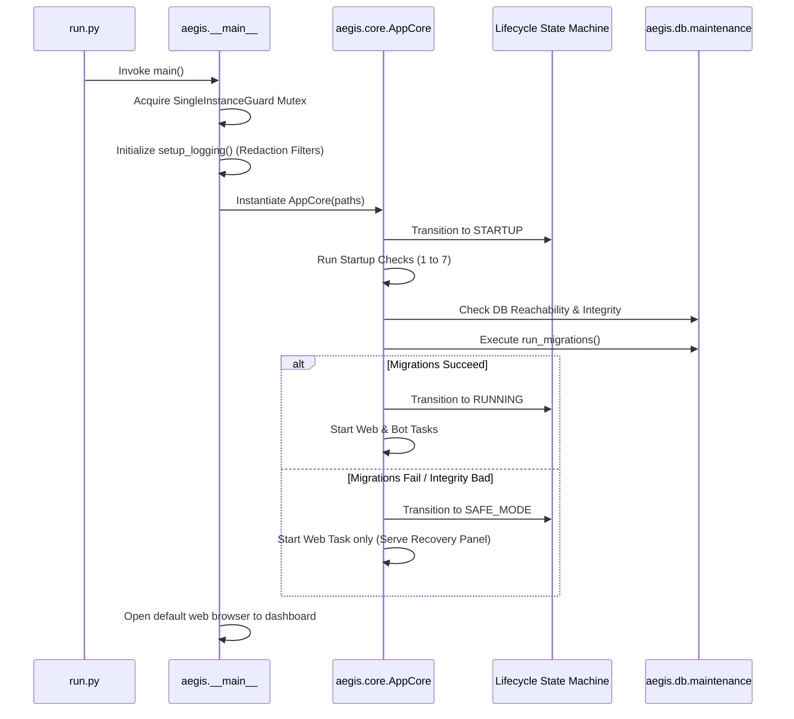

# Aegis Suite Architecture Overview

This document provides a technical guide to the architectural design, directory structure, data flows, and security domains of the Aegis Suite project.

---

## 1. Core Architectural Paradigm

Aegis Suite is designed as a **unified desktop service application** running within a **single process** on a **single asyncio event loop**. This model consolidates the FastAPI web service, the Discord bot interface, the SQLite database engine, and the logging subsystem into a single memory space. 

Benefits of this model include:
* **No Inter-Process Communication (IPC)**: Subsystems communicate directly through thread-safe in-memory interfaces.
* **Simplified Standalone Distribution**: The entire project compiles into a single-file executable using PyInstaller.
* **Resilient Fail-Safe Execution (Safe Mode)**: If external dependencies fail (e.g. Discord API connection), the web interface remains online to facilitate administrative recovery.

---

## 2. Directory Structure

A overview of the repository structure is detailed below:

```text
Aegis-Suite/
├── .github/                 # CI/CD Workflows (verify, deploy, release tag runners)
├── aegis/                   # Primary Application Package
│   ├── bot/                 # Discord Bot commands, leveling, music cogs
│   ├── config/              # Configuration loading, validation, sanitization
│   ├── core/                # Core orchestrators, paths, logging setup, state machine
│   ├── db/                  # Database engines, SQLAlchemy models, migration files
│   ├── diagnostics/         # Sanity check packing and log collectors
│   ├── templates_engine/    # Guild server layout templates reader/applier
│   ├── web/                 # FastAPI routes, dashboard routers, wizard, recovery UI
│   └── __main__.py          # Program boot loader
├── static/                  # Dashboard Frontend assets (index.html, CSS, JS)
├── templates/               # Builtin guild optimization layout structures
├── tests/                   # Regression, security, integration, and properties test suite
├── scripts/                 # Developer-only utilities
├── build_exe.py             # PyInstaller standalone build automation script
├── setup.iss                # Inno Setup compilation file for Windows installer
├── first_run_wizard.py      # Console fallback setup onboarding wizard
├── secret_store.py          # Windows DPAPI secret protection layer
└── run.py                   # Local environment preparation launcher
```

---

## 3. Subsystem Flows

### A. Startup Lifecycle Sequence

The startup lifecycle is managed by `AppCore` and a strict Lifecycle State Machine:



#### The 7 Startup Checks:
1. **Directory Write Probe**: Verifies write access to the AppData folder.
2. **Database Integrity**: Verifies SQLite engine connection and runs `PRAGMA integrity_check`.
3. **Database Migration Status**: Discovers if schema is at the head version.
4. **Database Downgrade Check**: Detects if database schema is ahead of this build (prevents downgrades).
5. **Config Migration check**: Ensures legacy configuration settings are ported.
6. **Token Presence**: Verifies if `DISCORD_BOT_TOKEN` exists in environment/DPAPI files.
7. **Intent Checks**: Probes capability configuration values for Privileged Gateway Intents.

---

### B. Web Server Flow (FastAPI)

The web dashboard is served by FastAPI via Uvicorn, configured programmatically in `aegis/web/server.py` and built in `aegis/web/app.py`.

* **Lifespan Manager**: Oversees startup verification execution and triggers bot initialization once active.
* **Authentication Middleware**: Intercepts HTTP requests and enforces authorization policies:
  - **CSRF Protection**: Block state-changing requests (POST, PUT, DELETE) where the `Origin` header deviates from the local web port.
  - **Safe Mode Bypasses**: Bypasses authentication for `/wizard/` and `/api/recovery/` endpoints during recovery when the admin password is not yet configured.
  - **Sliding-Window Rate Limiter**: Restricts tenant users to 60 requests per minute.
  - **Tenant Boundaries**: Prevents tenant-level sessions from accessing global routes (e.g. `/api/bot/start` or `/api/templates/`).

---

### C. Discord Bot Flow

The bot runs on the top-level asyncio loop, initialized by `aegis/bot/runner.py`.

* **Command Registration**: Hybrid and slash commands are registered dynamically via decorators from `aegis/bot/commands.py`.
* **Predicated Access**: Commands are guarded using permission predicates which check the caller's server role configuration in `ConfigModel` (supporting role hierarchy and owner bypass).
* **Auto-Moderation Engine**: Subscribes to `on_message` Discord gateway events to filter incoming chats:
  - **Invite Parser**: Extracts Discord invite URLs and blocks them unless whitelisted.
  - **Link/Domain Parser**: Discovers toxic web links and domains.
  - **Mention Spam Detector**: Counts message mentions and flags accounts exceeding configured thresholds.
  - **Audit Logging**: Violations are automatically posted to the configured MOD LOG channel and stored in `audit_log.json`.

---

## 4. Database Schema & Migration Flow

Aegis Suite utilizes SQLAlchemy ORM with sqlite engine driver:

* **Tables**:
  - `schema_meta`: Tracks application versions and legacy import indicators.
  - `config_kv`: Arbitrary key-value persistent storage for configurations.
  - `templates`: Preserves server layout structures (built-in templates are seeded during boot).
  - `servers`: Details registered guilds and synchronization timestamps.
  - `migration_log`: Records migration events with timestamp, status (`started`, `success`, `rolled_back`), and backup path pointers.
* **Transaction Rollbacks**: Before executing Alembic upgrades, Aegis triggers a database copy using SQLite Online Backup API. If the migration throws an exception, the backup replaces the corrupted db file immediately.

---

## 5. Security & Isolation Controls

### DPAPI Envelope Credentials
Secrets are stored in `.env.enc` using Windows DPAPI. Decryption happens on the local machine within memory spaces only. Plaintext copies are unlinked immediately after encryption:

```text
Plaintext .env
      │
      ▼
WIN32 CryptProtectData ──> AES-256 Bytecode Encryption ──> Base64 Encoding
                                                                │
                                                                ▼
                                                          JSON V1 Envelope
```

### Log Redaction
The custom `RedactionFilter` parses message templates and traceback details matching exact secrets from `_registered_secrets` (such as active bot tokens, password hashes) and replaces matches with `***REDACTED***` before writing files.

---

## 6. Development & Release Pipelines

CI/CD checks are triggered automatically on GitHub Actions:
1. **Verification**: Spawns test runners on `ubuntu-latest` running the pytest suite to check core code quality boundaries on every push.
2. **Release**: Triggers on tag pushes (`v*.*.*`). Sets up a Windows virtual environment, runs `build_exe.py` to create the PyInstaller artifact, compiles the installer package (`setup.iss`) using Inno Setup compiler (`iscc`), and uploads both binaries to the GitHub Release.
