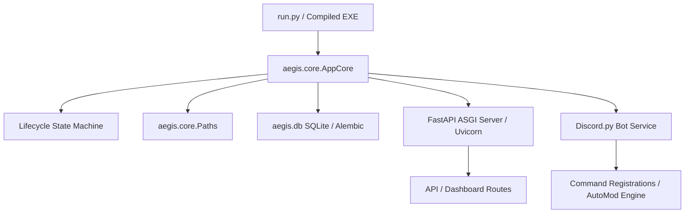

# Aegis Server Optimizer

[](https://github.com/Cyril-47/Aegis-Suite/actions/workflows/release.yml)
[](https://github.com/Cyril-47/Aegis-Suite/actions/workflows/verify.yml)
[](https://github.com/Cyril-47/Aegis-Suite/actions/workflows/deploy.yml)

Aegis Server Optimizer is an interactive server operations suite written in Python containing a Discord bot and a FastAPI web dashboard designed to automatically scan, analyze, audit, and optimize Discord servers with single-click layout configurations, welcome greeting embeds, custom command responses, support tickets, layouts backup/restore, and auto-moderation.

---

## 🚀 Features

- **Circular Server Health Score Indicator**: Runs an automated audit scanning server verification levels, content filters, public administrator rights, and insecure roles.
- **One-Click Server Layout Optimizations**: Choose from three professional layouts (`Gaming Guild`, `Social Community`, or `Developer Hub`) to instantly restructure channels and categories.
- **Safe Channel Handling**: Offers options to safely move existing channels into an `📦 ARCHIVED CHANNELS` category to prevent chat history loss, rather than delete them.
- **Automated Welcoming Module**: Configures customizable welcome cards, color themes, embed headers, and auto-assigns roles (e.g. `Verified Member`) upon user joins.
- **Robust Auto-Moderation Suite**: Filters links, prevents mention raid spam, blocks toxic profanity using a custom word blocklist, and logs violations to a staff `#mod-logs` channel.
- **Live Terminal Logging Console**: Real-time websocket feed displaying server logs and bot actions directly on the dashboard page.

---

## 📸 Screenshots

*Below are placeholders for the visual panels in the Aegis Suite interface:*

| **Circular Health Score & Audit Panel** | **Server Layout Optimizer Card** |
| :---: | :---: |
| *[Screenshot Placeholder: Health score gauge and security audit results]* | *[Screenshot Placeholder: Interactive cards for Gaming, Social, Developer layouts]* |

| **Automated Welcomer Configurator** | **Real-time Live Logging Console Feed** |
| :---: | :---: |
| *[Screenshot Placeholder: Welcome card customization, background templates]* | *[Screenshot Placeholder: Live websocket log streams running on the dashboard]* |

---

## 🏗️ Architecture Overview

Aegis Suite is structured as a unified process running on a single asyncio event loop. This architecture allows the web dashboard (FastAPI) and the Discord bot (Discord.py client) to run in-process, simplifying deployment, lifecycle coordination, and memory utilization.



### Key Subsystems:
1. **AppCore (`aegis/core/app_core.py`)**: The main lifecycle orchestrator which initializes directories, runs database migrations, handles setup verification checks, and spawns the bot and web tasks.
2. **State Machine (`aegis/core/state.py`)**: Manages transitions between `STARTUP`, `SAFE_MODE`, `RUNNING`, and `SHUTTING_DOWN`. If a fatal error occurs (e.g., token invalidation), Aegis enters `SAFE_MODE`, suspending the bot but keeping the web dashboard active for recovery.
3. **Database Layer (`aegis/db/`)**: Employs SQLite for persistent configuration storage (servers, leveling stats, templates), utilizing Alembic for schema migrations.
4. **Secret Store (`secret_store.py`)**: Uses Windows Data Protection API (DPAPI) to encrypt secrets (tokens, passwords) at rest in the `.env.enc` file on Windows desktops.

---

## ⚙️ Deployment Targets

Aegis Server Optimizer supports two deployment models depending on your target audience:

### Target A: Local Desktop App (Standalone / Private Server)
Ideal for single server owners running the dashboard locally.
1. **Compilation**: Run the build script to compile the application as a directory:
   ```cmd
   python build_exe.py
   ```
   *This compiles the python scripts into binary bytecode (.pyc) inside `dist/AegisOptimizer/`, bundling static frontend assets, and directs shortcut creation to installer scripts (e.g. Inno Setup).*
2. **Execution**: Run `dist/AegisOptimizer/AegisOptimizer.exe`. It resolves writeable config databases (such as `config.json` and `.env`) inside the application directory.

### Target B: Hosted Multi-Tenant Service (Public / SaaS Bot)
Ideal for public deployment where multiple server admins connect via a single hosted bot.
1. **Hosting**: Run the web server and bot processes concurrently on a Linux VPS, Docker container, or platform like Railway.
2. **Reverse Proxy (TLS)**: Front the application with a reverse proxy like Caddy (see `Caddyfile` for automated LetsEncrypt SSL certificate configuration) to encrypt WebSocket handshakes and API tokens.
3. **Linking Flow**: Server owners run the `!linkdashboard` prefix command or `/linkdashboard` slash command inside their Discord server to receive a temporary 6-digit linking code to unlock their server's panel on the dashboard.

---

## 🚀 Getting Started (Run from Source)

To run the application directly from the source code (without needing a compiled `.exe`):

1. **Clone the Repository**:
   ```cmd
   git clone https://github.com/Cyril-47/Aegis-Suite.git
   cd Aegis-Suite
   ```

2. **Launch the Application**:
   Simply run the automated launcher script using Python:
   ```cmd
   python run.py
   ```
   *The launcher script will automatically:*
   - Create a local Python virtual environment (`.venv/`) using `uv` (falls back to standard `venv` if `uv` is not installed).
   - Install all required dependencies (`discord.py`, `fastapi`, `uvicorn`, `websockets`, `yt-dlp`, `PyNaCl`, `pydantic`).
   - Automatically search and configure the path for FFmpeg (required for music playback).
   - Launch the FastAPI web server on `http://127.0.0.1:8000` and automatically open your default web browser.

---

## 🤖 Discord Bot Setup

The Aegis bot is hosted by us — you do not need to create a Discord application or paste any token.

1. **Invite Aegis to your server.** Click the **Invite Bot** button on the dashboard login page at `https://[your domain]/`. You must have **Administrator** permission on the target Discord server.
2. **Run `!linkdashboard` or `/linkdashboard` in your server.** In any text channel, type `!linkdashboard` (instant prefix command fallback) or `/linkdashboard` (slash command). The bot will reply with a 6-digit alphanumeric connection code that is valid for 10 minutes.
3. **Paste the code into the dashboard.** Back at `https://[your domain]/`, paste the 6-digit code into the login field and click **Unlock Dashboard**.
4. **You're in.** The dashboard now shows your server's panel. Codes are single-use; if you need to log in again later, run `!linkdashboard` or `/linkdashboard` to mint a fresh one.

---

## 📦 Self-Hosting Quick Start (Windows EXE)

If you want to run your **own** copy of Aegis Suite (Local PC mode), the easiest path is the prebuilt Windows EXE:

1. Go to the [Releases page](https://github.com/Cyril-47/Aegis-Suite/releases) and download the latest `AegisOptimizer.exe`.
2. Place the EXE in any folder you can write to (it stores its config next to itself).
3. Double-click the EXE. The first launch shows a one-time **first-run console wizard** that asks for:
   - Your **Discord bot token** (Discord Developer Portal → Your App → Bot tab).
   - Your application's **Client ID** (OAuth2 tab; a 17-20 digit number).
   - A **password** for the dashboard admin login.
   - Optionally, a public dashboard URL if you've put a reverse proxy in front of it.
4. The wizard hashes the password (PBKDF2-SHA256), generates a JWT secret, and writes everything to a DPAPI-encrypted `.env.enc` file bound to your Windows user account. The plaintext copy is deleted as soon as encryption succeeds.
5. The dashboard launches automatically at `http://127.0.0.1:8000` and a Desktop shortcut is created for future launches.

To re-run the wizard later (for example, to rotate credentials), delete `.env.enc` and re-launch the EXE. To inspect the encrypted contents, use `python -m secret_store decrypt --source .env.enc`.

> [!IMPORTANT]
> **Privileged Gateway Intents Required:**
> While the token validation step verifies that your token is well-formed and can authenticate with Discord, it *cannot* detect if the required privileged Gateway Intents are enabled in the Discord Developer Portal.
> 
> You must navigate to the [Discord Developer Portal](https://discord.com/developers/applications), open your application, go to the **Bot** tab, scroll down to **Privileged Gateway Intents**, and toggle **ON** the following intents:
> - **Presence Intent**
> - **Server Members Intent**
> - **Message Content Intent**
> 
> Failing to enable these intents will prevent the bot from receiving events (e.g., member joins, message-based auto-moderation) even if token validation succeeds.

---

## 🏠 Hosting Modes

Aegis Suite can be run two different ways, and the right choice depends on **where the bot process lives** and **how continuously it stays online**. In Local PC mode the bot runs on the Maintainer's own Windows machine and is online only while that PC is awake and connected. In Cloud mode the same repository runs on a paid third-party host that the Maintainer provisions themselves, with continuous 24/7 uptime expected. The dashboard's first-launch chooser, the header badge, and the Feature Availability Warning panel all surface this choice. Pick your hosting model first, then read the Secrets at Rest section below for the credential-handling rules that apply to the local path.

### Local PC Mode

Local PC mode runs the Windows EXE on the Maintainer's own desktop or laptop. The bot process is alive only while the PC is powered on, awake, and connected to the internet. Any Aegis feature that requires a continuous connection to Discord — for example, message-driven auto-moderation, the giveaway end-time scheduler, or `on_guild_remove` session revocation — will not run while the PC is offline, asleep, or disconnected. Schedules and timers do not "catch up" when the PC wakes back up; events that fired during downtime are simply missed.

### Cloud Mode

Cloud mode runs the same repository on a paid third-party host that the Maintainer provisions, pays for, and configures themselves. **Aegis does not provision the host for you** — the dashboard's only role in Cloud mode is to record your choice and silence the Local-PC-only warnings. There are three supported deployment paths:

- **Railway** — One-click deploy via the existing **Deploy on Railway** button (or follow the equivalent text instructions in the repo). The shipping `.github/workflows/deploy.yml` handles the rest. You'll need a `RAILWAY_TOKEN` secret on the GitHub repository for the deploy workflow to authenticate.
- **Render** — Create a new **Web Service** from the GitHub repo via the Render dashboard. Set the start command to `python -m uvicorn web_server:app --host 0.0.0.0 --port $PORT` and configure the required environment variables (`DISCORD_BOT_TOKEN`, `JWT_SECRET`, `ADMIN_PASSWORD_HASH`, `BOT_API_URL`, plus optionally `AEGIS_HOSTING_MODE=cloud`).
- **Generic Docker / VPS** — Clone the repo onto your host, install dependencies with `pip install -r requirements.txt`, set the same environment variables, and run via `python -m uvicorn web_server:app --host 0.0.0.0 --port 8000` (or wrap it in a `systemd` unit for restart-on-failure).

### Feature availability

The features below depend on the bot process being continuously connected to Discord. The two lists are kept in lock-step with the dashboard's Feature Availability Warning panel — if you change one surface, change the other.

**Impacted by intermittent uptime:**

- Auto-moderation message handlers
- Scheduled messages background loop
- Giveaway end-time scheduler
- Leveling XP grants on member messages
- `on_guild_remove` session revocation
- `/linkdashboard` pairing-code expiry
- Periodic audit log roll-ups
- Welcome embeds and auto-role assignment on member join
- Auto-responders

**Unaffected by intermittent uptime:**

- Dashboard configuration changes
- Server health audit scan
- Server layout optimizer
- Role creator
- Role panel deployment
- Custom commands configuration
- Server template save and apply
- Embed builder
- Server backup and restore
- Audit log viewer

The features in the **Impacted** list will not run while the host PC is offline, asleep, or disconnected from Discord. Switch to Cloud mode if any of those features are critical to your community.

### `AEGIS_HOSTING_MODE` environment variable

For headless deploys (Railway, Render) where no human can click the first-launch chooser, you can pre-select the hosting mode by setting `AEGIS_HOSTING_MODE` in the platform's environment-variable panel. This sits alongside the other environment variables Aegis reads at startup — `DISCORD_BOT_TOKEN`, `JWT_SECRET`, `ADMIN_PASSWORD_HASH`, and `BOT_API_URL` — and follows these rules:

- **Accepted values**: exactly `local_pc` or `cloud`. The value is matched case-insensitively after stripping leading and trailing whitespace, so `Cloud`, ` LOCAL_PC `, and `cloud` are all accepted.
- **First boot, no value persisted**: the env var's value is written to `config.json` under `hosting_mode` and becomes the active mode.
- **A value is already persisted**: the env var is **ignored**. Once a Maintainer (or a previous boot) has recorded a choice, `AEGIS_HOSTING_MODE` will never silently overwrite it. Change the mode from the dashboard's Settings panel instead.
- **Invalid values**: anything other than `local_pc` or `cloud` is logged at WARNING level (naming the offending value) and ignored. Startup continues normally.

The hosting mode is a non-sensitive deployment preference, so unlike the four secrets above it lives in `config.json` rather than the DPAPI-encrypted Secret Store.

---

## 🔐 Secrets at Rest (Local EXE Deployment)

For the local Windows EXE flow, the bot's secrets — `DISCORD_BOT_TOKEN`, `JWT_SECRET`, `ADMIN_PASSWORD_HASH`, `BOT_API_URL` — are stored encrypted at rest using **Windows DPAPI** (Data Protection API). The encrypted blob (`.env.enc`) is bound to your Windows user account and your machine; copying it to another user, another PC, or off the disk yields ciphertext that cannot be decrypted.

```cmd
# One-time: encrypt the plaintext .env into .env.enc and remove the cleartext
python -m secret_store encrypt --source .env --dest .env.enc --delete-source

# Decrypt to stdout (or to a file with --dest)
python -m secret_store decrypt --source .env.enc

# Re-wrap the ciphertext under the current Windows user (after a credential change)
python -m secret_store rotate --source .env.enc
```

Loader precedence at startup:

1. **Platform environment variables** (Railway / Render injected secrets) — wins over everything.
2. **`.env.enc`** — DPAPI-decrypted at startup if present.
3. **`.env`** — plaintext fallback so legacy installs keep working.

On Railway and other Linux hosts, DPAPI is unavailable; the `.env.enc` step is silently skipped and the platform-injected env vars are used directly. No file-based secrets are written.

---

## 🚀 Release Instructions

To package and deploy a new release:

1. **Tag the Commit**: Release pipelines trigger automatically when a version tag matching `v*.*.*` is pushed.
   ```cmd
   git tag v2.1.0-rc1
   git push origin v2.1.0-rc1
   ```
2. **GitHub Actions Workflow**:
   - The `.github/workflows/release.yml` pipeline will trigger on the pushed tag.
   - It sets up a `windows-latest` runner, installs Python 3.12, installs dependencies, and runs `build_exe.py` to compile the single-file binary.
   - It compiles the installer script `setup.iss` using Inno Setup compiler to produce `AegisSetup.exe`.
   - Both `AegisOptimizer.exe` and `AegisSetup.exe` are uploaded to the GitHub Release.

---

## 🤝 Contributing

Contributions are welcome! Please read our [Contributing Guidelines](CONTRIBUTING.md) and [Code of Conduct](CODE_OF_CONDUCT.md) to get started.

---

## ⚠️ Known Technical Debt & Limits

- **JSON Configuration Contention**: The current version uses local JSON files (`config.json`, `giveaways.json`, `audit_log.json`) for mutable configurations. While sufficient for small-scale local deployments, concurrent writes on large multi-tenant servers under high load can cause file corruptions or race conditions.
- **SQLite Migration Roadmap**: If scaling up for public SaaS usage, it is highly recommended to migrate the configurations, custom commands, leveling stats, backups, and pairings data to a structured SQLite database (using `aiosqlite`) to support transactional integrity and concurrent locks.

---

## 📄 License

This project is licensed under the MIT License - see the LICENSE file for details.
