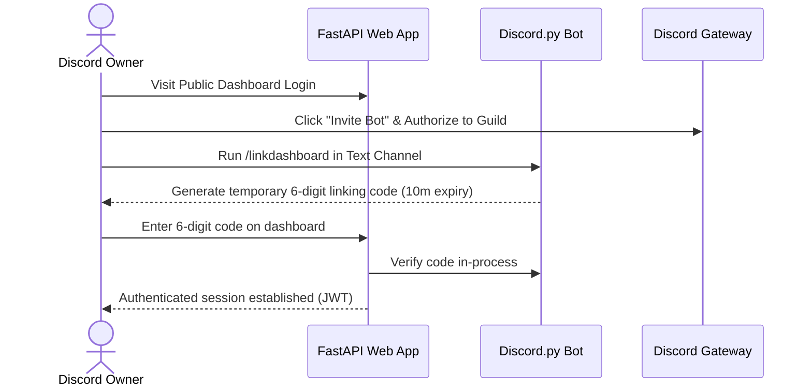
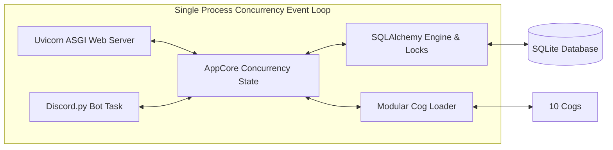
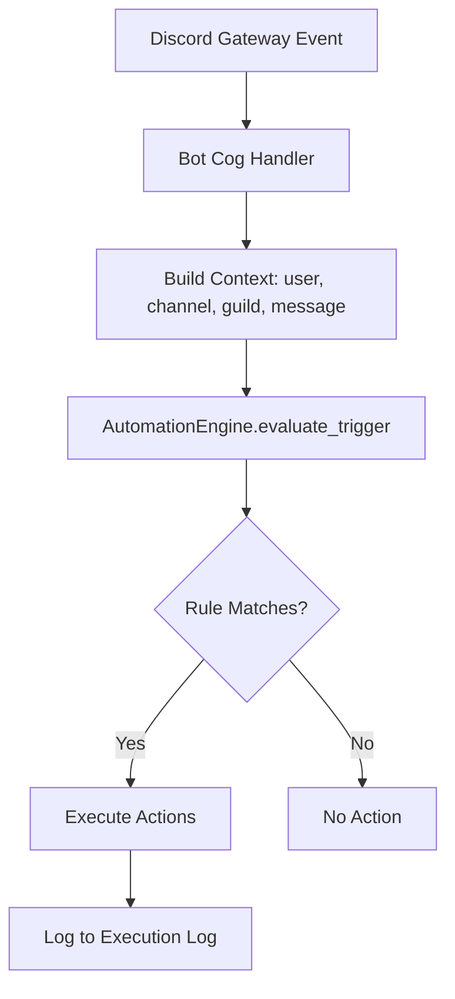
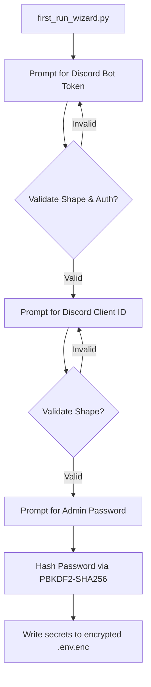
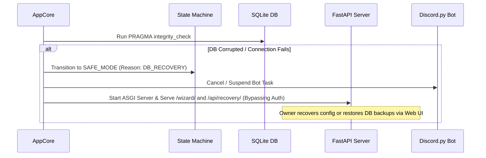

<p align="center">
  
  <br/>
  
  
  
  
</p>

<p align="center">
  <b>🤖 A unified Discord server optimizer — bot + web dashboard in a single process.</b>
  <br/>
  <sub>Scan · Analyze · Audit · Optimize · Automate</sub>
</p>

---

## 🚀 Features

### 🛡️ Core
| Feature | Description |
|---------|-------------|
| 🔍 **Automated Server Health Scan** | Runs an automated audit scanning verification levels, content filters, and administrator role security |
| 🎨 **One-Click Server Layouts** | 18+ professional templates (`Gaming Guild`, `Social Community`, `Developer Hub`, `Anime`, `Education`, etc.) |
| 📦 **Safe Channel Archiving** | Move old channels into an archived category to prevent chat history loss |
| 👋 **Automated Welcomer & Auto-Roles** | Assign roles and post welcoming embeds upon new member joins |
| 🛡️ **Robust Auto-Moderation Suite** | Filters links, prevents mention raid spam, blocks toxic words, logs violations to `#mod-logs` |

### 🧠 Intelligence Engine
| Feature | Description |
|---------|-------------|
| 🤖 **Guardian Mode — Automation Engine** | Rule-based automation with 13 triggers and 10 safe actions. Configurable from the dashboard UI |
| 🚨 **Adaptive Raid Detection** | Statistical anomaly detection — learns baseline over 24h windows, alerts on 2-5σ deviations |
| 🔎 **Fuzzy Spam Detection** | Levenshtein distance-based detection with 90% similarity threshold. Catches fuzzy variations and cross-user campaigns |
| 💬 **Sentiment Analysis** | VADER-based scoring with 20-message learning window. Normalizes leetspeak, abbreviations, and slang |
| 📊 **Activity Intelligence** | Statistical analysis by hour/day-of-week. Finds peak hours, dead zones, optimal event times |
| 💡 **Smart Recommendations** | 10+ rule-based checks with severity, impact score, and auto-fix availability |
| ⚡ **One-Click Auto Fix** | Execute fixes (create channels, archive inactive, remove roles, lock server) with rollback capability |

### 🔬 Smart Analyzers (12)
| Analyzer | Description |
|----------|-------------|
| 🏥 **Config Doctor** | Diagnoses config health across 5 dimensions (security, moderation, growth, automation, reliability) with 0-100 scores |
| 🔐 **Permission Doctor** | Scans roles for dangerous permission combinations and escalation paths |
| 🚨 **Smart Raid Detector** | Analyzes join patterns — join rate, new accounts, similar usernames — with threat levels |
| 📈 **Smart Growth Advisor** | Analyzes retention rate, activity ratio, channel count, welcome config |
| 👋 **Smart Welcome Analyzer** | Evaluates onboarding completeness — welcome message, rules channel, auto-role, verification |
| 🧹 **Smart Role Cleaner** | Detects unused roles, duplicates, and obsolete roles (90+ days, no perms, 0 members) |
| 📁 **Smart Channel Cleaner** | Identifies dead channels (30+ days inactive) and duplicates |
| 💾 **Smart Backup Advisor** | Tracks backup health with staleness thresholds and protection score |
| 🏆 **Server Maturity Score** | Comprehensive score across 6 dimensions — security, moderation, growth, automation, reliability, community |

### 📊 Analytics & Monitoring
| Feature | Description |
|---------|-------------|
| 🔥 **Channel Heatmap** | 24×7 hour-by-day-of-week activity heatmap |
| 🎫 **Ticket SLA Tracking** | First response time, resolution time, open rate, per-staff metrics |
| 📈 **Growth Recommendations** | Data-driven advice based on retention, activity trends, and peak times |
| 📊 **Server Benchmarking** | Percentile comparison against all servers in the system |
| 🔮 **Trend Forecasting** | Linear regression forecasting of messages/day, active users, and joins for 7 days |
| 👮 **Moderator Intelligence** | Mod action leaderboard and response time tracking |
| 📉 **Member Retention** | 1-day, 7-day, and 30-day retention rate calculations |
| 🔐 **Permission Heatmap** | Visual matrix of roles mapped against 12 key permissions |
| 📋 **Incident Timeline** | Correlated moderation events grouped within 5-minute windows |
| 🔔 **Live Alerts (SSE)** | Real-time push updates for health score changes, notifications, and timeline events |

### ⚙️ Automation & Maintenance
| Feature | Description |
|---------|-------------|
| ⏱️ **Dynamic Slowmode System** | Tracks per-channel message rates in real-time. Auto-applies/removes slowmode on bursts |
| 🗓️ **Nightly DB Backup** | Automated database backups with configurable schedule and retention |
| 🧹 **Auto Role Cleanup** | Daily prune of empty, unmanaged roles |
| 💾 **DB Vacuum** | Weekly SQLite vacuum to reclaim space |
| 📁 **Channel Archive** | Archive inactive channels after configurable days |
| 📨 **Scheduled Messages** | One-time and recurring message scheduling with web UI |
| 💬 **Auto-Responders** | Keyword-triggered automatic replies with CRUD management |

### 🎮 Bot Features
| Feature | Description |
|---------|-------------|
| 🧩 **Modular Cog Architecture** | 10 focused cogs loaded dynamically (Moderation, Config, Events, Intelligence, Music, Automation, Tickets, Giveaways, Leveling, Utils) |
| 🎵 **Music Player** | `/play`, `/pause`, `/resume`, `/skip`, `/stop`, `/volume`, queue management |
| ⬆️ **Leveling & XP System** | `/rank` (rank card), `/leaderboard`, `/set-xp-role` with role-specific XP multipliers |
| 🎁 **Giveaway System** | `/giveaway start`, `/giveaway end`, `/giveaway reroll` with duration and winner count |
| 🎫 **Ticket System** | Private support ticket channels with staff assignment and close commands |
| 📡 **Observability Stack** | Structured logging, secret redaction, request-ID tracking, metrics, security headers |
| 📺 **Live Terminal Logging** | Real-time WebSocket log streaming on the dashboard |

---

## 🏗️ Architecture

Aegis Suite runs as a **unified desktop service** in a **single process** on a **single asyncio event loop**. FastAPI (Uvicorn) and the Discord.py client operate in-process sharing memory and database access.

### 🔗 Connection Flows

<details>
<summary><b>🌐 Hosted Mode (Multi-Tenant SaaS)</b></summary>


</details>

<details>
<summary><b>🏠 Self-Hosted Mode (Private Standalone)</b></summary>


</details>

<details>
<summary><b>🔄 Dashboard ↔ Bot Communication</b></summary>


</details>

<details>
<summary><b>🤖 Automation Engine Flow</b></summary>


</details>

<details>
<summary><b>🔐 First-Run Onboarding Flow</b></summary>


</details>

<details>
<summary><b>🆘 Safe Mode Recovery Flow</b></summary>


</details>

---

## ⚙️ Getting Started

### 🚀 Quick Start (Run from Source)

**1. Clone the repository:**
```cmd
git clone https://github.com/Cyril-47/Aegis-Suite.git
cd Aegis-Suite
```

**2. Launch the application:**
```cmd
python run.py
```

> 💡 *The launcher automatically creates a virtual environment, installs dependencies, resolves `FFmpeg`, and opens the dashboard at `http://127.0.0.1:8000`.*

### 📦 Installation via pip

```cmd
pip install -e .
aegis
```

---

## 🤖 Discord Bot Setup

> 💡 *The Aegis bot is hosted by us — you do not need to create a Discord application or paste any token.*

| Step | Action |
|------|--------|
| ① | **Invite Aegis** — Click **Invite Bot** on the dashboard login page. You need **Administrator** permission. |
| ② | **Run `!linkdashboard`** — Type in any text channel. The bot replies with a 6-digit code (10 min expiry). |
| ③ | **Paste the code** — Enter it on the dashboard and click **Unlock Dashboard**. |
| ④ | **You're in** — The dashboard now shows your server's panel. |

---

## 🏠 Hosting Modes

### 💻 Local PC Mode

Runs the Windows EXE on your own desktop/laptop. The bot is alive only while the PC is powered on, awake, and connected to the internet.

### ☁️ Cloud Mode

**🚫 Removed** — Cloud Mode has been deprecated and completely removed as of this version.

### 📋 Feature Availability

<details>
<summary><b>⚠️ Impacted by intermittent uptime (15 features)</b></summary>

**Impacted by intermittent uptime:**

- Auto-moderation message handlers
- Guardian Mode automation triggers
- Dynamic slowmode enforcement
- Raid detection and auto-lockdown
- Fuzzy spam detection
- Sentiment analysis and scoring
- Scheduled messages background loop
- Giveaway end-time scheduler
- Leveling XP grants on member messages
- `on_guild_remove` session revocation
- `/linkdashboard` pairing-code expiry
- Periodic audit log roll-ups
- Welcome embeds and auto-role assignment on member join
- Auto-responders
- Live SSE alert stream
</details>

<details>
<summary><b>✅ Unaffected by intermittent uptime (17 features)</b></summary>

**Unaffected by intermittent uptime:**

- Dashboard configuration changes
- Server health audit scan
- Server layout optimizer
- Role creator
- Role panel deployment
- Custom commands configuration
- Server template save and apply
- Embed builder
- Server backup and restore
- Audit log viewer
- Smart analyzers (config doctor, permission doctor, role/channel cleaners)
- Analytics dashboards (heatmaps, growth, benchmarks, trends)
- Config history and rollback
- Ticket intelligence and moderator intelligence
- Member retention and growth center
- Permission heatmap
- Security checks and scoring
</details>

### 🔧 `AEGIS_HOSTING_MODE` Environment Variable

For headless deploys, pre-select the hosting mode:

| Value | Behavior |
|-------|----------|
| `local_pc` | Local PC mode |
| `cloud` | Cloud mode (deprecated) |

- **First boot**: env var is written to `config.json`
- **Subsequent boots**: env var is **ignored** — change via dashboard Settings panel
- **Invalid values**: logged at WARNING level and ignored

---

## 🔐 Secrets at Rest

Bot secrets (`DISCORD_BOT_TOKEN`, `JWT_SECRET`, `ADMIN_PASSWORD_HASH`, `BOT_API_URL`) are encrypted at rest using **Windows DPAPI**.

```cmd
# Encrypt plaintext .env → .env.enc
python -m secret_store encrypt --source .env --dest .env.enc --delete-source

# Decrypt .env.enc → stdout
python -m secret_store decrypt --source .env.enc
```

---

## 🛠️ Development & Release Pipelines

| Tool | Purpose |
|------|---------|
| 🖌️ `black` | Code formatting |
| 🔍 `ruff` | Linting |
| 🧪 `pytest` | Testing — `python -m pytest` |
| 📦 `pyinstaller` | Standalone EXE — `python build_exe.py` |

---

## ❓ FAQ & Troubleshooting

<details>
<summary><b>🤖 Bot is online but commands don't respond?</b></summary>

Verify **Privileged Gateway Intents** are **ON** in the [Discord Developer Portal](https://discord.com/developers/applications):
- ✅ Presence Intent
- ✅ Server Members Intent
- ✅ Message Content Intent
</details>

<details>
<summary><b>🔒 "Another instance is already running" error?</b></summary>

Aegis enforces single-instance execution. Check your system tray or delete `temp_appdata/aegis.lock`.
</details>

<details>
<summary><b>📊 Health gauge stays at 80%?</b></summary>

This is by design. The sentiment analyzer requires **20 messages** before showing real scores. The gauge holds at 80% during the learning phase.
</details>

<details>
<summary><b>🤖 Guardian Mode rules don't trigger?</b></summary>

Rules are evaluated in real-time on Discord events. Ensure:
- ✅ Rule is **enabled** (toggle on)
- ✅ **Trigger** matches the event type
- ✅ Bot has required permissions (kick, ban, timeout, manage channels)
- ✅ Check **Last Interventions** in Automation Center
</details>

<details>
<summary><b>📉 Smart analyzers show "No data"?</b></summary>

The bot needs to run for **24 hours** to collect baseline data. Channel cleaner needs message history to identify dead channels.
</details>

<details>
<summary><b>🎵 Music bot won't join voice channel?</b></summary>

Ensure `FFmpeg` is installed and in your PATH. Download from https://ffmpeg.org/download.html
</details>

<details>
<summary><b>💾 How do I restore a backup?</b></summary>

**Dashboard → Backup & Restore** → Select backup → **Restore**. Recreates channels and roles (message history not included).
</details>

---

## ⚠️ Known Technical Debt & Limits

| Issue | Description |
|-------|-------------|
| 🔄 **In-Memory Global State** | Auth token caches and rate-limit counters are in-process and lost on restart |
| 📊 **Sentiment Learning Window** | 20-message minimum before real scores display (intentional stability feature) |
| ⚡ **Reactive Only** | Guardian Mode fires on Discord events only — no periodic sweeps or cron scheduling |
| 📄 **JSON Contention** | Concurrent writes on large multi-tenant servers can cause race conditions |
| 🗄️ **SQLite Roadmap** | For SaaS scaling, migrate configs/stats to structured DB with transactional integrity |

---

## 📄 License

This project is licensed under the MIT License — see the [LICENSE](LICENSE) file for details.

---

<p align="center">
  <sub>Made with ❤️ by <a href="https://github.com/Cyril-47">Cyril-47</a></sub>
</p>
