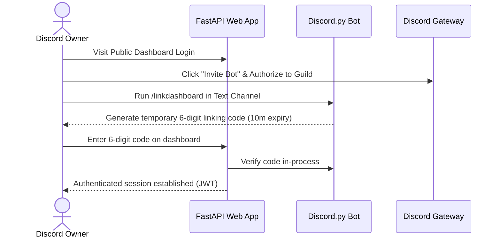
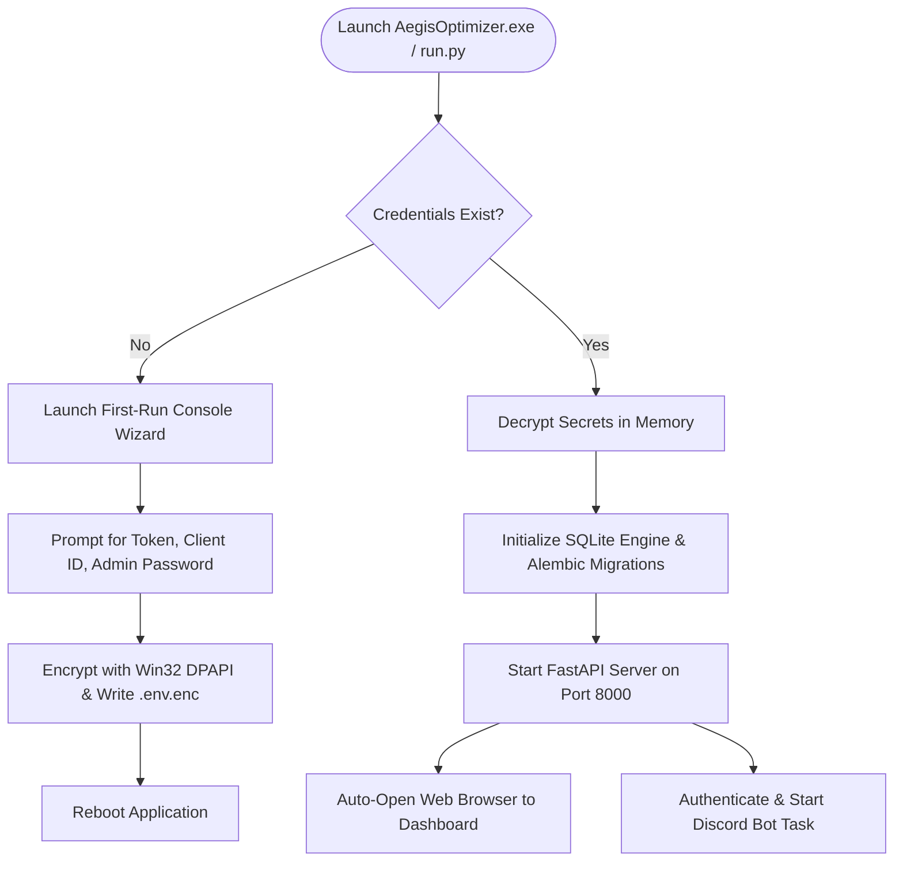
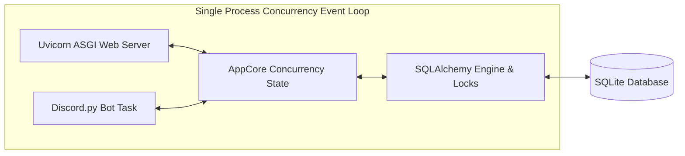
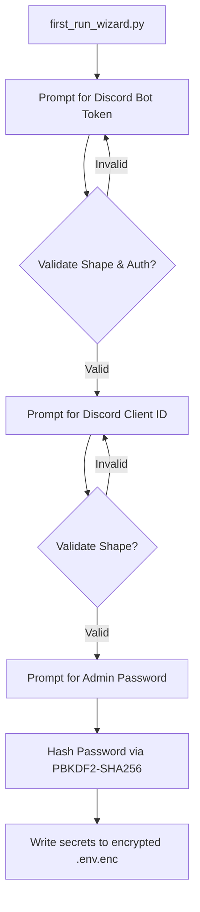
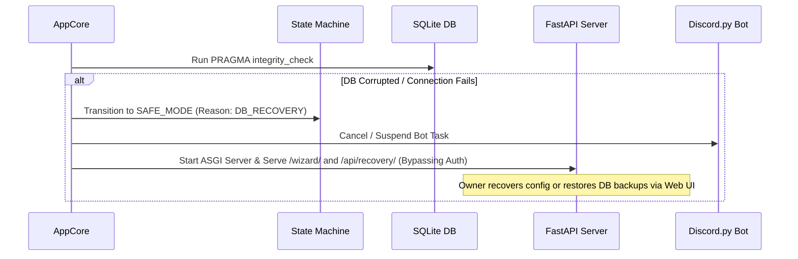

# Aegis Server Optimizer

[](https://github.com/Cyril-47/Aegis-Suite/actions/workflows/release.yml)
[](https://github.com/Cyril-47/Aegis-Suite/actions/workflows/verify.yml)
[](https://opensource.org/licenses/MIT)
[](https://www.python.org/)

Aegis Server Optimizer is an interactive operations suite featuring a Discord bot and a FastAPI web dashboard designed to automatically scan, analyze, audit, and optimize Discord servers.

---

## 🚀 Features

- **Automated Server Health Scan**: Runs an automated audit scanning server verification levels, content filters, and administrator role security.
- **One-Click Server Layouts**: Choose from professional templates (`Gaming Guild`, `Social Community`, `Developer Hub`) to restructure channels and categories.
- **Safe Channel Archiving**: Move old text/voice channels into an archived category to prevent chat history loss instead of deleting them.
- **Automated Welcomer & Auto-Roles**: Assign roles (e.g. `Verified Member`) and post welcoming embeds upon new member joins.
- **Robust Auto-Moderation Suite**: Filters links, prevents mention raid spam, blocks toxic words via custom lists, and logs violations to `#mod-logs`.
- **Live Terminal Logging Console**: Real-time WebSocket log streaming directly on the dashboard panel.
- **Music & Inactivity Timers**: Play audio streams with automated voice-client reconnects and 5-minute inactivity timeouts.
- **Persistent Database Backups**: Multi-version database rotation utilizing SQLite Online Backup API.

---

## 🏗️ Architecture & Connection Flows

Aegis Suite is designed as a **unified desktop service application** running within a **single process** on a **single asyncio event loop**. FastAPI (Uvicorn) and the Discord.py client operate in-process sharing memory structures and direct database access.

### 1. Hosted Mode (Multi-Tenant SaaS Setup)
Allows multiple server administrators to manage their respective servers through a single hosted bot deployment using link authorization.



### 2. Self-Hosted Mode (Private Standalone Setup)
Ideal for single server owners running the application locally on a private PC or private VPS.



### 3. Dashboard ↔ Bot Communication
Illustrates how subsystems communicate directly via a shared memory layer on a single asyncio event loop.



### 4. First-Run Onboarding Flow
Detailed logic executed when the console wizard runs for first-run setups:



### 5. Safe Mode Recovery Flow
When startup checks fail (e.g. database corruptions, invalid credentials), Aegis enters Safe Mode to serve an administrative recovery panel.



---

## ⚙️ Getting Started

### Quick Start (Run from Source)
1. **Clone the Repository**:
   ```cmd
   git clone https://github.com/Cyril-47/Aegis-Suite.git
   cd Aegis-Suite
   ```
2. **Launch Application**:
   ```cmd
   python run.py
   ```
   *The launcher automatically configures a local Python virtual environment, installs standard dependencies, resolves `FFmpeg` for voice/music, and launches the web interface at `http://127.0.0.1:8000`.*

### Installation via pip
To install Aegis Suite as an editable developer package:
```cmd
pip install -e .
```
You can now start the application from anywhere using the `aegis` console entry point command:
```cmd
aegis
```

---

## 🤖 Discord Bot Setup

The Aegis bot is hosted by us — you do not need to create a Discord application or paste any token.

1. **Invite Aegis to your server.** Click the **Invite Bot** button on the dashboard login page at `https://[your domain]/`. You must have **Administrator** permission on the target Discord server.
2. **Run `!linkdashboard` or `/linkdashboard` in your server.** In any text channel, type `!linkdashboard` (instant prefix command fallback) or `/linkdashboard` (slash command). The bot will reply with a 6-digit alphanumeric connection code that is valid for 10 minutes.
3. **Paste the code into the dashboard.** Back at `https://[your domain]/`, paste the 6-digit code into the login field and click **Unlock Dashboard**.
4. **You're in.** The dashboard now shows your server's panel. Codes are single-use; if you need to log in again later, run `!linkdashboard` or `/linkdashboard` to mint a fresh one.

---

## 🏠 Hosting Modes

Aegis Suite is designed to be run in Local PC mode. In previous versions, Cloud mode was supported for deploying the repository to a paid third-party host (such as Render, Railway, or a generic Docker VPS). However, as of this version, Cloud Mode is deprecated and has been completely removed from the Aegis Suite.

### Local PC Mode

Local PC mode runs the Windows EXE on the Maintainer's own desktop or laptop. The bot process is alive only while the PC is powered on, awake, and connected to the internet. Any Aegis feature that requires a continuous connection to Discord — for example, message-driven auto-moderation, the giveaway end-time scheduler, or `on_guild_remove` session revocation — will not run while the PC is offline, asleep, or disconnected. Schedules and timers do not "catch up" when the PC wakes back up; events that fired during downtime are simply missed.

### Cloud Mode

**Removed**: Cloud Mode (which allowed deploying to providers like Render, Railway, or generic Docker VPS) has been deprecated and completely removed as of this version. Any previous deployment templates or automated setup flows targeting these cloud environments are no longer supported. This resolves deployment failures on platforms like Railway.

### Feature availability

The features below depend on the bot process being continuously connected to Discord. The two lists are kept in lock-step with the dashboard's Feature Availability Warning panel — if you change one surface, change the other.

**Impacted by intermittent uptime:**

- Auto-moderation message handlers
- Scheduled messages background loop
- Giveaway end-time scheduler
- Leveling XP grants on member messages
- `on_guild_remove` session revocation
- `/linkdashboard` pairing-code expiry
- Periodic audit log roll-ups
- Welcome embeds and auto-role assignment on member join
- Auto-responders

**Unaffected by intermittent uptime:**

- Dashboard configuration changes
- Server health audit scan
- Server layout optimizer
- Role creator
- Role panel deployment
- Custom commands configuration
- Server template save and apply
- Embed builder
- Server backup and restore
- Audit log viewer

The features in the **Impacted** list will not run while the host PC is offline, asleep, or disconnected from Discord. Switch to Cloud mode if any of those features are critical to your community.

### `AEGIS_HOSTING_MODE` environment variable

For headless deploys (Render, self-hosted deployment) where no human can click the first-launch chooser, you can pre-select the hosting mode by setting `AEGIS_HOSTING_MODE` in the platform's environment-variable panel. This sits alongside the other environment variables Aegis reads at startup — `DISCORD_BOT_TOKEN`, `JWT_SECRET`, `ADMIN_PASSWORD_HASH`, and `BOT_API_URL` — and follows these rules:

- **Accepted values**: exactly `local_pc` or `cloud`. The value is matched case-insensitively after stripping leading and trailing whitespace, so `Cloud`, ` LOCAL_PC `, and `cloud` are all accepted.
- **First boot, no value persisted**: the env var's value is written to `config.json` under `hosting_mode` and becomes the active mode.
- **A value is already persisted**: the env var is **ignored**. Once a Maintainer (or a previous boot) has recorded a choice, `AEGIS_HOSTING_MODE` will never silently overwrite it or override a dashboard switch. Change the mode from the dashboard's Settings panel instead.
- **Invalid values**: anything other than `local_pc` or `cloud` is logged at WARNING level (naming the offending value) and ignored. Startup continues normally.

The hosting mode is a non-sensitive deployment preference, so unlike the four secrets above it lives in `config.json` rather than the DPAPI-encrypted Secret Store.

---

## 🔐 Secrets at Rest

For the local Windows EXE flow, the bot's secrets — `DISCORD_BOT_TOKEN`, `JWT_SECRET`, `ADMIN_PASSWORD_HASH`, `BOT_API_URL` — are stored encrypted at rest using **Windows DPAPI** (Data Protection API). The encrypted blob (`.env.enc`) is bound to your Windows user account and your machine; copying it to another user, another PC, or off the disk yields ciphertext that cannot be decrypted.

```cmd
# One-time: encrypt the plaintext .env into .env.enc and remove the cleartext
python -m secret_store encrypt --source .env --dest .env.enc --delete-source

# Decrypt to stdout (or to a file with --dest)
python -m secret_store decrypt --source .env.enc
```

---

## 🛠️ Development & Release Pipelines

- **Code Styling**: Standardized using `black` and linter via `ruff`.
- **Testing**: Run pytest: `python -m pytest`
- **Standalone Builds**: Compiles the standalone executable `AegisOptimizer.exe` under `dist/`:
  ```cmd
  python build_exe.py
  ```

---

## ❓ FAQ & Troubleshooting

### 1. Bot is online but commands do not respond?
Verify that **Privileged Gateway Intents** are toggled **ON** in your [Discord Developer Portal](https://discord.com/developers/applications):
* Presence Intent
* Server Members Intent
* Message Content Intent

### 2. "Another instance is already running" error?
Aegis enforces single-instance execution. Check your system tray for running processes or delete `temp_appdata/aegis.lock` if the application terminated abruptly.

---

## ⚠️ Known Technical Debt & Limits

- **JSON Configuration Contention**: The current version uses local JSON files (`config.json`, `giveaways.json`, `audit_log.json`) for mutable configurations. While sufficient for small-scale local deployments, concurrent writes on large multi-tenant servers under high load can cause file corruptions or race conditions.
- **SQLite Migration Roadmap**: If scaling up for public SaaS usage, it is highly recommended to migrate the configurations, custom commands, leveling stats, backups, and pairings data to a structured SQLite database (using `aiosqlite`) to support transactional integrity and concurrent locks.

---

## 📄 License
This project is licensed under the MIT License - see the [LICENSE](LICENSE) file for details.
